[English](integrations-a2a-service-keys.md) · [简体中文](integrations-a2a-service-keys.zh-CN.md)

# A2A 与服务 API Key

出站 A2A（调用远程 Agent）、入站 A2A（OpenCitadel 作为远程 Agent），以及服务 API Key 鉴权。

## 出站 A2A（Agent 调用远程 Agent）

在 `api/config.yaml` → `a2a_config.a2a_servers` 配置，或通过 **设置 → 集成**（MCP/A2A/服务 Key Tab）管理。

| 字段 | 说明 |
|------|------|
| `id` | 服务器引用 ID |
| `base_url` | 远程 Agent 基础 URL |
| `enabled` | 是否启用 |

Skill 可通过 `a2a_server_refs` 限制可用 A2A 服务器。运行时 Agent 使用 `a2a` 工具；Worker 维护出站连接池并定期释放陈旧连接。

远程 Agent 发现使用 `GET {base_url}/.well-known/agent-card.json`。

```mermaid
flowchart TB
  subgraph outbound ["Outbound A2A"]
    Agent["AgentTaskRunner"] --> A2ATool["a2a tool"]
    A2ATool --> Pool["Worker connection pool"]
    Pool --> Remote["Remote agent base_url"]
  end
  subgraph inbound ["Inbound A2A"]
    External["External caller"] -->|"X-Api-Key"| A2AEndpoint["POST /api/a2a"]
    A2AEndpoint --> Session["Create/run session"]
  end
  subgraph keys ["Service API Keys"]
    User["User"] --> CreateKey["POST /api/service-keys"]
    CreateKey --> Hash["SHA-256 hash in DB"]
  end
```



## 入站 A2A（OpenCitadel 作为远程 Agent）

当 `feature_flags.enable_agent_features=true` 时，OpenCitadel 暴露：

| 方法 | 路径 | 鉴权 | 说明 |
|------|------|------|------|
| GET | `/.well-known/agent-card.json` | 公开 | Agent Card 发现 |
| POST | `/api/a2a` | `X-Api-Key` | JSON-RPC（`message/send`、`message/stream`） |

入站调用通过**服务 API Key** 鉴权（`require_service_api_key`）。Principal 继承 Key 所属用户的 `global_role` 与用户 ID。

## 服务 API Key

用于自动化与入站 A2A 的长期 Key，按用户管理（需会话 JWT）：

| 方法 | 路径 | 说明 |
|------|------|------|
| GET | `/api/service-keys` | 列出 Key（仅哈希，无明文） |
| POST | `/api/service-keys` | 创建 Key — **明文仅返回一次** |
| DELETE | `/api/service-keys/{id}` | 吊销 Key |

**UI 入口**：设置 → 集成 → **服务 API Key** 面板（`ServiceKeysSettings`，`ui/src/components/settings/service-keys-settings.tsx`）。

使用方式：

```http
X-Api-Key: <plaintext-key>
```

Key 以 SHA-256 哈希存储（`service_api_keys` 表）。明文仅在创建时展示；列表与吊销接口永不返回密钥。吊销后立即失效。

**作用域说明**：服务 API Key 的 Principal 不含 `team_roles`；访问团队作用域资源需使用 JWT 会话鉴权并携带 `X-Workspace-Id`。入站 A2A（`POST /api/a2a`）使用 `require_service_api_key` — Principal 继承 Key 所属用户的 `global_role` 与用户 ID，不含团队成员身份。

## MCP 与 A2A 对比

| 协议 | 方向 | 配置 | 工具名 |
|------|------|------|--------|
| MCP | 出站工具 | `mcp_config.mcpServers` | `mcp` |
| A2A 出站 | 出站委托 | `a2a_config.a2a_servers` | `a2a` |
| A2A 入站 | 外部调用 → OpenCitadel | `feature_flags.enable_agent_features` | `/api/a2a` |

MCP 配置见 [教程 3：MCP 集成](../tutorials/03-mcp-integrations.zh-CN.md)。

## 相关文档

- [安全模型](security-model.zh-CN.md) — 服务 API Key 存储
- [配置来源治理](config-source-governance.zh-CN.md) — MCP/A2A AppConfig 种子
