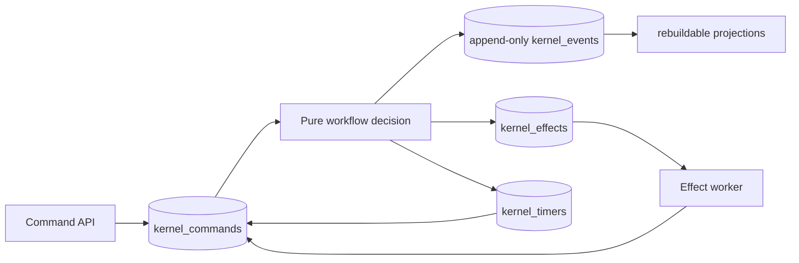

# Kernel v2 architecture

[简体中文](kernel-v2.zh-CN.md)

## Scope

OpenCitadel v2 retains four bounded contexts: identity, inference, knowledge,
and kernel. The product surface is Agent Runs plus the configuration and
governance needed to execute them safely. Session, automation, patrol,
compliance-report, A2A, skill marketplace, memory, and public-share authorities
are not part of v2.

## Execution protocol

Commands are accepted with an expected stream version and an idempotency key.
Inside one PostgreSQL transaction the store locks the Run, validates quota,
rehydrates state, decides events/effects/timers, appends a hash-linked event
batch, updates projections, and records the command result. Duplicate command
keys return the original acknowledgement.

Reducers and workflow decisions are pure. The only nondeterministic units are
the five effect kinds: `model.call`, `knowledge.retrieve`, `tool.call`,
`file.operation`, and `knowledge.build`. A claimed effect is fenced by lease
generation, runs under a hard timeout, and completes through another durable
command. Retry count and exponential due time are bounded and persisted.

Approval is protocol state, not UI state. Reviewer membership is frozen when
requested. Approval, rejection, expiration, cancellation, handler failure, and
unknown outcomes all emit terminal events, so no Run is left waiting forever.

## Data and security invariants

- `kernel_events`, audit records, and governance revisions reject mutation.
- Run status exists only in a rebuildable projection.
- Every tenant row has exactly one owner: user or team.
- API and kernel roles are distinct `NOLOGIN NOBYPASSRLS` roles.
- Forced RLS accepts only HMAC-signed transaction-local authorization claims.
- Purge uses the dedicated `kernel-purge` system actor and deletes object bytes.
- Endpoint credentials, MCP secrets, and command private payloads use versioned
  encrypted envelopes.
- User/team daily, concurrent, and storage quotas use transaction-scoped
  advisory locks; inference usage is idempotently recorded.

## Runtime topology

The API only admits commands and reads projections. One kernel process graph
owns Effect, timer, and retention lanes. PostgreSQL is authoritative; Redis is
optional. Object storage is MinIO or COS. Tool effects resolve the capability
catalog frozen at Run creation and execute built-ins or MCP calls. Docker uses
an authenticated narrow lifecycle broker; Kubernetes uses a scoped ServiceAccount
to create resource-bounded per-Run Pods. Both data planes require a derived
per-sandbox bearer token.

The single destructive Alembic revision is the schema authority. There is no
legacy migration or second execution engine.
