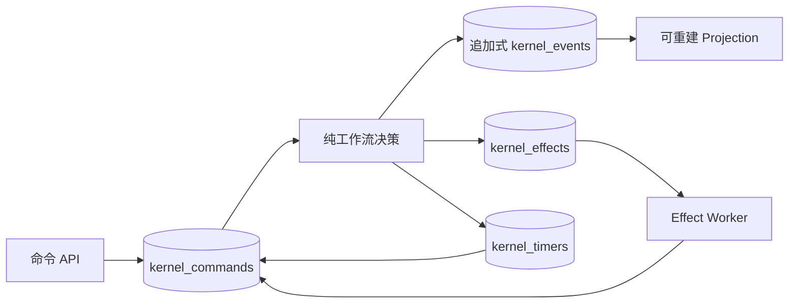

# v2 内核架构

[English](kernel-v2.md)

## 范围

OpenCitadel v2 只保留身份、推理、知识、内核四个限界上下文。产品面是 Agent Run，
以及安全执行所需的配置和治理。Session、自动化、巡检、合规报告、A2A、技能市场、
记忆和公开分享不属于 v2。

## 执行协议

命令携带预期流版本和幂等键。Store 在同一个 PostgreSQL 事务中锁定 Run、校验配额、
重放状态、决策事件/Effect/Timer、追加哈希链接事件批次、更新 Projection，并记录
命令结果。重复命令键返回原始确认。

Reducer 和工作流决策保持纯函数。所有非确定性工作只有五类 Effect：`model.call`、
`knowledge.retrieve`、`tool.call`、`file.operation`、`knowledge.build`。
Effect Claim 受租约代次保护，在硬超时内运行，并通过另一个持久命令完成；重试次数
和指数退避到期时间都有持久化上限。

审批是协议状态，不是 UI 状态。评审人集合在请求时冻结。批准、拒绝、过期、取消、
处理失败和未知结果都会产生终态事件，不会让 Run 永久等待。

## 数据与安全不变量

- `kernel_events`、审计记录和治理版本拒绝修改。
- Run 状态只存在于可重建 Projection。
- 每个租户行恰好属于一个用户或一个团队。
- API 与内核使用不同的 `NOLOGIN NOBYPASSRLS` 角色。
- 强制 RLS 只接受 HMAC 签名的事务级授权声明。
- Purge 使用专用 `kernel-purge` 系统 Actor，并删除对象存储字节。
- Endpoint Credential、MCP Secret 和命令私有载荷使用版本化加密信封。
- 用户/团队日配额、并发配额和存储配额使用事务级 Advisory Lock；推理用量幂等记账。

## 运行拓扑

API 只接收命令和读取 Projection。单一内核对象图持有 Effect、Timer、Retention 三条
Worker Lane。PostgreSQL 是权威源，Redis 可丢失。对象存储使用 MinIO 或 COS。
工具 Effect 使用 Run 创建时冻结的能力目录，执行内置工具或 MCP。Docker 通过窄接口、
带认证的生命周期 Broker；Kubernetes 通过受限 ServiceAccount 创建按 Run 隔离、资源
受限的 Pod。两类数据面都要求按沙箱派生的 Bearer Token。

唯一破坏式 Alembic Revision 是数据库结构权威；不存在旧数据迁移或第二执行引擎。
