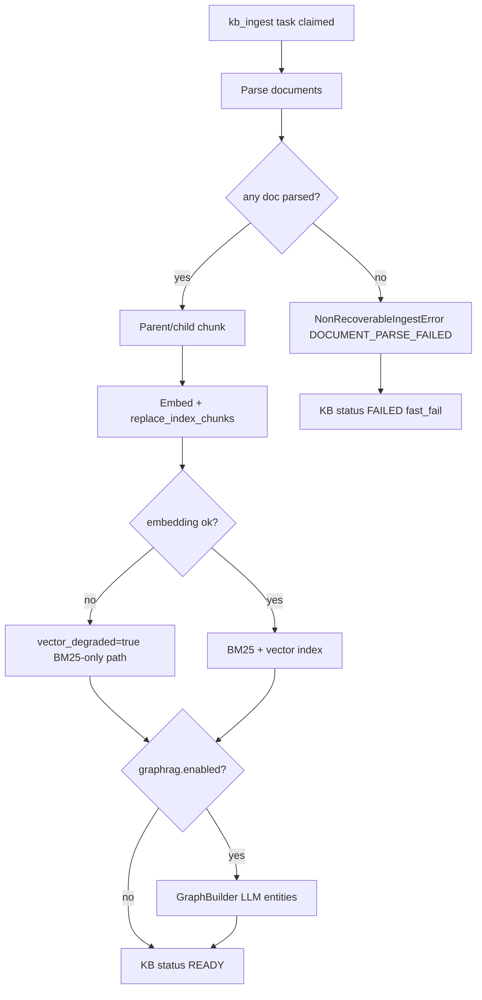
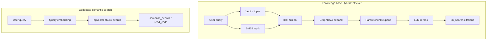

# Knowledge Base Ingestion

[简体中文](knowledge-base-ingestion.zh-CN.md)

Authoritative reference for knowledge-base document ingestion: parse, OCR, chunking, embedding, GraphRAG, vector degradation, failure handling, and Worker reconciliation.

## Overview

| Component | File | Role |
|-----------|------|------|
| API trigger | `knowledge_base_routes.py` | Creates `kb_ingest` task, binds `ingest_task_id` |
| Task runner | `KBIngestionTaskRunner` | Wraps `KBIngestionRunner`, maps terminal errors |
| Pipeline | `KBIngestionRunner` | Parse → chunk → embed → index → optional GraphRAG |
| OCR | `ocr_service.py` | Image PDF pages via vision LLM when `ocr.mode=vision_llm` |
| Worker entry | `worker/main.py` `_execute_kb_ingest_job` | Resolves GraphRAG LLM and separate OCR vision model |

Worker resolves two LLM handles for ingestion:

- **GraphRAG LLM** — default chat model for entity/relation extraction (`GraphBuilder`)
- **OCR LLM** — first available vision-capable model (`resolve_vision_model()`); falls back to GraphRAG LLM when not injected separately

Session id for ingest tasks: `kb-ingest:{kb_id}` (not a user chat session).

## Ingestion pipeline



### Parse stage

Sources (`KBSourceType`): file upload, ZIP archive, web URL, Confluence, Feishu.

- Per-document status: `PARSING` → `READY` or `FAILED`
- PDF with image-only pages: OCR via `ocr_pdf_to_blocks()` when `knowledge_base.ocr.mode=vision_llm`
- Oversized files: truncated at `knowledge_base.document.max_bytes` (default 50 MB) with parser warning — not rejected at upload if under nginx limit

Config (`api/config.yaml`):

```yaml
knowledge_base:
  ocr:
    mode: vision_llm  # vision_llm | rapidocr | off
    max_pages: 50
  document:
    max_bytes: 52428800
    max_pages: 1000
  graphrag:
    enabled: true
```

### Chunk and index

- `KBChunker` produces parent/child chunks (`parent_max_chars`, `child_max_chars`, `overlap`)
- `KBVectorService` embeds child chunks when `knowledge_base.vector_enabled=true`
- Embedding failure sets `vector_degraded=true`; BM25/hybrid retrieval continues without vectors
- SSE `step` events: `parse`, `chunk`, `index`, `graph` (when enabled)

### GraphRAG (optional)

When `graphrag.enabled=true`, `GraphBuilder` runs after index write. GraphRAG LLM unavailability is logged and skipped — ingestion can still reach `READY`.

## Retrieval stack (KB vs Codebase)

Knowledge base retrieval is intentionally richer than codebase semantic search:



| Dimension | Knowledge base | Codebase |
|-----------|----------------|----------|
| Vector index | `knowledge_base.vector_enabled` (default true) | Uses embedding when available; `vector_degraded` on failure |
| Full-text | BM25 + `zh_tokenizer` | Symbol index + static analysis |
| Graph | Optional GraphRAG | Dependency edges from static analysis |
| Rerank | LLM rerank (`knowledge_base.rerank`) | None |
| Agent tool | `KnowledgeBaseTool.kb_search` | `CodebaseTool.semantic_search` |

See [Codebase reindex](codebase-reindex.md) for the lighter codebase retrieval path.

## Failure and recovery

| Failure type | Error code | Worker behavior |
|--------------|------------|-----------------|
| All documents fail parse | `DOCUMENT_PARSE_FAILED` | `NonRecoverableIngestError` → `fast_fail`, no auto retry |
| Transient infra mid-run | `TASK_INFRA_FAILED` or generic | `prepare_recoverable_retry` for agent tasks; KB ingest may finalize FAILED if task ends failed |
| Stuck ingest (orphan task) | — | `_reconcile_stuck_kb_ingests()` every 30s + startup |

`NonRecoverableIngestError` (`ingest_errors.py`) marks corrupt or unparseable content — Worker calls `_finalize_kb_ingest_failure()` to set `KBStatus.FAILED` and clear `ingest_task_id`.

Recoverable agent-style retry (`RecoverableTaskInputUnavailable`, checkpoint restore) applies to **chat agent tasks**, not parse-all-failed KB ingest.

## Upload and size limits

| Layer | Limit | Notes |
|-------|-------|-------|
| Nginx gateway | 200 MB | `client_max_body_size 200m` in `nginx/nginx.conf` |
| KB document | 50 MB default | `knowledge_base.document.max_bytes` in AppConfig |
| Marketplace assets | 25 MB default | `server.marketplace_max_upload_bytes` |

Do not document a single “200 MB upload” for all features — KB documents enforce a lower AppConfig cap.

## Related documentation

- [Tutorial: Internal knowledge base](../tutorials/02-internal-knowledge-base.md)
- [Codebase reindex](codebase-reindex.md) — parallel vector degradation pattern for codebases
- [Task recovery](task-recovery.md) — agent vs ingest failure boundaries
- [Events](events.md) — `step` and `error` SSE during ingest
- [Config source governance](config-source-governance.md) — AppConfig ownership
- [Production deployment](../operations/deployment.md) — storage provider and Compose profiles
