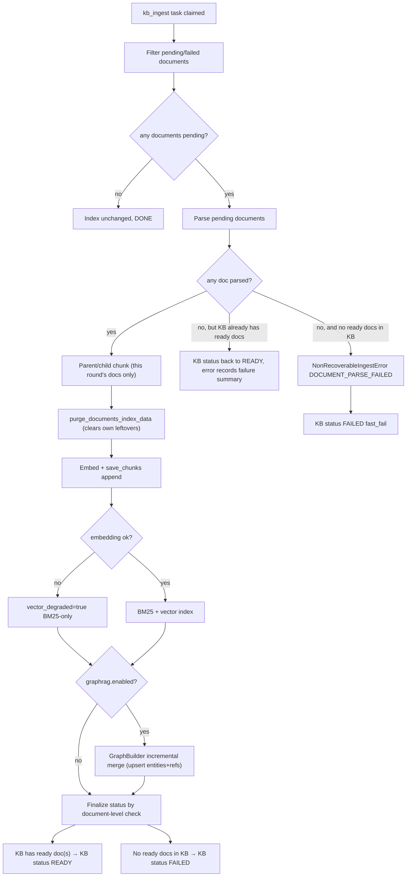
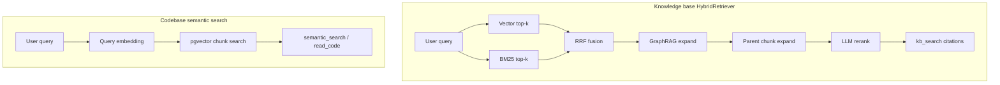

# Knowledge Base Ingestion

[简体中文](knowledge-base-ingestion.zh-CN.md)

Authoritative reference for knowledge-base document ingestion: parse, OCR, chunking, embedding, GraphRAG, vector degradation, failure handling, and Worker reconciliation.

## Overview

| Component | File | Role |
|-----------|------|------|
| API trigger | `knowledge_base_routes.py` | Creates `kb_ingest` task, binds `ingest_task_id` |
| Task runner | `KBIngestionTaskRunner` | Wraps `KBIngestionRunner`, maps terminal errors |
| Pipeline | `KBIngestionRunner` | Parse → chunk → embed → index → optional GraphRAG |
| OCR | `ocr_service.py` | Image PDF pages via vision LLM when `ocr.mode=vision_llm` |
| Worker entry | `worker/main.py` `_execute_kb_ingest_job` | Resolves GraphRAG LLM and separate OCR vision model |

Worker resolves two LLM handles for ingestion:

- **GraphRAG LLM** — default chat model for entity/relation extraction (`GraphBuilder`)
- **OCR LLM** — first available vision-capable model (`resolve_vision_model()`); falls back to GraphRAG LLM when not injected separately

Session id for ingest tasks: `kb-ingest:{kb_id}` (not a user chat session).

## Ingestion pipeline

Ingestion is an **incremental** pipeline by default; a full reindex is just one special case of it:

- `KBIngestionRunner.run(kb_id)` processes only the documents in the KB with `status IN (pending, failed)` on each run (parse → chunk → embed → index → optional GraphRAG). Before indexing, `purge_documents_index_data` clears the old chunks/relations/refs belonging to **those documents only** (leftovers from a failed retry), then the new chunks are **appended** — the pipeline no longer calls `replace_index_chunks`/`clear_index_data` against the whole KB. Other documents already `ready` in the KB, and their index data, are untouched throughout.
- New documents (`add_documents`): new documents are naturally `pending`, so once the task is dispatched the runner only processes the new documents; retrieval/Q&A over existing documents is unaffected during ingestion.
- Manual `reindex` (full rebuild fallback): before dispatch, all documents in the KB are reset to `pending` and `clear_index_data` is called (including `knowledge_entity_refs`), then the same pipeline reprocesses every document — semantically equivalent to ingesting a brand-new KB. Retrieval has a blackout window during a full rebuild.
- Document deletion does not go through this pipeline; it completes synchronously at the service layer (see "Document deletion semantics").


```mermaid
flowchart TD
  Start["kb_ingest task claimed"] --> Select["Filter pending/failed documents"]
  Select --> HasPending{"any documents pending?"}
  HasPending -->|"no"| NoOp["Index unchanged, DONE"]
  HasPending -->|"yes"| Parse["Parse pending documents"]
  Parse --> ParseFail{"any doc parsed?"}
  ParseFail -->|"no, and no ready docs in KB"| NonRecov["NonRecoverableIngestError DOCUMENT_PARSE_FAILED"]
  ParseFail -->|"no, but KB already has ready docs"| KeepReady["KB status back to READY, error records failure summary"]
  ParseFail -->|"yes"| Chunk["Parent/child chunk (this round's docs only)"]
  Chunk --> Purge["purge_documents_index_data (clears own leftovers)"]
  Purge --> Embed["Embed + save_chunks append"]
  Embed --> EmbedOk{"embedding ok?"}
  EmbedOk -->|"no"| Degraded["vector_degraded=true BM25-only"]
  EmbedOk -->|"yes"| Index["BM25 + vector index"]
  Degraded --> GraphCheck{"graphrag.enabled?"}
  Index --> GraphCheck
  GraphCheck -->|"yes"| Graph["GraphBuilder incremental merge (upsert entities+refs)"]
  GraphCheck -->|"no"| Finalize["Finalize status by document-level check"]
  Graph --> Finalize
  Finalize --> Ready["KB has ready doc(s) → KB status READY"]
  Finalize --> Failed2["No ready docs in KB → KB status FAILED"]
  NonRecov --> Failed["KB status FAILED fast_fail"]
```

### Parse stage

Sources (`KBSourceType`): file upload, ZIP archive, web URL, Confluence, Feishu.

- Per-document status: `PARSING` → `READY` or `FAILED`
- PDF with image-only pages: OCR via `ocr_pdf_to_blocks()` when `knowledge_base.ocr.mode=vision_llm`
- Oversized files: truncated at `knowledge_base.document.max_bytes` (default 50 MB) with parser warning — not rejected at upload if under nginx limit

Config (`api/config.yaml`):

```yaml
knowledge_base:
  ocr:
    mode: vision_llm  # vision_llm | rapidocr | off
    max_pages: 50
  document:
    max_bytes: 52428800
    max_pages: 1000
  graphrag:
    enabled: true
```

### Chunk and index

- `KBChunker` produces parent/child chunks (`parent_max_chars`, `child_max_chars`, `overlap`), processing only this round's `pending`/`failed` documents
- `KBVectorService` embeds child chunks when `knowledge_base.vector_enabled=true`
- Embedding failure sets `vector_degraded=true`; BM25/hybrid retrieval continues without vectors
- `save_chunks` takes one of two paths depending on whether embeddings are present, batch-`INSERT`ing 500 rows at a time (`db_knowledge_base_repository.py`) instead of writing row by row
- SSE `step` events: `parse`, `chunk`, `index`, `graph` (when enabled)

### GraphRAG (optional, incremental merge)

When `graphrag.enabled=true`, `GraphBuilder` runs after index write, extracting entities/relations only from the parent chunks of **this round's newly processed documents**. GraphRAG LLM unavailability is logged and skipped — ingestion can still reach `READY`.

Entity merging upserts by `(kb_id, name)` (`upsert_entities`): if an entity with the same name already exists, its id is reused and only a new provenance ref row is written; otherwise a new entity is created. Relations are inserted as usual with `chunk_id` provenance; cross-document relations emerge naturally from entity merging, with no special handling needed. See "Entity provenance table" below for details.

## Entity provenance table (knowledge_entity_refs)

Incremental document deletion needs to know whether an entity is still backed by other documents, so a provenance table records which documents an entity came from:

| Column | Type | Notes |
|--------|------|-------|
| `id` | varchar PK | |
| `kb_id` | varchar | FK `knowledge_bases.id`, `ondelete=CASCADE` |
| `entity_id` | varchar | FK `knowledge_entities.id`, `ondelete=CASCADE` |
| `doc_id` | varchar | FK `knowledge_documents.id`, `ondelete=CASCADE` |
| `created_at` | timestamp | |

`UNIQUE(entity_id, doc_id)`, plus one index each on `doc_id` and `entity_id` (migration `a5b6c7d8e9f0_create_knowledge_entity_refs`). Writes go through `save_entity_refs` (`INSERT … ON CONFLICT (entity_id, doc_id) DO NOTHING`), so an entity hit multiple times by the same document is not double-counted.

**Existing-data backfill**: right after creating the table, the migration runs `INSERT … SELECT DISTINCT`, using `knowledge_relations.chunk_id → knowledge_chunks.doc_id` to derive, for each relation, which documents its two entities (`src_entity_id`/`dst_entity_id`) came from; `id` is `md5(entity_id || ':' || doc_id)` so the backfill is idempotent and re-runnable. **Orphan entities** that appear in no relation cannot have their provenance derived this way, so they are conservatively left unbackfilled — they get no ref rows, so they never enter the candidate set for deletion and can't be accidentally deleted; such pre-existing orphan entities are only cleared and rebuilt via `clear_index_data` during a manual `reindex`.

## Document deletion semantics

Deleting a single document (`DELETE /knowledge-bases/{id}/documents/{doc_id}`) **no longer triggers a reindex**. Instead it's cleaned up synchronously and precisely within a single UoW transaction, in an order-sensitive sequence (`purge_documents_index_data`):

1. Delete the relations attached to that document's chunks (via a `chunk_id IN (this document's chunks)` subquery).
2. Delete that document's entity ref rows (`doc_id = ?`), first reading the `entity_id` set of the rows about to be deleted as candidates.
3. Within that candidate set, delete entities whose ref count has dropped to zero: `DELETE FROM knowledge_entities WHERE id IN (candidates) AND NOT EXISTS (SELECT 1 FROM knowledge_entity_refs WHERE entity_id = knowledge_entities.id)`; scoping the deletion to the candidate set guarantees that pre-existing orphan entities with no ref rows to begin with are never accidentally deleted by this step. Relations left dangling on zeroed-out entities are cleared automatically via FK `ondelete=CASCADE`.
4. Delete that document's chunks, then finally the document row itself.

Effect: chunks, relations, and entities exclusive to that document all disappear; entities shared with other documents are kept. After deletion, `kb.doc_count`/`kb.chunk_count`/`kb.ready_doc_count` are recomputed; if all documents are deleted, the KB reverts to `PENDING` and clears `ingest_task_id`, otherwise it converges to `READY` or `FAILED` per the KB-level determination described below.

## Retrieval stack (KB vs Codebase)

Knowledge base retrieval is intentionally richer than codebase semantic search:


```mermaid
flowchart TB
  subgraph kb ["Knowledge base HybridRetriever"]
    Q1["User query"] --> V1["Vector top-k"]
    Q1 --> B1["BM25 top-k"]
    V1 --> RRF["RRF fusion"]
    B1 --> RRF
    RRF --> Graph["GraphRAG expand"]
    Graph --> Parent["Parent chunk expand"]
    Parent --> Rerank["LLM rerank"]
    Rerank --> Out1["kb_search citations"]
  end
  subgraph cb ["Codebase semantic search"]
    Q2["User query"] --> Embed2["Query embedding"]
    Embed2 --> Vec2["pgvector chunk search"]
    Vec2 --> Out2["semantic_search / read_code"]
  end
```

| Dimension | Knowledge base | Codebase |
|-----------|----------------|----------|
| Vector index | `knowledge_base.vector_enabled` (default true) | Uses embedding when available; `vector_degraded` on failure |
| Full-text | BM25 + `zh_tokenizer` | Symbol index + static analysis |
| Graph | Optional GraphRAG | Dependency edges from static analysis |
| Rerank | LLM rerank (`knowledge_base.rerank`) | None |
| Agent tool | `KnowledgeBaseTool.kb_search` | `CodebaseTool.semantic_search` |

See [Codebase reindex](codebase-reindex.md) for the lighter codebase retrieval path.

## State machine & Q&A gate

The document state machine is unchanged: `PENDING → PARSING → READY | FAILED`.

The KB state machine (`PENDING → PARSING → CHUNKING → INDEXING → GRAPH_BUILDING → READY | FAILED`) is also unchanged, but **KB-level failure determination is now document-level**: at the end of an ingestion round (`_finalize_kb`), the KB's final status is `READY` as long as **at least one `READY` document exists** in the KB; it is only set to `FAILED` when the KB has **no `READY` documents at all**. When some documents fail, the KB's `error` field is written with a summary (e.g. "2 documents failed to parse or index"), and the frontend displays it as a warning rather than a fatal error; each document's own failure reason is recorded in that document's `error` field.

`KnowledgeBase.ready_doc_count` (`count_ready_documents` aggregates the count of documents with `status='ready'`, returned alongside the existing `doc_count`) is the gate for "can Q&A start": `create_session_for_kb` requires `ready_doc_count > 0`, and the frontend's "Start Q&A" button likewise gates on `ready_doc_count > 0` (rather than waiting for the whole KB's `status === READY`). This means that while new documents are being incrementally ingested, or if a new document fails to parse, retrieval and Q&A remain unaffected throughout as long as the KB already has ready documents.

## Failure and recovery

| Failure type | Error code | Worker behavior |
|--------------|------------|-----------------|
| All documents fail parse AND no ready docs in KB | `DOCUMENT_PARSE_FAILED` | `NonRecoverableIngestError` → `fast_fail`, no auto retry |
| This round's documents fail parse/chunk but KB already has ready docs | — | Failed documents marked `FAILED`; KB reverts to `READY`; `error` records failure summary; index data unaffected |
| Transient infra mid-run | `TASK_INFRA_FAILED` or generic | `prepare_recoverable_retry` for agent tasks; KB ingest may finalize FAILED if task ends failed |
| Stuck ingest (orphan task) | — | `_reconcile_stuck_kb_ingests()` every 30s + startup |

`NonRecoverableIngestError` (`ingest_errors.py`) marks corrupt or unparseable content — Worker calls `_finalize_kb_ingest_failure()` to set `KBStatus.FAILED` and clear `ingest_task_id`.

Recoverable agent-style retry (`RecoverableTaskInputUnavailable`, checkpoint restore) applies to **chat agent tasks**, not parse-all-failed KB ingest.

## Upload and size limits

| Layer | Limit | Notes |
|-------|-------|-------|
| Nginx gateway | 200 MB | `client_max_body_size 200m` in `nginx/nginx.conf` |
| KB document | 50 MB default | `knowledge_base.document.max_bytes` in AppConfig |
| Marketplace assets | 25 MB default | `server.marketplace_max_upload_bytes` |

Do not document a single “200 MB upload” for all features — KB documents enforce a lower AppConfig cap.

## Related documentation

- [Tutorial: Internal knowledge base](../tutorials/02-internal-knowledge-base.md)
- [Codebase reindex](codebase-reindex.md) — parallel vector degradation pattern for codebases
- [Task recovery](task-recovery.md) — agent vs ingest failure boundaries
- [Events](events.md) — `step` and `error` SSE during ingest
- [Config source governance](config-source-governance.md) — AppConfig ownership
- [Production deployment](../operations/deployment.md) — storage provider and Compose profiles
