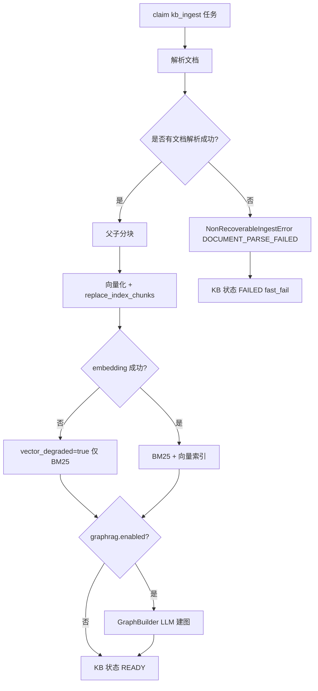
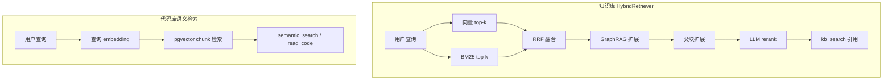

# 知识库文档摄取

[English](knowledge-base-ingestion.md)

知识库文档摄取的权威说明：解析、OCR、分块、向量化、GraphRAG、向量降级、失败处理与 Worker 对账。

## 概览

| 组件 | 文件 | 职责 |
|------|------|------|
| API 触发 | `knowledge_base_routes.py` | 创建 `kb_ingest` 任务，绑定 `ingest_task_id` |
| 任务 Runner | `KBIngestionTaskRunner` | 包装 `KBIngestionRunner`，映射终态错误 |
| 流水线 | `KBIngestionRunner` | 解析 → 分块 → 向量化 → 索引 → 可选 GraphRAG |
| OCR | `ocr_service.py` | `ocr.mode=vision_llm` 时对图片型 PDF 页做视觉 LLM OCR |
| Worker 入口 | `worker/main.py` `_execute_kb_ingest_job` | 解析 GraphRAG LLM 与独立 OCR 视觉模型 |

Worker 为摄取解析两个 LLM 句柄：

- **GraphRAG LLM** — 默认对话模型，用于实体/关系抽取（`GraphBuilder`）
- **OCR LLM** — 首个可用视觉模型（`resolve_vision_model()`）；未单独注入时回退到 GraphRAG LLM

摄取任务 session id：`kb-ingest:{kb_id}`（非用户聊天会话）。

## 摄取流水线



### 解析阶段

来源（`KBSourceType`）：文件上传、ZIP、网页 URL、Confluence、飞书。

- 单文档状态：`PARSING` → `READY` 或 `FAILED`
- 纯图片 PDF：`knowledge_base.ocr.mode=vision_llm` 时通过 `ocr_pdf_to_blocks()` OCR
- 超大文件：在 `knowledge_base.document.max_bytes`（默认 50 MB）处截断并告警 — 若未超过 nginx 限制则不会在 API 层拒绝

配置（`api/config.yaml`）：

```yaml
knowledge_base:
  ocr:
    mode: vision_llm  # vision_llm | rapidocr | off
    max_pages: 50
  document:
    max_bytes: 52428800
    max_pages: 1000
  graphrag:
    enabled: true
```

### 分块与索引

- `KBChunker` 生成父子块（`parent_max_chars`、`child_max_chars`、`overlap`）
- `knowledge_base.vector_enabled=true` 时对子块做 embedding
- embedding 失败设置 `vector_degraded=true`；BM25/混合检索仍可用
- SSE `step` 事件：`parse`、`chunk`、`index`、`graph`（启用时）

### GraphRAG（可选）

`graphrag.enabled=true` 时在索引写入后运行 `GraphBuilder`。GraphRAG LLM 不可用会记录日志并跳过 — 摄取仍可能达到 `READY`。

## 检索栈（KB vs Codebase）

知识库检索有意设计得比代码库语义搜索更复杂：



| 维度 | 知识库 | 代码库 |
|------|--------|--------|
| 向量索引 | `knowledge_base.vector_enabled`（默认 true） | 可用时建向量；失败时 `vector_degraded` |
| 全文 | BM25 + `zh_tokenizer` | 符号索引 + 静态分析 |
| 图 | 可选 GraphRAG | 静态分析依赖边 |
| Rerank | LLM rerank（`knowledge_base.rerank`） | 无 |
| Agent 工具 | `KnowledgeBaseTool.kb_search` | `CodebaseTool.semantic_search` |

见 [Codebase 重新索引](codebase-reindex.zh-CN.md) 了解更轻量的代码库检索路径。

## 失败与恢复

| 失败类型 | 错误码 | Worker 行为 |
|----------|--------|-------------|
| 全部文档解析失败 | `DOCUMENT_PARSE_FAILED` | `NonRecoverableIngestError` → `fast_fail`，不自动重试 |
| 运行中瞬态基础设施故障 | `TASK_INFRA_FAILED` 等 | Agent 任务走 `prepare_recoverable_retry`；KB 摄取若任务终态 failed 则 `_finalize_kb_ingest_failure` |
| 卡住摄取（孤儿任务） | — | `_reconcile_stuck_kb_ingests()` 每 30 秒 + 启动时 |

`NonRecoverableIngestError`（`ingest_errors.py`）表示内容损坏或不可解析 — Worker 调用 `_finalize_kb_ingest_failure()` 设置 `KBStatus.FAILED` 并清除 `ingest_task_id`。

可恢复 Agent 重试（`RecoverableTaskInputUnavailable`、检查点恢复）适用于**聊天 Agent 任务**，不适用于「全部解析失败」的 KB 摄取。

## 上传与大小限制

| 层级 | 限制 | 说明 |
|------|------|------|
| Nginx 网关 | 200 MB | `nginx/nginx.conf` 中 `client_max_body_size 200m` |
| KB 文档 | 默认 50 MB | AppConfig `knowledge_base.document.max_bytes` |
| 市场资源 | 默认 25 MB | `server.marketplace_max_upload_bytes` |

勿对所有功能统一写「200 MB 上传」— KB 文档有更低的 AppConfig 上限。

## 相关文档

- [教程：内部知识库](../tutorials/02-internal-knowledge-base.zh-CN.md)
- [Codebase 向量降级与重新索引](codebase-reindex.zh-CN.md)
- [任务恢复](task-recovery.zh-CN.md)
- [事件系统](events.zh-CN.md)
- [配置来源治理](config-source-governance.zh-CN.md)
- [生产部署](../operations/deployment.zh-CN.md)
