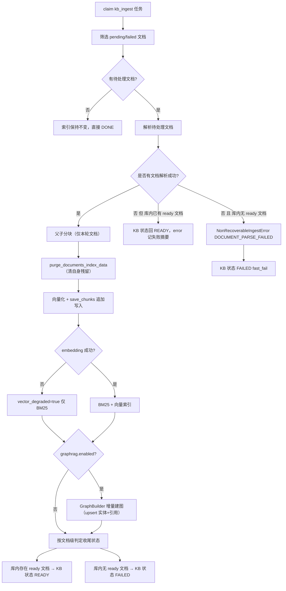
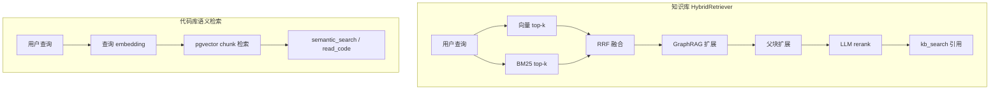

# 知识库文档摄取

[English](knowledge-base-ingestion.md)

知识库文档摄取的权威说明：解析、OCR、分块、向量化、GraphRAG、向量降级、失败处理与 Worker 对账。

## 概览

| 组件 | 文件 | 职责 |
|------|------|------|
| API 触发 | `knowledge_base_routes.py` | 创建 `kb_ingest` 任务，绑定 `ingest_task_id` |
| 任务 Runner | `KBIngestionTaskRunner` | 包装 `KBIngestionRunner`，映射终态错误 |
| 流水线 | `KBIngestionRunner` | 解析 → 分块 → 向量化 → 索引 → 可选 GraphRAG |
| OCR | `ocr_service.py` | `ocr.mode=vision_llm` 时对图片型 PDF 页做视觉 LLM OCR |
| Worker 入口 | `worker/main.py` `_execute_kb_ingest_job` | 解析 GraphRAG LLM 与独立 OCR 视觉模型 |

Worker 为摄取解析两个 LLM 句柄：

- **GraphRAG LLM** — 默认对话模型，用于实体/关系抽取（`GraphBuilder`）
- **OCR LLM** — 首个可用视觉模型（`resolve_vision_model()`）；未单独注入时回退到 GraphRAG LLM

摄取任务 session id：`kb-ingest:{kb_id}`（非用户聊天会话）。

## 摄取流水线

摄取是**增量**的常态化流水线，全量重建只是它的一个特例：

- `KBIngestionRunner.run(kb_id)` 每次只选取库内 `status IN (pending, failed)` 的文档处理（解析 → 分块 → 向量化 → 索引 → 可选 GraphRAG）。索引前先 `purge_documents_index_data` 清掉**这些文档自己**的旧 chunks/关系/引用行（失败重试场景的残留），随后把新 chunks **追加**写入，不再对整库调用 `replace_index_chunks`/`clear_index_data`。库内其他已 `ready` 的文档、其索引数据全程不受触碰。
- 新增文档（`add_documents`）：新文档天然是 `pending`，派发任务后 runner 自然只处理新文档；已有文档的检索/问答在摄取期间不受影响。
- 手动 `reindex`（全量兜底）：派发前把库内**所有**文档重置为 `pending` 并调用 `clear_index_data`（含 `knowledge_entity_refs`），之后走同一条流水线重新处理全部文档，语义与「摄取一个全新的库」等价。全量重建期间检索为空窗。
- 删除文档不进入这条流水线，而是在服务层同步完成（见「删除文档语义」）。


```mermaid
flowchart TD
  Start["claim kb_ingest 任务"] --> Select["筛选 pending/failed 文档"]
  Select --> HasPending{"有待处理文档?"}
  HasPending -->|"否"| NoOp["索引保持不变，直接 DONE"]
  HasPending -->|"是"| Parse["解析待处理文档"]
  Parse --> ParseFail{"是否有文档解析成功?"}
  ParseFail -->|"否 且 库内无 ready 文档"| NonRecov["NonRecoverableIngestError DOCUMENT_PARSE_FAILED"]
  ParseFail -->|"否 但 库内已有 ready 文档"| KeepReady["KB 状态回 READY，error 记失败摘要"]
  ParseFail -->|"是"| Chunk["父子分块（仅本轮文档）"]
  Chunk --> Purge["purge_documents_index_data（清自身残留）"]
  Purge --> Embed["向量化 + save_chunks 追加写入"]
  Embed --> EmbedOk{"embedding 成功?"}
  EmbedOk -->|"否"| Degraded["vector_degraded=true 仅 BM25"]
  EmbedOk -->|"是"| Index["BM25 + 向量索引"]
  Degraded --> GraphCheck{"graphrag.enabled?"}
  Index --> GraphCheck
  GraphCheck -->|"是"| Graph["GraphBuilder 增量建图（upsert 实体+引用）"]
  GraphCheck -->|"否"| Finalize["按文档级判定收尾状态"]
  Graph --> Finalize
  Finalize --> Ready["库内存在 ready 文档 → KB 状态 READY"]
  Finalize --> Failed2["库内无 ready 文档 → KB 状态 FAILED"]
  NonRecov --> Failed["KB 状态 FAILED fast_fail"]
```

### 解析阶段

来源（`KBSourceType`）：文件上传、ZIP、网页 URL、Confluence、飞书。

- 单文档状态：`PARSING` → `READY` 或 `FAILED`
- 纯图片 PDF：`knowledge_base.ocr.mode=vision_llm` 时通过 `ocr_pdf_to_blocks()` OCR
- 超大文件：在 `knowledge_base.document.max_bytes`（默认 50 MB）处截断并告警 — 若未超过 nginx 限制则不会在 API 层拒绝

配置（`api/config.yaml`）：

```yaml
knowledge_base:
  ocr:
    mode: vision_llm  # vision_llm | rapidocr | off
    max_pages: 50
  document:
    max_bytes: 52428800
    max_pages: 1000
  graphrag:
    enabled: true
```

### 分块与索引

- `KBChunker` 生成父子块（`parent_max_chars`、`child_max_chars`、`overlap`），只处理本轮 `pending`/`failed` 文档的内容
- `knowledge_base.vector_enabled=true` 时对子块做 embedding
- embedding 失败设置 `vector_degraded=true`；BM25/混合检索仍可用
- `save_chunks` 按有无 embedding 分两路、每批 500 条批量 `INSERT`（`db_knowledge_base_repository.py`），不再逐条写入
- SSE `step` 事件：`parse`、`chunk`、`index`、`graph`（启用时）

### GraphRAG（可选，增量合并）

`graphrag.enabled=true` 时在索引写入后运行 `GraphBuilder`，只对**本轮新处理文档**的父块做实体/关系抽取。GraphRAG LLM 不可用会记录日志并跳过 — 摄取仍可能达到 `READY`。

实体合并按 `(kb_id, name)` upsert（`upsert_entities`）：同名实体已存在则复用其 id，只补写一条来源引用行；不存在则新建实体。关系照常插入并带 `chunk_id` 溯源；跨文档关系由实体合并自然产生，无需特殊处理。详见下节「实体来源引用表」。

## 实体来源引用表（knowledge_entity_refs）

增量删除文档需要知道「一个实体是否还被其他文档支撑」，为此引入引用表记录实体的来源文档：

| 列 | 类型 | 说明 |
|----|------|------|
| `id` | varchar PK | |
| `kb_id` | varchar | FK `knowledge_bases.id`，`ondelete=CASCADE` |
| `entity_id` | varchar | FK `knowledge_entities.id`，`ondelete=CASCADE` |
| `doc_id` | varchar | FK `knowledge_documents.id`，`ondelete=CASCADE` |
| `created_at` | timestamp | |

`UNIQUE(entity_id, doc_id)`，并各建一条 `doc_id`/`entity_id` 索引（迁移 `a5b6c7d8e9f0_create_knowledge_entity_refs`）。写入走 `save_entity_refs`（`INSERT … ON CONFLICT (entity_id, doc_id) DO NOTHING`），同一实体被同一文档多次命中不会重复计数。

**存量回填**：迁移在建表后立即执行 `INSERT … SELECT DISTINCT`，用 `knowledge_relations.chunk_id → knowledge_chunks.doc_id` 反推每条关系两端实体（`src_entity_id`/`dst_entity_id`）各自关联的文档，`id` 用 `md5(entity_id || ':' || doc_id)` 保证幂等可重跑。不出现在任何关系里的**孤儿实体**无法反推来源，保守不回填——它们没有引用行，因此也不会进入删除文档时的候选集，不会被误删；这类存量孤儿实体只在手动 `reindex` 时随 `clear_index_data` 被清除并重建。

## 删除文档语义

删除单个文档（`DELETE /knowledge-bases/{id}/documents/{doc_id}`）**不再触发 reindex**，而是在单个 UoW 事务内同步精确清理，顺序敏感（`purge_documents_index_data`）：

1. 删除该文档 chunks 关联的关系（按 `chunk_id IN (该文档的 chunks)` 子查询）。
2. 删除该文档的实体引用行（`doc_id = ?`），删除前先查出被删行的 `entity_id` 集合作为候选。
3. 在候选集合内删除引用计数归零的实体：`DELETE FROM knowledge_entities WHERE id IN (候选) AND NOT EXISTS (SELECT 1 FROM knowledge_entity_refs WHERE entity_id = knowledge_entities.id)`；候选集合的范围保证「本来就没有引用行的存量孤儿实体」不会被这一步误删。归零实体的残余关系由 FK `ondelete=CASCADE` 一并清除。
4. 删除该文档的 chunks，最后删除文档行本身。

效果：该文档独占的 chunks、关系、实体全部消失；被其他文档共享的实体保留。删除后 `kb.doc_count`/`kb.chunk_count`/`kb.ready_doc_count` 重新统计；若删空全部文档则 KB 回到 `PENDING` 并清空 `ingest_task_id`，否则按下节的库级判定收敛到 `READY` 或 `FAILED`。

## 检索栈（KB vs Codebase）

知识库检索有意设计得比代码库语义搜索更复杂：


```mermaid
flowchart TB
  subgraph kb ["知识库 HybridRetriever"]
    Q1["用户查询"] --> V1["向量 top-k"]
    Q1 --> B1["BM25 top-k"]
    V1 --> RRF["RRF 融合"]
    B1 --> RRF
    RRF --> Graph["GraphRAG 扩展"]
    Graph --> Parent["父块扩展"]
    Parent --> Rerank["LLM rerank"]
    Rerank --> Out1["kb_search 引用"]
  end
  subgraph cb ["代码库语义检索"]
    Q2["用户查询"] --> Embed2["查询 embedding"]
    Embed2 --> Vec2["pgvector chunk 检索"]
    Vec2 --> Out2["semantic_search / read_code"]
  end
```

| 维度 | 知识库 | 代码库 |
|------|--------|--------|
| 向量索引 | `knowledge_base.vector_enabled`（默认 true） | 可用时建向量；失败时 `vector_degraded` |
| 全文 | BM25 + `zh_tokenizer` | 符号索引 + 静态分析 |
| 图 | 可选 GraphRAG | 静态分析依赖边 |
| Rerank | LLM rerank（`knowledge_base.rerank`） | 无 |
| Agent 工具 | `KnowledgeBaseTool.kb_search` | `CodebaseTool.semantic_search` |

见 [Codebase 重新索引](codebase-reindex.zh-CN.md) 了解更轻量的代码库检索路径。

## 状态机与问答门槛

文档状态机不变：`PENDING → PARSING → READY | FAILED`。

KB 状态机（`PENDING → PARSING → CHUNKING → INDEXING → GRAPH_BUILDING → READY | FAILED`）也不变，但**库级失败判定是文档级的**：一轮摄取结束时（`_finalize_kb`），只要库内**存在任意一个 `READY` 文档**，KB 最终状态就是 `READY`；只有库内**没有任何 `READY` 文档**才置为 `FAILED`。部分文档失败时，KB 的 `error` 字段写入摘要（如「2 个文档解析或索引失败」），前端按 warning 展示而非致命错误，单个文档自身的失败原因记录在该文档的 `error` 字段。

`KnowledgeBase.ready_doc_count`（`count_ready_documents` 聚合 `status='ready'` 的文档数，与既有 `doc_count` 并列返回）是「能否开始问答」的门槛：`create_session_for_kb` 要求 `ready_doc_count > 0`，前端「开始问答」按钮同样以 `ready_doc_count > 0` 为条件（而非等待整库 `status === READY`）。这使得增量摄取新文档、或新文档解析失败时，只要库内已有 ready 文档，检索与问答全程不受影响。

## 失败与恢复

| 失败类型 | 错误码 | Worker 行为 |
|----------|--------|-------------|
| 全部文档解析失败且库内无 ready 文档 | `DOCUMENT_PARSE_FAILED` | `NonRecoverableIngestError` → `fast_fail`，不自动重试 |
| 本轮文档解析/分块失败但库内已有 ready 文档 | — | 失败文档标记 `FAILED`，KB 回到 `READY`，`error` 记失败摘要，索引数据未受影响 |
| 运行中瞬态基础设施故障 | `TASK_INFRA_FAILED` 等 | Agent 任务走 `prepare_recoverable_retry`；KB 摄取若任务终态 failed 则 `_finalize_kb_ingest_failure` |
| 卡住摄取（孤儿任务） | — | `_reconcile_stuck_kb_ingests()` 每 30 秒 + 启动时 |

`NonRecoverableIngestError`（`ingest_errors.py`）表示内容损坏或不可解析 — Worker 调用 `_finalize_kb_ingest_failure()` 设置 `KBStatus.FAILED` 并清除 `ingest_task_id`。

可恢复 Agent 重试（`RecoverableTaskInputUnavailable`、检查点恢复）适用于**聊天 Agent 任务**，不适用于「全部解析失败」的 KB 摄取。

## 上传与大小限制

| 层级 | 限制 | 说明 |
|------|------|------|
| Nginx 网关 | 200 MB | `nginx/nginx.conf` 中 `client_max_body_size 200m` |
| KB 文档 | 默认 50 MB | AppConfig `knowledge_base.document.max_bytes` |
| 市场资源 | 默认 25 MB | `server.marketplace_max_upload_bytes` |

勿对所有功能统一写「200 MB 上传」— KB 文档有更低的 AppConfig 上限。

## 相关文档

- [教程：内部知识库](../tutorials/02-internal-knowledge-base.zh-CN.md)
- [Codebase 向量降级与重新索引](codebase-reindex.zh-CN.md)
- [任务恢复](task-recovery.zh-CN.md)
- [事件系统](events.zh-CN.md)
- [配置来源治理](config-source-governance.zh-CN.md)
- [生产部署](../operations/deployment.zh-CN.md)
