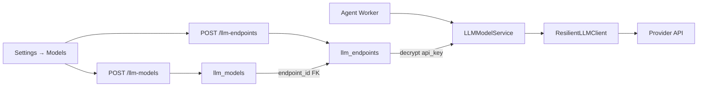

# LLM Endpoints and Models

[简体中文](llm-endpoints-and-models.zh-CN.md)

This document describes the **endpoint / model split** introduced in 2026-07: why it exists, data model, API/UI flow, migration, encryption, and interaction with model resilience.

## Motivation

Previously each `llm_models` row stored provider, base URL, and API key. That caused:

- Duplicate keys when multiple model names share one provider account
- Key rotation requiring edits on every model row
- Fallback logic coupling quota errors to individual model rows instead of sibling models on the same endpoint

The split separates **connection credentials** (endpoint) from **model selection** (model).

| Layer | Table | Stores |
|-------|-------|--------|
| Endpoint | `llm_endpoints` | `provider`, `base_url`, encrypted `api_key`, `visibility`, owner |
| Model | `llm_models` | `endpoint_id` FK, `model_name`, temperature, capabilities, default flag |

## Architecture

## User flow (UI)

1. **Add endpoint** — provider, optional custom base URL, API key (stored encrypted)
2. **Add model** — pick endpoint, enter model name (e.g. `gpt-4o`), optional temperature
3. **Set default** — one model marked default for new sessions
4. **Rotate key** — edit the **endpoint** row only; sibling models inherit the new key

Authoritative operational steps: [Production deployment — Models](../operations/deployment.md).

## API

| Method | Path | Description |
|--------|------|-------------|
| GET/POST | `/api/llm-endpoints` | List/create endpoints |
| GET/PUT/DELETE | `/api/llm-endpoints/{id}` | Endpoint CRUD |
| GET/POST | `/api/llm-models` | List/create models |
| GET/PUT/DELETE | `/api/llm-models/{id}` | Model CRUD |
| POST | `/api/llm-models/{id}/set-default` | Set default |
| POST | `/api/llm-models/{id}/probe-multimodal` | Vision capability probe |

Creating/updating a model validates that `endpoint_id` belongs to the current user's visibility scope. Connection info is injected from the endpoint at runtime — models no longer accept raw API keys.

## Encryption and migration

- Alembic migration `ff01llmendpoints` creates `llm_endpoints`, adds `llm_models.endpoint_id`, backfills from legacy model rows
- `python -m app.migrate` encrypts endpoint keys (`llm_endpoints.api_key_encryption`: `legacy_plaintext` → `fernet_v1`)
- Standalone fix: `python -m app.migrate_llm_api_keys`

See [Security model — Secret management](security-model.md#secret-management).

## Model resilience interaction

`ResilientLLMClient` resolves the active model, then on quota/rate errors may iterate **sibling models** sharing the same `endpoint_id` before cross-endpoint fallback. Circuit breaker state is keyed per model/endpoint pair.

See [Model resilience](model-resilience.md).

## Team visibility (known limitation)

`OwnerScope.team(...)` does not yet filter `llm_endpoints` / `llm_models` by `team_id`. Team-shared LLM configs are a future enhancement. See [Config source governance](config-source-governance.md).

## Related documentation

- [API README](../../api/README.md) — route index
- [Frontend UI](frontend-ui.md) — Settings → Models components
- [Model resilience](model-resilience.md)
- [Security model](security-model.md)
