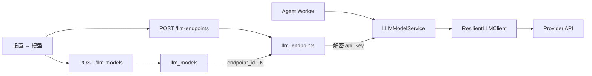

[English](llm-endpoints-and-models.md)

# LLM 端点与模型

本文档说明 2026-07 引入的 **端点 / 模型拆分**：动机、数据模型、API/UI 流程、迁移、加密及与模型韧性的关系。

## 动机

此前每个 `llm_models` 行存储 Provider、Base URL 与 API Key，导致：

- 同一 Provider 账户下多模型名重复存储 Key
- 轮换 Key 需逐个编辑模型行
- 配额回退逻辑与单模型行耦合，无法在同端点兄弟模型间遍历

拆分将 **连接凭证**（端点）与 **模型选择**（模型）分离。

| 层级 | 表 | 存储内容 |
|------|-----|----------|
| 端点 | `llm_endpoints` | `provider`、`base_url`、加密 `api_key`、`visibility`、owner |
| 模型 | `llm_models` | `endpoint_id` FK、`model_name`、temperature、capabilities、默认标记 |

## 架构

## 用户流程（UI）

1. **添加端点** — Provider、可选 Base URL、API Key（加密存储）
2. **添加模型** — 选择端点、填写模型名（如 `gpt-4o`）、可选 temperature
3. **设为默认** — 新会话使用默认模型
4. **轮换 Key** — 仅编辑**端点**；同端点下模型自动继承

权威操作步骤：[生产部署 — 模型](../operations/deployment.zh-CN.md)。

## API

| 方法 | 路径 | 说明 |
|------|------|------|
| GET/POST | `/api/llm-endpoints` | 列表/创建端点 |
| GET/PUT/DELETE | `/api/llm-endpoints/{id}` | 端点 CRUD |
| GET/POST | `/api/llm-models` | 列表/创建模型 |
| GET/PUT/DELETE | `/api/llm-models/{id}` | 模型 CRUD |
| POST | `/api/llm-models/{id}/set-default` | 设为默认 |
| POST | `/api/llm-models/{id}/probe-multimodal` | 多模态探测 |

创建/更新模型时校验 `endpoint_id` 属于当前用户可见范围。运行时从端点注入连接信息 — 模型不再接受原始 API Key。

## 加密与迁移

- Alembic `ff01llmendpoints` 创建 `llm_endpoints`、添加 `llm_models.endpoint_id`、从旧模型行回填
- `python -m app.migrate` 加密端点 Key（`llm_endpoints.api_key_encryption`：`legacy_plaintext` → `fernet_v1`）
- 独立修复：`python -m app.migrate_llm_api_keys`

见 [安全模型 — 密钥管理](security-model.zh-CN.md#密钥管理)。

## 与模型韧性的关系

`ResilientLLMClient` 解析当前模型后，遇配额/限流错误可先遍历同 `endpoint_id` 的**兄弟模型**，再跨端点回退。熔断状态按模型/端点对键控。

见 [模型韧性](model-resilience.zh-CN.md)。

## 团队可见性（已知限制）

`OwnerScope.team(...)` 尚未按 `team_id` 过滤 `llm_endpoints` / `llm_models`。团队共享 LLM 配置为后续增强。见 [配置来源治理](config-source-governance.zh-CN.md)。

## 相关文档

- [API README](../../api/README.zh-CN.md)
- [前端 UI](frontend-ui.zh-CN.md)
- [模型韧性](model-resilience.zh-CN.md)
- [安全模型](security-model.zh-CN.md)
