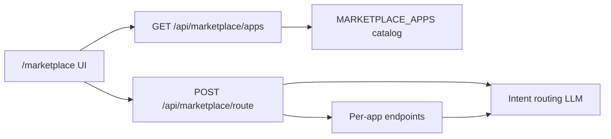

# Marketplace

[简体中文](marketplace.zh-CN.md)

OpenCitadel ships a catalog of **LLM-powered mini-apps** under `/marketplace`. Apps are defined in code (`api/app/application/services/marketplace/catalog.py`) and must stay in sync with the UI registry (enforced by `test_catalog_contract.py`).

## Architecture

- **Catalog** exposes metadata (id, name, category, `model_dependency`, vision requirements).
- **Route** endpoint picks the best app and prefills params from natural language.
- **Per-app routes** implement nutrition, translation, watermark, etc.

Feature flag: `feature_flags.enable_marketplace_llm_apps` in `AppConfig` (default `true` in `config.yaml`).

## Current apps (9)

| ID | Name | Model | Vision |
|----|------|-------|--------|
| `nutrition-analysis` | AI nutrition analysis | required | yes |
| `consumption-calculator` | Consumption calculator | required | yes |
| `smart-translation` | Smart translation | required | no |
| `prompt-lab` | Prompt lab | required | no |
| `qr-generator` | QR code generator | none | no |
| `dev-toolbox` | Developer toolbox | none | no |
| `secret-generator` | Password & UUID generator | none | no |
| `document-converter` | Document format converter | none | no |
| `watermark-tool` | Watermark tool | optional | yes |

## Removed apps (historical)

The following were removed from the catalog and database (migration `x2y3z4a5b6c7`):

- Fortune teller / personality tests / document QA / video search / quiz-style apps
- Related tables: `marketplace_fortune_predictions`, `questionnaires`, `rooms`, etc.

Do not reference these in new integrations; Web Operator is now a **built-in Skill**, not a Marketplace app.

## model_dependency contract

| Value | Meaning |
|-------|---------|
| `required` | App needs a configured LLM; UI prompts user to add a model |
| `optional` | Works with or without LLM (e.g. watermark with local processing fallback) |
| `none` | Pure client-side or deterministic logic |

See [Contract compatibility](contract-compatibility.md) for API/SSE stability rules.

## Public vs authenticated routes

- `GET /api/marketplace/apps` — public catalog list
- App-specific POST routes — require authenticated session (JWT)

## Related docs

- [Model resilience](model-resilience.md)
- [Contract compatibility](contract-compatibility.md)
