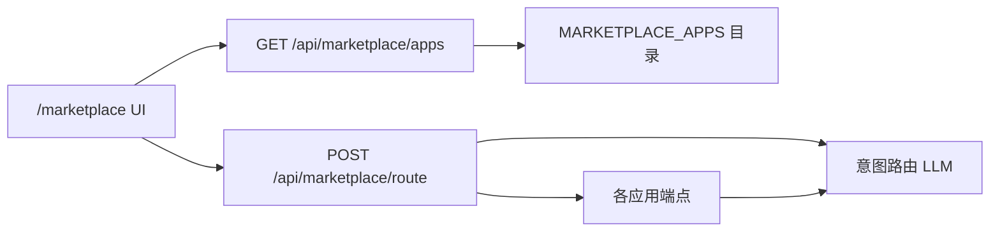

# 应用市场

[English](marketplace.md)

OpenCitadel 在 `/marketplace` 提供一组 **LLM 小应用**。应用定义在代码中（`api/app/application/services/marketplace/catalog.py`），须与 UI registry 保持一致（由 `test_catalog_contract.py` 保障）。

## 架构

- **目录**暴露元数据（id、名称、分类、`model_dependency`、是否需视觉）。
- **Route** 端点根据自然语言选择应用并预填参数。
- **各应用路由**实现营养分析、翻译、水印等功能。

功能开关：`AppConfig.feature_flags.enable_marketplace_llm_apps`（`config.yaml` 默认 `true`）。

## 当前应用（9 个）

| ID | 名称 | 模型依赖 | 视觉 |
|----|------|----------|------|
| `nutrition-analysis` | AI 营养分析 | required | 是 |
| `consumption-calculator` | 消耗计算器 | required | 是 |
| `smart-translation` | 智能翻译 | required | 否 |
| `prompt-lab` | 提示词工坊 | required | 否 |
| `qr-generator` | 二维码生成器 | none | 否 |
| `dev-toolbox` | 开发者工具箱 | none | 否 |
| `secret-generator` | 密码 & UUID 生成器 | none | 否 |
| `document-converter` | 文档格式转换 | none | 否 |
| `watermark-tool` | 水印工具 | optional | 是 |

## 已移除应用（历史）

以下已从目录与数据库移除（迁移 `x2y3z4a5b6c7`）：

- 占卜 / 性格测试 / 文档问答 / 视频搜索 / 问卷类应用
- 相关表：`marketplace_fortune_predictions`、`questionnaires`、`rooms` 等

新集成请勿再引用；Web Operator 现为**内置 Skill**，非 Marketplace 应用。

## model_dependency 契约

| 值 | 含义 |
|----|------|
| `required` | 需要已配置 LLM；UI 引导用户添加模型 |
| `optional` | 可有可无 LLM（如水印本地处理回退） |
| `none` | 纯前端或确定性逻辑 |

见 [协议兼容策略](contract-compatibility.zh-CN.md)。

## 公开与鉴权路由

- `GET /api/marketplace/apps` — 公开目录
- 各应用 POST 路由 — 需登录（JWT）

## 相关文档

- [模型韧性设计](model-resilience.zh-CN.md)
- [API/SSE 协议兼容策略](contract-compatibility.zh-CN.md)
