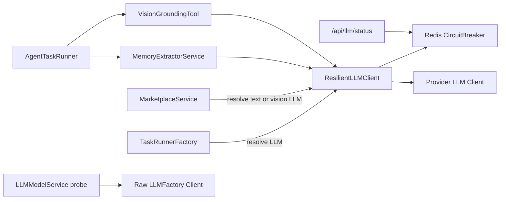
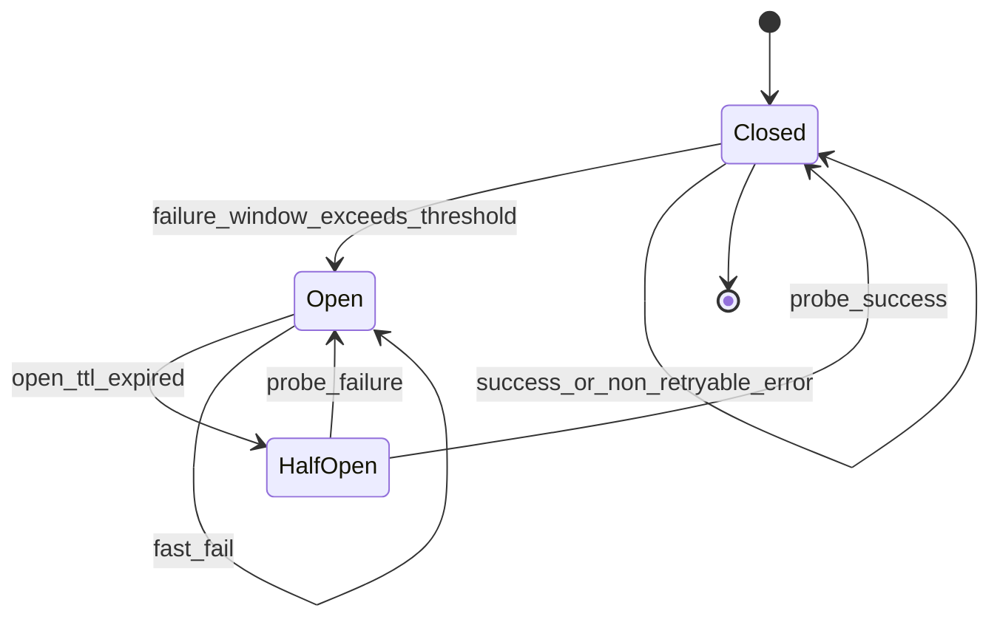

# Model Resilience Design

[简体中文](model-resilience.zh-CN.md)

This document is the authoritative reference for OpenCitadel model isolation, circuit breaking, fallback, SLO, and runtime governance.

## Goals and Scope

When all models are unavailable, the platform must still satisfy:

- Configurable: model probe is decoupled from config save.
- Health visible: `/api/status` reflects platform domain health; `/api/llm/status` reflects model domain health.
- Non-model features available: file operations and catalog endpoints that do not depend on chat LLM.
- Model entry points fail fast: Agent, A2A, and Marketplace LLM terminate with explicit error codes, without accumulating Worker, sandbox, or Redis resources.

### P0 Scope

| Capability | Description |
|------------|-------------|
| DB config cold-start seed | When `AppConfig` is empty, initialized from `config.yaml` / Helm `appConfig` |
| `ModelResilienceConfig` | Single source of truth for model resilience behavior |
| `feature_flags` | Controls model-dependent entry points such as Agent / A2A |
| Probe decoupling | User-initiated probes use raw LLM, not the chat circuit-breaker domain |
| Health surface split | `/api/status` and `/api/llm/status` separated |
| Tiered error codes | `ErrorEvent.code` carries machine-readable reasons such as `MODEL_*` |
| Circuit breaking and fast fail | Redis circuit state drives Worker, reconcile, and A2A fast fail |
| Embedding degradation | Codebase ingest can complete in degraded mode when vectors are unavailable |

### Non-P0 Enhancements

| Capability | Current positioning |
|------------|---------------------|
| Cross-provider fallback | Off by default; requires separate gradual rollout |
| DLQ auto replay | Off by default; currently controlled manually per runbook |
| Full container split | Long-term structural isolation direction |
| UI badge full coverage | Partially implemented; to be completed |

## Architecture

### Call-Site Boundaries

| Call site | Path | Failure domain |
|-----------|------|----------------|
| Agent main path | `TaskRunnerFactory._resolve_llm_and_config` -> `create_resilient_llm` | chat LLM |
| MemoryExtractorService | Inherits runner-injected `llm` | chat LLM |
| VisionGroundingTool | Inherits Agent-injected `llm` | chat LLM |
| Marketplace LLM | `_resolve_text_llm` / `_resolve_vision_llm` | chat LLM |
| ImageGenerationTool / `generate_image()` | Image generation | Independent tool domain; no chat LLM fallback |
| `LLMModelService._run_vision_probe` | User-initiated probe | Raw `LLMFactory.create`; bypasses resilience layer |

## Circuit Breaker State Machine

| State | Behavior |
|-------|----------|
| `closed` | Normal Provider calls; failures counted in window |
| `open` | No Provider calls; return model unavailable error directly |
| `half_open` | Allow limited probe requests; success closes, failure reopens |

Circuit state is stored in Redis `cb:open_until:*`, `cb:errors:*`, `cb:probe:*`; window thresholds come from `AppConfig.model_resilience`. Circuit error classification counts only recoverable failures such as 429, 5xx, and timeout; non-recoverable errors like auth and missing config should fail fast and do not participate in fallback.

## Fallback and Retry Boundaries

| Phase | Behavior |
|-------|----------|
| Before first token / first delta emitted | May use `ResilientLLMClient` transient retry and same-provider capability-matched fallback |
| After any delta emitted | Mid-stream model switch prohibited; terminate with `ErrorEvent.code=MODEL_*` |
| Non-streaming `invoke` | Not subject to mid-stream restriction; may retry or fallback |

Implementation constraints:

- `ResilientLLMClient.streaming_started` is set after the first chunk is yielded.
- `stream_invoke` throws `ModelUnavailableError` directly on error when `streaming_started=true`; does not switch candidate models.
- OpenAI path no longer retains an independent retry helper; chat LLM retry authority is centralized in `ResilientLLMClient`.
- `allow_cross_provider_fallback=false` is the default; cross-provider fallback is not a P0 capability.

## Health, SLO, and Alerting

### Platform Domain L0

| Metric | Target |
|--------|--------|
| `/api/status` availability | >= 99.9% |
| P95 latency | < 500ms |

### Model Domain L2 / L3

| Metric | Description |
|--------|-------------|
| Success rate by provider / model_id | From resilience_events |
| 429 / 5xx / timeout ratio | Counted in circuit window |
| Circuit open duration | Redis `cb:open_until:*` TTL |
| Fallback hit rate | `fallback_success` events |

### Embedding Domain

| Metric | Description |
|--------|-------------|
| Index task success rate | Codebase ingest |
| Degradation trigger rate | `vector_degraded=true` |

### `/api/llm/status`

| Metric | Target |
|--------|--------|
| Availability | > 99.5% |
| P95 | < 200ms, read-only aggregation |

Initial thresholds are in `AppConfig.model_resilience`; review and tune weekly.

## Runbook

### Gradual Rollout Order

1. Observe only: deploy `/api/llm/status` and resilience metrics; do not enable fallback.
2. Tiered error codes: frontend and backend recognize `ErrorEvent.code`.
3. Circuit breaking: `model_resilience.enabled=true`, `fallback_enabled=false`.
4. Fallback: optionally enable `fallback_enabled=true`; keep `allow_cross_provider_fallback=false`.

### Kill Switches

| Switch | Effect |
|--------|--------|
| `model_resilience.enabled=false` | Disable circuit breaking and `ResilientLLMClient` fast fail |
| `model_resilience.fallback_enabled=false` | Disable same-provider fallback |
| `feature_flags.enable_agent_features=false` | Disable Agent / A2A entry points |

### DLQ Replay

`dlq_replay_enabled=false` is the current default. For manual replay:

1. Replay only entries whose `error_code` starts with `MODEL_`.
2. Confirm the corresponding `model_id` circuit state is `closed`.
3. Batch size must not exceed `dlq_replay_batch_size`; interval must be at least `dlq_replay_interval_seconds`.
4. Pause replay when the model enters `open` again.

### A2A Fixed Error

When models are unavailable, A2A JSON-RPC returns:

| Field | Value |
|-------|-------|
| `code` | `-32001` |
| `message` | `Model service temporarily unavailable (circuit open); please retry later` |

## Rollout Phases

| Phase | Content |
|-------|---------|
| Short-term, shipped / low risk | DB config migration, `AppConfig` schema, probe decoupling, health split, `/api/llm/status`, `ErrorEvent.code`, Marketplace catalog `model_dependency`, Marketplace lazy LLM resolution |
| Mid-term, core resilience | Redis circuit + half_open Lua, `ResilientLLMClient`, DLQ `error_code`, Worker fast fail, reconcile circuit linkage, Embedding ingest degradation, A2A entry governance |
| Long-term, structural isolation | `feature_flags` route grouping, Worker runner registry, full UI visualization, Codebase reindex UI |

## Regression Focus

| Test | Coverage |
|------|----------|
| `test_model_error_fixes.py` | Model error classification and frontend/backend compatibility |
| `test_reconcile.py` | Orphan task reconcile |
| `test_reconcile_circuit.py` | Reconcile and circuit linkage |
| `test_status_routes.py` | `/api/status` |
| `api/tests/app/infrastructure/external/llm/test_circuit_breaker.py` | Redis circuit state transitions |
| `api/tests/app/domain/models/test_event_upgrader.py` | Legacy event `ErrorEvent.code` compatibility |
| `test_marketplace_catalog.py` | `model_dependency` field validation |

## Related Documentation

- [Architecture Overview](overview.md)
- [Event System](events.md)
- [Configuration Source Governance](config-source-governance.md)
- [API/SSE Protocol Compatibility](contract-compatibility.md)
- [Codebase Vector Degradation and Reindex](codebase-reindex.md)
