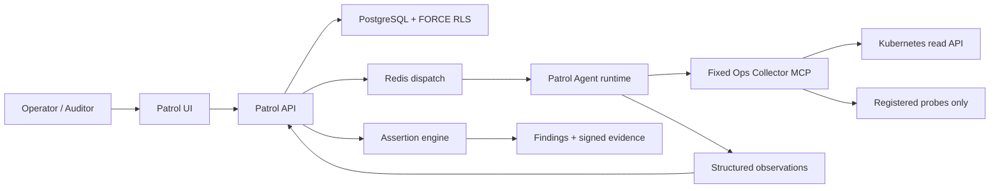
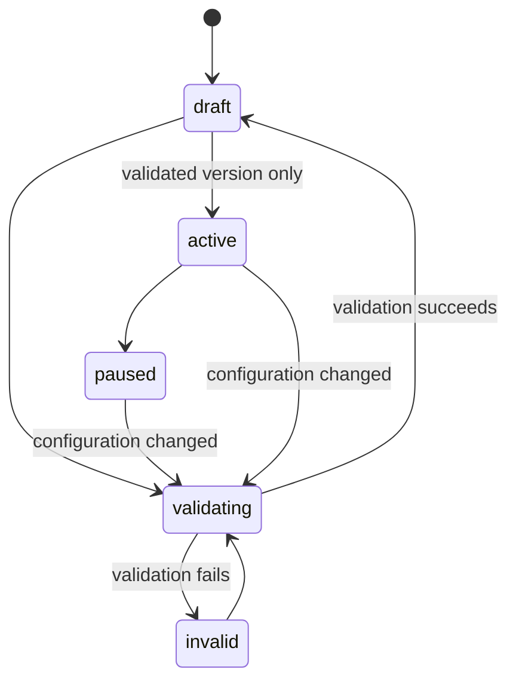

[简体中文](ops-patrol.zh-CN.md)

# Ops Patrol architecture

Ops Patrol is a Developer Preview control plane for deterministic, read-only infrastructure checks. Its first built-in Pack targets Kubernetes operations. The Agent may collect observations, but it cannot declare the final check status: the API evaluates assertions, creates Findings, calculates evidence completeness, and signs the export package.

## Trust boundary

The Collector is a separate security boundary. It exports nine operations: `get_capabilities` and eight bounded probes. It accepts namespace, workload, and registered target identifiers—not shell commands, arbitrary URLs, PromQL, SQL, or Kubernetes paths. Kubernetes authentication stays inside the Collector through its Pod ServiceAccount; P0 registered HTTP probes do not accept arbitrary auth headers.

Collector strings are always untrusted input. Redaction, output caps, schema hashes, evidence hashes, assertion evaluation, and result finalization are enforced outside the model.

## Domain and lifecycle

| Object | Purpose | Important invariants |
|--------|---------|----------------------|
| Pack | Versioned target, schedule, checks, and Collector binding | A change increments `version`, disables its schedule, and requires validation again |
| Run | Immutable snapshot of one Pack version | One active Run per Pack; manual triggers require `Idempotency-Key` |
| Check result | Authoritative assertion outcome | Status comes from the server assertion engine, not model text |
| Finding | Deduplicated actionable failure | Fingerprinted, occurrence-counted, and decision-audited |
| Evidence package | Portable review record | Canonical JSON, SHA-256 manifest, and HMAC signature |

Activation is version-bound. Validation checks the persisted MCP tool policies, performs live capability discovery and a read-only dry run, and stores the capability hash. A Run refuses finalization if the live capability hash, Pack version, Session, or submission idempotency key differs from its snapshot.

## Runtime isolation

A Patrol Session is created with `operator_scope=owned` and `gate_profile=strict`. `TaskRunnerFactory` binds exactly one Collector, removes A2A servers and unrelated extra tools, disables generic memory extraction, and applies the Pack run timeout. Capability drift is checked before construction and again at submission.

Only the built-in `PatrolTool` may submit observations. Disabled or missing checks become explicit results according to the Pack contract; they are never silently counted as healthy. Errors such as Collector unavailability, denied scope, schema mismatch, truncated required evidence, or incomplete evidence remain visible in the Run.

## Persistence and tenant isolation

Patrol Packs, Runs, check results, and Findings are tenant tables protected by owner/team scope and PostgreSQL `FORCE ROW LEVEL SECURITY`. Scope mismatches return not found where possible to avoid resource-existence leaks. Audit records are append-only and are not deleted by Patrol retention.

`AUDITOR` can list Packs/Runs, open reports, and download evidence, but authenticated mutations are denied. `USER` and `ADMIN` may mutate resources inside their validated workspace scope. Global feature flags and runtime configuration remain admin-only.

## HTTP contract

All paths are below `/api` and require a session JWT. Team resources also require the normal `X-Workspace-Id` context.

| Operation | Endpoint |
|-----------|----------|
| List/create Packs | `GET/POST /patrol-packs` |
| Read/update/delete Pack | `GET/PATCH/DELETE /patrol-packs/{id}` |
| Validate/activate/pause | `POST /patrol-packs/{id}/{validate|activate|pause}` |
| Manual Run | `POST /patrol-packs/{id}/trigger` with `Idempotency-Key` |
| Pack metrics | `GET /patrol-packs/{id}/metrics` |
| List/read Runs | `GET /patrol-runs`, `GET /patrol-runs/{id}` |
| Cancel/replay Run | `POST /patrol-runs/{id}/{cancel|replay}` |
| Download evidence | `GET /patrol-runs/{id}/evidence` |
| Decide Finding | `POST /patrol-findings/{id}/{acknowledge|resolve|false-positive}` |

False-positive decisions require a reason. The Developer Preview deliberately exposes no repair or mutation action against infrastructure.

## Configuration ownership

| Configuration | Source of truth |
|---------------|-----------------|
| `feature_flags.enable_ops_patrol` | Global DB-backed AppConfig; `api/config.yaml` / Helm `appConfig` are seeds |
| `feature_flags.enable_ops_patrol_fixture_replay` | Global AppConfig; must remain false in production |
| `patrol_retention.*` | Global DB-backed AppConfig |
| MCP Server URL and fixed tool policies | Persisted MCP Server record |
| Collector allowlists, registries, limits, Kubernetes identity | Collector environment / Kubernetes deployment |
| Evidence HMAC | `AUDIT_SIGNING_KEY` and its key-id/previous-key rotation settings |

Disabling the product flag hides navigation and prevents new work while keeping authorized history readable. It does not drop tables or delete evidence.

## Retention and observability

The Worker scheduler periodically removes expired Runs and Findings in bounded batches and clears expired Collector evidence references. Defaults are 30 days for Runs/Findings and 7 days for Collector evidence, with a 90-day maximum. Audit rows remain intact.

Patrol metrics report Run finalization and status counts. Product metrics on a Pack use a 30-day window: scheduled-run success, Finding/false-positive counts, and median review time. Review time is absent until an operator opens the Run and decides a Finding; missing values are not converted to zero.

## Related documentation

- [Run a Patrol](../tutorials/06-ops-patrol.md)
- [Operations and troubleshooting](../operations/ops-patrol.md)
- [Collector module](../../ops-collector/README.md)
- [Configuration source governance](config-source-governance.md)
- [Automation scheduler](automation-scheduler.md)
