# Ops Patrol Architecture

[简体中文](ops-patrol.zh-CN.md)

Ops Patrol separates read-only collection, deterministic assertion, and
approval-gated remediation. Patrol and remediation use the universal execution
kernel; neither has a private task lifecycle.

```mermaid
flowchart LR
  Pack[Versioned Patrol Pack] --> Admit[Patrol Run admission]
  Admit --> Run[Patrol Run]
  Run --> Activity[patrol.execute Activity]
  Activity --> Collector[Read-only Collector]
  Collector --> Validate[Manifest + schema validation]
  Validate --> Assert[Deterministic assertions]
  Assert --> Finding[Findings + signed evidence]
  Finding --> Proposal[Remediation proposal]
  Proposal --> Child[Remediation child Run]
  Child --> Approval[Persisted approval]
  Approval --> Remediation[remediation.execute Activity]
  Remediation --> Actuator[Narrow Ops Actuator]
  Actuator --> Verify[Verification Patrol Run]
```

## Patrol Packs and collection

A Pack is immutable once published and snapshots its assertions, target,
collector server id, capability manifest/hash, timeout, and retention policy.
Admission freezes that snapshot into the Patrol product Run and formal Run
input. Collector output must match the registered closed-world schema and the
frozen capability hash.

The Collector owns read-only Kubernetes/HTTP/Prometheus/certificate/backup/
dependency probes. It accepts only configured names and destinations. The
kernel validates every submission before deterministic server-side assertion;
LLM output cannot decide pass/warn/fail.

`PatrolExecutionActivityHandler` is idempotent: finalization uses the Run's
submission key and creates one report/finding set. Evidence references and
digests are stored before the Activity reports success.

## Remediation

A Finding may produce a remediation proposal from a fixed action policy. The
proposal becomes a linked `remediation` Run whose single
`remediation.execute` Activity always requires formal approval. The approval
freezes subject and risk information; only a dedicated approval command can
advance it.

The Actuator exposes registered restart, scale, and rollback-style operations
within explicit namespace/workload allowlists. It has separate ServiceAccount,
NetworkPolicy, non-root/read-only container hardening, and idempotency keys.
It cannot read application credentials or issue arbitrary Kubernetes calls.

After execution, a linked verification Patrol Run determines whether the
finding is resolved. Remediation status is projected from these durable Runs,
not from transport success.

## Safety invariants

- Collector has no write RBAC; Actuator has no arbitrary read/write API.
- Capability drift, owner mismatch, unregistered target, invalid evidence, or
  missing approval fails closed.
- A rejected/cancelled/expired approval makes zero Actuator calls.
- Duplicate trigger, Activity delivery, or completion cannot create another
  finding set or mutation.
- Audit and evidence rows outlive product retention; cleanup removes only
  expired product references allowed by policy.

See [governance plane](governance-plane.md), [security model](security-model.md),
and [Patrol operations](../operations/ops-patrol.md).
