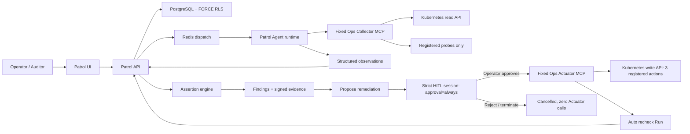
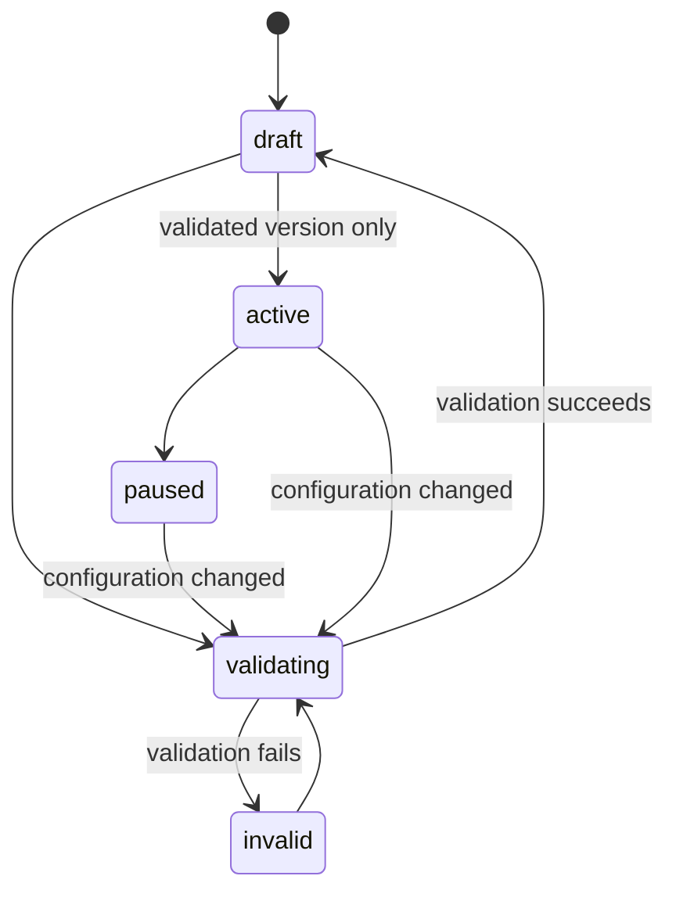
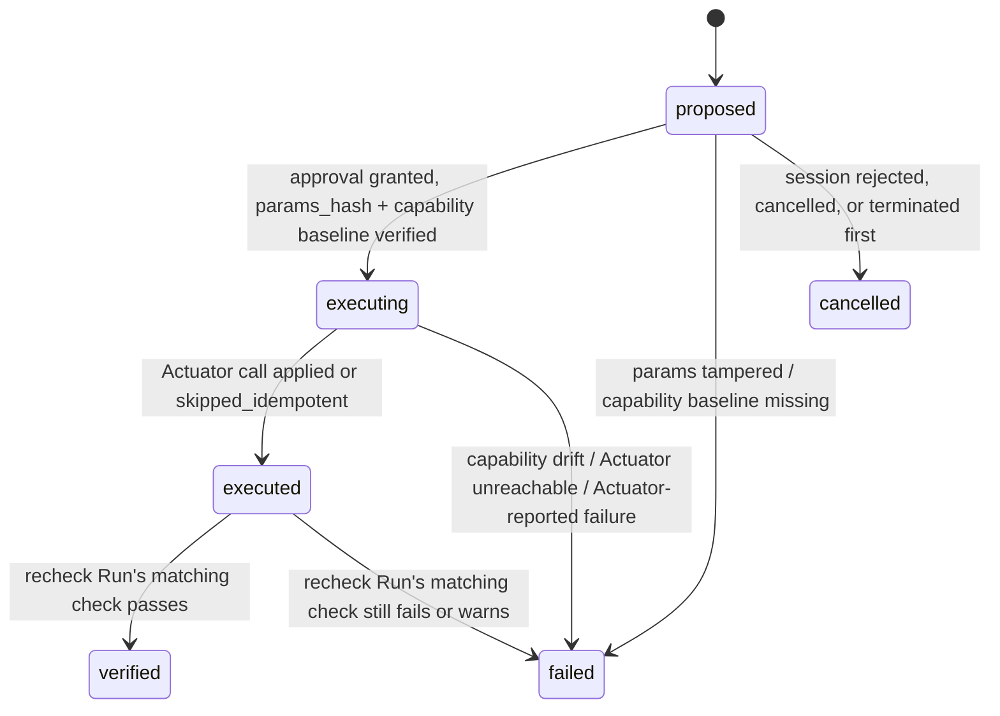
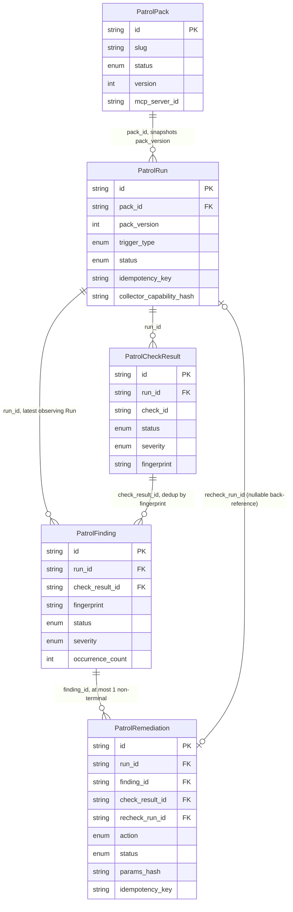

[简体中文](ops-patrol.zh-CN.md)

# Ops Patrol architecture

Ops Patrol is a Developer Preview control plane for deterministic, read-only infrastructure checks. Its first built-in Pack targets Kubernetes operations. The Agent may collect observations, but it cannot declare the final check status: the API evaluates assertions, creates Findings, calculates evidence completeness, and signs the export package.

## Trust boundary

The Collector is a separate security boundary. It exports nine operations: `get_capabilities` and eight bounded probes. It accepts namespace, workload, and registered target identifiers—not shell commands, arbitrary URLs, PromQL, SQL, or Kubernetes paths. Kubernetes authentication stays inside the Collector through its Pod ServiceAccount; P0 registered HTTP probes do not accept arbitrary auth headers.

The Ops Actuator is a second, stricter security boundary reused only for approved writes: exactly three registered actions (`restart_workload`, `scale_workload`, `rollback_workload`) plus `get_capabilities`, gated by an explicit namespace/workload allowlist, and never exposed to a model — the backend execution service is its only caller, and only after a human approves the specific call inside a strict-gate session. See [Remediation](#remediation).

Collector strings are always untrusted input. Redaction, output caps, schema hashes, evidence hashes, assertion evaluation, and result finalization are enforced outside the model.

## Domain and lifecycle

| Object | Purpose | Important invariants |
|--------|---------|----------------------|
| Pack | Versioned target, schedule, checks, and Collector binding | A change increments `version`, disables its schedule, and requires validation again |
| Run | Immutable snapshot of one Pack version | One active Run per Pack; manual triggers require `Idempotency-Key` |
| Check result | Authoritative assertion outcome | Status comes from the server assertion engine, not model text |
| Finding | Deduplicated actionable failure | Fingerprinted, occurrence-counted, and decision-audited |
| Evidence package | Portable review record | Canonical JSON, SHA-256 manifest, and HMAC signature |

Activation is version-bound. Validation checks the persisted MCP tool policies, performs live capability discovery and a read-only dry run, and stores the capability hash. A Run refuses finalization if the live capability hash, Pack version, Session, or submission idempotency key differs from its snapshot.

## Runtime isolation

A Patrol Session is created with `operator_scope=owned` and `gate_profile=strict`. `TaskRunnerFactory` binds exactly one Collector, removes A2A servers and unrelated extra tools, disables generic memory extraction, and applies the Pack run timeout. Capability drift is checked before construction and again at submission.

Only the built-in `PatrolTool` may submit observations. Disabled or missing checks become explicit results according to the Pack contract; they are never silently counted as healthy. Errors such as Collector unavailability, denied scope, schema mismatch, truncated required evidence, or incomplete evidence remain visible in the Run.

## Remediation

Ops Patrol Remediation adds a narrow, human-approved write path on top of the read-only Pack/Run/Finding pipeline. It is a governed extension, not a new trust-boundary escape hatch: every write still goes through the same session-gate machinery every other Agent tool call uses.

| Object | Purpose | Important invariants |
|--------|---------|----------------------|
| `PatrolRemediation` | One proposed/executed write action against one Finding | `idempotency_key` and `params_hash` are fixed at proposal time; at most one non-terminal remediation per Finding |
| Ops Actuator | Separate write-capable MCP service | Exactly three registered actions against an explicit namespace/workload allowlist; resolved by the fixed MCP Server name `ops-actuator` |
| Remediation session | `gate_profile=strict` Agent session, Skill `ops-patrol-remediation` | Exactly one tool (`patrol_execute_remediation`, `approval=always`); no MCP, A2A, memory, or subagent access |

`propose()` fails closed on the `enable_ops_patrol_remediation` flag, an inactionable Finding, an unsupported probe family (only `k8s_*` probes have an Actuator counterpart), or an already-active remediation for the same Finding — before opening any session. If the built-in `ops-patrol-remediation` Skill has not been seeded, `propose()` rejects every request rather than writing a partial record.

### Safety invariants

Four invariants hold at the real governed-tool code path — the same `ToolBatchExecutor` machinery every strict-gate session runs through — and are contract-tested (`api/tests/app/contracts/test_remediation_governance_invariants.py`), not only asserted at the service-unit level:

1. **Zero execution before approval.** The tool's declared policy is `approval=always`; the batch executor queues every matching call and never invokes it ahead of a human decision. Rejecting or abandoning the session leaves the Actuator untouched and moves the proposal to `cancelled`.
2. **The approved `params_hash` binds through to execution.** Execution recomputes the hash from the persisted action/namespace/workload/kind/params immediately before calling the Actuator; any mismatch fails the remediation (`PARAMS_TAMPERED`) with zero Actuator calls.
3. **Actuator capability drift between approval and execution is rejected.** A capability-hash baseline is captured when the session is built — before the tool is ever exposed to the model, and therefore before any approval window opens — and compared against one live read immediately before the write call; a mismatch or a missing baseline fails closed with zero write calls.
4. **AUDITOR can neither create nor approve a remediation.** The propose route requires `require_non_auditor`, and the generic tool-approval RBAC applies identically to this tool as to every other governed call.

The Actuator call itself is never retried on failure and always carries the remediation's own persisted idempotency key — never a value supplied by the tool call or the LLM — so an approved action executes at most once even under session resume or worker retry. A successfully `executed` remediation automatically triggers a recheck Run against the same Pack; `finalize_run` resolves the originating Finding and marks the remediation `verified` only if the matching check now passes, otherwise the remediation becomes `failed` and the Finding stays open for a human decision.

## Entity relationships

`api/app/domain/models/patrol.py` is the source of truth for every field below. A Run is an immutable snapshot of one Pack version; a Remediation both descends from a Finding and, once executed, points back at the Run its recheck produced — closing the loop from read-only detection to a verified fix.

`PatrolCheckResult.fingerprint` and `PatrolFinding.fingerprint` share the same derivation (`patrol_fingerprint(pack_id, check_id, target_ref, ...)`), so a recurring failure updates one open Finding's `run_id`, `check_result_id`, `last_seen_at`, and `occurrence_count` instead of creating a duplicate row — `PatrolFinding.run_id` therefore always tracks the Run that most recently observed it, not the Run that first created it. `PatrolRemediation.run_id` records the Run that was active when the remediation was proposed; `PatrolRemediation.recheck_run_id` is a separate, nullable field populated only once the Actuator call reports `executed` — it is `null` while `proposed`/`executing`/`cancelled`, and identifies the auto-triggered Run whose matching check result decides whether the remediation lands on `verified` or `failed`. `PATROL_REMEDIATION_TERMINAL_STATUSES` (`verified` / `failed` / `cancelled`) plus a partial unique DB index enforce the "at most one non-terminal remediation per Finding" invariant that the cardinality above cannot express on its own.

## Persistence and tenant isolation

Patrol Packs, Runs, check results, and Findings are tenant tables protected by owner/team scope and PostgreSQL `FORCE ROW LEVEL SECURITY`. Scope mismatches return not found where possible to avoid resource-existence leaks. Audit records are append-only and are not deleted by Patrol retention.

`AUDITOR` can list Packs/Runs, open reports, and download evidence, but authenticated mutations are denied. `USER` and `ADMIN` may mutate resources inside their validated workspace scope. Global feature flags and runtime configuration remain admin-only.

## HTTP contract

All paths are below `/api` and require a session JWT. Team resources also require the normal `X-Workspace-Id` context.

| Operation | Endpoint |
|-----------|----------|
| List/create Packs | `GET/POST /patrol-packs` |
| Read/update/delete Pack | `GET/PATCH/DELETE /patrol-packs/{id}` |
| Validate/activate/pause | `POST /patrol-packs/{id}/{validate|activate|pause}` |
| Manual Run | `POST /patrol-packs/{id}/trigger` with `Idempotency-Key` |
| Pack metrics | `GET /patrol-packs/{id}/metrics` |
| List/read Runs | `GET /patrol-runs`, `GET /patrol-runs/{id}` |
| Cancel/replay Run | `POST /patrol-runs/{id}/{cancel|replay}` |
| Download evidence | `GET /patrol-runs/{id}/evidence` |
| Decide Finding | `POST /patrol-findings/{id}/{acknowledge|resolve|false-positive}` |
| Propose remediation | `POST /patrol-findings/{id}/remediations` |
| List/read remediations | `GET /patrol-runs/{run_id}/remediations`, `GET /patrol-remediations/{id}` |

False-positive decisions require a reason. Write operations against infrastructure are limited to the approval-gated remediation channel described in [Remediation](#remediation): a separate Ops Actuator, three registered actions, and human approval required for every call.

## Configuration ownership

| Configuration | Source of truth |
|---------------|-----------------|
| `feature_flags.enable_ops_patrol` | Global DB-backed AppConfig; `api/config.yaml` / Helm `appConfig` are seeds |
| `feature_flags.enable_ops_patrol_fixture_replay` | Global AppConfig; must remain false in production |
| `feature_flags.enable_ops_patrol_remediation` | Global DB-backed AppConfig; `propose()` fails closed when disabled |
| `patrol_retention.*` | Global DB-backed AppConfig |
| MCP Server URL and fixed tool policies | Persisted MCP Server record |
| Collector allowlists, registries, limits, Kubernetes identity | Collector environment / Kubernetes deployment |
| Actuator namespace/workload allowlist, min/max replicas, Kubernetes identity | Actuator environment / Kubernetes deployment |
| Evidence HMAC | `AUDIT_SIGNING_KEY` and its key-id/previous-key rotation settings |

Disabling the product flag hides navigation and prevents new work while keeping authorized history readable. It does not drop tables or delete evidence.

## Retention and observability

The Worker scheduler periodically removes expired Runs and Findings in bounded batches and clears expired Collector evidence references. Defaults are 30 days for Runs/Findings and 7 days for Collector evidence, with a 90-day maximum. Audit rows remain intact.

Patrol metrics report Run finalization and status counts. Product metrics on a Pack use a 30-day window: scheduled-run success, Finding/false-positive counts, and median review time. Review time is absent until an operator opens the Run and decides a Finding; missing values are not converted to zero.

## Related documentation

- [Run a Patrol](../tutorials/06-ops-patrol.md)
- [Approve a remediation](../tutorials/07-approved-remediation.md)
- [Operations and troubleshooting](../operations/ops-patrol.md)
- [Collector module](../../ops-collector/README.md)
- [Actuator module](../../ops-actuator/README.md)
- [Configuration source governance](config-source-governance.md)
- [Automation scheduler](automation-scheduler.md)
