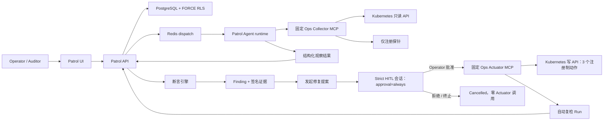
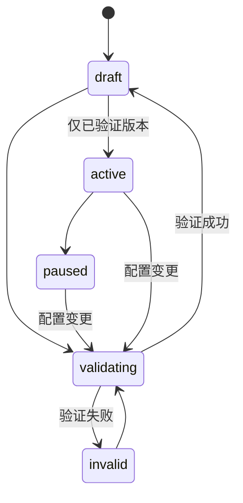
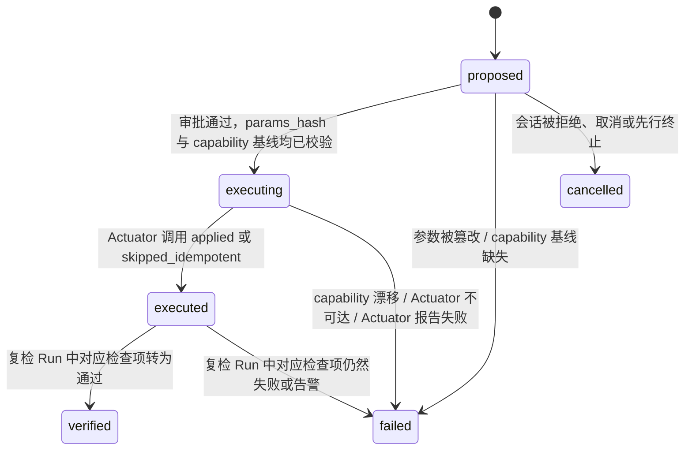
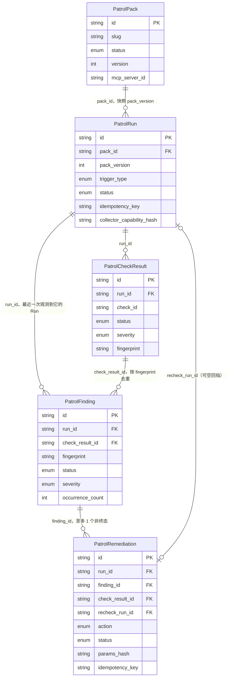

[English](ops-patrol.md)

# Ops Patrol 架构

Ops Patrol 是一个用于确定性、只读基础设施检查的 Developer Preview 控制面。首个内置 Pack 面向 Kubernetes 运维。Agent 可以采集观察结果，但不能自行宣布最终检查状态：API 负责计算断言、创建 Finding、统计证据完整率并签名导出包。

## 信任边界

Collector 是独立安全边界，只暴露九个操作：`get_capabilities` 与八个有界探针。输入只能是 Namespace、Workload 和已注册目标标识符，不接受 Shell、任意 URL、PromQL、SQL 或 Kubernetes 路径。Kubernetes 认证通过 Pod ServiceAccount 留在 Collector 内；P0 注册 HTTP 探针不接受任意 Auth Header。

Ops Actuator 是第二个、范围更窄的安全边界，仅在批准后的写操作中复用：只暴露三个注册制动作（`restart_workload`、`scale_workload`、`rollback_workload`）与 `get_capabilities`，受显式 Namespace/Workload 白名单限制，且从不暴露给模型——后端执行服务是它唯一的调用方，且只有在人工批准该具体调用后才会调用它。详见 [Remediation](#remediation)。

Collector 返回的字符串一律视为不可信输入。脱敏、输出上限、Schema Hash、证据 Hash、断言计算和结果定稿均在模型之外强制执行。

## 领域对象与生命周期

| 对象 | 作用 | 关键不变量 |
|------|------|------------|
| Pack | 版本化目标、计划、检查与 Collector 绑定 | 变更会增加 `version`、停用计划并要求重新验证 |
| Run | 某个 Pack 版本的不可变快照 | 同一 Pack 仅一个活动 Run；手动触发必须提供 `Idempotency-Key` |
| Check result | 权威断言结果 | 状态来自服务端断言引擎，而非模型文本 |
| Finding | 去重后的可处理异常 | 按指纹去重、累计次数并审计决策 |
| Evidence package | 可携带复核记录 | 规范化 JSON、SHA-256 Manifest 与 HMAC 签名 |

激活与版本绑定。验证阶段检查持久化 MCP 工具策略，执行实时能力发现和只读 dry-run，并保存 Capability Hash。若实时 Capability Hash、Pack 版本、Session 或提交幂等键与快照不一致，Run 将拒绝定稿。

## 运行时隔离

Patrol Session 使用 `operator_scope=owned` 与 `gate_profile=strict`。`TaskRunnerFactory` 只绑定一个 Collector，移除 A2A Server 与无关额外工具，关闭通用记忆提取，并采用 Pack 的 Run Timeout。能力漂移会在构建运行时前和提交时再次校验。

只有内置 `PatrolTool` 可以提交观察结果。被禁用或缺失的检查会按 Pack 契约形成显式结果，绝不会静默计为健康。Collector 不可达、Scope 被拒绝、Schema 不匹配、必需证据被截断或证据不完整都会保留在 Run 中。

## Remediation

Ops Patrol Remediation 在只读的 Pack/Run/Finding 流水线之上增加了一条范围收窄、需人工审批的写入通道。这是一个受治理的扩展，不是新的信任边界逃逸口：每一次写操作都要经过与其他任何 Agent 工具调用完全相同的会话门控机制。

| 对象 | 作用 | 关键不变量 |
|------|------|------------|
| `PatrolRemediation` | 针对一个 Finding 的一次提案/执行写动作 | `idempotency_key` 与 `params_hash` 在提案时即固定；同一 Finding 至多一条非终态修复记录 |
| Ops Actuator | 独立的写能力 MCP 服务 | 仅三个注册制动作，受显式 Namespace/Workload 白名单限制；按固定 MCP Server 名称 `ops-actuator` 解析 |
| 修复会话 | `gate_profile=strict` 的 Agent 会话，Skill 为 `ops-patrol-remediation` | 仅一个工具（`patrol_execute_remediation`，`approval=always`）；无 MCP、A2A、记忆或子 Agent 访问权限 |

`propose()` 会在打开任何会话之前，按 `enable_ops_patrol_remediation` 开关、Finding 是否可处理、探针族是否受支持（今天只有 `k8s_*` 探针有 Actuator 对应能力）、同一 Finding 是否已有进行中修复这几项逐一拒绝失败。若内置 `ops-patrol-remediation` Skill 尚未 Seed，`propose()` 会拒绝所有请求，而不是写入一条部分记录。

### 安全不变量

以下四条不变量在真实的受治理工具代码路径——每个 Strict Gate 会话都会经过的同一套 `ToolBatchExecutor` 机制——上成立，并且已有契约测试覆盖（`api/tests/app/contracts/test_remediation_governance_invariants.py`），而不仅仅是服务单元层面的断言：

1. **审批前零执行。** 该工具声明的 Policy 是 `approval=always`；批执行器会把每个匹配的调用排队，绝不会在人工决策前调用它。拒绝或放弃会话会让 Actuator 保持未被触碰，提案转为 `cancelled`。
2. **已批准的 `params_hash` 一路绑定到执行时刻。** 执行阶段会在调用 Actuator 前，用持久化的 action/namespace/workload/kind/params 重新计算一次 Hash；任何不一致都会让修复失败（`PARAMS_TAMPERED`），且零 Actuator 调用。
3. **审批与执行之间的 Actuator Capability 漂移会被拒绝。** Capability Hash 基线在会话构建时（工具暴露给模型之前，也就是任何审批窗口开启之前）就已捕获，并在写调用前与一次实时读取比对；不一致或基线缺失都会失败关闭，零写调用。
4. **AUDITOR 既不能创建也不能审批修复。** propose 路由要求 `require_non_auditor`，通用工具审批 RBAC 对这个工具与其他任何受治理调用一视同仁。

Actuator 调用本身失败后从不重试，且恒定携带该修复记录自身持久化的幂等键——绝非工具调用或 LLM 提供的值——因此即便会话恢复或 Worker 重试，一次批准的动作最多只会执行一次。成功 `executed` 的修复会自动对同一 Pack 触发一次复检 Run；`finalize_run` 只有在对应检查项转为通过时才会解决原 Finding 并把修复标记为 `verified`，否则修复变为 `failed`，Finding 保持开放、等待人工决策。

## 实体关系

`api/app/domain/models/patrol.py` 是以下字段的权威依据。Run 是某个 Pack 版本的不可变快照；Remediation 既由 Finding 派生，一旦执行完成又会回指自己触发的复检 Run——从只读检测到验证修复闭环。

`PatrolCheckResult.fingerprint` 与 `PatrolFinding.fingerprint` 共享同一套推导方式（`patrol_fingerprint(pack_id, check_id, target_ref, ...)`），因此重复出现的失败会更新同一个 open Finding 的 `run_id`、`check_result_id`、`last_seen_at` 与 `occurrence_count`，而不会新建一行——所以 `PatrolFinding.run_id` 始终指向最近一次观测到它的 Run，而不是最初创建它的 Run。`PatrolRemediation.run_id` 记录该修复被提议时所处的 Run；`PatrolRemediation.recheck_run_id` 是一个独立的可空字段，只有在 Actuator 调用汇报 `executed` 后才会被写入：处于 `proposed`/`executing`/`cancelled` 时为 `null`，其余情况下指向那个自动触发的 Run——该 Run 中对应检查项的结果决定修复最终落到 `verified` 还是 `failed`。「同一 Finding 至多一个非终态修复」这条不变量无法单靠上面的基数表达，由 `PATROL_REMEDIATION_TERMINAL_STATUSES`（`verified` / `failed` / `cancelled`）加上一条 DB 部分唯一索引共同强制。

## 持久化与租户隔离

Patrol Pack、Run、Check Result 与 Finding 均为租户表，受 Owner/Team Scope 与 PostgreSQL `FORCE ROW LEVEL SECURITY` 保护。Scope 不匹配时尽量返回 Not Found，避免泄露资源是否存在。审计记录仅追加，Patrol 保留策略不会删除它们。

`AUDITOR` 可以查看 Pack/Run、打开报告和下载证据，但所有已认证写操作均被拒绝。`USER` 与 `ADMIN` 可在已验证工作区 Scope 内变更资源。全局功能开关和运行时配置仍仅限管理员。

## HTTP 契约

以下路径均位于 `/api` 下并要求 Session JWT。团队资源还需要常规 `X-Workspace-Id` 上下文。

| 操作 | Endpoint |
|------|----------|
| 列出/创建 Pack | `GET/POST /patrol-packs` |
| 读取/更新/删除 Pack | `GET/PATCH/DELETE /patrol-packs/{id}` |
| 验证/激活/暂停 | `POST /patrol-packs/{id}/{validate|activate|pause}` |
| 手动 Run | `POST /patrol-packs/{id}/trigger` + `Idempotency-Key` |
| Pack 指标 | `GET /patrol-packs/{id}/metrics` |
| 列出/读取 Run | `GET /patrol-runs`、`GET /patrol-runs/{id}` |
| 取消/回放 Run | `POST /patrol-runs/{id}/{cancel|replay}` |
| 下载证据 | `GET /patrol-runs/{id}/evidence` |
| 决策 Finding | `POST /patrol-findings/{id}/{acknowledge|resolve|false-positive}` |
| 发起修复提案 | `POST /patrol-findings/{id}/remediations` |
| 列出/读取修复记录 | `GET /patrol-runs/{run_id}/remediations`、`GET /patrol-remediations/{id}` |

误报决策必须填写原因。针对基础设施的写操作仅限于 [Remediation](#remediation) 一节描述的审批制修复通道：独立的 Ops Actuator、三个注册制动作，且每次调用都要求人工审批。

## 配置归属

| 配置 | 权威来源 |
|------|----------|
| `feature_flags.enable_ops_patrol` | DB 承载的全局 AppConfig；`api/config.yaml` / Helm `appConfig` 仅为种子 |
| `feature_flags.enable_ops_patrol_fixture_replay` | 全局 AppConfig；生产必须保持 false |
| `feature_flags.enable_ops_patrol_remediation` | DB 承载的全局 AppConfig；关闭时 `propose()` 失败关闭 |
| `patrol_retention.*` | DB 承载的全局 AppConfig |
| MCP Server URL 与固定 Tool Policy | 持久化 MCP Server 记录 |
| Collector 白名单、注册表、限制与 Kubernetes 身份 | Collector 环境变量 / Kubernetes 部署 |
| Actuator Namespace/Workload 白名单、最小/最大副本数、Kubernetes 身份 | Actuator 环境变量 / Kubernetes 部署 |
| 证据 HMAC | `AUDIT_SIGNING_KEY` 及其 Key ID/历史 Key 轮换配置 |

关闭产品总开关会隐藏导航并停止新工作，但有权限的历史仍可读取；不会删除表或证据。

## 保留与可观测性

Worker Scheduler 以有界批次周期清理过期 Run、Finding 和 Collector 证据引用。默认 Run/Finding 保留 30 天、Collector 证据保留 7 天，最大均为 90 天；审计行保持不变。

Patrol 指标记录 Run 定稿及各状态数量。Pack 产品指标使用 30 天窗口：计划运行成功率、Finding/误报数和复核时间中位数。仅在 Operator 打开 Run 并完成 Finding 决策后才计算复核时间，缺失值不会转成 0。

## 相关文档

- [运行 Patrol](../tutorials/06-ops-patrol.zh-CN.md)
- [审批通过后执行修复](../tutorials/07-approved-remediation.zh-CN.md)
- [运维与排障](../operations/ops-patrol.zh-CN.md)
- [Collector 模块](../../ops-collector/README.zh-CN.md)
- [Actuator 模块](../../ops-actuator/README.zh-CN.md)
- [配置来源治理](config-source-governance.zh-CN.md)
- [自动化调度](automation-scheduler.zh-CN.md)
