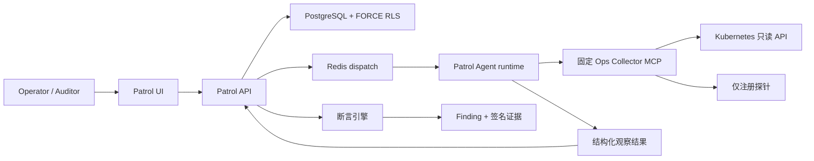
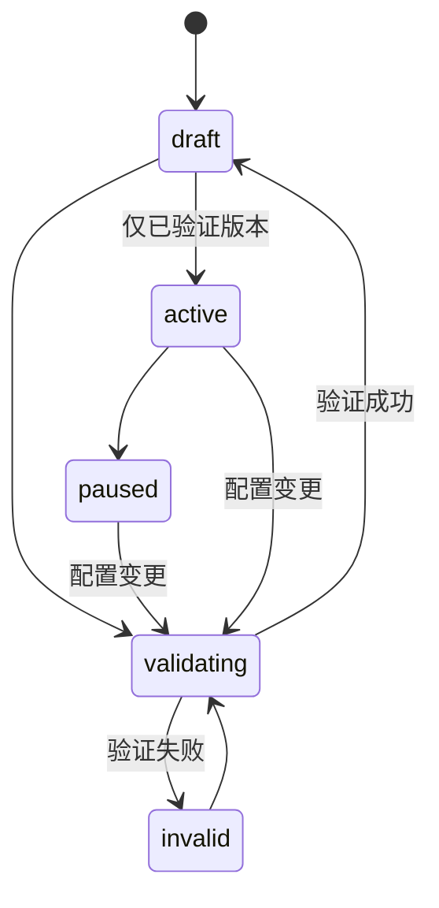

[English](ops-patrol.md)

# Ops Patrol 架构

Ops Patrol 是一个用于确定性、只读基础设施检查的 Developer Preview 控制面。首个内置 Pack 面向 Kubernetes 运维。Agent 可以采集观察结果，但不能自行宣布最终检查状态：API 负责计算断言、创建 Finding、统计证据完整率并签名导出包。

## 信任边界

Collector 是独立安全边界，只暴露九个操作：`get_capabilities` 与八个有界探针。输入只能是 Namespace、Workload 和已注册目标标识符，不接受 Shell、任意 URL、PromQL、SQL 或 Kubernetes 路径。Kubernetes 认证通过 Pod ServiceAccount 留在 Collector 内；P0 注册 HTTP 探针不接受任意 Auth Header。

Collector 返回的字符串一律视为不可信输入。脱敏、输出上限、Schema Hash、证据 Hash、断言计算和结果定稿均在模型之外强制执行。

## 领域对象与生命周期

| 对象 | 作用 | 关键不变量 |
|------|------|------------|
| Pack | 版本化目标、计划、检查与 Collector 绑定 | 变更会增加 `version`、停用计划并要求重新验证 |
| Run | 某个 Pack 版本的不可变快照 | 同一 Pack 仅一个活动 Run；手动触发必须提供 `Idempotency-Key` |
| Check result | 权威断言结果 | 状态来自服务端断言引擎，而非模型文本 |
| Finding | 去重后的可处理异常 | 按指纹去重、累计次数并审计决策 |
| Evidence package | 可携带复核记录 | 规范化 JSON、SHA-256 Manifest 与 HMAC 签名 |

激活与版本绑定。验证阶段检查持久化 MCP 工具策略，执行实时能力发现和只读 dry-run，并保存 Capability Hash。若实时 Capability Hash、Pack 版本、Session 或提交幂等键与快照不一致，Run 将拒绝定稿。

## 运行时隔离

Patrol Session 使用 `operator_scope=owned` 与 `gate_profile=strict`。`TaskRunnerFactory` 只绑定一个 Collector，移除 A2A Server 与无关额外工具，关闭通用记忆提取，并采用 Pack 的 Run Timeout。能力漂移会在构建运行时前和提交时再次校验。

只有内置 `PatrolTool` 可以提交观察结果。被禁用或缺失的检查会按 Pack 契约形成显式结果，绝不会静默计为健康。Collector 不可达、Scope 被拒绝、Schema 不匹配、必需证据被截断或证据不完整都会保留在 Run 中。

## 持久化与租户隔离

Patrol Pack、Run、Check Result 与 Finding 均为租户表，受 Owner/Team Scope 与 PostgreSQL `FORCE ROW LEVEL SECURITY` 保护。Scope 不匹配时尽量返回 Not Found，避免泄露资源是否存在。审计记录仅追加，Patrol 保留策略不会删除它们。

`AUDITOR` 可以查看 Pack/Run、打开报告和下载证据，但所有已认证写操作均被拒绝。`USER` 与 `ADMIN` 可在已验证工作区 Scope 内变更资源。全局功能开关和运行时配置仍仅限管理员。

## HTTP 契约

以下路径均位于 `/api` 下并要求 Session JWT。团队资源还需要常规 `X-Workspace-Id` 上下文。

| 操作 | Endpoint |
|------|----------|
| 列出/创建 Pack | `GET/POST /patrol-packs` |
| 读取/更新/删除 Pack | `GET/PATCH/DELETE /patrol-packs/{id}` |
| 验证/激活/暂停 | `POST /patrol-packs/{id}/{validate|activate|pause}` |
| 手动 Run | `POST /patrol-packs/{id}/trigger` + `Idempotency-Key` |
| Pack 指标 | `GET /patrol-packs/{id}/metrics` |
| 列出/读取 Run | `GET /patrol-runs`、`GET /patrol-runs/{id}` |
| 取消/回放 Run | `POST /patrol-runs/{id}/{cancel|replay}` |
| 下载证据 | `GET /patrol-runs/{id}/evidence` |
| 决策 Finding | `POST /patrol-findings/{id}/{acknowledge|resolve|false-positive}` |

误报决策必须填写原因。Developer Preview 有意不提供任何基础设施修复或变更操作。

## 配置归属

| 配置 | 权威来源 |
|------|----------|
| `feature_flags.enable_ops_patrol` | DB 承载的全局 AppConfig；`api/config.yaml` / Helm `appConfig` 仅为种子 |
| `feature_flags.enable_ops_patrol_fixture_replay` | 全局 AppConfig；生产必须保持 false |
| `patrol_retention.*` | DB 承载的全局 AppConfig |
| MCP Server URL 与固定 Tool Policy | 持久化 MCP Server 记录 |
| Collector 白名单、注册表、限制与 Kubernetes 身份 | Collector 环境变量 / Kubernetes 部署 |
| 证据 HMAC | `AUDIT_SIGNING_KEY` 及其 Key ID/历史 Key 轮换配置 |

关闭产品总开关会隐藏导航并停止新工作，但有权限的历史仍可读取；不会删除表或证据。

## 保留与可观测性

Worker Scheduler 以有界批次周期清理过期 Run、Finding 和 Collector 证据引用。默认 Run/Finding 保留 30 天、Collector 证据保留 7 天，最大均为 90 天；审计行保持不变。

Patrol 指标记录 Run 定稿及各状态数量。Pack 产品指标使用 30 天窗口：计划运行成功率、Finding/误报数和复核时间中位数。仅在 Operator 打开 Run 并完成 Finding 决策后才计算复核时间，缺失值不会转成 0。

## 相关文档

- [运行 Patrol](../tutorials/06-ops-patrol.zh-CN.md)
- [运维与排障](../operations/ops-patrol.zh-CN.md)
- [Collector 模块](../../ops-collector/README.zh-CN.md)
- [配置来源治理](config-source-governance.zh-CN.md)
- [自动化调度](automation-scheduler.zh-CN.md)
