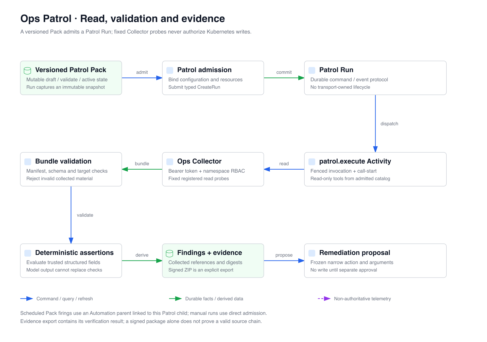
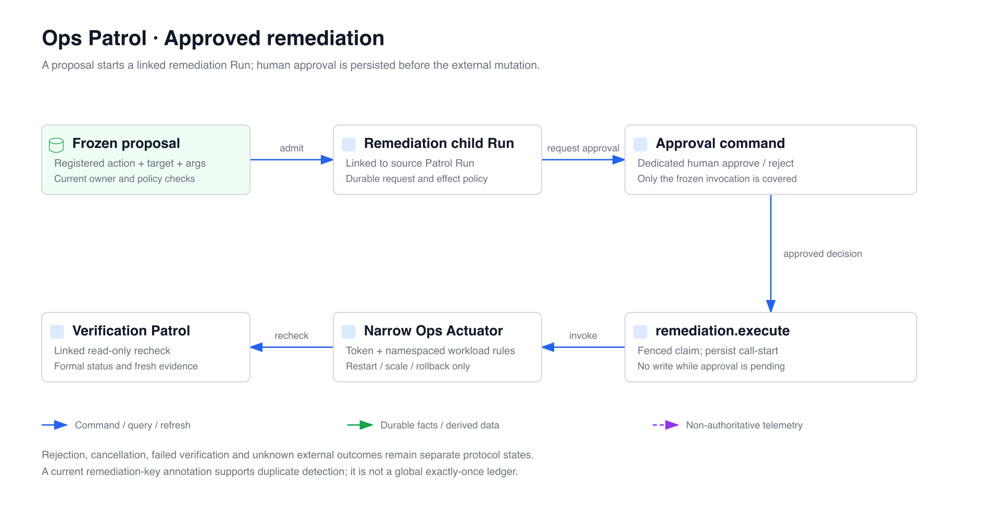

# Ops Patrol 架构

[English](ops-patrol.md)

Ops Patrol 把只读采集、确定性断言与审批制修复分离。巡检与修复都使用通用执行内核，
不存在私有任务生命周期。

## Patrol Pack 与采集

Pack Definition 是可编辑的版本化记录。编辑要求 `expected_version`，递增 Version、
回到 `draft` 并清空 Validation；该版本的正式 Patrol Validation Run 完成后才可 Activate。
执行准入将 Assertion、Target、Collector Server ID、Capability Hash 与 Enabled Tool 复制
到不可变产品 Run Snapshot；正式 Run Input 通过 Patrol Run/Pack Identity 关联该 Snapshot。
Retention 属于实时 Operations Policy，不是 Pack Snapshot 的一部分。Collector Output 必须匹配注册的闭世界 Schema 与冻结 Capability Hash。

Collector 只负责 Kubernetes/HTTP/Prometheus/Certificate/Backup/Dependency 读取，只接受已配置
Name/Destination。内核在确定性服务端断言前验证每个 Submission；LLM 输出不能决定
Pass/Warn/Fail。

`PatrolExecutionActivityHandler` 是 Idempotent：Finalization 使用 Run Submission Key，只创建
一份 Report/Finding Set。Evidence Reference 与 Digest 写入后 Activity 才报告成功。签名
Evidence Archive 由独立 Evidence Export Endpoint 组装；断言成功本身不创建签名 Archive。

## 修复

Finding 可由固定 Action Policy 生成 Remediation Proposal。目前仅 `k8s_*` Probe
Finding 支持修复；HTTP、Certificate、Backup、Dependency、Prometheus Probe 不支持。
Restart/Rollback 不接受 Action Parameter；Scale 只接受正整数 `replicas`，Rollback
回到 Workload 的紧邻前一 Revision。Proposal 成为关联 `remediation`
Run，其唯一 `remediation.execute` Activity 总是要求正式审批。Approval 冻结 Subject 与 Risk；
只有专用 Approval Command 能推进。

Remediation 默认 `disabled`；`propose_only` 允许审阅 Proposal 但不能执行，`enabled`
允许在审批后执行。Actuator 只暴露注册的 Restart/Scale/Rollback 类操作，受明确
Namespace/Workload Allowlist。
它使用独立 ServiceAccount、NetworkPolicy、Non-root/Read-only Container 与 Idempotency Key，
不能读取应用凭据，也不能发任意 Kubernetes Call。

执行后由关联 Verification Patrol Run 判断 Finding 是否解决。Remediation Status 从这些持久 Run
投影，不从 Transport Success 推断。

## 安全不变量

- Collector 没有写 RBAC；Actuator 没有任意读写 API。
- Capability Drift、Owner Mismatch、未注册 Target、无效 Evidence 或缺失 Approval 一律关闭失败。
- Rejected/Cancelled/Expired Approval 产生零次 Actuator Call。
- 重复 Trigger、Activity Delivery 或 Completion 不会制造第二份 Finding Set 或 Mutation。
- Audit/Evidence Row 比产品 Retention 更长；Cleanup 只删除 Policy 允许的过期产品 Reference。

参见[治理平面](governance-plane.zh-CN.md)、[安全模型](security-model.zh-CN.md)与
[Patrol 运维](../operations/ops-patrol.zh-CN.md)。
