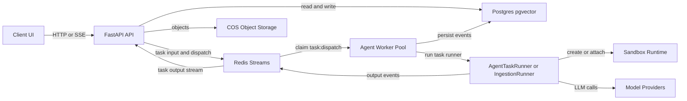
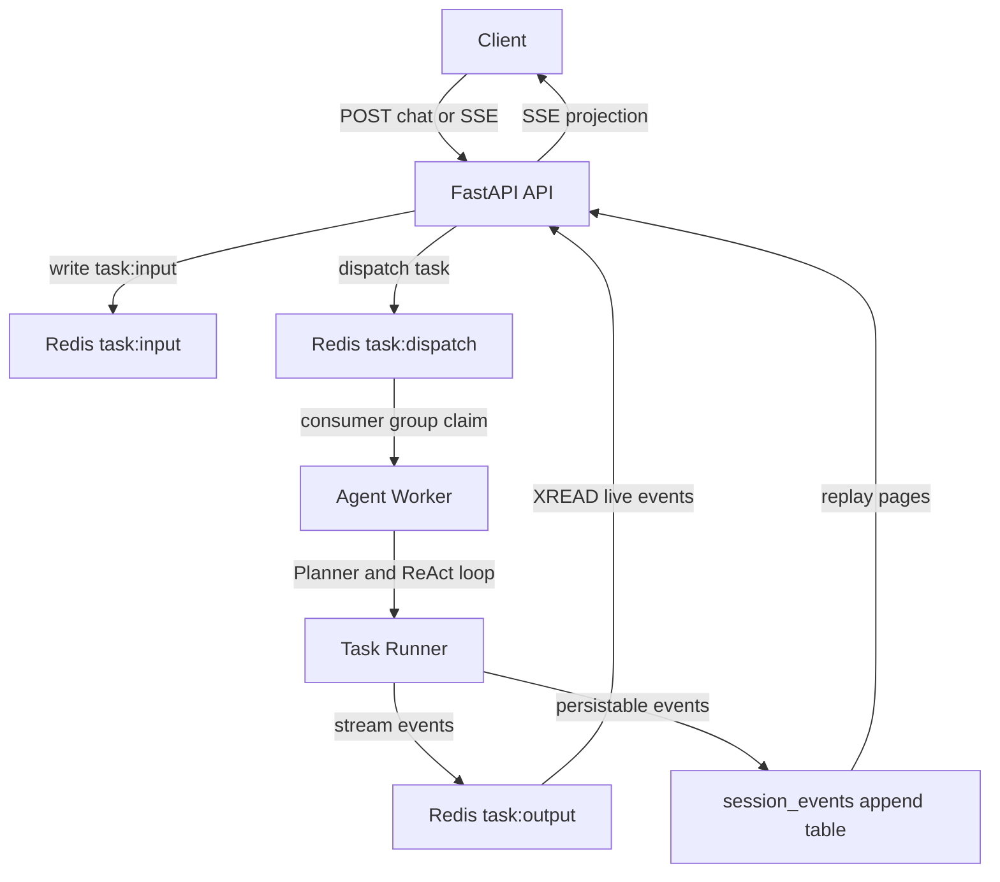
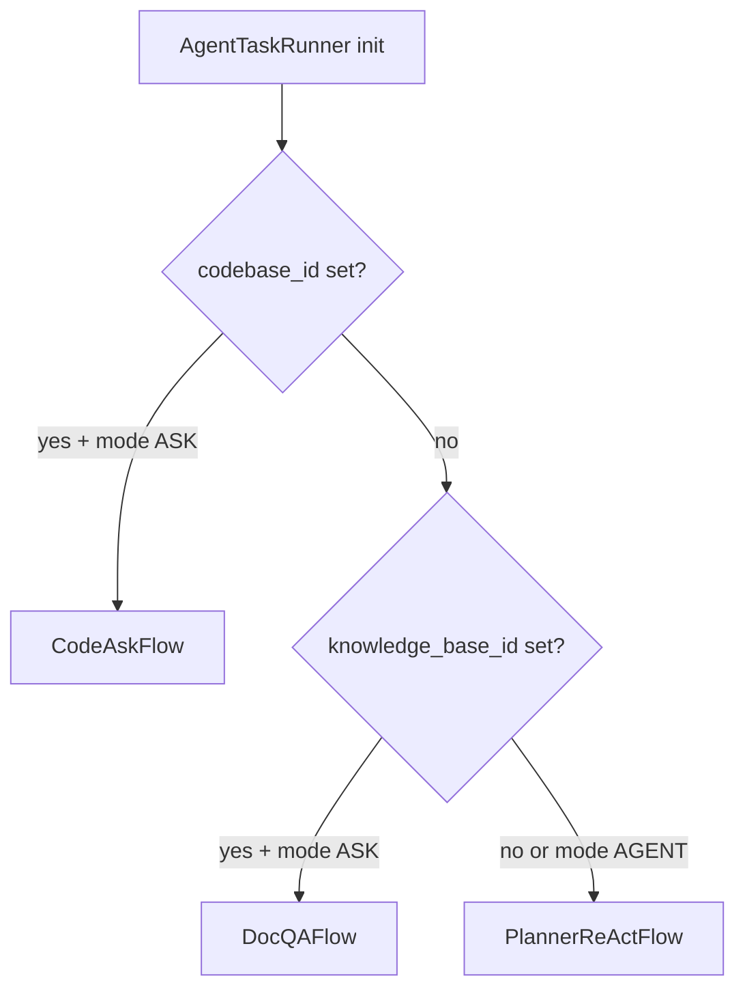
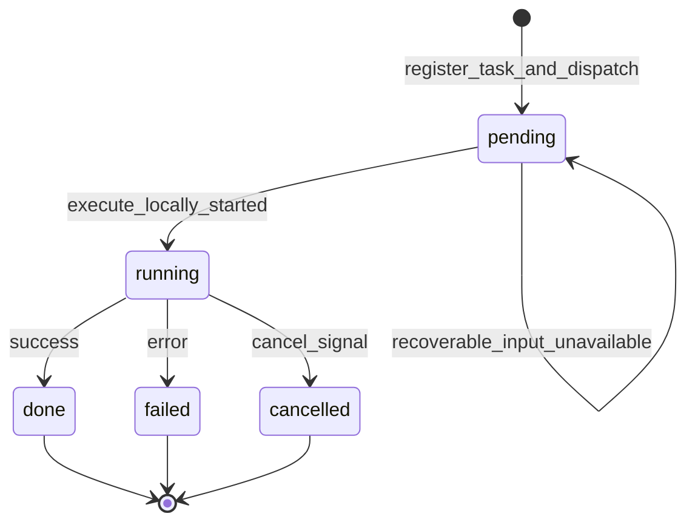
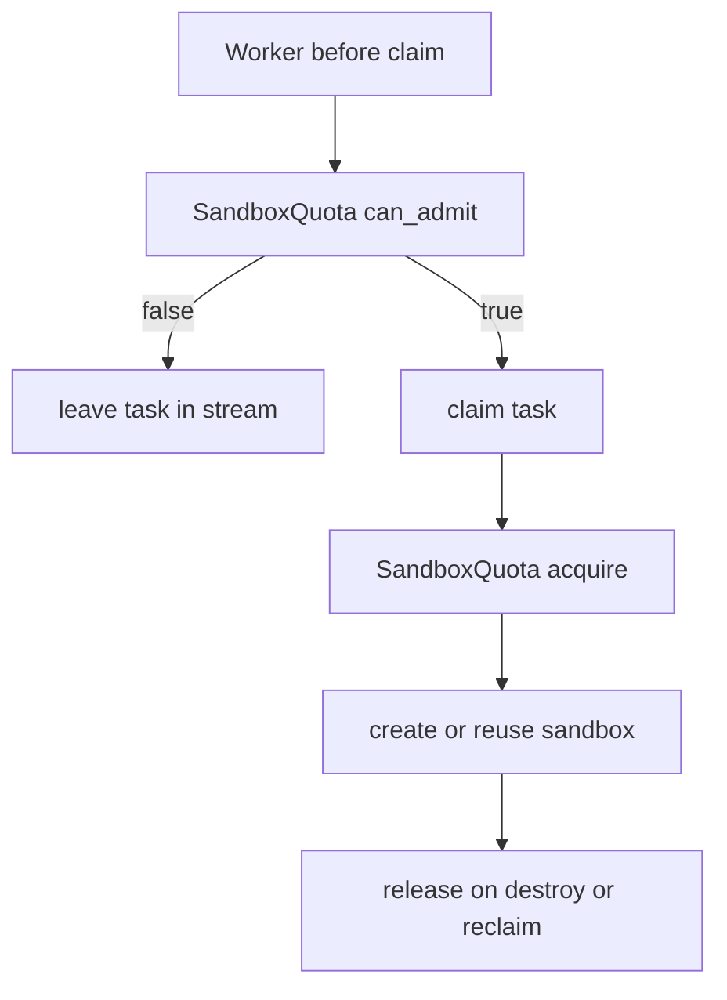
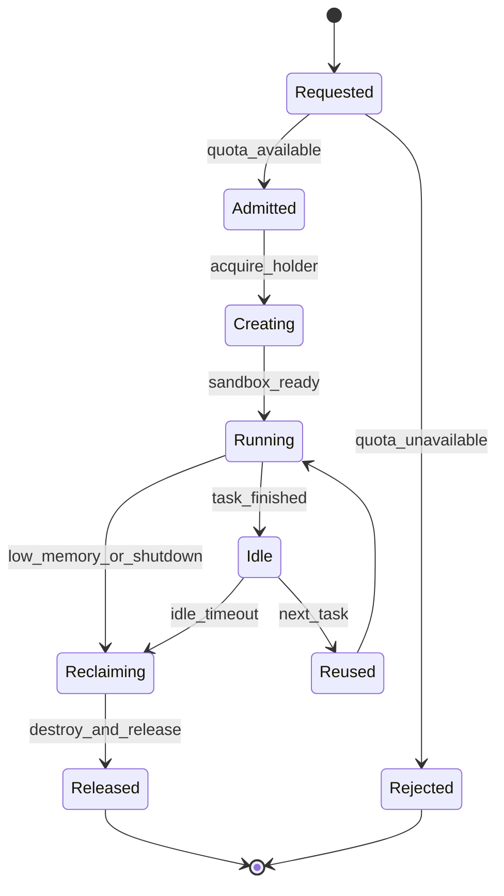
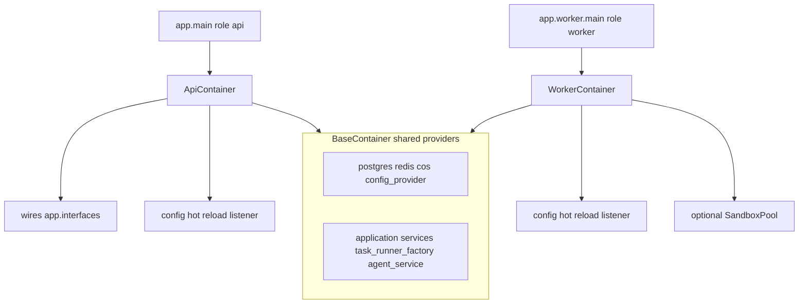
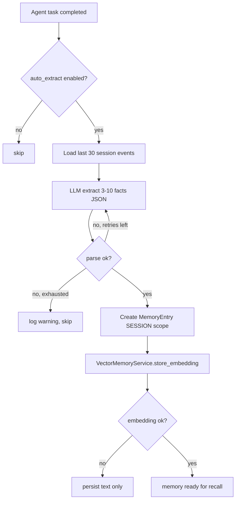

# OpenCitadel Architecture

[简体中文](overview.zh-CN.md)

This document is the authoritative reference for OpenCitadel system architecture, API/Worker responsibility boundaries, dependency injection, sandbox lifecycle, and deployment topologies.

## Overall Architecture



At runtime, the core boundaries are: stateless API, Workers consuming Redis Streams, Postgres persistence, and sandbox-isolated execution. The API handles ingress and projection; Workers handle execution and resource governance; Migrate handles schema and configuration seed migrations.

## Process Roles

| Role | Entry | Image target | Responsibilities |
|------|-------|--------------|------------------|
| API | `app.main` -> `uvicorn` | `api` | HTTP/SSE, task dispatch, event stream reads, configuration management |
| Worker | `app.worker.main` | `worker` | Consume `task:dispatch`, run Agent / codebase ingestion |
| Migrate | `app.migrate` | `api`, one-shot job | `alembic upgrade head` and configuration seed migration |

Process roles are set explicitly via the `ProcessRole` enum in `app/runtime_role.py` and written to the `OPENCITADEL_PROCESS_ROLE` environment variable.

## Runtime Data Flow



### API Responsibilities

- Accept HTTP / WebSocket requests and return SSE event streams.
- Create tasks and write user messages to Redis `task:input`.
- Dispatch via `task.invoke()` to the `task:dispatch` consumer group.
- Read events from the `task:output` stream and push them to clients.
- Notify Workers of `stop` via the Redis cancel channel.
- Validate DB schema version and refuse startup when migrations are pending.
- Maintain MCP / A2A connection pool idle reclamation via `_connection_pool_cleanup_loop`.

### Worker Responsibilities

- Claim tasks from the Redis `task:dispatch` consumer group.
- Admission gate: when `can_admit()` is false, do not claim; tasks remain in the Stream and do not enter the PEL.
- Task idempotency lock: after claim, use `try_acquire_task_lease()` and related functions in `task_lease.py` to prevent duplicate execution from XAUTOCLAIM.
- Run `AgentTaskRunner` or `CodebaseIngestionTaskRunner`.
- Write events to the `task:output` stream.
- Append persistable events to the `session_events` table.
- Run sandbox reconcile, idle reclamation, and low-memory reclamation, coordinated by a single active leader via `try_become_reclaim_leader()`.
- Release stale MCP / A2A connections after task completion.

## Agent Flow Routing (SessionMode)

`AgentTaskRunner` selects the execution flow based on session-bound resources and `SessionMode` (`api/app/domain/services/agent_task_runner.py`):



| Condition | Flow | Description |
|-----------|------|-------------|
| `codebase_id` + `SessionMode.ASK` | `CodeAskFlow` | Codebase Q&A; takes priority over KB |
| `knowledge_base_id` + `SessionMode.ASK` | `DocQAFlow` | Knowledge base Doc QA |
| Other (including `SessionMode.AGENT`) | `PlannerReActFlow` | Planner → ReAct general Agent |

## Task Execution Status

Task status persisted in Redis is defined by the `TaskStatus` enum (`api/app/infrastructure/external/task/task_state.py`), with 5 values:

| `TaskStatus` | Value | Description |
|--------------|-------|-------------|
| `PENDING` | `pending` | Task registered and dispatched to `task:dispatch`, waiting for Worker execution |
| `RUNNING` | `running` | `RedisStreamTask.execute_locally()` has started |
| `DONE` | `done` | Completed normally (corresponds to SSE `done` event; session layer projects as `completed`) |
| `FAILED` | `failed` | Execution failed |
| `CANCELLED` | `cancelled` | Cancelled by user or system |

The following behavioral phases are **not written** to `TaskStatus` but affect task flow:

| Behavioral phase | Implementation | Description |
|------------------|----------------|-------------|
| WaitingAdmission | `worker/main.py` | Worker sleeps when `can_admit()` is false; does not claim; task stays in Stream |
| Claimed | `claim_dispatch()` | XREADGROUP claim succeeds; no independent status field |
| LeaseAcquired | `try_acquire_task_lease()` | Redis idempotency lock; on conflict, ack and skip; status unchanged |



Recovery and retry paths (not shown as separate states above):

- `RecoverableTaskInputUnavailable`: input unavailable before execution → revert to `pending` and re-dispatch.
- `mark_dispatch_failure()`: non-fatal dispatch failure → revert to `pending` and retry dispatch.
- Task lease conflict: ack dispatch message; do not update `TaskStatus`.

`task:dispatch` is the authoritative task dispatch queue. On admission failure, Workers do not claim, avoiding tasks stuck in the PEL; after a successful claim, module functions in `task_lease.py` serve as the execution idempotency lock.

## Sandbox Admission and Lifecycle





| Component | File | Description |
|-----------|------|-------------|
| `SandboxQuota` | `api/app/infrastructure/external/sandbox/admission.py` | Per-node bucket quota; fail-closed when Redis is unavailable |
| `try_acquire_task_lease()` etc. | `api/app/infrastructure/external/task/task_lease.py` | Long-running task deduplication |
| `MemoryProbe` | `api/app/infrastructure/external/sandbox/memory_probe.py` | Docker mode reads host `/proc/meminfo`; K8s bypass |
| `try_become_reclaim_leader()` | `api/app/infrastructure/external/sandbox/reclaim_coordinator.py` | Redis leader lease; single active reclamation |
| `resolve_sandbox_driver()` / `get_sandbox_class()` | `api/app/infrastructure/external/sandbox/sandbox_driver.py` | `auto` detects docker / kubernetes |

### Sandbox Runtime Modes

| Mode | Typical scenario | Configuration | Description |
|------|------------------|---------------|-------------|
| Docker local dynamic sandbox | Single-node Docker Compose | `sandbox.driver=auto` or `docker`, `sandbox.address` empty | Worker mounts `docker.sock`, dynamically creates `opencitadel-sandbox-*` |
| Kubernetes Pod sandbox | Helm cluster deployment | `sandbox.driver=kubernetes`, `sandbox.address` empty | Worker uses ServiceAccount + RBAC to create Pods; ResourceQuota limits total |
| Remote sandbox gateway | External sandbox execution plane | `sandbox.address=http://sandbox-gateway.internal:8080` | Worker connects directly to remote service; no local Docker or K8s API calls |

`pool_enabled=false` is the current deployment default in `api/config.yaml` and Helm seed config; the `AppConfig` schema itself retains `true` as a fallback when no seed is present. The warm pool is an optional optimization and should only be enabled when memory budget is clear and first tool-call latency needs to be reduced.

## Dependency Injection Container



| Container | File | HTTP wiring | Sandbox warm pool | Config hot reload listener |
|-----------|------|-------------|-------------------|------------------------------|
| `BaseContainer` | `app/container.py` | No | No | No |
| `ApiContainer` | Extends Base | Yes | No | Yes |
| `WorkerContainer` | Extends Base | No | Yes | Yes |

Initialization entry points:

- API: `init_api_container()` / `shutdown_api_container()`.
- Worker: `init_worker_container()` / `shutdown_worker_container()`.

FastAPI dependency injection resolves via `ApiContainer`; the Worker entry initializes runtime dependencies via `WorkerContainer`.

## Configuration Authority

| Type | Authoritative source | Description |
|------|---------------------|-------------|
| Behavioral config | `AppConfig`, backed by DB | Runtime behavior such as `model_resilience`, `feature_flags`, `worker`, `sandbox` |
| Initial defaults | `api/config.yaml` / Helm `appConfig` | Migrate job writes seed when `AppConfig` is empty |
| Secrets and connections | `Settings` environment variables | Deployment secrets: DB, Redis, COS, model keys, etc. |

Production must use `USE_DB_APP_CONFIG=true`; Docker Compose does not enforce this by default—set it explicitly in `.env`; Helm `env` is already configured. When modifying `AppConfig` fields, sync the schema, `config.yaml`, Helm `appConfig`, and related documentation.

## Background Loop Ownership

| Loop | Owner | Description |
|------|-------|-------------|
| MCP / A2A connection pool reclamation | API | Release stale connections every 5 minutes |
| Sandbox maintenance | Worker | `run_sandbox_maintenance()` + leader lease |
| Sandbox warm pool | Worker | `SandboxPool`, default `pool_enabled=false` |

## Memory Auto-Extraction

After an Agent task completes normally, if `memory.auto_extract_enabled=true`, `TaskRunnerFactory` triggers `MemoryExtractorService.extract_from_session()` via an `on_complete` callback:



- Extraction results are written to `MemoryEntry`, source marked as `AUTO_EXTRACTED`, scope `SESSION`.
- JSON parsing retries up to 2 times (`RepairJSONParser`); text memory is retained even when vector embedding fails.
- Catches `IntegrityError` on concurrent session deletion and exits safely.

## Dependency Management

| Module | Tool | Lock file | Install command |
|--------|------|-----------|-----------------|
| `api/` | uv | `uv.lock` | `uv sync --frozen` |
| `sandbox/` | uv | `uv.lock` | `uv sync --frozen` |
| `ui/` | npm | `package-lock.json` | `npm ci` |

Python projects uniformly use `pyproject.toml` + `uv.lock`; `requirements.txt` is no longer maintained.

## Packaging and Deployment

### Docker Images

`api/Dockerfile` is a multi-stage build:

| target | Image name | CMD | `OPENCITADEL_PROCESS_ROLE` |
|--------|------------|-----|----------------------------|
| `api` | `opencitadel-api` | `./run.sh` | `api` |
| `worker` | `opencitadel-worker` | `./worker.sh` | `worker` |

`opencitadel-migrate` uses the `api` target with image name `opencitadel-migrate`, command overridden to `python -m app.migrate`. The `opencitadel-ui` image name is `opencitadel-ui`.

### Docker Compose Startup Order

```text
postgres/redis -> opencitadel-migrate -> opencitadel-api + opencitadel-worker -> ui -> nginx
```

### Build-Time Mirror Sources

`docker-compose.yml` passes unified build args to API / Worker / Sandbox / UI: `PIP_INDEX_URL`, `UV_INDEX_URL`, `UV_VERSION`, `UV_HTTP_TIMEOUT`, `NPM_CONFIG_REGISTRY`, etc. After Compose build, application images are uniformly named `opencitadel-api`, `opencitadel-worker`, `opencitadel-migrate`, `opencitadel-ui`, `opencitadel-sandbox`. Pre-built GHCR images (see `docker-compose.yml` comments) or CI pipelines in `.github/workflows/` can also be used.

### Kubernetes / Helm

The Chart is located at `deploy/helm/opencitadel/` and provides full-stack one-click deployment:

- In-cluster PostgreSQL pgvector / Redis StatefulSets.
- API / Worker / UI Deployments + Ingress.
- Worker ServiceAccount + RBAC for Pod sandbox create / delete.
- Namespace ResourceQuota limiting total sandbox Pods.
- Migrate initContainer using the API image.
- Default K8s sandbox mode is `sandbox.driver=kubernetes` with `sandbox.address` empty; use `sandbox.address` when connecting to a remote sandbox gateway.

## Related Documentation

- [Event System](events.md)
- [Configuration Source Governance](config-source-governance.md)
- [Model Resilience Design](model-resilience.md)
- [Architecture Evolution Guide](architecture-evolution.md)
- [Security Model](security-model.md)
- [Production Deployment](../operations/deployment.md)
