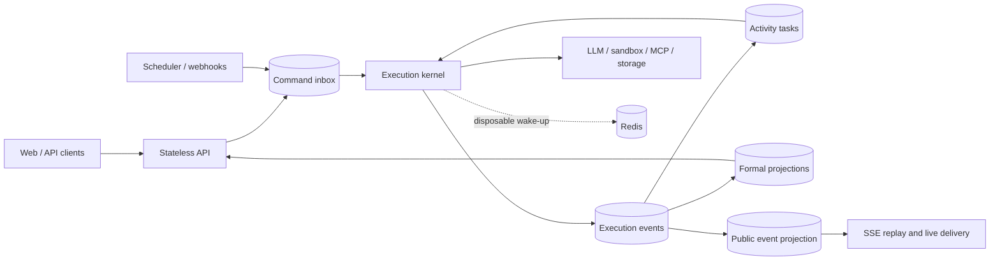

# Architecture Overview

[简体中文](overview.zh-CN.md)

OpenCitadel is built around one event-sourced execution kernel. Agent, Ask,
resource ingestion, automation, patrol, and remediation all use the same
PostgreSQL command, event, Activity, timer, approval, and projection protocol.
There is no second task lifecycle and no transport-owned workflow state.

## Runtime topology

```mermaid
flowchart LR
  Client[Web / API clients] --> API[Stateless API]
  API --> Inbox[(Command inbox)]
  Scheduler[Scheduler / webhooks] --> Inbox
  Inbox --> Kernel[Execution kernel]
  Kernel --> Events[(Execution events)]
  Events --> Activities[(Activity tasks)]
  Activities --> Kernel
  Kernel --> Providers[LLM / sandbox / MCP / storage]
  Events --> Views[(Formal projections)]
  Views --> API
  Events --> Public[(Public event projection)]
  Public --> SSE[SSE replay and live delivery]
  Kernel -. disposable wake-up .-> Redis[(Redis)]
```

PostgreSQL is the lifecycle authority. Redis may reduce wake-up and notification
latency, but a lost notification cannot lose accepted work: the kernel polls
pending database rows and resumes from verified events.

## Processes and trust boundaries

| Process | Responsibility | Database role |
| --- | --- | --- |
| API | Authenticate, authorize, submit idempotent commands, read projections, serve SSE | API role |
| Execution kernel | Decide Runs, append events, claim Activities and timers, project formal views | Execution role |
| Migrate | Apply Alembic schema and seed configuration | Migration role |
| UI | Render API projections and public events; never infer authoritative state | None |
| Sandbox broker | Create isolated execution sandboxes without exposing the container socket to API/kernel | None |
| Ops collector / actuator | Fixed read probes and approval-gated narrow mutations | Service-specific |

Schema ownership is separated from runtime DML. Owner-scoped execution tables
use forced row-level security, and the event store checks that every append
matches the stream's original owner scope.

## Composition, transactions, and lifecycle

Each executable loads `DeploymentSettings` exactly once and builds its own
manual typed object graph. `app.composition.api` owns one immutable
`ApiRuntime`; `app.composition.kernel` owns a separate `KernelRuntime`. HTTP
dependencies resolve services from `app.state` and never construct
infrastructure. There is no service locator, global resource getter, or shared
role container.

Every background coroutine belongs to the runtime's `TaskSupervisor`. A
critical failure initiates process shutdown; auxiliary listeners restart under
a bounded policy. Shutdown revokes readiness before the supervisor drains and
closes the process-owned PostgreSQL, Redis, storage, provider, and connection
pool resources.

Application writes use an explicit unit of work: a successful mutation calls
`uow.commit()`. Leaving the context without that call rolls back, including
normal returns. PostgreSQL is authoritative; Redis messages and caches are
post-commit hints only and cannot make an uncommitted write visible.

The browser follows the same ownership rule. Authenticated resource caches are
owned by `ClientDataProvider` and keyed by exactly `userId + workspaceId`.
Identity/workspace changes invalidate the old generation, so a late response
cannot populate the new scope; anonymous state cannot read authenticated data.

## One execution model

Every behavior starts as a `Run` in one family:

- `agent` and `ask` for conversational execution;
- `kb_ingest` for immutable candidate publication;
- `automation`, `patrol`, and `remediation` for scheduled or governed work.

A pure family decision handler consumes the current aggregate and one typed
command, then emits typed events and deterministic effects. Nondeterministic
work is an Activity. Before an external call begins, its input reference,
digest, invocation identity, timeout, and claim generation are durable.
Heartbeats, retries, cancellation, approvals, timeouts, and unknown outcomes
are explicit protocol states.

The durable records are:

- `execution_command_inbox` for idempotent ingress;
- `execution_events` for append-only, hash-chained facts;
- `execution_activity_tasks` for external work and fencing;
- `execution_scheduled_commands` for timers and cancellation;
- `execution_outbox` for post-commit wake-ups;
- integrity-checked snapshots for replay acceleration.

Run, activity, approval, resource-build, and public-event tables are rebuildable
projections. They can answer queries but cannot decide workflow state.

## Product data and resource bindings

Product repositories store content, configuration, files, immutable resource
versions, and evidence. A knowledge rebuild creates one candidate
version carrying `build_id` and `request_key`; the source Run owns lifecycle and
progress. Publication validates the complete closure and compare-and-swaps the
resource's `active_version_id`.

Sessions bind concrete published resource versions through
`session_resource_bindings`. Later publication never changes an existing
session's evidence boundary. Missing, foreign, unpublished, or ambiguous
bindings fail closed.

## API and streaming contract

Mutation endpoints submit typed commands. Approval decisions use dedicated
endpoints and cannot be synthesized from chat text. Read endpoints return
formal projections. SSE live delivery and replay read the same sanitized
`execution_public_events` projection and use the formal event position as the
cursor; private Activity inputs and provider payloads are never exposed.

## Failure and recovery rules

- Process death does not imply success or failure; expired claims are fenced
  and reclaimed from PostgreSQL.
- A duplicate command returns its persisted result and cannot repeat effects.
- A repeated Activity delivery reuses the same invocation result; an explicit
  new invocation may execute again.
- Invalid snapshots fall back to verified event replay.
- Hash-chain, owner-scope, or projection-integrity failure stops closed and
  produces operational evidence.
- Candidate build failure never mutates the active published version.

## Code map

| Boundary | Location |
| --- | --- |
| Commands, events, aggregates, decisions | `api/app/domain/execution/` |
| Orchestration and Activities | `api/app/application/execution/` |
| PostgreSQL stores and formal projectors | `api/app/infrastructure/execution/` |
| API/kernel typed composition | `api/app/composition/api.py`, `api/app/composition/kernel.py` |
| Task ownership and bounded drain | `api/app/composition/tasks.py` |
| Kernel process | `api/app/execution_kernel_main.py` |
| Resource binding model | `api/app/domain/models/resource_bindings.py` |
| HTTP ingress and projection routes | `api/app/interfaces/endpoints/` |
| Scoped browser resources | `ui/src/providers/client-data-provider.tsx` |

## Related documentation

- [Execution kernel](execution-kernel.md)
- [Security model](security-model.md)
- [Knowledge-base ingestion](knowledge-base-ingestion.md)
- [Automation and scheduler](automation-scheduler.md)
