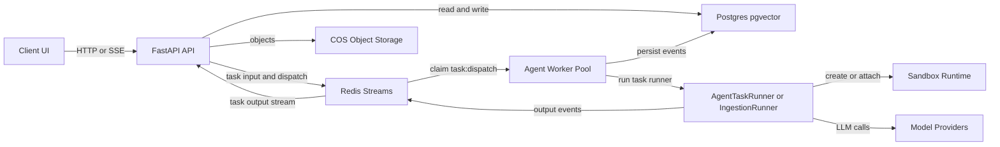
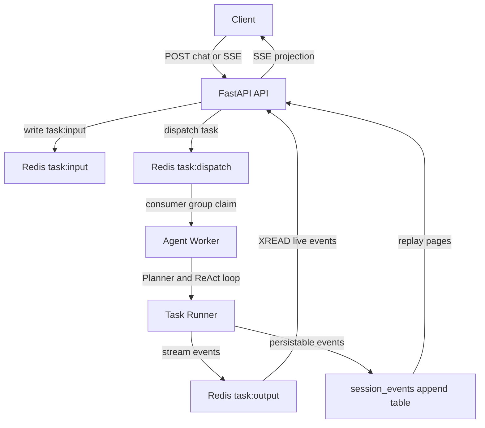
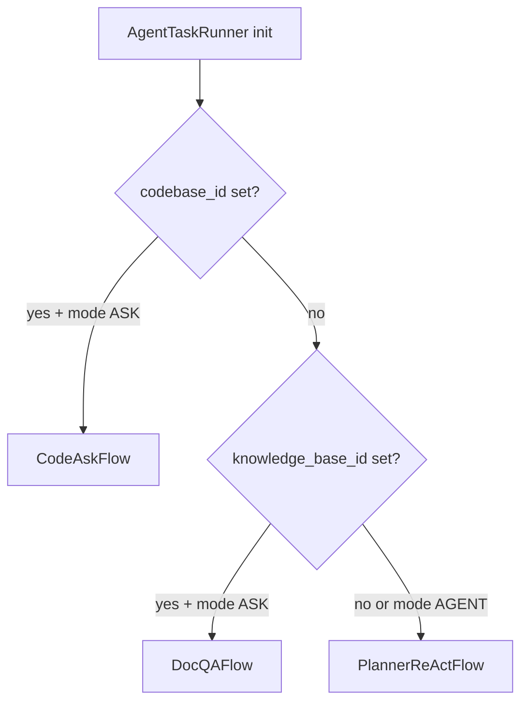
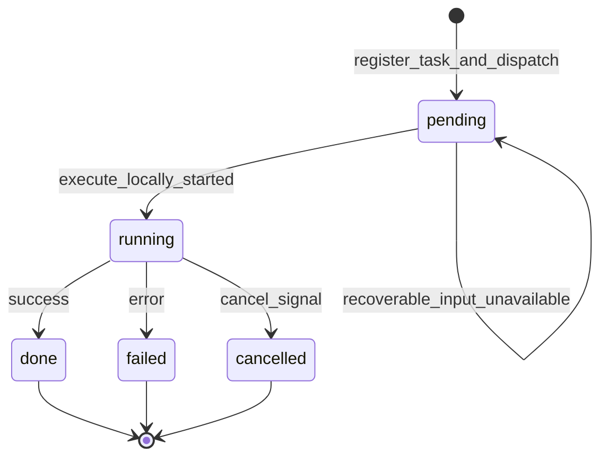
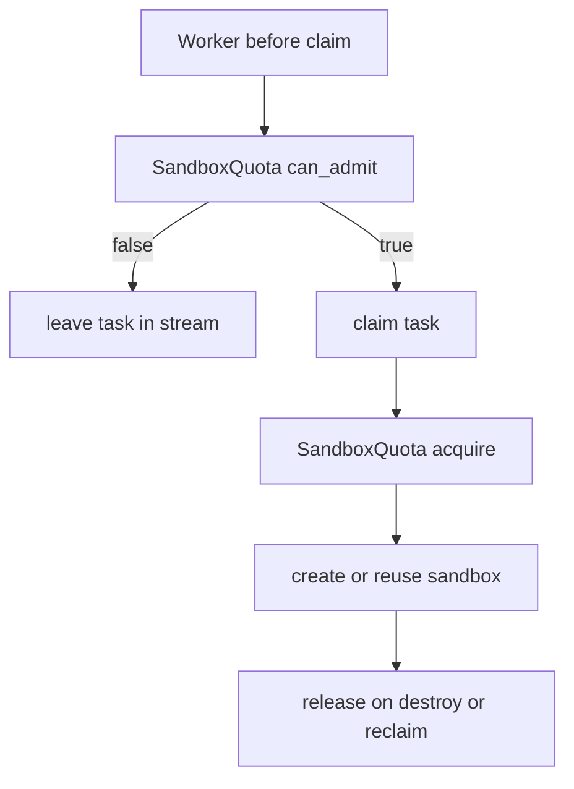
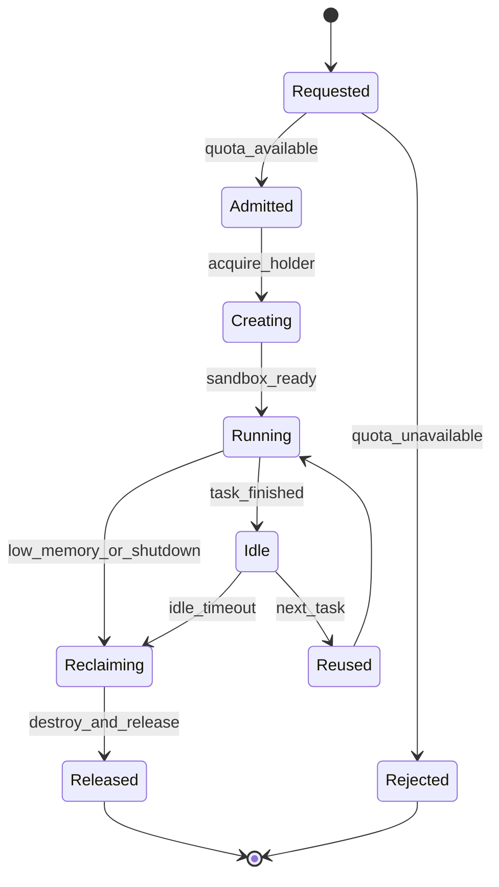
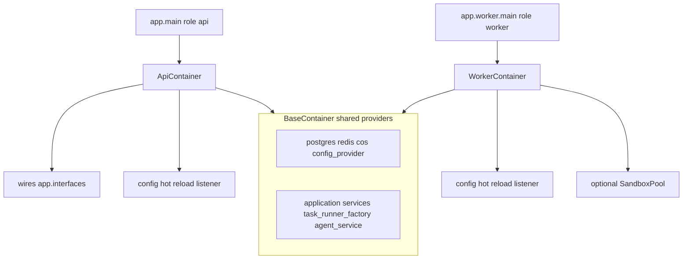
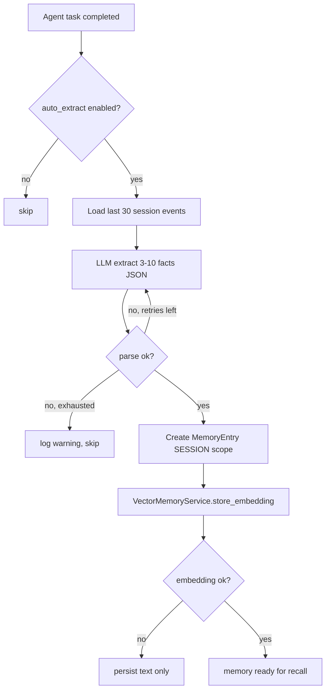

[English](overview.md)

# OpenCitadel 架构说明

本文档是 OpenCitadel 系统架构、API / Worker 职责划分、依赖注入、沙箱生命周期与部署形态的权威说明。

## 总体架构



运行时以 API 无状态、Worker 消费 Redis Streams、Postgres 持久化、沙箱隔离执行为核心边界。API 负责接入和投影，Worker 负责执行和资源治理，Migrate 负责 schema 与配置种子迁移。

## 进程角色

| 角色 | 入口 | 镜像 target | 职责 |
|------|------|-------------|------|
| API | `app.main` -> `uvicorn` | `api` | HTTP/SSE、任务 dispatch、事件流读取、配置管理 |
| Worker | `app.worker.main` | `worker` | 消费 `task:dispatch`、执行 Agent / 代码库摄取 |
| Migrate | `app.migrate` | `api`，一次性 job | `alembic upgrade head` 与配置种子迁移 |

进程角色通过 `app/runtime_role.py` 的 `ProcessRole` 枚举显式设置，并写入环境变量 `OPENCITADEL_PROCESS_ROLE`。

## 运行时数据流



### API 职责

- 接收 HTTP / WebSocket 请求，返回 SSE 事件流。
- 创建任务，写入用户消息到 Redis `task:input`。
- 通过 `task.invoke()` dispatch 到 `task:dispatch` 消费组。
- 从 `task:output` stream 读取事件并推送给客户端。
- `stop` 通过 Redis cancel 通道通知 Worker。
- 校验 DB schema 版本，拒绝未迁移启动。
- 维护 MCP / A2A 连接池空闲回收，入口为 `_connection_pool_cleanup_loop`。

### Worker 职责

- 从 Redis `task:dispatch` 消费组领取任务。
- 准入门控：`can_admit()` 不满足时不 claim，任务留在 Stream，不进入 PEL。
- 任务幂等锁：claim 后通过 `task_lease.py` 中的 `try_acquire_task_lease()` 等函数防止 XAUTOCLAIM 重复执行。
- 运行 `AgentTaskRunner` 或 `CodebaseIngestionTaskRunner`。
- 写入事件到 `task:output` stream。
- 将可持久化事件追加到 `session_events` 表。
- 执行沙箱 reconcile、空闲回收、低内存回收，使用 `try_become_reclaim_leader()` 单活协调。
- 任务结束后释放 MCP / A2A 陈旧连接。

## Agent 流路由（SessionMode）

`AgentTaskRunner` 根据会话绑定的资源与 `SessionMode` 选择执行流（`api/app/domain/services/agent_task_runner.py`）：



| 条件 | 流 | 说明 |
|------|-----|------|
| `codebase_id` + `SessionMode.ASK` | `CodeAskFlow` | 代码库问答；优先于 KB |
| `knowledge_base_id` + `SessionMode.ASK` | `DocQAFlow` | 知识库 Doc QA |
| 其他（含 `SessionMode.AGENT`） | `PlannerReActFlow` | Planner → ReAct 通用 Agent |

## 任务执行状态

Redis 中持久化的任务状态由 `TaskStatus` 枚举定义（`api/app/infrastructure/external/task/task_state.py`），共 5 个值：

| `TaskStatus` | 值 | 说明 |
|--------------|-----|------|
| `PENDING` | `pending` | 任务已注册并 dispatch 到 `task:dispatch`，等待 Worker 执行 |
| `RUNNING` | `running` | `RedisStreamTask.execute_locally()` 已开始执行 |
| `DONE` | `done` | 正常完成（对应 SSE `done` 事件；会话层投影为 `completed`） |
| `FAILED` | `failed` | 执行失败 |
| `CANCELLED` | `cancelled` | 用户或系统取消 |

以下行为阶段**不写入** `TaskStatus`，但影响任务流转：

| 行为阶段 | 实现位置 | 说明 |
|----------|----------|------|
| WaitingAdmission | `worker/main.py` | `can_admit()` 为 false 时 Worker sleep，不 claim，任务留在 Stream |
| Claimed | `claim_dispatch()` | XREADGROUP claim 成功，无独立状态字段 |
| LeaseAcquired | `try_acquire_task_lease()` | Redis 幂等锁；冲突时 ack 并跳过，状态不变 |



恢复与重试路径（未在上图单独画状态）：

- `RecoverableTaskInputUnavailable`：执行前输入不可用 → 回退 `pending` 并重新 dispatch。
- `mark_dispatch_failure()`：非致命 dispatch 失败 → 回退 `pending` 并重试 dispatch。
- 任务 lease 冲突：ack dispatch 消息，不更新 `TaskStatus`。

`task:dispatch` 是任务分发权威队列。准入失败时 Worker 不 claim，避免任务进入 PEL 后长期占用；claim 成功后以 `task_lease.py` 中的模块函数作为执行幂等锁。

## 沙箱准入与生命周期





| 组件 | 文件 | 说明 |
|------|------|------|
| `SandboxQuota` | `api/app/infrastructure/external/sandbox/admission.py` | 节点分桶配额；Redis 不可用 fail-closed |
| `try_acquire_task_lease()` 等 | `api/app/infrastructure/external/task/task_lease.py` | 长任务执行去重 |
| `MemoryProbe` | `api/app/infrastructure/external/sandbox/memory_probe.py` | Docker 模式读宿主机 `/proc/meminfo`；K8s 旁路 |
| `try_become_reclaim_leader()` | `api/app/infrastructure/external/sandbox/reclaim_coordinator.py` | Redis leader lease，单活执行回收 |
| `resolve_sandbox_driver()` / `get_sandbox_class()` | `api/app/infrastructure/external/sandbox/sandbox_driver.py` | `auto` 探测 docker / kubernetes |

### 沙箱运行模式

| 模式 | 典型场景 | 配置 | 说明 |
|------|----------|------|------|
| Docker 本地动态沙箱 | 单机 Docker Compose | `sandbox.driver=auto` 或 `docker`，`sandbox.address` 为空 | Worker 挂载 `docker.sock`，动态创建 `opencitadel-sandbox-*` |
| Kubernetes Pod 沙箱 | Helm 集群部署 | `sandbox.driver=kubernetes`，`sandbox.address` 为空 | Worker 使用 ServiceAccount + RBAC 创建 Pod，ResourceQuota 限制总量 |
| 远程沙箱网关 | 沙箱执行面外置 | `sandbox.address=http://sandbox-gateway.internal:8080` | Worker 直连远程服务，不再调用本地 Docker 或 K8s API |

`api/config.yaml` 与 Helm 种子配置中 `pool_enabled=false` 是当前部署默认值；`AppConfig` schema 自身仍保留 `true` 作为无种子兜底。预热池是可选优化，只应在内存预算明确且需要降低首个工具调用延迟时开启。

## 依赖注入容器



| 容器 | 文件 | HTTP wiring | Sandbox 预热门户 | 配置热更新监听 |
|------|------|-------------|------------------|----------------|
| `BaseContainer` | `app/container.py` | 否 | 否 | 否 |
| `ApiContainer` | 继承 Base | 是 | 否 | 是 |
| `WorkerContainer` | 继承 Base | 否 | 是 | 是 |

初始化入口：

- API：`init_api_container()` / `shutdown_api_container()`。
- Worker：`init_worker_container()` / `shutdown_worker_container()`。

FastAPI 依赖注入通过 `ApiContainer` 解析；Worker 入口通过 `WorkerContainer` 初始化运行时依赖。

## 配置权威

| 类型 | 权威来源 | 说明 |
|------|----------|------|
| 行为配置 | `AppConfig`，由 DB 承载 | `model_resilience`、`feature_flags`、`worker`、`sandbox` 等运行行为 |
| 初始默认值 | `api/config.yaml` / Helm `appConfig` | migrate job 在 `AppConfig` 为空时写入种子 |
| 密钥与连接 | `Settings` 环境变量 | DB、Redis、COS、模型密钥等部署私密信息 |

生产环境必须使用 `USE_DB_APP_CONFIG=true`；Docker Compose 默认不强制设置，需在 `.env` 显式开启，Helm `env` 已配置。修改 `AppConfig` 字段时需同步 schema、`config.yaml`、Helm `appConfig` 与相关文档。

## 后台循环归属

| 循环 | 归属 | 说明 |
|------|------|------|
| MCP / A2A 连接池回收 | API | 每 5 分钟释放陈旧连接 |
| 沙箱维护 | Worker | `run_sandbox_maintenance()` + leader lease |
| 沙箱预热门户 | Worker | `SandboxPool`，默认 `pool_enabled=false` |

## Memory 自动提取

Agent 任务正常结束后，若 `memory.auto_extract_enabled=true`，`TaskRunnerFactory` 通过 `on_complete` 回调触发 `MemoryExtractorService.extract_from_session()`：



- 提取结果写入 `MemoryEntry`，来源标记为 `AUTO_EXTRACTED`，scope 为 `SESSION`。
- JSON 解析最多重试 2 次（`RepairJSONParser`）；向量嵌入失败时仍保留文本记忆。
- 与会话删除并发时捕获 `IntegrityError` 并安全退出。

## 依赖管理规范

| 模块 | 工具 | 锁文件 | 安装命令 |
|------|------|--------|----------|
| `api/` | uv | `uv.lock` | `uv sync --frozen` |
| `sandbox/` | uv | `uv.lock` | `uv sync --frozen` |
| `ui/` | npm | `package-lock.json` | `npm ci` |

Python 项目统一使用 `pyproject.toml` + `uv.lock`，不再维护 `requirements.txt`。

## 打包与部署

### Docker 镜像

`api/Dockerfile` 为多阶段构建：

| target | 镜像名 | CMD | `OPENCITADEL_PROCESS_ROLE` |
|--------|--------|-----|----------------------|
| `api` | `opencitadel-api` | `./run.sh` | `api` |
| `worker` | `opencitadel-worker` | `./worker.sh` | `worker` |

`opencitadel-migrate` 使用 `api` target，镜像名为 `opencitadel-migrate`，命令覆盖为 `python -m app.migrate`。`opencitadel-ui` 镜像名为 `opencitadel-ui`。

### Docker Compose 启动顺序

```text
postgres/redis -> opencitadel-migrate -> opencitadel-api + opencitadel-worker -> ui -> nginx
```

### 构建期镜像源

`docker-compose.yml` 向 API / Worker / Sandbox / UI 传入统一 build args：`PIP_INDEX_URL`、`UV_INDEX_URL`、`UV_VERSION`、`UV_HTTP_TIMEOUT`、`NPM_CONFIG_REGISTRY` 等。Compose 构建后的应用镜像统一为 `opencitadel-api`、`opencitadel-worker`、`opencitadel-migrate`、`opencitadel-ui`、`opencitadel-sandbox`。也可使用 GHCR 预构建镜像（见 `docker-compose.yml` 注释）或 `.github/workflows/` CI 流水线构建。

### Kubernetes / Helm

Chart 位于 `deploy/helm/opencitadel/`，提供全栈一键部署：

- 集群内 PostgreSQL pgvector / Redis StatefulSet。
- API / Worker / UI Deployment + Ingress。
- Worker ServiceAccount + RBAC，用于 Pod 沙箱 create / delete。
- namespace ResourceQuota 限制沙箱 Pod 总量。
- migrate initContainer 使用 API 镜像。
- 默认 K8s 沙箱模式为 `sandbox.driver=kubernetes` 且 `sandbox.address` 为空；如接入远程沙箱网关，则改用 `sandbox.address`。

## 相关文档

- [事件系统](events.zh-CN.md)
- [配置来源治理](config-source-governance.zh-CN.md)
- [模型韧性设计](model-resilience.zh-CN.md)
- [架构演进指南](architecture-evolution.zh-CN.md)
- [安全模型](security-model.zh-CN.md)
- [生产部署](../operations/deployment.zh-CN.md)
