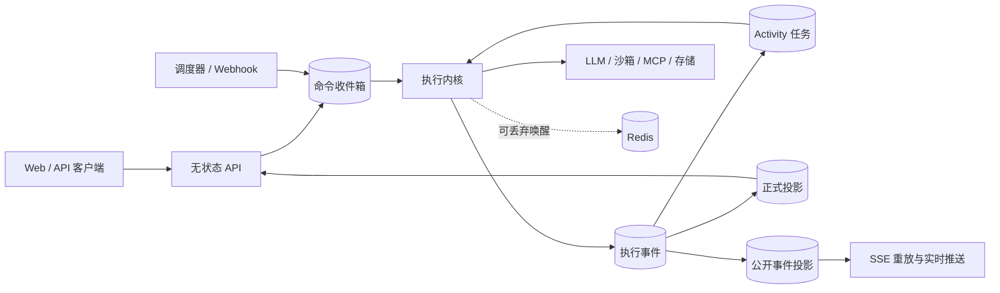

# 架构总览

[English](overview.md)

OpenCitadel 只有一个事件溯源执行内核。Agent、Ask、资源摄取、自动化、巡检和修复统一使用 PostgreSQL 命令、事件、Activity、定时器、审批与投影协议；系统中不存在第二套任务生命周期，也不让传输层持有工作流状态。

## 运行拓扑

```mermaid
flowchart LR
  Client[Web / API 客户端] --> API[无状态 API]
  API --> Inbox[(命令收件箱)]
  Scheduler[调度器 / Webhook] --> Inbox
  Inbox --> Kernel[执行内核]
  Kernel --> Events[(执行事件)]
  Events --> Activities[(Activity 任务)]
  Activities --> Kernel
  Kernel --> Providers[LLM / 沙箱 / MCP / 存储]
  Events --> Views[(正式投影)]
  Views --> API
  Events --> Public[(公开事件投影)]
  Public --> SSE[SSE 重放与实时推送]
  Kernel -. 可丢弃唤醒 .-> Redis[(Redis)]
```

PostgreSQL 是生命周期唯一权威。Redis 只用于降低唤醒和通知延迟；通知丢失不会丢失已接收工作，执行内核会轮询数据库待处理行并从已校验事件恢复。

## 进程与信任边界

| 进程 | 职责 | 数据库角色 |
| --- | --- | --- |
| API | 认证授权、提交幂等命令、读取投影、提供 SSE | API 角色 |
| 执行内核 | 决策 Run、追加事件、认领 Activity/定时器、构建正式投影 | 执行角色 |
| Migrate | 执行 Alembic schema 与配置种子迁移 | 迁移角色 |
| UI | 展示 API 投影与公开事件，不自行推断权威状态 | 无 |
| 沙箱 Broker | 创建隔离沙箱，不向 API/内核暴露容器 socket | 无 |
| Ops Collector / Actuator | 固定只读探针与审批后窄写入 | 服务专用 |

Schema 所有权与运行时 DML 分离。所有按所有者隔离的执行表强制启用行级安全；事件存储还会校验每次追加的上下文与该流首次建立的 owner scope 完全一致。

## 装配、事务与生命周期

每个可执行入口只加载一次 `DeploymentSettings`，并构建自己的手工强类型对象图。
`app.composition.api` 持有一个不可变 `ApiRuntime`，`app.composition.kernel` 持有完全
独立的 `KernelRuntime`。HTTP 依赖只从 `app.state` 解析服务，不构造基础设施；系统中
不存在 Service Locator、全局资源 Getter 或跨角色共享容器。

每个后台协程都归运行时的 `TaskSupervisor` 所有。关键任务失败会触发进程退出，辅助监听器
按有界策略重启。关闭时先撤销就绪状态，再排空 Supervisor，并关闭该进程独占的 PostgreSQL、
Redis、对象存储、Provider 与连接池资源。

应用写入使用显式 Unit of Work：成功变更必须调用 `uow.commit()`；未调用即退出 Context 时，
即使是正常 return 也会 rollback。PostgreSQL 是权威，Redis 消息与缓存只是 post-commit
提示，不能让未提交写入变得可见。

浏览器也遵守同一所有权规则。认证资源缓存由 `ClientDataProvider` 持有，并严格按
`userId + workspaceId` 建键。身份或工作区变化会递增旧 Scope 的 Generation，晚到响应不能
写入新 Scope；匿名状态不能读取认证数据。

## 单一执行模型

每项行为都以某个 `Run` family 开始：

- `agent`、`ask`：对话执行；
- `kb_ingest`、`codebase_ingest`：不可变候选版本发布；
- `automation`、`patrol`、`remediation`：调度或受治理工作。

纯 family 决策器读取当前聚合与一个类型化命令，产出类型化事件和确定性 effect。所有非确定性工作都是 Activity。外部调用开始前，输入引用、摘要、调用身份、超时和认领代次都已持久化。心跳、重试、取消、审批、超时和未知结果均为显式协议状态。

持久化事实包括：

- `execution_command_inbox`：幂等接入；
- `execution_events`：仅追加、带哈希链的事实；
- `execution_activity_tasks`：外部工作与 fencing；
- `execution_scheduled_commands`：定时器和取消；
- `execution_outbox`：提交后唤醒；
- 完整性校验的快照：仅用于加速重放。

Run、Activity、审批、资源构建和公开事件表都是可重建投影；它们可以回答查询，但不能决定工作流状态。

## 产品数据与资源绑定

产品仓库存储内容、配置、文件、不可变资源版本和证据。知识库或代码库重建只创建一个带 `build_id`、`request_key` 的候选版本，源 Run 独占生命周期和进度。发布前验证完整闭包，再通过 CAS 切换资源的 `active_version_id`。

会话通过 `session_resource_bindings` 固定到具体已发布版本。后续发布不会改变已有会话的证据边界；缺失、跨租户、未发布或歧义绑定一律关闭执行。

## API 与流式契约

写接口只提交类型化命令。审批只能通过专用端点决策，聊天文本不能绕过审批。读接口返回正式投影。SSE 实时和重放统一读取脱敏后的 `execution_public_events`，以正式事件位置作为 cursor；Activity 私有输入和供应商载荷永不进入公开投影。

## 失败与恢复规则

- 进程退出不等于成功或失败；过期 claim 由 fencing 后从 PostgreSQL 回收。
- 重复命令返回已持久化结果，不会重复 effect。
- 同一 Activity invocation 的重复投递复用结果；只有显式新 invocation 才可再次执行。
- 无效快照回退到已校验事件重放。
- 哈希链、owner scope 或投影完整性失败时关闭执行并产生运维证据。
- 候选构建失败绝不改动当前已发布版本。

## 代码地图

| 边界 | 位置 |
| --- | --- |
| 命令、事件、聚合、决策 | `api/app/domain/execution/` |
| 编排与 Activity | `api/app/application/execution/` |
| PostgreSQL 存储与正式投影器 | `api/app/infrastructure/execution/` |
| API/Kernel 强类型装配 | `api/app/composition/api.py`、`api/app/composition/kernel.py` |
| 任务所有权与有界排空 | `api/app/composition/tasks.py` |
| 执行内核进程 | `api/app/execution_kernel_main.py` |
| 资源绑定模型 | `api/app/domain/models/resource_bindings.py` |
| HTTP 接入与投影路由 | `api/app/interfaces/endpoints/` |
| 浏览器作用域资源 | `ui/src/providers/client-data-provider.tsx` |

## 相关文档

- [执行内核](execution-kernel.zh-CN.md)
- [安全模型](security-model.zh-CN.md)
- [知识库摄取](knowledge-base-ingestion.zh-CN.md)
- [代码库分析](codebase-reindex.zh-CN.md)
- [自动化与调度器](automation-scheduler.zh-CN.md)
