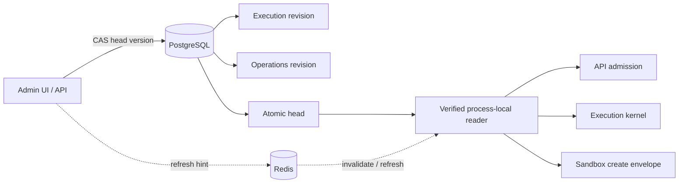

# Runtime Policy Control Plane

[简体中文](runtime-policy-control-plane.zh-CN.md)

Runtime Policy is the only authority for live behavioral settings. PostgreSQL
stores immutable typed revisions and one atomic head; Redis carries refresh hints
only and is never a source of truth.

## Policy families

Execution Policy is snapshot semantics. Admission writes its revision ID and
complete validated policy snapshot into every Run. Agent limits, model
resilience, activity timeouts, memory, and knowledge behavior therefore
cannot drift during retries, approvals, restarts, or replay.

Operations Policy is live semantics. Consumers require a fresh verified head
before traffic admission, scheduler actions, Patrol admission/remediation,
sandbox allocation, source access, garbage collection, or retention work. A
policy tightening applies to the next boundary check; already committed domain
history remains visible.

## Integrity and consistency

Each revision contains a sequence, schema version, canonical digest, author,
note, and timestamp. The head identifies exactly one Execution and one Operations
revision and carries a monotonically increasing version. Readers verify:

1. both referenced revisions exist and have the expected family;
2. supported schema versions and canonical digests match;
3. the pair belongs to the current atomic head;
4. the last verified read is within the configured staleness window.

Integrity failure, unavailable storage, and excessive staleness are distinct
errors and all fail closed at behavioral boundaries. Readiness exposes the same
stable reason keys.

## Mutation model

Only administrators may create or activate revisions. Writes include the
expected head version and use compare-and-swap. Conflicts return the current head
without discarding the caller's draft. Restore is append-only: it copies a
historical policy into a new revision and atomically activates that revision.

The admin UI renders every typed field with bounds, shows a semantic diff and
history, requires confirmation for restore, and handles head conflicts by
preserving edits until the operator explicitly reloads.

## Process lifecycle

API, execution kernel, and migration bootstrap initialize their readers from
PostgreSQL. A short local refresh interval bounds propagation even if Redis is
down. Refresh hints reduce latency but contain no policy data. Processes reject
policy-dependent work until initialization and verification succeed.

## Sandbox boundary

Deployment Settings choose sandbox driver, image, network, proxies, namespace,
and broker endpoint. Each authenticated sandbox create request carries the active
Operations revision ID plus a closed `SandboxContainerPolicy` containing TTL,
memory, CPU, and PID limits. The broker labels the resource with the revision ID
and never reconstructs behavior from environment variables.

## Operational checks

- Watch Runtime Policy readiness and integrity metrics on every process.
- Alert when readers approach the maximum staleness window.
- Audit every revision create, activation, conflict, and restore.
- Treat a head conflict as concurrent administration, not as a retryable blind write.
- Back up revision and head tables together; never restore only one side.
