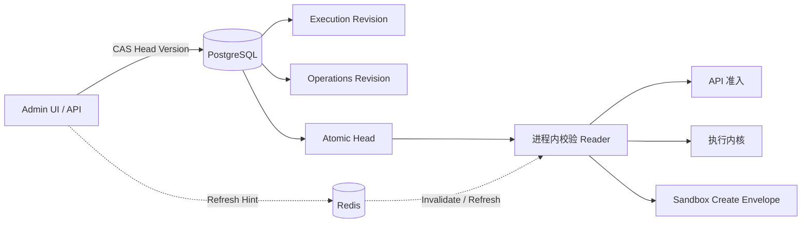

# Runtime Policy 控制面

[English](runtime-policy-control-plane.md)

Runtime Policy 是实时行为设置的唯一权威。PostgreSQL 保存不可变、类型化 Revision 与一个原子
Head；Redis 只传递 Refresh Hint，永远不是事实来源。

## Policy Family

Execution Policy 使用 Snapshot Semantics。准入会把 Revision ID 与完整、已校验 Policy Snapshot
写入每个 Run。Agent Limit、Model Resilience、Activity Timeout、Memory、Knowledge 与 Codebase
行为在 Retry、Approval、Restart、Replay 期间都不会漂移。

Operations Policy 使用 Live Semantics。Traffic Admission、Scheduler Action、Patrol
Admission/Remediation、Sandbox Allocation、Source Access、GC 或 Retention 开始前都必须读取新鲜、
已验证的 Head。策略收紧在下一个边界检查生效；已提交的领域历史仍保持可见。

## 完整性与一致性

每个 Revision 包含 Sequence、Schema Version、Canonical Digest、Author、Note 与 Timestamp。
Head 精确指向一个 Execution 与一个 Operations Revision，并携带单调递增 Version。Reader 验证：

1. 两个 Revision 均存在且 Family 正确；
2. Schema Version 受支持，Canonical Digest 一致；
3. Revision Pair 属于当前原子 Head；
4. 最近一次验证读取未超过 Staleness Window。

完整性异常、存储不可用与过度陈旧是不同错误，但在行为边界都 Fail Closed；Readiness 使用同一组
稳定 Reason Key。

## 变更模型

只有 Admin 可以创建或激活 Revision。写入携带 Expected Head Version，并使用 Compare-and-swap。
冲突返回当前 Head，且不丢弃调用方 Draft。Restore 是 Append-only：复制历史 Policy 形成新
Revision，再原子激活。

Admin UI 显式渲染每个有界类型字段，展示语义 Diff 与 History，Restore 前要求确认；Head
Conflict 时保留编辑，直到操作者显式 Reload。

## 进程生命周期

API、执行内核与 Migration Bootstrap 均从 PostgreSQL 初始化 Reader。本地短 Refresh Interval
保证即使 Redis 故障也有传播上界；Refresh Hint 只降低延迟，不包含 Policy Data。初始化与校验
成功前，进程拒绝依赖 Policy 的工作。

## Sandbox 边界

Deployment Settings 选择 Sandbox Driver、Image、Network、Proxy、Namespace 与 Broker Endpoint。
每个认证 Sandbox Create Request 携带活动 Operations Revision ID，以及封闭的
`SandboxContainerPolicy`（TTL、Memory、CPU、PID Limit）。Broker 用 Revision ID 标记资源，
不会从环境变量重建行为。

## 运维检查

- 监控每个进程的 Runtime Policy Readiness 与 Integrity Metric。
- Reader 接近最大 Staleness Window 时告警。
- 审计每次 Revision Create、Activation、Conflict 与 Restore。
- Head Conflict 表示并发管理，禁止盲重试覆盖。
- Revision Table 与 Head Table 必须一起备份和恢复。
