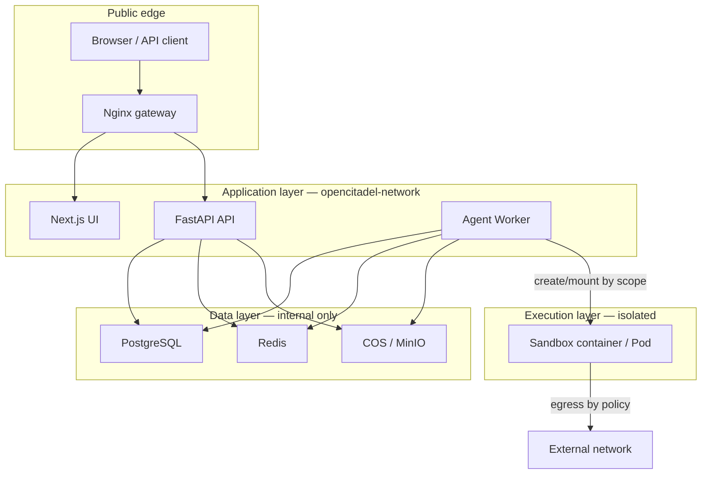
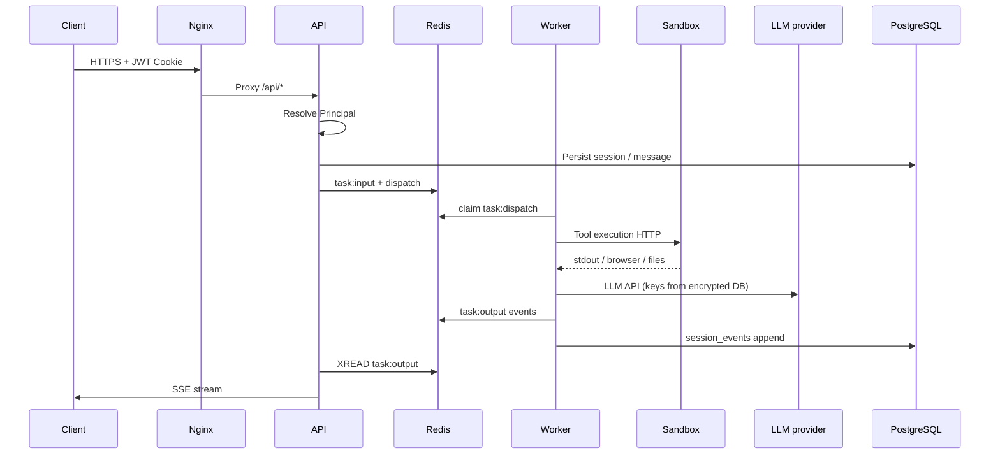
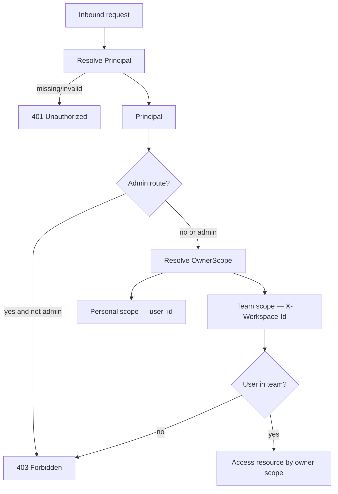
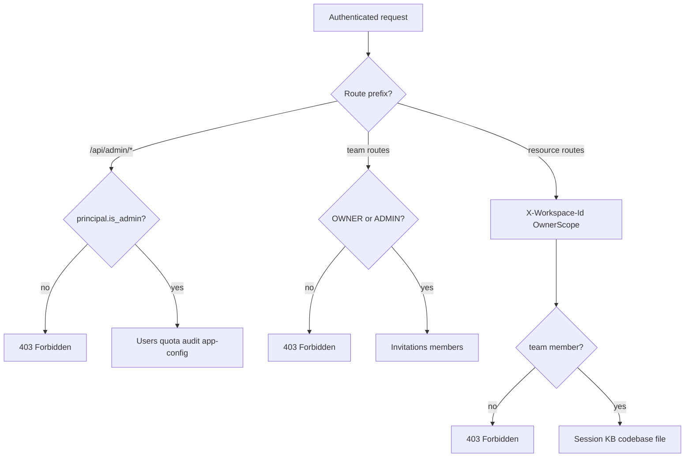

# OpenCitadel Security Model

[简体中文](security-model.zh-CN.md)

This document describes OpenCitadel security boundaries: sandbox isolation, data flows, authentication, and authorization. It complements operational hardening in [Production deployment](../operations/deployment.md) and network topology in [Architecture Overview](overview.md).

## Trust Boundaries



**Principles**

1. Only Nginx exposes HTTP/HTTPS ports to the host.
2. PostgreSQL, Redis, API, Worker, and UI communicate on the internal Docker network (`opencitadel-network`) or cluster NetworkPolicy.
3. Agent code, shell commands, and browser automation run inside sandboxes—not in API/Worker processes.
4. Secrets must not appear in logs; LLM provider keys are encrypted at the storage layer.

---

## Sandbox Isolation

### What Runs Inside a Sandbox

Each Agent session (or pooled instance) receives an independent runtime containing:

- Ubuntu 22.04 base image with Python and Node.js
- Chromium + Playwright (web automation)
- Xvfb + x11vnc + websockify (optional VNC observation)
- FastAPI sidecar (`sandbox/`) exposing shell, file, and browser tools to the Worker via HTTP

The Worker orchestrates sandboxes; user-facing tools (shell, browser, file I/O) execute **inside the sandbox boundary**.

### Isolation Mechanisms

| Layer | Mechanism | Description |
|-------|-----------|-------------|
| **Process** | Each sandbox is an independent container or K8s Pod | Not co-located with API/Worker |
| **Network** | Internal Docker/K8s network; no public ports by default | VNC exposed only via controlled proxy path |
| **Resources** | `memory_limit`, CPU shares, TTL / idle timeout | Prevents runaway resource consumption |
| **Admission** | `SandboxQuota` + host memory probe | Fail-closed when Redis unavailable; tasks queue rather than over-provision |
| **Lifecycle** | Idle reclamation, low-memory reclamation, orphan cleanup | Single-active coordination via Redis lease |
| **Permissions** | Non-root recommended; drop capabilities in hardened deployments | See hardening recommendations below |

### Sandbox Drivers

| Driver | Isolation surface | Worker permissions |
|--------|-------------------|-------------------|
| **Docker** (Compose) | Host Docker containers | Requires `docker.sock` mount to create `opencitadel-sandbox-*` |
| **Kubernetes** (Helm) | Namespace Pods + ResourceQuota | ServiceAccount with pods create/delete/list — **no** `docker.sock` required |
| **Remote gateway** | External execution service | Worker calls HTTP API only; no local container API |

### Hardening Recommendations

Default images prioritize developer experience. For a stricter production posture:

```yaml
# docker-compose.yml — sandbox service or template
security_opt:
  - no-new-privileges:true
cap_drop:
  - ALL
cap_add:
  - NET_BIND_SERVICE
mem_limit: 1g
```

Additional enterprise controls:

- Configure AppArmor / seccomp per organizational policy
- Sandbox egress firewall (allowlist LLM, MCP, and required domains only)
- Disable VNC in untrusted multi-tenant deployments
- Keep `sandbox.ttl_minutes` and `idle_timeout_minutes` short on shared hosts

For admission state machine and quota keys, see [Architecture Overview](overview.md).

---

## Data Flows

### Request and Task Path



### Data Classification

| Data | Storage | Encryption | Scope |
|------|---------|------------|-------|
| User credentials | PostgreSQL (`users`) | bcrypt password hash | Per user |
| JWT access / refresh | HTTP-only Cookie | Signed with `JWT_SECRET` | Per session |
| LLM API Key | PostgreSQL (`llm_models`) | Fernet (`fernet_v1`), `API_KEY_SECRET` | Per model config |
| Service API Key | PostgreSQL (hash) | SHA-256 static hash | Per key, mapped to owner |
| Session messages and events | PostgreSQL + Redis Streams | Transport TLS when HTTPS enabled | Personal or team workspace |
| Uploaded files / screenshots | Object storage (COS/MinIO) | Provider or bucket policy | Keys stored in DB |
| Long-term memory | PostgreSQL (+ pgvector) | Same as DB | Global or session |
| MCP / A2A traffic | Worker egress | TLS to remote servers | Per server config |

### Object Storage

- PostgreSQL **stores object keys only**, not file bytes.
- API and Worker share the same storage abstraction; switching backends requires object migration (`python -m app.migrate_storage`).
- Optional `MINIO_PUBLIC_ENDPOINT` exposes presigned/public URLs to LLMs for vision; otherwise images are inlined as base64 (no additional public URL).

### Observability

- `/api/metrics` exposes Prometheus metrics (no secrets).
- Optional OpenTelemetry export—configure collector access separately.
- Structured logs include `session_id` for correlation; must not log API keys or tokens.

---

## Authentication and Authorization

### Authentication Methods

| Method | Header / Cookie | Use case |
|--------|-----------------|----------|
| **Session JWT** | `access_token` Cookie (HTTP-only) | Browser UI and authenticated REST |
| **Refresh Token** | `refresh_token` Cookie | Silent access token renewal |
| **Service API Key** | `X-Api-Key` | Automation, integrations (`require_service_api_key`) |
| **CSRF Token** | Validated on browser state-changing requests | Cookie session protection |

JWT Claims (access token): `sub` (user id), `role` (global role), `ver` (token version), `typ`, `iss`, `exp`.

Revocation: incrementing the user record's `token_version` invalidates all unexpired refresh tokens.

### Authorization Model



**Global Roles**

| Role | Capabilities |
|------|--------------|
| `USER` | Own sessions, personal resources, team resources as member |
| `ADMIN` | Admin routes (`require_admin`), user management, system config |

**Workspace Scoping**

- Default: personal scope (`OwnerScope.personal(user_id)`).
- Team resources: client sends `X-Workspace-Id`; server validates `principal.team_roles` membership.
- Repositories filter by `OwnerScope`—cross-tenant access returns 403.

### Platform Admin vs Team Admin

OpenCitadel uses **two-tier authorization**: platform-level `ADMIN` global role and team-level `OWNER` / `ADMIN` roles are independent.



| Tier | Role | Typical capabilities | Implementation |
|------|------|-------------------|----------------|
| Platform | `ADMIN` (`global_role`) | `/api/admin/*`, global LLM default model, `app-config` writes | `require_admin` |
| Team | `OWNER` / `ADMIN` | Create invitations, manage members | `TeamService._require_team_admin` |
| Workspace | Any member | Access sessions, KB, codebases under team scope | `OwnerScope` + `X-Workspace-Id` |

Team creators default to `OWNER`; regular members can access team resources but cannot manage invitations.

### Rate Limiting and CORS

Configured in `api/config.yaml`:

```yaml
server:
  cors_origins: https://your-domain.com   # Restrict in production
  rate_limit_enabled: true
  rate_limit_per_minute: 120
```

Public endpoints (registration, status) are also limited by the rate limiter when enabled.

### Secret Management

| Secret | Environment variable | Rotation notes |
|--------|---------------------|----------------|
| LLM Key encryption | `API_KEY_SECRET` | After rotation, re-save all model keys in UI |
| JWT signing | `JWT_SECRET` | Invalidates all sessions |
| Session / Cookie | `SESSION_SECRET` | Invalidates cookie sessions |
| DB / Redis / Storage | `POSTGRES_*`, `REDIS_*`, `COS_*`, `MINIO_*` | Update `.env` and restart services |

Production checklist:

```bash
openssl rand -hex 32   # Generate separately for each secret
chmod 600 .env api/config.yaml
USE_DB_APP_CONFIG=true
ENV=production
```

Legacy plaintext LLM keys (`legacy_plaintext`) are automatically encrypted by `opencitadel-migrate` on deploy.

---

## Network Exposure Summary

| Service | Default exposure | Recommendation |
|---------|------------------|----------------|
| Nginx | Host `NGINX_PORT` (8088), optional 443 | Sole public entry point |
| API / UI / Worker | Internal only | Do not publish ports |
| PostgreSQL / Redis | Internal only | Never expose to public internet |
| MinIO | Internal; optional public endpoint variable | Keep internal unless LLM needs to fetch URLs |
| Sandbox | Internal HTTP to Worker | Do not map host ports |
| MCP / A2A servers | Worker/API egress | Allowlist targets |

---

## Related Documentation

- [Architecture Overview](overview.md) — Process roles, sandbox lifecycle, DI
- [Production deployment](../operations/deployment.md) — Firewall, backup, HTTPS
- [HTTPS & domain setup](../operations/https-domain-setup.md) — TLS and domain binding
- [Configuration Source Governance](config-source-governance.md) — Boundary between secrets and behavioral config
