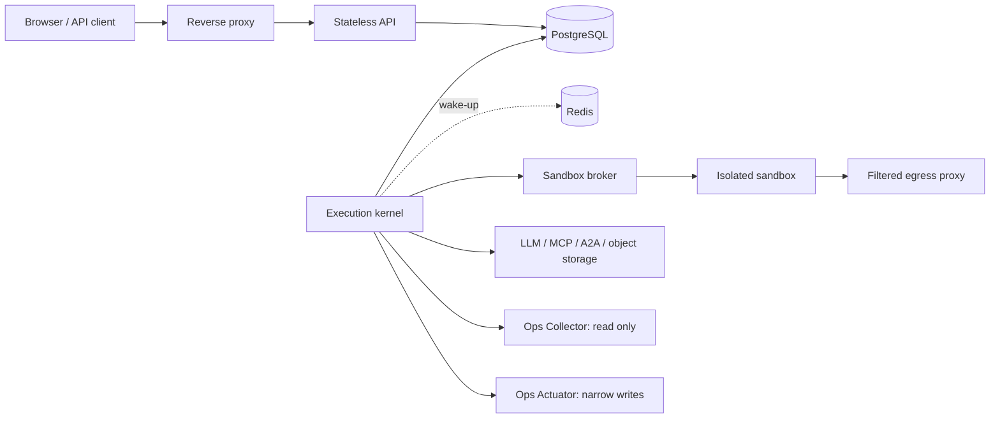

# Security Model

[简体中文](security-model.zh-CN.md)

OpenCitadel assumes model output, uploaded content, retrieved text, remote
integrations, and sandbox workloads are untrusted. Security controls are
enforced by typed command admission, capability narrowing, durable approval,
database isolation, sandbox boundaries, and verifiable evidence.

## Trust boundaries

```mermaid
flowchart LR
  User[Browser / API client] --> Proxy[Reverse proxy]
  Proxy --> API[Stateless API]
  API --> PG[(PostgreSQL)]
  Kernel[Execution kernel] --> PG
  Kernel -. wake-up .-> Redis[(Redis)]
  Kernel --> Broker[Sandbox broker]
  Broker --> Sandbox[Isolated sandbox]
  Sandbox --> Egress[Filtered egress proxy]
  Kernel --> Providers[LLM / MCP / A2A / object storage]
  Kernel --> Collector[Ops Collector: read only]
  Kernel --> Actuator[Ops Actuator: narrow writes]
```

- Only the reverse proxy is public. API, kernel metrics, PostgreSQL, Redis,
  object storage, broker, sandboxes, Collector, and Actuator stay private.
- API accepts identity and commands but does not execute workflow steps.
- The execution kernel calls providers using a separate database role.
- Agent code, shell, files, and Chromium execute inside sandbox isolation.
- Only the broker receives Docker socket access in Compose.

## Identity, authorization, and tenant isolation

Session JWTs and service API keys resolve a `Principal`. Workspace selection
creates an immutable `AuthorizationContext` and `OwnerScope`. Personal and team
resources are mutually exclusive scopes. Application repositories filter by
scope, while transaction-local PostgreSQL settings enforce forced RLS as a
second boundary.

Runtime database users are non-superuser and cannot bypass RLS. Owner-scoped
tables use `ENABLE ROW LEVEL SECURITY` plus `FORCE ROW LEVEL SECURITY`; this
includes `inference_bindings` as well as execution and product resources.
The migration role owns schema changes; the API and execution kernel receive only required
DML. Owner-scoped execution rows freeze personal/team ownership at creation.
The event store also compares each append context with the existing stream and
rejects mismatches even for system-authorized kernel work.

The `AUDITOR` global role is read-only. Administrators manage global resources, but global
authorization does not make a personal/team event stream ownerless.

## Execution integrity

Every accepted command has a unique id and persisted result. Every execution
event has a monotonically increasing stream version, previous hash, and current
hash. Replay verifies the complete chain or a verified snapshot plus tail.
Invalid snapshots are deleted and replayed; event tampering stops execution.

Activity requests persist input references/digests, policy, timeout, claim
generation, and call-start before provider access. Stale claim generations
cannot report completion. For non-idempotent external writes, an uncertain
post-call result enters explicit unknown-outcome handling rather than automatic
repetition.

Formal projections are rebuildable and cannot append facts. SSE uses a
sanitized public projection; private inputs, raw provider bodies, secrets, and
internal event metadata never enter the browser stream.

## Tool and approval policy

Tool exposure is the intersection of:

1. registered platform capability;
2. authenticated role and OwnerScope;
3. Run mode and Operator domain;
4. selected Skill allowlist and integration references;
5. `ToolExecutionPolicy` effect, idempotency, and approval mode.

The external-call intent and policy snapshot are durable before evaluation.
Calls requiring approval create a persisted approval batch and wait. Approval
uses dedicated endpoints and commands; prompt text, chat messages, and model
output cannot approve an invocation. An approval authorizes only the frozen
invocation set and arguments.

Ops Collector exposes fixed registered reads. Ops Actuator exposes only a
closed set of namespace/workload-scoped changes, with dedicated RBAC and
network policy. A model cannot construct an arbitrary Kubernetes request.

## Sandbox and outbound access

Docker and Kubernetes sandboxes run as non-root where supported, drop
capabilities, apply resource/PID limits, use controlled writable mounts, and
route egress through policy. Attachments and pinned resource versions are
admitted before mounting. Paths are normalized and cannot escape the session
workspace.

Outbound HTTP applies scheme, hostname, DNS/IP, private-network, and port
validation. Exact private hosts require operator allowlisting. Redirects are
revalidated. MCP/A2A servers are owner-scoped resources; a Skill may reference
only accessible, enabled servers.

## Secrets

- Deployment secrets live in environment/secret-manager inputs, never Runtime
  Policy revisions or UI event payloads.
- Inference endpoint and integration secrets are encrypted as versioned
  `v2.<key-id>...` envelopes with `API_KEY_SECRET`.
- `API_KEY_PREVIOUS_SECRETS` supports planned rotation of versioned envelopes.
- Audit signatures use a separate `AUDIT_SIGNING_KEY` active/previous signing-key ring.
- API responses mask stored secrets; blank/masked update values do not replace
  a credential accidentally.
- Logs, metrics, audit metadata, public events, and evidence packages redact
  credential material.

## Audit and evidence

Audit rows form a signed hash chain. Governance projections report Run state,
approval requests/decisions, Activity failures, policy denials, resource
bindings, and chain verification. Evidence packages contain sanitized
manifested files and digests. Audit and execution event rows are append-only to
runtime roles.

## Network exposure

| Surface | Required exposure |
| --- | --- |
| Reverse proxy | Public HTTP/HTTPS |
| API/UI | Internal behind proxy |
| PostgreSQL/Redis/object storage | Internal only |
| Execution-kernel metrics | Internal scrape only |
| Sandbox broker and sandboxes | API/kernel private networks only |
| Ops Collector/Actuator | API/kernel only; Actuator disabled by default |
| Remote LLM/MCP/A2A | Explicit outbound policy and TLS |

Production must enable NetworkPolicy, strong Redis authentication, secure
cookies, narrow trusted-proxy CIDRs, and separate database credentials. Any
hash, RLS, OwnerScope, signature, or credential-decryption error fails closed.

Authentication middleware permits only controlled CORS preflight `OPTIONS`
requests, lifecycle probes `/api/health/live` and `/api/health/ready`, and the
dependency diagnostic `/api/status` without a user session.
`/api/metrics` is disabled when `METRICS_TOKEN` is empty and otherwise requires
its bearer token; execution-kernel metrics remain on a private scrape port.
