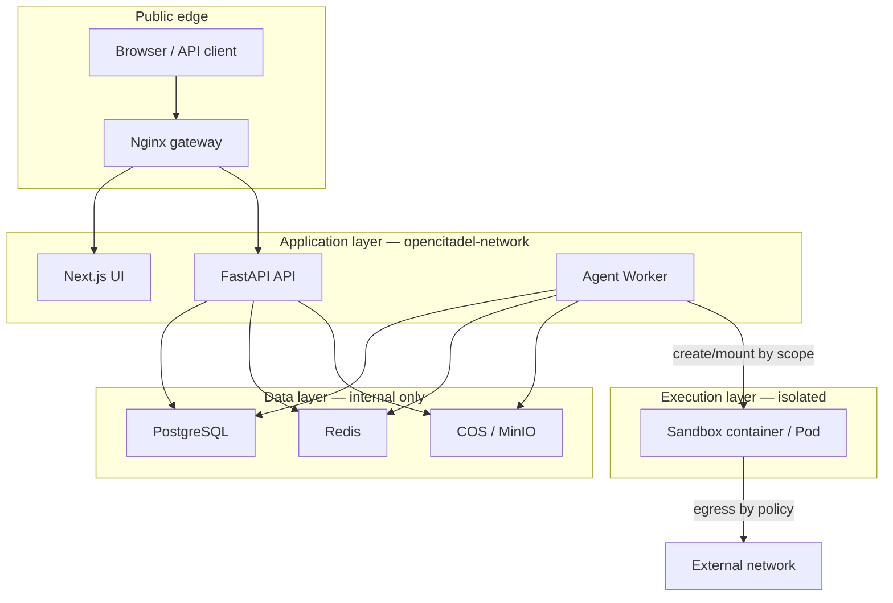
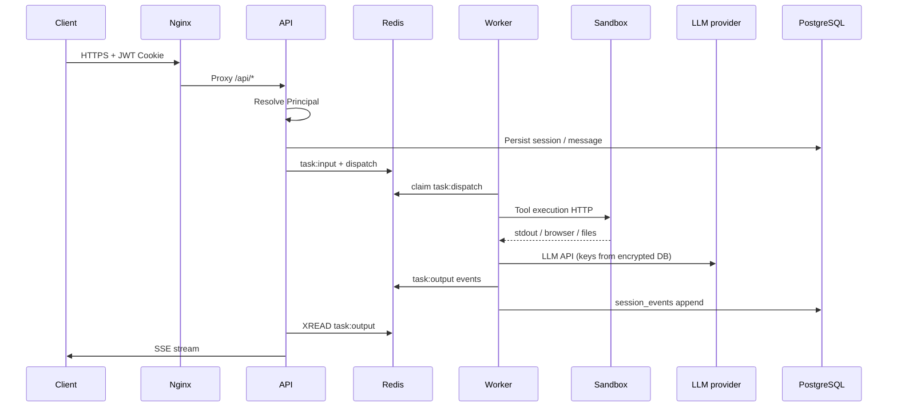
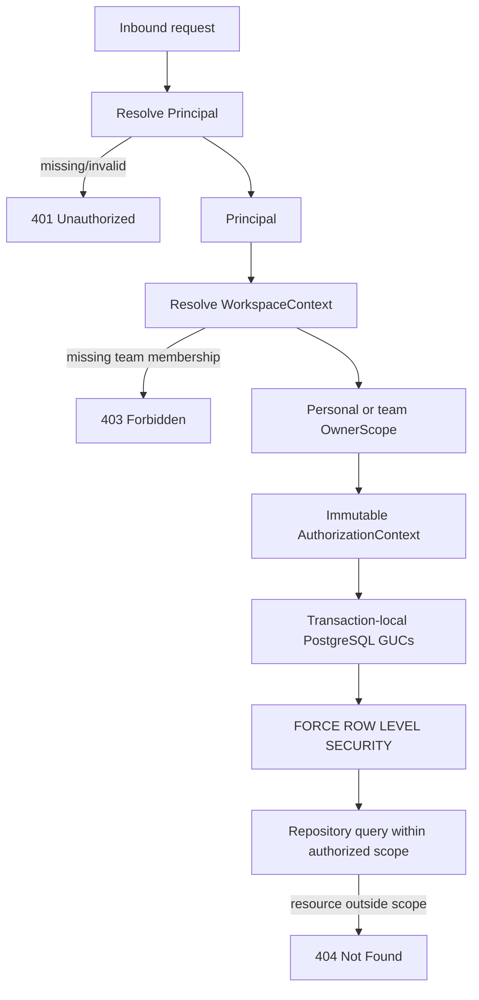
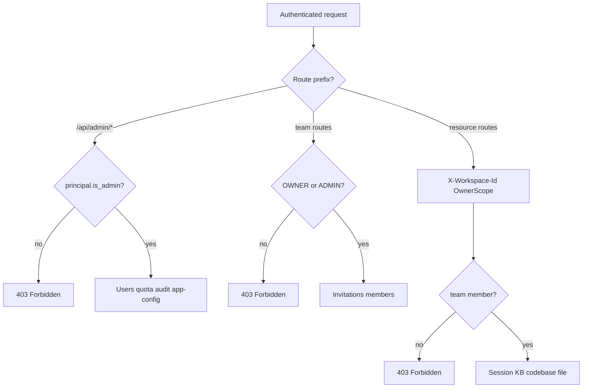

# OpenCitadel Security Model

[简体中文](security-model.zh-CN.md)

This document describes OpenCitadel security boundaries: sandbox isolation, data flows, authentication, and authorization. It complements operational hardening in [Production deployment](../operations/deployment.md) and network topology in [Architecture Overview](overview.md).

## Trust Boundaries


```mermaid
flowchart TB
  subgraph public ["Public edge"]
    Browser["Browser / API client"]
    Nginx["Nginx gateway"]
  end
  subgraph app ["Application layer — opencitadel-network"]
    UI["Next.js UI"]
    API["FastAPI API"]
    Worker["Agent Worker"]
  end
  subgraph data ["Data layer — internal only"]
    PG["PostgreSQL"]
    Redis["Redis"]
    Storage["COS / MinIO"]
  end
  subgraph exec ["Execution layer — isolated"]
    Sandbox["Sandbox container / Pod"]
  end
  Browser --> Nginx
  Nginx --> UI
  Nginx --> API
  API --> PG
  API --> Redis
  API --> Storage
  Worker --> PG
  Worker --> Redis
  Worker --> Storage
  Worker -->|"create/mount by scope"| Sandbox
  Sandbox -->|"egress by policy"| Internet["External network"]
```

**Principles**

1. Only Nginx exposes HTTP/HTTPS ports to the host.
2. PostgreSQL, Redis, API, Worker, and UI communicate on the internal Docker network (`opencitadel-network`) or cluster NetworkPolicy.
3. Agent code, shell commands, and browser automation run inside sandboxes—not in API/Worker processes.
4. Secrets must not appear in logs; LLM provider keys are encrypted at the storage layer.

---

## Sandbox Isolation

### What Runs Inside a Sandbox

Each Agent session (or pooled instance) receives an independent runtime containing:

- Ubuntu 22.04 base image with Python and Node.js
- Chromium (browser runtime inside the sandbox)
- Xvfb + x11vnc + websockify (optional VNC observation)
- FastAPI sidecar (`sandbox/`) exposing shell, file, and browser tools to the Worker via HTTP

The Worker orchestrates sandboxes and drives browser automation via **Playwright in the Worker process**, connecting to Chromium inside the sandbox over CDP. User-facing tools (shell, browser, file I/O) execute **inside the sandbox boundary**.

### Isolation Mechanisms

| Layer | Mechanism | Description |
|-------|-----------|-------------|
| **Process** | Each sandbox is an independent container or K8s Pod | Not co-located with API/Worker |
| **Network** | Internal Docker network + dual-homed Squid egress / K8s NetworkPolicy | No direct PostgreSQL/Redis access; destination ACLs exclude private and metadata ranges |
| **Resources** | `memory_limit`, CPU shares, TTL / idle timeout | Prevents runaway resource consumption |
| **Admission** | `SandboxQuota` + host memory probe | Fail-closed when Redis unavailable; tasks queue rather than over-provision |
| **Lifecycle** | Idle reclamation, low-memory reclamation, orphan cleanup | Single-active coordination via Redis lease |
| **Permissions** | UID 1000, all capabilities dropped, read-only root, no-new-privileges | Enforced by the runtime policy |

### Sandbox Drivers

| Driver | Isolation surface | Worker permissions |
|--------|-------------------|-------------------|
| **Docker** (Compose) | Internal sandbox network + filtered forward proxy | API/Worker call a token-authenticated broker; only the broker mounts `docker.sock` |
| **Kubernetes** (Helm) | Namespace Pods + ResourceQuota | ServiceAccount with pods create/delete/list — **no** `docker.sock` required |
| **Remote gateway** | External execution service | Worker calls HTTP API only; no local container API |

### Hardening Recommendations

The default sandbox runtime already applies the baseline below:

```yaml
# docker-compose.yml — sandbox service or template
security_opt:
  - no-new-privileges:true
cap_drop:
  - ALL
mem_limit: 1g
memswap_limit: 1g
pids_limit: 512
read_only: true
user: "1000:1000"
```

Additional enterprise controls:

- Configure AppArmor / seccomp per organizational policy
- Keep `networkPolicy.enabled=true`; use an egress proxy for domain-level allowlists
- Disable VNC in untrusted multi-tenant deployments
- Keep `sandbox.ttl_minutes` and `idle_timeout_minutes` short on shared hosts

For admission state machine and quota keys, see [Architecture Overview](overview.md).

---

## Data Flows

### Request and Task Path


```mermaid
sequenceDiagram
  participant C as Client
  participant N as Nginx
  participant A as API
  participant R as Redis
  participant W as Worker
  participant S as Sandbox
  participant L as LLM provider
  participant D as PostgreSQL

  C->>N: HTTPS + JWT Cookie
  N->>A: Proxy /api/*
  A->>A: Resolve Principal
  A->>D: Persist session / message
  A->>R: task:input + dispatch
  W->>R: claim task:dispatch
  W->>S: Tool execution HTTP
  S-->>W: stdout / browser / files
  W->>L: LLM API (keys from encrypted DB)
  W->>R: task:output events
  W->>D: session_events append
  A->>R: XREAD task:output
  A->>C: SSE stream
```

### Data Classification

| Data | Storage | Encryption | Scope |
|------|---------|------------|-------|
| User credentials | PostgreSQL (`users`) | bcrypt password hash | Per user |
| JWT access / refresh | HTTP-only Cookie | Signed with `JWT_SECRET` | Per session |
| LLM API Key | PostgreSQL (`llm_endpoints`) | Fernet (`fernet_v1`), `API_KEY_SECRET` | Per endpoint (shared by sibling models) |
| Service API Key | PostgreSQL (hash) | SHA-256 static hash | Per key, mapped to owner |
| Session messages and events | PostgreSQL + Redis Streams | Transport TLS when HTTPS enabled | Personal or team workspace |
| Uploaded files / screenshots | Object storage (COS/MinIO) | Provider or bucket policy | Keys stored in DB |
| Long-term memory | PostgreSQL (+ pgvector) | Same as DB | Global or session |
| MCP / A2A traffic | Worker egress | TLS to remote servers | Per server config |

### Object Storage

- PostgreSQL **stores object keys only**, not file bytes.
- API and Worker share the same storage abstraction; switching backends requires object migration (`python -m app.migrate_storage`).
- Optional `MINIO_PUBLIC_ENDPOINT` exposes presigned/public URLs to LLMs for vision; otherwise images are inlined as base64 (no additional public URL).

### Codebase Source and Version Security

Codebase analysis treats source material as immutable, versioned evidence rather
than mutable sandbox state.

- Source creation validates shape and ownership before a task is created.
- ZIP imports reject absolute paths, `..`, symlinks, excessive entry count,
  excessive uncompressed size, and suspicious compression ratios.
- Git imports are HTTPS-only, reject credentials and non-default ports, and
  reject any resolved private, loopback, link-local, multicast, or metadata
  address.
- Each import/rebuild materializes into a clean temporary workspace and then
  stores a content-addressed source snapshot in object storage.
- Published versions are immutable. Sessions bind to an explicit
  `codebase_version_id`; source reads and Agent workspace restore use that bound
  snapshot even after a newer version publishes.
- Rebuild publication uses a compare-and-swap on the previous active version.
  Failures preserve the current active analysis instead of clearing shared rows.
- Lexical search is mandatory. Vector search is degradable and must fall back to
  lexical results with visible `degraded_reasons`.
- Static-analysis graph facts must carry `EvidenceRef` values. Unsupported
  diagrams are omitted and recorded as unsupported reasons rather than rendered
  from generic templates.
- Version GC protects active versions, historical session bindings, and
  queued/running builds. Snapshot objects are deleted only after the final DB
  reference to that object key is collected.

### Observability

- `/api/metrics` exposes Prometheus metrics (no secrets).
- Optional OpenTelemetry export—configure collector access separately.
- Structured logs include `session_id` for correlation; must not log API keys or tokens.

---

## Authentication and Authorization

### Authentication Methods

| Method | Header / Cookie | Use case |
|--------|-----------------|----------|
| **Session JWT** | `access_token` Cookie (HTTP-only) | Browser UI and authenticated REST |
| **Refresh Token** | `refresh_token` Cookie | Silent access token renewal |
| **Service API Key** | `X-Api-Key` | Automation, integrations (`require_service_api_key`) |
| **CSRF Token** | Validated on browser state-changing requests | Cookie session protection |

JWT Claims (access token): `sub` (user id), `role` (global role), `ver` (token version), `typ`, `iss`, `exp`.

Revocation: incrementing the user record's `token_version` invalidates all unexpired refresh tokens.

### Authorization Model


```mermaid
flowchart TD
  Request["Inbound request"] --> AuthN["Resolve Principal"]
  AuthN -->|"missing/invalid"| Deny401["401 Unauthorized"]
  AuthN --> Principal["Principal"]
  Principal --> Workspace["Resolve WorkspaceContext"]
  Workspace -->|"missing team membership"| Deny403["403 Forbidden"]
  Workspace --> Scope["Personal or team OwnerScope"]
  Scope --> Authz["Immutable AuthorizationContext"]
  Authz --> GUC["Transaction-local PostgreSQL GUCs"]
  GUC --> RLS["FORCE ROW LEVEL SECURITY"]
  RLS --> Resource["Repository query within authorized scope"]
  Resource -->|"resource outside scope"| Deny404["404 Not Found"]
```

Each authenticated request resolves a `Principal`, then a
`WorkspaceContext` and `OwnerScope`. Those values are copied into an immutable
`AuthorizationContext`. Every SQLAlchemy transaction binds the context with
transaction-local `set_config(..., true)` values (`app.auth_mode`,
`app.user_id`, `app.team_id`, `app.is_admin`, `app.request_id`, and
`app.system_actor`) before repository work. Tenant tables enable and
**FORCE ROW LEVEL SECURITY**, so repository predicates and PostgreSQL policies
form independent authorization layers. Background and migration paths must use
an explicitly named system actor; anonymous access is not an implicit bypass.

**Global Roles**

| Role | Capabilities |
|------|--------------|
| `USER` | Own sessions, personal resources, team resources as member |
| `AUDITOR` | Read-only admin/compliance evidence; all authenticated mutations are default-denied |
| `ADMIN` | Platform admin routes, user management, global configuration and global resource mutation |

`AUDITOR` is enforced at both authenticated router and service-key boundaries:
methods other than `GET`, `HEAD`, and `OPTIONS` are rejected, and a service API
key owned by an auditor cannot execute A2A operations.

**Workspace Scoping**

- Default: personal scope (`OwnerScope.personal(user_id)`).
- Team resources: client sends `X-Workspace-Id`; server validates `principal.team_roles` membership.
- Missing team membership returns 403. Resource lookups outside an authorized
  scope normally return 404 so object existence is not disclosed.

| Resource visibility | Read visibility | Mutation authority |
|---------------------|-----------------|--------------------|
| Personal | Owning user | Owning non-auditor user |
| Team | Validated team members | Scope-aware non-auditor members; team administration still requires team `OWNER` / `ADMIN` |
| Global LLM endpoints/models, Skills, MCP and A2A servers | Authenticated users where the route permits | Platform `ADMIN` only |

Global model rows are catalog/control-plane objects. Selecting a default for a
personal or team workspace writes a scoped row in
`llm_model_preferences`; it never mutates the global `llm_models` row.

### Platform Admin vs Team Admin

OpenCitadel uses **two-tier authorization**: platform-level `ADMIN` global role and team-level `OWNER` / `ADMIN` roles are independent.


```mermaid
flowchart TD
  Request["Authenticated request"] --> Route{"Route prefix?"}
  Route -->|"/api/admin/*"| PlatformAdmin{"principal.is_admin?"}
  PlatformAdmin -->|"no"| Deny403A["403 Forbidden"]
  PlatformAdmin -->|"yes"| AdminOps["Users quota audit app-config"]
  Route -->|"team routes"| TeamAdmin{"OWNER or ADMIN?"}
  TeamAdmin -->|"no"| Deny403B["403 Forbidden"]
  TeamAdmin -->|"yes"| TeamOps["Invitations members"]
  Route -->|"resource routes"| Workspace["X-Workspace-Id OwnerScope"]
  Workspace --> Member{"team member?"}
  Member -->|"no"| Deny403C["403 Forbidden"]
  Member -->|"yes"| ResourceAccess["Session KB codebase file"]
```

| Tier | Role | Typical capabilities | Implementation |
|------|------|-------------------|----------------|
| Platform | `ADMIN` (`global_role`) | `/api/admin/*`, global LLM default model, `app-config` writes | `require_admin` |
| Team | `OWNER` / `ADMIN` | Create invitations, manage members | `TeamService._require_team_admin` |
| Workspace | Any member | Access sessions, KB, codebases under team scope | `OwnerScope` + `X-Workspace-Id` |

Team creators default to `OWNER`; regular members can access team resources but cannot manage invitations.

### Artifacts and trusted delivery

- Private artifact routes require `WorkspaceContext` scope: list/get/content/share verify session ownership via `OwnerScope`.
- Cross-scope artifact access returns **404** (no existence leak).
- Lifecycle: `artifact_write` → object storage upload → `ArtifactEvent` to workbench → `artifact_finalize` → optional share token (`/share/artifact/{token}`).
- HTML artifacts are sanitized server-side (strip `<script>` and inline event handlers) before preview.
- UI renders HTML in iframe with `sandbox="allow-scripts"` only — **no** `allow-same-origin` (prevents same-origin script escalation).

Details: [Checkpoints & HITL — Artifact delivery](checkpoints-and-hitl.md#artifact-delivery-related).

### Webhook automation

- `POST /api/webhooks/{token}` requires `X-Webhook-Signature: HMAC-SHA256(body, webhook_secret)`.
- Webhook secrets are Fernet-encrypted at rest (`API_KEY_SECRET`); plaintext shown once on create/rotate.
- Idempotency keys are scoped per job token: `webhook:idem:{token}:{sha256(body)}`.

### Rate Limiting and CORS

Configured in `api/config.yaml`:

```yaml
server:
  cors_origins: https://your-domain.com   # Restrict in production
  rate_limit_enabled: true
  rate_limit_per_minute: 120
```

The limiter covers every business path under `/api/` except `/api/status`,
`/api/metrics`, and `OPTIONS` preflight requests. Each request consumes an IP
bucket plus one bucket for every presented access cookie, refresh cookie, or
`X-Api-Key`; credentials are SHA-256 fingerprinted and raw tokens are never
stored in Redis keys. Production fails closed with `503` and `Retry-After`
when the Redis limiter is unavailable.

### Secret Management

| Secret | Environment variable | Rotation notes |
|--------|---------------------|----------------|
| LLM Key encryption | `API_KEY_SECRET`, `API_KEY_SECRET_ID`, `API_KEY_PREVIOUS_SECRETS` | Versioned `fernet_v2` key ring with idempotent migration |
| Audit HMAC signing | `AUDIT_SIGNING_KEY`, `AUDIT_SIGNING_KEY_ID`, `AUDIT_PREVIOUS_SIGNING_KEYS` | Keep prior verification keys until the retention/rollback window closes |
| JWT signing | `JWT_SECRET` | Invalidates all sessions |
| Session / Cookie | `SESSION_SECRET` | Invalidates cookie sessions |
| Sandbox broker | `SANDBOX_BROKER_TOKEN` | Rotate API, Worker, and broker together |
| DB / Redis / Storage | `POSTGRES_*`, `REDIS_*`, `COS_*`, `MINIO_*` | Update `.env` and restart services |

Production checklist:

```bash
openssl rand -hex 32   # Generate separately for each secret
chmod 600 .env api/config.yaml
USE_DB_APP_CONFIG=true
ENV=production
```

Legacy plaintext LLM keys (`legacy_plaintext`) are automatically encrypted by `opencitadel-migrate` on deploy.

**LLM credential-key rotation**

1. Add the old id and secret to `API_KEY_PREVIOUS_SECRETS`.
2. Set a new, unique `API_KEY_SECRET` and `API_KEY_SECRET_ID`.
3. Restart the migrate environment and run
   `python -m app.migrate_llm_api_key_rotation`.
4. Verify all non-empty endpoint credentials use `fernet_v2` and the new key
   id.
5. Remove the old key only after the verification and rollback windows close.

The migration reads `legacy_plaintext`, `fernet_v1`, and old `fernet_v2`
records, then rewrites them under the active key id. It is idempotent and logs
counts and key ids, never plaintext credentials.

**Audit integrity and signing-key rotation**

New audit rows use `AUDIT_SIGNING_KEY_ID`; verification resolves historical
rows through `AUDIT_PREVIOUS_SIGNING_KEYS` (legacy rows also consult the API
key ring). Rotate by retaining the old signing key, setting a new distinct
`AUDIT_SIGNING_KEY` and id, restarting all writers, then calling
`GET /api/admin/audit/verify-chain` before and after the change. Only remove
the old verification key after every retained row that needs it has expired or
been archived.

Audit rows carry a monotonically chained HMAC, and a PostgreSQL trigger rejects
`UPDATE` and `DELETE`. Verification emits the critical log marker
`AUDIT_CHAIN_INTEGRITY_FAILURE` on the first broken sequence. This is tamper
evidence, not protection from a privileged operator dropping the table or
rewriting backups; regulated deployments still need external immutable/WORM
export and alert routing.

### Security verification in CI

- `.github/workflows/ci.yml` runs API/UI/sandbox tests, five image builds and
  Trivy scans, Compose/Helm/Squid rendering, and this documentation checker.
- `.github/workflows/security.yml` runs Gitleaks history scanning, dependency
  review and lockfile audits, CodeQL, and Trivy filesystem/IaC scanning.
- `.github/workflows/release.yml` builds two architectures with SBOM,
  provenance, digest scanning, and registry attestations; Actions are pinned to
  full commit SHAs.

---

## Network Exposure Summary

| Service | Default exposure | Recommendation |
|---------|------------------|----------------|
| Nginx | Host `NGINX_PORT` (8088), optional 443 | Sole public entry point |
| API / UI / Worker | Internal only | Do not publish ports |
| PostgreSQL / Redis | Internal only | Never expose to public internet |
| MinIO | Internal; optional public endpoint variable | Keep internal unless LLM needs to fetch URLs |
| Sandbox | Internal HTTP to Worker | Do not map host ports |
| MCP / A2A servers | Worker/API egress | Allowlist targets |

---

## Related Documentation

- [Architecture Overview](overview.md) — Process roles, sandbox lifecycle, DI
- [Production deployment](../operations/deployment.md) — Firewall, backup, HTTPS
- [HTTPS & domain setup](../operations/https-domain-setup.md) — TLS and domain binding
- [Configuration Source Governance](config-source-governance.md) — Boundary between secrets and behavioral config
