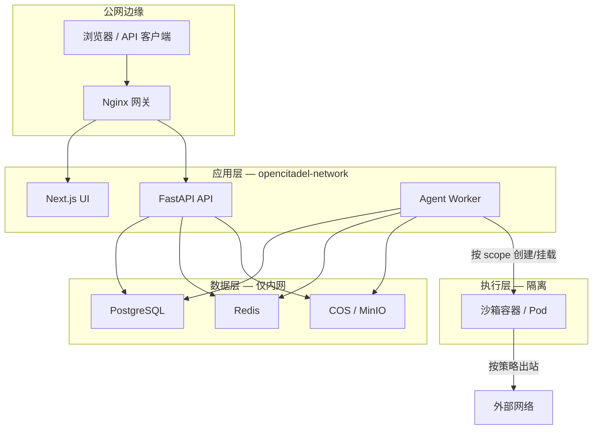
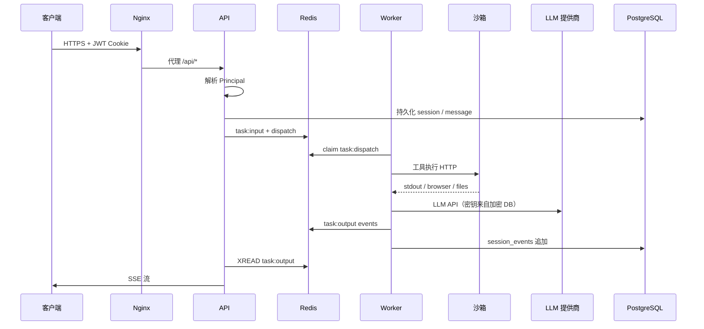
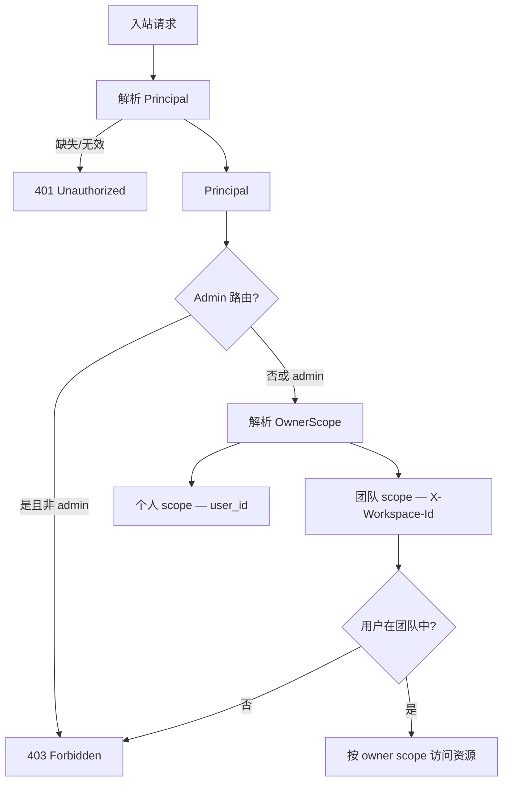
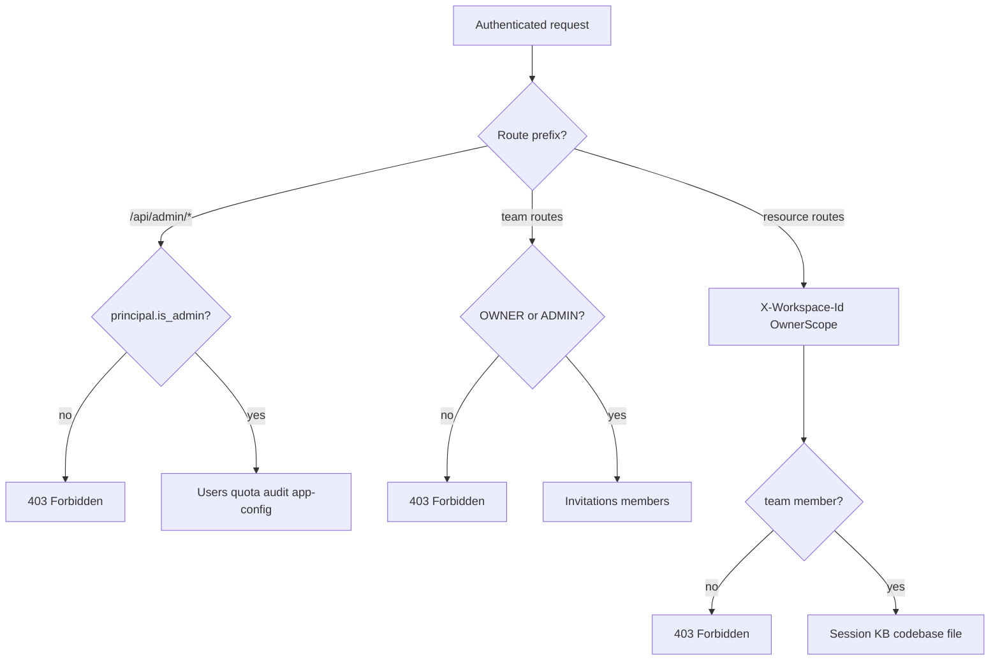

[English](security-model.md)

# OpenCitadel 安全模型

本文档描述 OpenCitadel 的安全边界：沙箱隔离、数据流、认证与授权。与 [生产部署](../operations/deployment.zh-CN.md) 中的运维加固，以及 [overview.zh-CN.md](overview.zh-CN.md) 中的网络拓扑互为补充。

## 信任边界



**原则**

1. 仅 Nginx 向宿主机暴露 HTTP/HTTPS 端口。
2. PostgreSQL、Redis、API、Worker、UI 在内部 Docker 网络（`opencitadel-network`）或集群 NetworkPolicy 内通信。
3. Agent 代码、Shell 命令、浏览器自动化在沙箱内运行——不在 API/Worker 进程中执行。
4. 密钥不得出现在日志中；LLM 提供商 Key 在存储层加密。

---

## 沙箱隔离

### 沙箱内运行什么

每个 Agent 会话（或池化实例）获得独立运行时，包含：

- Ubuntu 22.04 基础镜像，Python、Node.js
- Chromium（浏览器运行时，位于沙箱内）
- Xvfb + x11vnc + websockify（可选 VNC 观测）
- FastAPI 侧车（`sandbox/`），通过 HTTP 向 Worker 暴露 shell、文件、浏览器工具

Worker 编排沙箱，并通过 **Worker 进程内的 Playwright** 经 CDP 连接沙箱内 Chromium 驱动浏览器自动化。面向用户的工具（shell、browser、文件 I/O）在**沙箱边界内**执行。

### 隔离机制

| 层级 | 机制 | 说明 |
|------|------|------|
| **进程** | 每个沙箱独立容器或 K8s Pod | 不与 API/Worker 同进程 |
| **网络** | 内部 Docker/K8s 网络；默认无公网端口 | VNC 仅通过受控代理路径暴露 |
| **资源** | `memory_limit`、CPU 份额、TTL / 空闲超时 | 防止资源失控 |
| **准入** | `SandboxQuota` + 宿主机内存探测 | Redis 不可用时 fail-closed；任务排队而非超配 |
| **生命周期** | 空闲回收、低内存回收、孤儿清理 | 通过 Redis lease 单活协调 |
| **权限** | 建议非 root；加固部署时 drop capabilities | 见下方加固建议 |

### 沙箱 Driver

| Driver | 隔离面 | Worker 权限 |
|--------|--------|-------------|
| **Docker**（Compose） | 宿主机 Docker 容器 | 需挂载 `docker.sock` 以创建 `opencitadel-sandbox-*` |
| **Kubernetes**（Helm） | 命名空间内 Pod + ResourceQuota | ServiceAccount 具备 pods create/delete/list — **无需** `docker.sock` |
| **远程网关** | 外部执行服务 | Worker 仅调用 HTTP API；不使用本地容器 API |

### 加固建议

默认镜像优先开发体验。更严格的生产 posture：

```yaml
# docker-compose.yml — sandbox 服务或模板
security_opt:
  - no-new-privileges:true
cap_drop:
  - ALL
cap_add:
  - NET_BIND_SERVICE
mem_limit: 1g
```

额外企业级控制：

- 按组织策略配置 AppArmor / seccomp
- 沙箱网络出站防火墙（仅 allowlist LLM、MCP 及必要域名）
- 不可信多租户部署中禁用 VNC
- 共享主机上保持较短的 `sandbox.ttl_minutes` 与 `idle_timeout_minutes`

准入状态机与配额键见 [overview.zh-CN.md](overview.zh-CN.md)。

---

## 数据流

### 请求与任务路径



### 数据分类

| 数据 | 存储 | 加密 | 作用域 |
|------|------|------|--------|
| 用户凭证 | PostgreSQL（`users`） | bcrypt 密码哈希 | 按用户 |
| JWT access / refresh | HTTP-only Cookie | `JWT_SECRET` 签名 | 按会话 |
| LLM API Key | PostgreSQL（`llm_models`） | Fernet（`fernet_v1`），`API_KEY_SECRET` | 按模型配置 |
| Service API Key | PostgreSQL（哈希） | SHA-256 静态哈希 | 按 Key，映射 owner |
| 会话消息与事件 | PostgreSQL + Redis Streams | 启用 HTTPS 时传输层 TLS | 个人或团队工作区 |
| 上传文件 / 截图 | 对象存储（COS/MinIO） | 提供商或桶策略 | Key 存 DB |
| 长期记忆 | PostgreSQL（+ pgvector） | 同 DB | 全局或会话 |
| MCP / A2A 流量 | Worker 出站 | 远程服务器 TLS | 按 server 配置 |

### 对象存储

- PostgreSQL **仅存储 object key**，不存文件字节。
- API 与 Worker 共用同一存储抽象；切换后端需对象迁移（`python -m app.migrate_storage`）。
- 可选 `MINIO_PUBLIC_ENDPOINT` 向 LLM 暴露预签名/公开 URL 用于视觉；否则图片以 base64 内联（无额外公网 URL）。

### 可观测性

- `/api/metrics` 暴露 Prometheus 指标（不含密钥）。
- 可选 OpenTelemetry 导出——单独配置 collector 访问。
- 结构化日志含 `session_id` 便于关联；不得记录 API Key 与 Token。

---

## 认证与授权

### 认证方式

| 方式 | Header / Cookie | 场景 |
|------|-----------------|------|
| **Session JWT** | `access_token` Cookie（HTTP-only） | 浏览器 UI 与已认证 REST |
| **Refresh Token** | `refresh_token` Cookie | 静默续期 access token |
| **Service API Key** | `X-Api-Key` | 自动化、集成（`require_service_api_key`） |
| **CSRF Token** | 浏览器状态变更请求校验 | Cookie 会话防护 |

JWT Claims（access token）：`sub`（用户 id）、`role`（全局角色）、`ver`（token 版本）、`typ`、`iss`、`exp`。

吊销：递增用户记录的 `token_version` 可使所有未过期 refresh token 失效。

### 授权模型



**全局角色**

| 角色 | 能力 |
|------|------|
| `USER` | 自有会话、个人资源、作为成员的团队资源 |
| `ADMIN` | Admin 路由（`require_admin`）、用户管理、系统配置 |

**工作区作用域**

- 默认：个人 scope（`OwnerScope.personal(user_id)`）。
- 团队资源：客户端发送 `X-Workspace-Id`；服务端校验 `principal.team_roles` 成员关系。
- Repository 按 `OwnerScope` 过滤——跨租户访问返回 403。

### 平台 Admin 与团队 Admin

OpenCitadel 采用**双层授权**：平台级 `ADMIN` 全局角色与团队内 `OWNER` / `ADMIN` 角色相互独立。



| 层级 | 角色 | 典型能力 | 实现 |
|------|------|----------|------|
| 平台 | `ADMIN`（`global_role`） | `/api/admin/*`、全局 LLM 默认模型、`app-config` 写入 | `require_admin` |
| 团队 | `OWNER` / `ADMIN` | 创建邀请、管理成员 | `TeamService._require_team_admin` |
| 工作区 | 任意成员 | 访问团队 scope 下的会话、KB、代码库 | `OwnerScope` + `X-Workspace-Id` |

团队创建者默认为 `OWNER`；普通成员可访问团队资源但无法管理邀请。

### 交付物与可信分发

- 私有交付物路由需 `WorkspaceContext` scope：list/get/content/share 均通过 `OwnerScope` 校验会话归属。
- 跨 scope 访问返回 **404**（不泄露存在性）。
- 生命周期：`artifact_write` → 对象存储上传 → `ArtifactEvent` 推送工作台 → `artifact_finalize` → 可选分享 token（`/share/artifact/{token}`）。
- HTML 交付物在预览前经服务端消毒（移除 `<script>` 与内联事件处理器）。
- UI 在 iframe 中使用 `sandbox="allow-scripts"`，**不含** `allow-same-origin`（防止同源脚本升级）。

详见 [检查点与 HITL — 交付物](checkpoints-and-hitl.zh-CN.md#交付物相关)。

### Webhook 自动化

- `POST /api/webhooks/{token}` 需要 `X-Webhook-Signature: HMAC-SHA256(body, webhook_secret)`。
- Webhook 密钥 Fernet 加密存储（`API_KEY_SECRET`）；创建/轮换时仅展示一次明文。
- 幂等键按 job token 隔离：`webhook:idem:{token}:{sha256(body)}`。

### 限流与 CORS

在 `api/config.yaml` 配置：

```yaml
server:
  cors_origins: https://your-domain.com   # 生产环境应限制
  rate_limit_enabled: true
  rate_limit_per_minute: 120
```

公开端点（注册、状态）在启用时同样受限于流器。

### 密钥管理

| 密钥 | 环境变量 | 轮换说明 |
|------|----------|----------|
| LLM Key 加密 | `API_KEY_SECRET` | 轮换后需在 UI 重新保存所有模型 Key |
| JWT 签名 | `JWT_SECRET` | 使所有会话失效 |
| Session / Cookie | `SESSION_SECRET` | 使 Cookie 会话失效 |
| DB / Redis / 存储 | `POSTGRES_*`、`REDIS_*`、`COS_*`、`MINIO_*` | 更新 `.env` 后重启服务 |

生产检查清单：

```bash
openssl rand -hex 32   # 为各密钥分别生成
chmod 600 .env api/config.yaml
USE_DB_APP_CONFIG=true
ENV=production
```

旧版明文 LLM Key（`legacy_plaintext`）在部署时由 `opencitadel-migrate` 自动加密。

---

## 网络暴露摘要

| 服务 | 默认暴露 | 建议 |
|------|----------|------|
| Nginx | 宿主机 `NGINX_PORT`（8088），可选 443 | 唯一公网入口 |
| API / UI / Worker | 仅内网 | 不要 publish ports |
| PostgreSQL / Redis | 仅内网 | 切勿暴露到公网 |
| MinIO | 内网；可选 public endpoint 变量 | 除非 LLM 需拉取 URL，否则保持内网 |
| 沙箱 | 对 Worker 内网 HTTP | 不要映射宿主机端口 |
| MCP / A2A 服务器 | Worker/API 出站 | 对目标做 allowlist |

---

## 相关文档

- [系统架构](overview.zh-CN.md) — 进程角色、沙箱生命周期、DI
- [生产部署](../operations/deployment.zh-CN.md) — 防火墙、备份、HTTPS
- [HTTPS 配置](../operations/https-domain-setup.zh-CN.md) — TLS 与域名绑定
- [配置来源治理](config-source-governance.zh-CN.md) — 密钥与行为配置的边界
