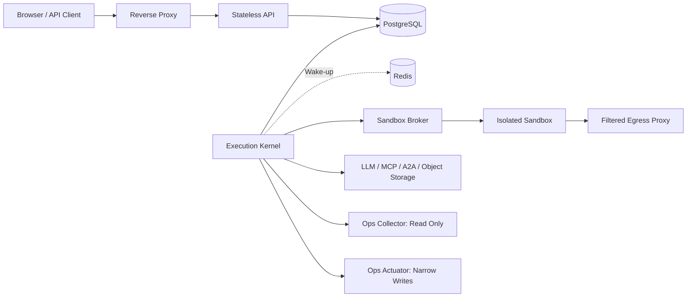

# 安全模型

[English](security-model.md)

OpenCitadel 将模型输出、上传内容、检索文本、远程 Integration 与 Sandbox Workload 全部视为
不可信。安全由强类型 Command Admission、能力收窄、持久审批、数据库隔离、沙箱边界和可验证
证据共同执行。

## 信任边界

```mermaid
flowchart LR
  User[Browser / API Client] --> Proxy[Reverse Proxy]
  Proxy --> API[Stateless API]
  API --> PG[(PostgreSQL)]
  Kernel[Execution Kernel] --> PG
  Kernel -. Wake-up .-> Redis[(Redis)]
  Kernel --> Broker[Sandbox Broker]
  Broker --> Sandbox[Isolated Sandbox]
  Sandbox --> Egress[Filtered Egress Proxy]
  Kernel --> Providers[LLM / MCP / A2A / Object Storage]
  Kernel --> Collector[Ops Collector: Read Only]
  Kernel --> Actuator[Ops Actuator: Narrow Writes]
```

- 只有 Reverse Proxy 对公网开放。API、Kernel Metrics、PostgreSQL、Redis、对象存储、
  Broker、Sandbox、Collector 与 Actuator 均在内网。
- API 接收身份与 Command，但不执行工作流步骤。
- 执行内核使用独立数据库角色调用 Provider。
- Agent 代码、Shell、文件与 Chromium 在沙箱隔离内执行。
- Compose 中只有 Broker 能访问 Docker Socket。

## 身份、授权与租户隔离

Session JWT 与 Service API Key 解析为 `Principal`。Workspace 选择形成不可变
`AuthorizationContext` 与 `OwnerScope`。个人与团队资源是互斥 Scope。应用仓储按 Scope
过滤，事务级 PostgreSQL Setting 通过 FORCE RLS 提供第二道边界。

运行时数据库用户不是 Superuser，不能 Bypass RLS。Owner Scope 表同时启用
`ENABLE ROW LEVEL SECURITY` 与 `FORCE ROW LEVEL SECURITY`；覆盖
`inference_bindings`、执行表和产品资源表。FORCE RLS 现在还覆盖身份、租户与审计表，
即使应用角色绕过 ORM 过滤也无法跨租户读取：`users`、`teams`、`team_members`、
`invitations`、`oauth_identities`、`refresh_tokens` 与 `audit_logs`。身份所属行
（`refresh_tokens`、`oauth_identities`）只对其 `owner_user_id` 可见；`users`/`teams`
要求调用方为该行或已接受的成员。`audit_logs` 仅对 system/admin/auditor 上下文授予
`SELECT`，且不允许 `UPDATE`/`DELETE`，因此追加式约束由数据库本身而非仅应用代码强制。
Migration Role 负责 Schema；API 与执行内核只有所需 DML。Owner Scope 执行行创建时冻结
Personal/Team 所有权。Event Store 还会把每次 Append Context 与现有 Stream 比较，即使系统
授权的内核工作 Scope 不匹配也会拒绝。

`AUDITOR` 全局角色只读。Admin 可管理全局资源，但全局权限不会让 Personal/Team Event Stream 失去 Owner。

认证 Cookie 在未配置 Cookie `Domain` 时使用 `__Host-` 前缀（Secure、`Path=/`、无
`Domain`），子域无法设置或覆盖。OAuth 登录只接受 Provider 已验证的主邮箱，且不会把已验证
Provider 身份静默关联到已存在的密码账号。认证端点拥有独立于通用限流的 Rate-Limit Bucket，
连续失败会锁定账号一段冷却期；生产环境限流 Fail Closed。

## 执行完整性

每个已接受 Command 都有唯一 ID 与持久结果。每个执行 Event 都有单调 Stream Version、
Previous Hash 与 Current Hash。回放验证完整 Hash Chain，或验证 Snapshot 后再验证 Tail。
无效 Snapshot 会被删除并重新回放；Event Tamper 会停止执行。

Provider 调用前，Activity Request 先持久化 Input Reference/Digest、Policy、Timeout、
Claim Generation 与 call-start。过期 Claim Generation 不能报告完成。非幂等外部写若调用后
结果不确定，会进入显式 Unknown-Outcome 处理，不自动重复。

正式投影可重建，不能追加事实。SSE 读取脱敏公开投影；私有输入、Provider 原始 Body、Secret
与内部 Event Metadata 不进入浏览器 Stream。

## 工具与审批 Policy

工具暴露取以下条件交集：

1. 平台注册能力；
2. 认证角色与 OwnerScope；
3. Run Mode 与 Operator Domain；
4. 已选 Skill Allowlist 与 Integration Reference；
5. `ToolExecutionPolicy` 的 Effect、Idempotency、Approval Mode。

外部调用 Intent 与 Policy Snapshot 先持久化再判断。需要审批的调用创建持久 Approval Batch
并等待。审批只通过专用 Endpoint 与 Command；Prompt、聊天消息与模型输出不能批准 Invocation。
一次批准只授权冻结的 Invocation 集合与参数。

Ops Collector 只暴露固定注册读取。Ops Actuator 只提供闭合集合、Namespace/Workload Scope
变更，并使用独立 RBAC 与 NetworkPolicy。两个 MCP Server 的 streamable-http 端点都要求
Bearer Token（`OPS_COLLECTOR_TOKEN` / `OPS_ACTUATOR_TOKEN`）；缺少强 Token 时拒绝启动，
调用方未携带 `Authorization: Bearer <token>` 一律拒绝，连只读侦察也被拦截。其 Kubernetes
RBAC 是按允许 Namespace 渲染的 Namespaced `Role`/`RoleBinding`，而非集群级 `ClusterRole`。
模型不能构造任意 Kubernetes Request。

## 沙箱与出站访问

Docker/Kubernetes 沙箱在支持时使用 Non-Root、Drop Capability、资源/PID 上限、受控可写 Mount
与策略化 Egress。Attachment 与固定资源版本在 Mount 前完成 Admission。Path 规范化后不能逃逸
Session Workspace。

沙箱数据面 Bearer Token 无状态派生为 `HMAC(SANDBOX_TOKEN_SEED, sandbox_id)`。API 与执行
内核用同一部署级 Seed 计算相同值，任何副本重新附着到运行中的沙箱都无需共享 Token 状态；
Seed 本身绝不注入不可信沙箱容器。沙箱侧以恒定时间比较 Token，缺 Seed 时拒绝启动。Egress
被限制到一个默认拒绝、按域名 Allowlist 的 Squid 正向代理（Compose 服务与 Helm
`egress-proxy` Deployment），Kubernetes NetworkPolicy 只允许沙箱出站到该代理。

出站 HTTP 校验 Scheme、Hostname、DNS/IP、Private Network 与 Port；DNS 解析使用异步
`getaddrinfo`，不阻塞事件循环，Private Network 守卫还会拦截 NAT64 映射段
（`64:ff9b::/96`），防止用 IPv6 地址夹带私网 IPv4 目标。Private Host 必须精确 Allowlist；
Redirect 重新校验。MCP/A2A Server 是 Owner Scope 资源，Skill 只能引用可访问且 Enabled 的
Server。

## Secret

- 部署 Secret 存在环境变量/Secret Manager，不进入 Runtime Policy Revision 或 UI Event Payload。
- 推理 Endpoint 与 Integration Secret 使用 `API_KEY_SECRET` 加密为版本化
  `v2.<key-id>...` 信封。
- `API_KEY_PREVIOUS_SECRETS` 支持版本化信封的计划轮换。
- Audit Signature 使用独立的 `AUDIT_SIGNING_KEY` Active/Previous Signing-Key Ring。
- Session JWT 使用 `JWT_SECRET` 签名；`JWT_PREVIOUS_SECRETS` 在轮换窗口内保留已退役
  密钥用于验证，不使在途 Token 失效。
- 数据库授权 HMAC（RLS 策略校验的 `app.auth_signature` GUC）可通过
  `DATABASE_AUTHORIZATION_SIGNING_SECRET` 与 Starlette Session Cookie 信任域拆分；未设置
  时回退 `SESSION_SECRET`（现有部署不变），独立配置时必须强且互不相同。
- API Response 屏蔽存量 Secret；Blank/Masked Update 不会误覆盖凭据。
- Log、Metric、Audit Metadata、Public Event 与 Evidence Package 均脱敏凭据。

## 审计与证据

Audit Row 形成签名 Hash Chain。Chain 按租户（Team/Owner Scope）分片：每个分片在各自的
Advisory Lock 与序列下推进，不同租户的并发写者不会在单个全局锁上串行化，也不会交织进同一条
链。合规验证独立遍历每个分片。治理投影报告 Run 状态、Approval Request/Decision、Activity
Failure、Policy Denial、Resource Binding 与 Chain Verification。Evidence Package 包含脱敏、
有 Manifest 与 Digest 的文件。运行时角色只能追加 Audit 与执行 Event；`audit_logs`、
`execution_events` 与类型化 Policy Revision 表的 `UPDATE`/`DELETE` 由数据库不可变触发器拒绝，
而不仅靠角色授权。

## 网络暴露

| Surface | 所需暴露 |
| --- | --- |
| Reverse Proxy | 公网 HTTP/HTTPS |
| API/UI | Proxy 后内网 |
| PostgreSQL/Redis/Object Storage | 仅内网 |
| Execution-Kernel Metrics | 仅内网抓取 |
| Sandbox Broker/Sandbox | 仅 API/Kernel 私网 |
| Ops Collector/Actuator | 仅 API/Kernel；Actuator 默认关闭 |
| 远程 LLM/MCP/A2A | 显式 Outbound Policy 与 TLS |

Reverse Proxy 在每个响应上设置加固响应头（HTTPS 上 `Strict-Transport-Security`、
`X-Content-Type-Options: nosniff`、`Referrer-Policy: strict-origin-when-cross-origin`，
以及带 `frame-ancestors 'none'` 与 `object-src 'none'` 的 `Content-Security-Policy`），并以
`server_tokens off` 运行。分享的 Artifact HTML 在该 CSP 下由独立沙箱化 Origin 提供。

生产必须启用 NetworkPolicy、强 Redis 认证、Secure Cookie、精确 Trusted Proxy CIDR 与独立
数据库凭据。生产环境 `TRUSTED_PROXY_CIDRS` 在启动时校验，拒绝与沙箱/Pod 网络重叠的宽私网
段——信任它们会让被攻陷的沙箱伪造 `X-Forwarded-For`。Hash、RLS、OwnerScope、Signature 或
Secret 解密错误一律关闭失败。

认证中间件只允许受控 CORS 预检 `OPTIONS`、生命周期探针 `/api/health/live` 与
`/api/health/ready`，以及依赖诊断 `/api/status` 无用户会话访问。
`METRICS_TOKEN` 为空时 `/api/metrics` 关闭，配置后必须携带对应 Bearer Token；执行内核
Metrics 只使用内网抓取端口。
