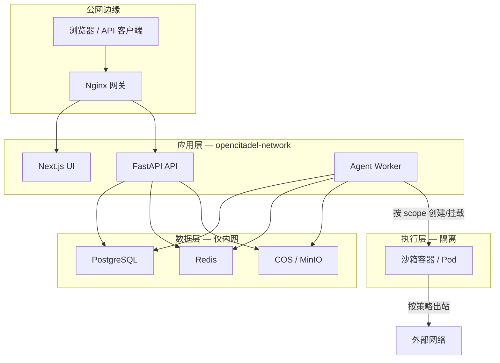
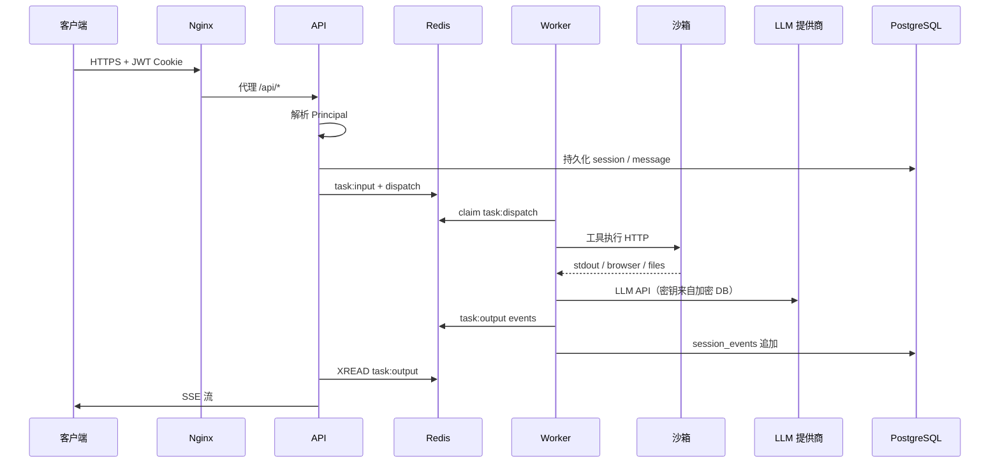
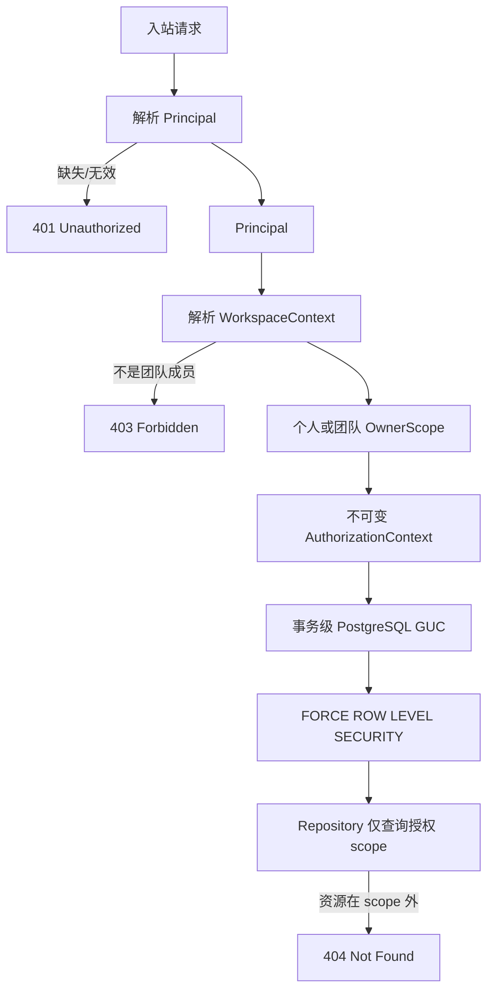
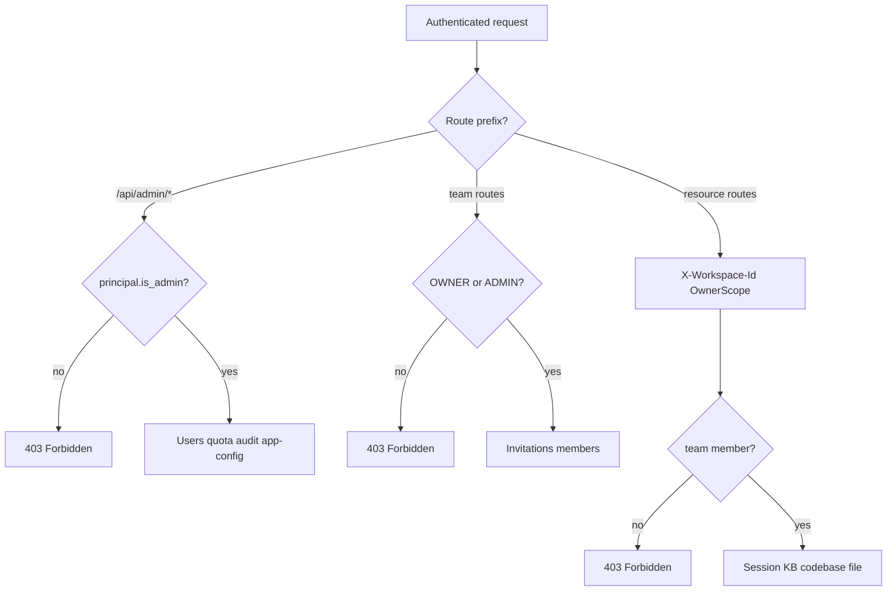

[English](security-model.md)

# OpenCitadel 安全模型

本文档描述 OpenCitadel 的安全边界：沙箱隔离、数据流、认证与授权。与 [生产部署](../operations/deployment.zh-CN.md) 中的运维加固，以及 [overview.zh-CN.md](overview.zh-CN.md) 中的网络拓扑互为补充。

## 信任边界


```mermaid
flowchart TB
  subgraph public ["公网边缘"]
    Browser["浏览器 / API 客户端"]
    Nginx["Nginx 网关"]
  end
  subgraph app ["应用层 — opencitadel-network"]
    UI["Next.js UI"]
    API["FastAPI API"]
    Worker["Agent Worker"]
  end
  subgraph data ["数据层 — 仅内网"]
    PG["PostgreSQL"]
    Redis["Redis"]
    Storage["COS / MinIO"]
  end
  subgraph exec ["执行层 — 隔离"]
    Sandbox["沙箱容器 / Pod"]
  end
  Browser --> Nginx
  Nginx --> UI
  Nginx --> API
  API --> PG
  API --> Redis
  API --> Storage
  Worker --> PG
  Worker --> Redis
  Worker --> Storage
  Worker -->|"按 scope 创建/挂载"| Sandbox
  Sandbox -->|"按策略出站"| Internet["外部网络"]
```

**原则**

1. 仅 Nginx 向宿主机暴露 HTTP/HTTPS 端口。
2. PostgreSQL、Redis、API、Worker、UI 在内部 Docker 网络（`opencitadel-network`）或集群 NetworkPolicy 内通信。
3. Agent 代码、Shell 命令、浏览器自动化在沙箱内运行——不在 API/Worker 进程中执行。
4. 密钥不得出现在日志中；LLM 提供商 Key 在存储层加密。

---

## 沙箱隔离

### 沙箱内运行什么

每个 Agent 会话（或池化实例）获得独立运行时，包含：

- Ubuntu 22.04 基础镜像，Python、Node.js
- Chromium（浏览器运行时，位于沙箱内）
- Xvfb + x11vnc + websockify（可选 VNC 观测）
- FastAPI 侧车（`sandbox/`），通过 HTTP 向 Worker 暴露 shell、文件、浏览器工具

Worker 编排沙箱，并通过 **Worker 进程内的 Playwright** 经 CDP 连接沙箱内 Chromium 驱动浏览器自动化。面向用户的工具（shell、browser、文件 I/O）在**沙箱边界内**执行。

### 隔离机制

| 层级 | 机制 | 说明 |
|------|------|------|
| **进程** | 每个沙箱独立容器或 K8s Pod | 不与 API/Worker 同进程 |
| **网络** | Docker 内部网络 + 双网卡 Squid 出口 / K8s NetworkPolicy | 不可直连 PostgreSQL/Redis；目标 ACL 排除私网与元数据网段 |
| **资源** | `memory_limit`、CPU 份额、TTL / 空闲超时 | 防止资源失控 |
| **准入** | `SandboxQuota` + 宿主机内存探测 | Redis 不可用时 fail-closed；任务排队而非超配 |
| **生命周期** | 空闲回收、低内存回收、孤儿清理 | 通过 Redis lease 单活协调 |
| **权限** | UID 1000、drop 全部 capability、只读根文件系统、no-new-privileges | 由运行时策略强制执行 |

### 沙箱 Driver

| Driver | 隔离面 | Worker 权限 |
|--------|--------|-------------|
| **Docker**（Compose） | 内部沙箱网络 + 过滤正向代理 | API/Worker 调用 Token 认证 broker；仅 broker 挂载 `docker.sock` |
| **Kubernetes**（Helm） | 命名空间内 Pod + ResourceQuota | ServiceAccount 具备 pods create/delete/list — **无需** `docker.sock` |
| **远程网关** | 外部执行服务 | Worker 仅调用 HTTP API；不使用本地容器 API |

### 加固建议

默认沙箱运行时已强制执行以下基线：

```yaml
# docker-compose.yml — sandbox 服务或模板
security_opt:
  - no-new-privileges:true
cap_drop:
  - ALL
mem_limit: 1g
memswap_limit: 1g
pids_limit: 512
read_only: true
user: "1000:1000"
```

额外企业级控制：

- 按组织策略配置 AppArmor / seccomp
- 保持 `networkPolicy.enabled=true`；域名级 allowlist 应接入出站代理
- 不可信多租户部署中禁用 VNC
- 共享主机上保持较短的 `sandbox.ttl_minutes` 与 `idle_timeout_minutes`

准入状态机与配额键见 [overview.zh-CN.md](overview.zh-CN.md)。

---

## 数据流

### 请求与任务路径


```mermaid
sequenceDiagram
  participant C as 客户端
  participant N as Nginx
  participant A as API
  participant R as Redis
  participant W as Worker
  participant S as 沙箱
  participant L as LLM 提供商
  participant D as PostgreSQL

  C->>N: HTTPS + JWT Cookie
  N->>A: 代理 /api/*
  A->>A: 解析 Principal
  A->>D: 持久化 session / message
  A->>R: task:input + dispatch
  W->>R: claim task:dispatch
  W->>S: 工具执行 HTTP
  S-->>W: stdout / browser / files
  W->>L: LLM API（密钥来自加密 DB）
  W->>R: task:output events
  W->>D: session_events 追加
  A->>R: XREAD task:output
  A->>C: SSE 流
```

### 数据分类

| 数据 | 存储 | 加密 | 作用域 |
|------|------|------|--------|
| 用户凭证 | PostgreSQL（`users`） | bcrypt 密码哈希 | 按用户 |
| JWT access / refresh | HTTP-only Cookie | `JWT_SECRET` 签名 | 按会话 |
| LLM API Key | PostgreSQL（`llm_endpoints`） | Fernet（`fernet_v1`），`API_KEY_SECRET` | 按端点（同端点下多模型共享） |
| Service API Key | PostgreSQL（哈希） | SHA-256 静态哈希 | 按 Key，映射 owner |
| 会话消息与事件 | PostgreSQL + Redis Streams | 启用 HTTPS 时传输层 TLS | 个人或团队工作区 |
| 上传文件 / 截图 | 对象存储（COS/MinIO） | 提供商或桶策略 | Key 存 DB |
| 长期记忆 | PostgreSQL（+ pgvector） | 同 DB | 全局或会话 |
| MCP / A2A 流量 | Worker 出站 | 远程服务器 TLS | 按 server 配置 |

### 对象存储

- PostgreSQL **仅存储 object key**，不存文件字节。
- API 与 Worker 共用同一存储抽象；切换后端需对象迁移（`python -m app.migrate_storage`）。
- 可选 `MINIO_PUBLIC_ENDPOINT` 向 LLM 暴露预签名/公开 URL 用于视觉；否则图片以 base64 内联（无额外公网 URL）。

### 代码库源码与版本安全

代码库分析把源码材料视为不可变、可版本化的证据，而不是可变沙箱状态。

- 创建源码任务前先校验参数形状与文件归属。
- ZIP 导入拒绝绝对路径、`..`、符号链接、过多 entry、过大解压体积和异常压缩比。
- Git 导入仅允许 HTTPS，拒绝凭据和非默认端口，并拒绝任何解析到私有、
  loopback、link-local、多播或 metadata 地址的目标。
- 每次导入/重建都物化到干净临时工作区，然后把内容寻址源码 snapshot
  存入对象存储。
- 已发布版本不可变。会话绑定明确的 `codebase_version_id`；即使新版本发布，
  源码读取与 Agent 工作区恢复也使用该绑定 snapshot。
- 重建发布使用基于前一个 active version 的 compare-and-swap。失败保留当前
  active analysis，而不是清空共享行。
- Lexical search 是强制能力。Vector search 可降级，必须回退到 lexical 结果并
  返回可见 `degraded_reasons`。
- 静态分析图事实必须带 `EvidenceRef`。不支持的图会被省略并记录 unsupported
  reason，而不是用通用模板渲染。
- Version GC 保护 active versions、历史 session bindings 和 queued/running
  builds。snapshot object 只有在数据库里最后一个引用被回收后才会删除。

### 可观测性

- `/api/metrics` 暴露 Prometheus 指标（不含密钥）。
- 可选 OpenTelemetry 导出——单独配置 collector 访问。
- 结构化日志含 `session_id` 便于关联；不得记录 API Key 与 Token。

---

## 认证与授权

### 认证方式

| 方式 | Header / Cookie | 场景 |
|------|-----------------|------|
| **Session JWT** | `access_token` Cookie（HTTP-only） | 浏览器 UI 与已认证 REST |
| **Refresh Token** | `refresh_token` Cookie | 静默续期 access token |
| **Service API Key** | `X-Api-Key` | 自动化、集成（`require_service_api_key`） |
| **CSRF Token** | 浏览器状态变更请求校验 | Cookie 会话防护 |

JWT Claims（access token）：`sub`（用户 id）、`role`（全局角色）、`ver`（token 版本）、`typ`、`iss`、`exp`。

吊销：递增用户记录的 `token_version` 可使所有未过期 refresh token 失效。

### 授权模型


```mermaid
flowchart TD
  Request["入站请求"] --> AuthN["解析 Principal"]
  AuthN -->|"缺失/无效"| Deny401["401 Unauthorized"]
  AuthN --> Principal["Principal"]
  Principal --> Workspace["解析 WorkspaceContext"]
  Workspace -->|"不是团队成员"| Deny403["403 Forbidden"]
  Workspace --> Scope["个人或团队 OwnerScope"]
  Scope --> Authz["不可变 AuthorizationContext"]
  Authz --> GUC["事务级 PostgreSQL GUC"]
  GUC --> RLS["FORCE ROW LEVEL SECURITY"]
  RLS --> Resource["Repository 仅查询授权 scope"]
  Resource -->|"资源在 scope 外"| Deny404["404 Not Found"]
```

每个已认证请求先解析 `Principal`，再得到 `WorkspaceContext` 与
`OwnerScope`，并复制到不可变的 `AuthorizationContext`。每个 SQLAlchemy
事务在访问 Repository 前，通过事务级 `set_config(..., true)` 绑定
`app.auth_mode`、`app.user_id`、`app.team_id`、`app.is_admin`、
`app.request_id` 与 `app.system_actor`。租户表启用并强制
**FORCE ROW LEVEL SECURITY**，Repository 条件与 PostgreSQL 策略形成两道
独立授权边界。后台任务和迁移必须声明具名 system actor；匿名上下文不会
隐式绕过授权。

**全局角色**

| 角色 | 能力 |
|------|------|
| `USER` | 自有会话、个人资源、作为成员的团队资源 |
| `AUDITOR` | 只读访问管理/合规证据；默认拒绝所有已认证写操作 |
| `ADMIN` | 平台管理路由、用户管理、全局配置与全局资源变更 |

`AUDITOR` 同时在已认证 Router 与服务 Key 边界强制只读：除 `GET`、
`HEAD`、`OPTIONS` 外的方法均被拒绝，审计员账号拥有的服务 API Key
也不能执行 A2A 操作。

**工作区作用域**

- 默认：个人 scope（`OwnerScope.personal(user_id)`）。
- 团队资源：客户端发送 `X-Workspace-Id`；服务端校验 `principal.team_roles` 成员关系。
- 非团队成员返回 403；已授权 scope 外的资源查询通常返回 404，避免泄露
  对象是否存在。

| 资源可见性 | 读取范围 | 变更权限 |
|-----------|---------|---------|
| 个人 | 所有者本人 | 非审计员的所有者本人 |
| 团队 | 已验证团队成员 | scope 内非审计员成员；团队管理仍要求团队 `OWNER` / `ADMIN` |
| 全局 LLM 端点/模型、Skill、MCP、A2A 服务 | 路由允许的已认证用户 | 仅平台 `ADMIN` |

全局模型行属于目录/控制面对象。个人或团队工作区选择默认模型时写入
`llm_model_preferences` 的作用域记录，不会修改全局 `llm_models` 行。

### 平台 Admin 与团队 Admin

OpenCitadel 采用**双层授权**：平台级 `ADMIN` 全局角色与团队内 `OWNER` / `ADMIN` 角色相互独立。


```mermaid
flowchart TD
  Request["Authenticated request"] --> Route{"Route prefix?"}
  Route -->|"/api/admin/*"| PlatformAdmin{"principal.is_admin?"}
  PlatformAdmin -->|"no"| Deny403A["403 Forbidden"]
  PlatformAdmin -->|"yes"| AdminOps["Users quota audit app-config"]
  Route -->|"team routes"| TeamAdmin{"OWNER or ADMIN?"}
  TeamAdmin -->|"no"| Deny403B["403 Forbidden"]
  TeamAdmin -->|"yes"| TeamOps["Invitations members"]
  Route -->|"resource routes"| Workspace["X-Workspace-Id OwnerScope"]
  Workspace --> Member{"team member?"}
  Member -->|"no"| Deny403C["403 Forbidden"]
  Member -->|"yes"| ResourceAccess["Session KB codebase file"]
```

| 层级 | 角色 | 典型能力 | 实现 |
|------|------|----------|------|
| 平台 | `ADMIN`（`global_role`） | `/api/admin/*`、全局 LLM 默认模型、`app-config` 写入 | `require_admin` |
| 团队 | `OWNER` / `ADMIN` | 创建邀请、管理成员 | `TeamService._require_team_admin` |
| 工作区 | 任意成员 | 访问团队 scope 下的会话、KB、代码库 | `OwnerScope` + `X-Workspace-Id` |

团队创建者默认为 `OWNER`；普通成员可访问团队资源但无法管理邀请。

### 交付物与可信分发

- 私有交付物路由需 `WorkspaceContext` scope：list/get/content/share 均通过 `OwnerScope` 校验会话归属。
- 跨 scope 访问返回 **404**（不泄露存在性）。
- 生命周期：`artifact_write` → 对象存储上传 → `ArtifactEvent` 推送工作台 → `artifact_finalize` → 可选分享 token（`/share/artifact/{token}`）。
- HTML 交付物在预览前经服务端消毒（移除 `<script>` 与内联事件处理器）。
- UI 在 iframe 中使用 `sandbox="allow-scripts"`，**不含** `allow-same-origin`（防止同源脚本升级）。

详见 [检查点与 HITL — 交付物](checkpoints-and-hitl.zh-CN.md#交付物相关)。

### Webhook 自动化

- `POST /api/webhooks/{token}` 需要 `X-Webhook-Signature: HMAC-SHA256(body, webhook_secret)`。
- Webhook 密钥 Fernet 加密存储（`API_KEY_SECRET`）；创建/轮换时仅展示一次明文。
- 幂等键按 job token 隔离：`webhook:idem:{token}:{sha256(body)}`。

### 限流与 CORS

在 `api/config.yaml` 配置：

```yaml
server:
  cors_origins: https://your-domain.com   # 生产环境应限制
  rate_limit_enabled: true
  rate_limit_per_minute: 120
```

限流覆盖 `/api/` 下所有业务路径，仅豁免 `/api/status`、
`/api/metrics` 与 `OPTIONS` 预检请求。每个请求消耗一个 IP bucket，
并为每个出现的 access cookie、refresh cookie、`X-Api-Key` 分别消耗
credential bucket；凭证只保存 SHA-256 指纹，Redis key 中不存原始
Token。生产环境的 Redis 限流器不可用时会 fail closed，返回 `503` 与
`Retry-After`。

### 密钥管理

| 密钥 | 环境变量 | 轮换说明 |
|------|----------|----------|
| LLM Key 加密 | `API_KEY_SECRET`、`API_KEY_SECRET_ID`、`API_KEY_PREVIOUS_SECRETS` | 带版本的 `fernet_v2` 密钥环与幂等迁移 |
| 审计 HMAC 签名 | `AUDIT_SIGNING_KEY`、`AUDIT_SIGNING_KEY_ID`、`AUDIT_PREVIOUS_SIGNING_KEYS` | 在保留/回滚窗口关闭前保留历史验证 Key |
| JWT 签名 | `JWT_SECRET` | 使所有会话失效 |
| Session / Cookie | `SESSION_SECRET` | 使 Cookie 会话失效 |
| 沙箱 Broker | `SANDBOX_BROKER_TOKEN` | API、Worker 与 Broker 同步轮换 |
| DB / Redis / 存储 | `POSTGRES_*`、`REDIS_*`、`COS_*`、`MINIO_*` | 更新 `.env` 后重启服务 |

生产检查清单：

```bash
openssl rand -hex 32   # 为各密钥分别生成
chmod 600 .env api/config.yaml
USE_DB_APP_CONFIG=true
ENV=production
```

旧版明文 LLM Key（`legacy_plaintext`）在部署时由 `opencitadel-migrate` 自动加密。

**LLM 凭证加密 Key 轮换**

1. 将旧 id 与 Secret 加入 `API_KEY_PREVIOUS_SECRETS`。
2. 设置新的、唯一的 `API_KEY_SECRET` 与 `API_KEY_SECRET_ID`。
3. 重启迁移环境并运行
   `python -m app.migrate_llm_api_key_rotation`。
4. 确认所有非空端点凭证均为 `fernet_v2` 且使用新 key id。
5. 仅在验证与回滚窗口关闭后移除旧 Key。

迁移会读取 `legacy_plaintext`、`fernet_v1` 与旧 `fernet_v2` 记录，再
使用当前 key id 重写；可安全重复执行，日志只输出数量与 key id，不输出
明文凭证。

**审计完整性与签名 Key 轮换**

新审计行使用 `AUDIT_SIGNING_KEY_ID`；历史行通过
`AUDIT_PREVIOUS_SIGNING_KEYS` 校验（legacy 行还会读取 API Key 密钥环）。
轮换时保留旧签名 Key，设置新的且与其他密钥不同的
`AUDIT_SIGNING_KEY` 与 id，重启所有写入进程，并在变更前后调用
`GET /api/admin/audit/verify-chain`。只有在需要旧 Key 的保留记录均已
过期或归档后，才能移除旧验证 Key。

审计行使用单调序号的 HMAC 链，PostgreSQL Trigger 拒绝 `UPDATE` 与
`DELETE`。校验发现首个断点时会输出 critical 日志标记
`AUDIT_CHAIN_INTEGRITY_FAILURE`。这提供的是防篡改证据，不能阻止特权
数据库管理员删除表或改写备份；受监管部署仍需外部不可变/WORM 导出与
告警路由。

### CI 安全验证

- `.github/workflows/ci.yml` 运行 API/UI/沙箱/Collector 测试、六个镜像构建与
  Trivy 扫描、Compose/Helm/Kustomize/Squid 渲染及本文档检查。
- `.github/workflows/security.yml` 运行 Gitleaks 历史扫描、依赖评审与
  Lockfile 审计、CodeQL、Trivy 文件系统/IaC 扫描。
- `.github/workflows/release.yml` 构建双架构镜像，并生成 SBOM、
  provenance、摘要扫描与 Registry attestation；Actions 均固定到完整
  Commit SHA。

---

## 网络暴露摘要

| 服务 | 默认暴露 | 建议 |
|------|----------|------|
| Nginx | 宿主机 `NGINX_PORT`（8088），可选 443 | 唯一公网入口 |
| API / UI / Worker | 仅内网 | 不要 publish ports |
| PostgreSQL / Redis | 仅内网 | 切勿暴露到公网 |
| MinIO | 内网；可选 public endpoint 变量 | 除非 LLM 需拉取 URL，否则保持内网 |
| 沙箱 | 对 Worker 内网 HTTP | 不要映射宿主机端口 |
| Ops Collector | 对 API/Worker 的内网 MCP | 仅 ClusterIP；固定只读工具与注册目的地 |
| MCP / A2A 服务器 | Worker/API 出站 | 对目标做 allowlist |

---

## 相关文档

- [系统架构](overview.zh-CN.md) — 进程角色、沙箱生命周期、DI
- [生产部署](../operations/deployment.zh-CN.md) — 防火墙、备份、HTTPS
- [HTTPS 配置](../operations/https-domain-setup.zh-CN.md) — TLS 与域名绑定
- [配置来源治理](config-source-governance.zh-CN.md) — 密钥与行为配置的边界
- [Ops Patrol](ops-patrol.zh-CN.md) — Collector 信任边界、断言权威与证据
