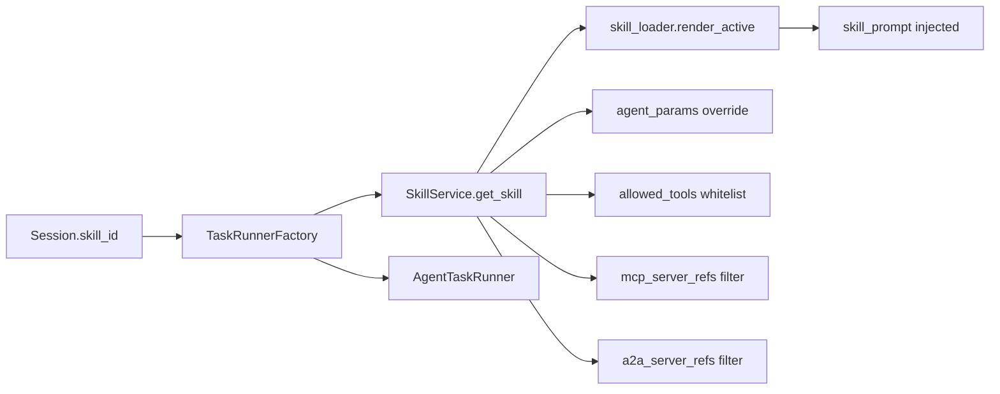

[English](skills.md) · [简体中文](skills.zh-CN.md)

# Skills

Skill templates shape Agent behavior: system prompt, allowed tools, MCP/A2A scope, temperature overrides, and HITL defaults. Skills are first-class resources bound to sessions at creation time.

## Data model

| Field | Purpose |
|-------|---------|
| `name`, `slug`, `description`, `icon`, `category` | UI display and discovery |
| `system_prompt` | Injected into Agent runtime prompt (`skill_loader.render_active`) |
| `allowed_tools` | Tool whitelist (fnmatch patterns, e.g. `browser_*`) |
| `agent_params` | Overrides: `max_iterations`, `max_retries`, `temperature_override`, `tool_gate_call_level_enabled`, `writing_style_override` |
| `mcp_server_refs` | Restrict MCP servers available to this Skill |
| `a2a_server_refs` | Restrict outbound A2A servers |
| `recommended_model_id` | Default model when session has no explicit model |
| `override_base_rules` | Replace base safety rules instead of appending |
| `is_builtin` | Seeded built-in Skill; cannot be deleted |
| `enabled` | Disabled Skills are skipped at runtime |

Built-in Skills include `coding`, `research`, `web-operator`, `refund-reconciliation`, and others — see `api/app/application/services/skill_service.py`.

## API

| Method | Path | Description |
|--------|------|-------------|
| GET | `/api/skills` | List Skills (owner scope via `X-Workspace-Id`) |
| POST | `/api/skills` | Create custom Skill |
| GET/PUT/DELETE | `/api/skills/{id}` | CRUD |
| POST | `/api/skills/recommend` | Recommend Skill from user message |
| POST | `/api/skills/import` | Import Skill from external format |

## Runtime pipeline

1. **Session bind**: home page or API sets `skill_id` on session create.
2. **Auto-recommend** (optional): when `feature_flags.enable_skill_auto_recommend=true` and session has no Skill, `SkillRecommenderService` picks one from enabled Skills in the current owner scope.
3. **TaskRunnerFactory** loads Skill, renders active prompt, applies `agent_params`, filters MCP/A2A connections, and passes `skill_prompt` to `AgentTaskRunner`.
4. **ToolRegistry** respects `allowed_tools`; Ask flows use a read-only subset regardless of Skill.
5. **Web Operator**: Skill `web-operator` triggers `operator-scope-dialog.tsx` on session create and enables stricter HITL defaults.

## UI

| Surface | Component | Path |
|---------|-----------|------|
| Settings → Skills | `SkillsSettings` | `ui/src/components/settings/skills-settings.tsx` |
| Home / session picker | model + Skill selectors | `ui/src/app/page.tsx`, `session-detail-view.tsx` |
| Web Operator scope | `OperatorScopeDialog` | `ui/src/components/operator-scope-dialog.tsx` |

## Configuration

- **Global defaults**: `api/config.yaml` → `agent_config`, HITL gates in AppConfig
- **Per-Skill overrides**: `agent_params` on Skill entity
- **Integration filtering**: `mcp_server_refs` / `a2a_server_refs` on Skill; empty = all enabled servers

## Related documentation

- [Frontend UI](frontend-ui.md) — Settings tabs and session flows
- [A2A & Service API Keys](integrations-a2a-service-keys.md) — outbound A2A filtering
- [Checkpoints & HITL](checkpoints-and-hitl.md) — gate profiles and Web Operator
- [Tutorial 4: Governed Web Operator](../tutorials/04-governed-web-operator.md)
