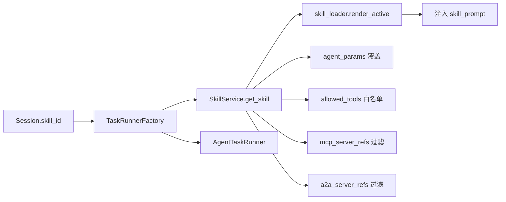

[English](skills.md) · [简体中文](skills.zh-CN.md)

# Skills

Skill 模板塑造 Agent 行为：系统提示词、允许工具、MCP/A2A 范围、温度覆盖与 HITL 默认值。Skill 是会话创建时绑定的第一类资源。

## 数据模型

| 字段 | 作用 |
|------|------|
| `name`、`slug`、`description`、`icon`、`category` | UI 展示与发现 |
| `system_prompt` | 注入 Agent 运行时提示词（`skill_loader.render_active`） |
| `allowed_tools` | 工具白名单（fnmatch 模式，如 `browser_*`） |
| `agent_params` | 覆盖项：`max_iterations`、`max_retries`、`temperature_override`、`tool_gate_call_level_enabled`、`writing_style_override` |
| `mcp_server_refs` | 限制该 Skill 可用的 MCP 服务 |
| `a2a_server_refs` | 限制出站 A2A 服务 |
| `recommended_model_id` | 会话未显式选模型时的默认模型 |
| `override_base_rules` | 替换基础安全规则而非追加 |
| `is_builtin` | 内置 Skill，不可删除 |
| `enabled` | 禁用的 Skill 在运行时被跳过 |

内置 Skill 含 `coding`、`research`、`web-operator`、`refund-reconciliation` 等 — 见 `api/app/application/services/skill_service.py`。

## API

| 方法 | 路径 | 说明 |
|------|------|------|
| GET | `/api/skills` | 列表（经 `X-Workspace-Id` 限定 owner scope） |
| POST | `/api/skills` | 创建自定义 Skill |
| GET/PUT/DELETE | `/api/skills/{id}` | CRUD |
| POST | `/api/skills/recommend` | 根据用户消息推荐 Skill |
| POST | `/api/skills/import` | 从外部格式导入 |

## 运行时链路

1. **会话绑定**：首页或 API 在创建会话时设置 `skill_id`。
2. **自动推荐**（可选）：当 `feature_flags.enable_skill_auto_recommend=true` 且会话无 Skill 时，`SkillRecommenderService` 从当前 owner scope 的启用 Skill 中选取。
3. **TaskRunnerFactory** 加载 Skill、渲染活动提示词、应用 `agent_params`、过滤 MCP/A2A 连接，并将 `skill_prompt` 传给 `AgentTaskRunner`。
4. **ToolRegistry** 遵守 `allowed_tools`；Ask 流程无论 Skill 如何均使用只读工具子集。
5. **Web Operator**：Skill `web-operator` 在创建会话时触发 `operator-scope-dialog.tsx`，并启用更严格的 HITL 默认。

## UI

| 入口 | 组件 | 路径 |
|------|------|------|
| 设置 → Skill | `SkillsSettings` | `ui/src/components/settings/skills-settings.tsx` |
| 首页 / 会话选择 | 模型 + Skill 选择器 | `ui/src/app/page.tsx`、`session-detail-view.tsx` |
| Web Operator 范围 | `OperatorScopeDialog` | `ui/src/components/operator-scope-dialog.tsx` |

## 配置

- **全局默认**：`api/config.yaml` → `agent_config`；HITL 门控在 AppConfig
- **按 Skill 覆盖**：Skill 实体上的 `agent_params`
- **集成过滤**：Skill 上的 `mcp_server_refs` / `a2a_server_refs`；为空表示所有已启用服务

## 相关文档

- [前端 UI](frontend-ui.zh-CN.md) — 设置 Tab 与会话流程
- [A2A 与服务 API Key](integrations-a2a-service-keys.zh-CN.md) — 出站 A2A 过滤
- [检查点与 HITL](checkpoints-and-hitl.zh-CN.md) — gate profile 与 Web Operator
- [教程 4：受治理 Web Operator](../tutorials/04-governed-web-operator.zh-CN.md)
