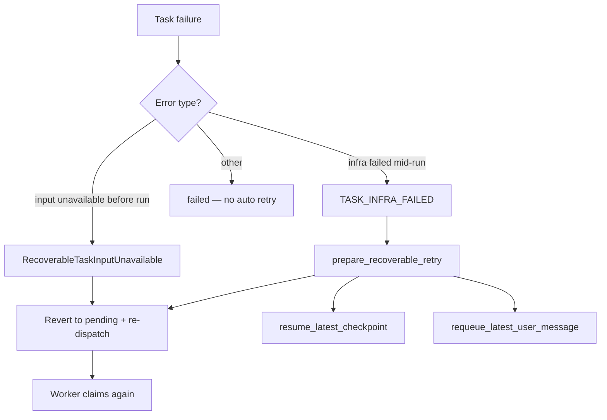
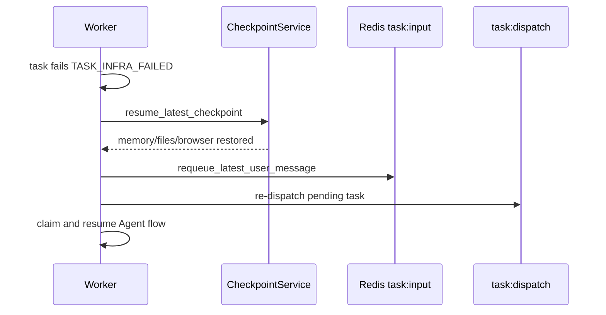

# Task Recovery and Retry

[简体中文](task-recovery.zh-CN.md)

This document describes recoverable task failures: when Workers retry, how checkpoints are restored, and how user input is requeued.

## Recovery paths overview

## RecoverableTaskInputUnavailable

Occurs when task input is not yet available in Redis before execution starts (race with API write).

- Task status reverts to `pending`
- Message stays in `task:dispatch` or is re-dispatched
- No checkpoint restore

Documented in [Architecture overview — Task status](overview.md#task-execution-status).

## TASK_INFRA_FAILED + checkpoint recovery

When a task fails with error code `TASK_INFRA_FAILED` (transient infra: sandbox, storage, network), `prepare_recoverable_retry()` in `recoverable_task_retry.py`:

1. Calls `CheckpointService.resume_latest_checkpoint(session_id)` if a checkpoint exists
2. Sets session status back to `RUNNING`
3. Requeues the latest user `MessageEvent` into `task:input` if the stream is empty
4. Worker picks up a new dispatch attempt

## DLQ replay (optional)

When enabled, Worker runs `_dlq_replay_loop` to replay dead-lettered dispatch messages after cooldown. This is separate from per-session checkpoint recovery.

## User-initiated checkpoint restore

Distinct from automatic infra retry:

- User triggers `POST /api/sessions/{session_id}/checkpoints/{checkpoint_id}/restore`
- Restores memory, workspace files, optional browser profile tarball
- Does not automatically re-run the Agent unless the user sends a new message

See [Checkpoints & HITL](checkpoints-and-hitl.md).

## Boundaries (non-recoverable)

| Scenario | Behavior |
|----------|----------|
| Model unavailable (all fallbacks exhausted) | `failed`, SSE `error` with `MODEL_UNAVAILABLE` |
| User cancel | `cancelled` |
| Lease conflict (duplicate Worker claim) | Ack dispatch, skip — no status change |
| Non-recoverable agent logic error | `failed` |
| KB ingest — all documents fail parse | `NonRecoverableIngestError` → `fast_fail`, KB `FAILED`, no auto retry |
| KB ingest — stuck/orphan task | `_reconcile_stuck_kb_ingests()` → `_finalize_kb_ingest_failure()` |

## Ingestion task recovery (distinct from agent retry)

KB and codebase ingest tasks use synthetic session ids (`kb-ingest:*`, `codebase-ingest:*`). They do **not** use checkpoint restore or user message requeue.

| Task type | Recoverable? | Mechanism |
|-----------|--------------|-----------|
| `kb_ingest` parse-all-failed | No | `NonRecoverableIngestError` (`DOCUMENT_PARSE_FAILED`) |
| `kb_ingest` transient failure | Partial | Generic exception may trigger agent-style retry; if task ends `failed`, `_finalize_kb_ingest_failure()` |
| `kb_ingest` stuck (no heartbeat, no lease) | N/A | Periodic reconcile marks task failed and finalizes KB |
| `codebase_ingest` | Similar | Sandbox/embedding failures may degrade vectors; see [Codebase reindex](codebase-reindex.md) |
| `agent` chat | Yes | `RecoverableTaskInputUnavailable`, `TASK_INFRA_FAILED` + checkpoint |

See [Knowledge base ingestion](knowledge-base-ingestion.md) for OCR LLM resolution and pipeline stages.

## Tests

- `api/tests/app/infrastructure/external/task/test_recoverable_retry.py`
- `api/tests/app/domain/services/flows/test_planner_react_failed_resume.py`

## Related documentation

- [Architecture overview](overview.md)
- [Events — error codes](events.md)
- [Knowledge base ingestion](knowledge-base-ingestion.md)
- [Model resilience](model-resilience.md)
