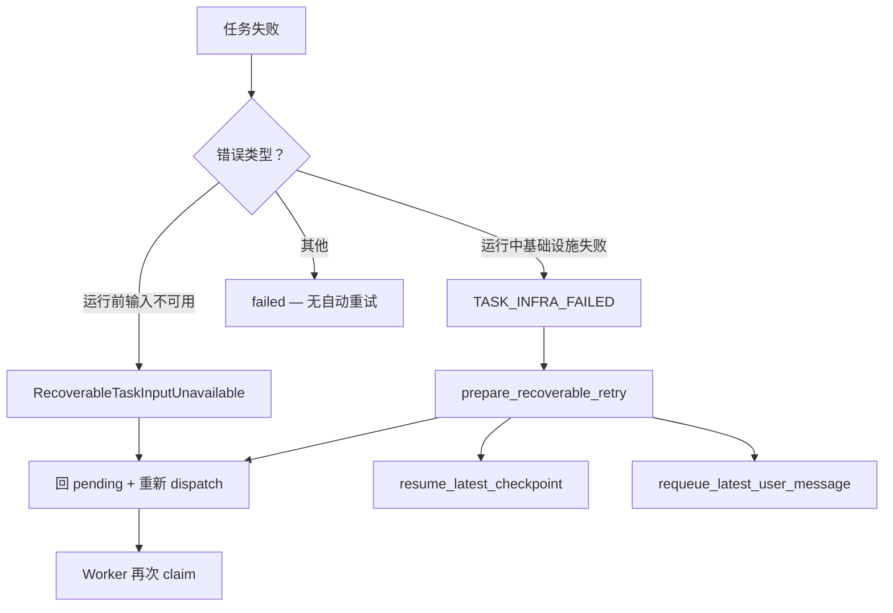
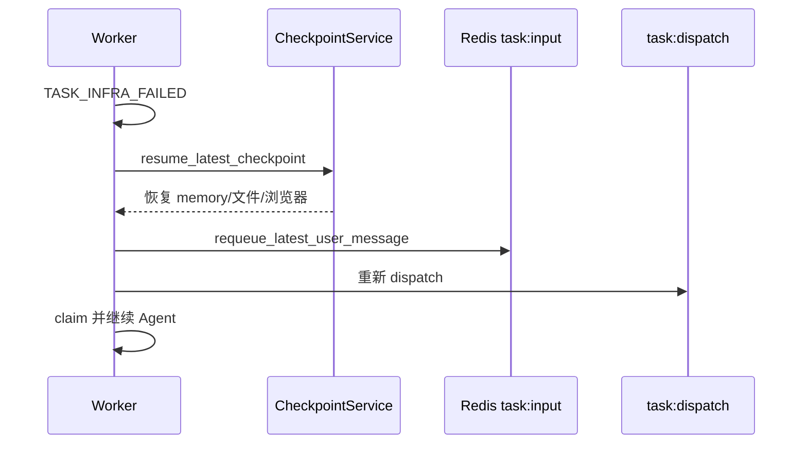

[English](task-recovery.md)

# 任务恢复与重试

本文档说明可恢复的任务失败：Worker 何时重试、检查点如何恢复、用户输入如何重新入队。

## 恢复路径概览

## RecoverableTaskInputUnavailable

任务开始执行前 Redis 中尚无输入（与 API 写入竞态）。

- 任务状态回 `pending`
- 消息保留在 `task:dispatch` 或重新 dispatch
- 不恢复检查点

见 [架构总览 — 任务状态](overview.zh-CN.md#任务执行状态)。

## TASK_INFRA_FAILED + 检查点恢复

任务以 `TASK_INFRA_FAILED` 失败（沙箱、存储、网络等瞬时故障）时，`recoverable_task_retry.py` 中 `prepare_recoverable_retry()`：

1. 若存在检查点，调用 `CheckpointService.resume_latest_checkpoint(session_id)`
2. 将会话状态设回 `RUNNING`
3. 若 `task:input` 为空，将最新用户 `MessageEvent` 重新入队
4. Worker 再次 claim 并恢复 Agent 流程

## DLQ 回放（可选）

启用时 Worker 运行 `_dlq_replay_loop`，在冷却后对死信 dispatch 消息回放。与会话级检查点恢复独立。

## 用户主动检查点恢复

与自动基础设施重试不同：

- 用户调用 `POST /api/sessions/{session_id}/checkpoints/{checkpoint_id}/restore`
- 恢复 memory、工作区文件、可选浏览器 Profile 包
- 除非用户发送新消息，否则不会自动重跑 Agent

见 [检查点与 HITL](checkpoints-and-hitl.zh-CN.md)。

## 边界（不可恢复）

| 场景 | 行为 |
|------|------|
| 模型不可用（回退耗尽） | `failed`，SSE `error` + `MODEL_UNAVAILABLE` |
| 用户取消 | `cancelled` |
| 租约冲突（重复 claim） | ack dispatch，跳过 — 不改状态 |
| 不可恢复的逻辑错误 | `failed` |
| KB 摄取 — 全部文档解析失败 | `NonRecoverableIngestError` → `fast_fail`，KB `FAILED`，不自动重试 |
| KB 摄取 — 卡住/孤儿任务 | `_reconcile_stuck_kb_ingests()` → `_finalize_kb_ingest_failure()` |

## 摄取任务恢复（与 Agent 重试区分）

KB 与 Codebase 摄取使用合成 session id（`kb-ingest:*`、`codebase-ingest:*`），**不**使用检查点恢复或用户消息重入队。

| 任务类型 | 可恢复？ | 机制 |
|----------|----------|------|
| `kb_ingest` 全部解析失败 | 否 | `NonRecoverableIngestError`（`DOCUMENT_PARSE_FAILED`） |
| `kb_ingest` 瞬态失败 | 部分 | 通用异常可能触发 Agent 式重试；任务终态 `failed` 时 `_finalize_kb_ingest_failure()` |
| `kb_ingest` 卡住（无心跳、无租约） | N/A | 周期对账标记任务失败并 finalize KB |
| `codebase_ingest` | 类似 | 沙箱/embedding 失败可降级向量；见 [Codebase 重新索引](codebase-reindex.zh-CN.md) |
| `agent` 聊天 | 是 | `RecoverableTaskInputUnavailable`、`TASK_INFRA_FAILED` + 检查点 |

见 [知识库摄取](knowledge-base-ingestion.zh-CN.md) 了解 OCR LLM 与流水线阶段。

## 测试

- `api/tests/app/infrastructure/external/task/test_recoverable_retry.py`
- `api/tests/app/domain/services/flows/test_planner_react_failed_resume.py`

## 相关文档

- [架构总览](overview.zh-CN.md)
- [Events — 错误码](events.zh-CN.md)
- [知识库摄取](knowledge-base-ingestion.zh-CN.md)
- [模型韧性](model-resilience.zh-CN.md)
