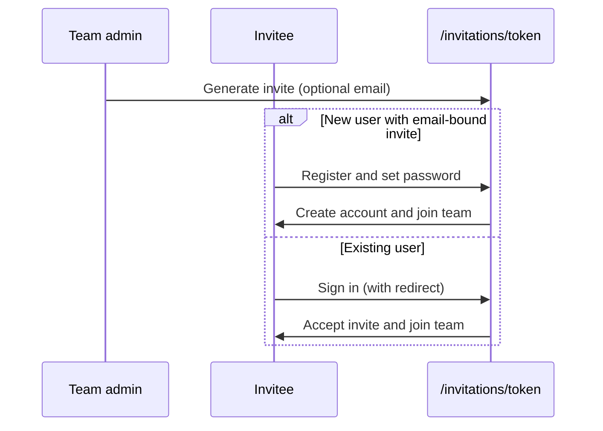
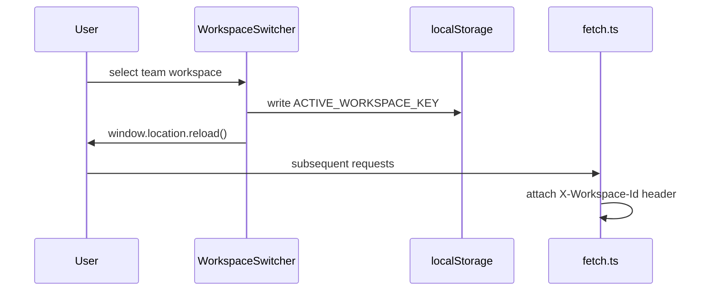
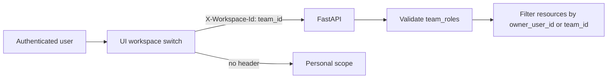

[English](teams-and-workspaces.md) · [简体中文](teams-and-workspaces.zh-CN.md)

# Teams and Workspaces

Multi-user collaboration via team workspaces. Resources (sessions, codebases, knowledge bases, artifacts) can be owned by a user or scoped to a team.

## UI entry

- **Teams list**: `/teams`
- **Team detail**: `/teams/[id]` — members, invitations, workspace switch
- **Accept invitation**: `/invitations/[token]` — preview, sign in, or register and join

## Invitation and account onboarding

OpenCitadel has two invitation types:

| Type | Issuer | Link | Purpose |
|------|--------|------|---------|
| Platform invite | Platform admin `/admin/invitations` | `/register?invite_token=...` | Platform access only |
| Team invite | Team owner/admin `/teams/[id]` | `/invitations/{token}` | Join a team |

Team invites accept an optional **invitee email** (hybrid security model):

- **With email**: New users register with a password on the invite page and join in one step; existing users sign in and accept (email must match)
- **Without email**: Only users who already have a platform account can accept (open link; trusted environments)

The login page supports safe `?redirect=` return paths; OAuth login also carries `redirect` and `team_invite_token`.



## Workspace scoping

When a user selects a team workspace in the UI, API requests include:

```
X-Workspace-Id: <team_id>
```

If the header is omitted, the server uses **personal scope** (`OwnerScope.personal(user_id)`).

| Scope | Header | Resource ownership |
|-------|--------|-------------------|
| Personal | (none) | `owner_user_id = current user` |
| Team | `X-Workspace-Id` | `team_id = workspace` |

The server validates `principal.team_roles` before accepting a team workspace.



`WorkspaceSwitcher` (`ui/src/components/workspace-switcher.tsx`) persists the active team id in localStorage and performs a **full page reload** so all providers and cached lists re-fetch under the new scope.



## Team roles

| Role | Capabilities |
|------|--------------|
| `OWNER` | Full team admin; create invitations; change member roles; cannot leave if sole owner |
| `ADMIN` | Create invitations; manage members (via `TeamService._require_team_admin`) |
| `MEMBER` | Access team-scoped resources; no member management |

Team creators default to `OWNER`. Platform admins can manage teams from `/admin/teams`.

## API routes

| Method | Path | Description |
|--------|------|-------------|
| POST | `/api/teams` | Create team |
| GET | `/api/teams` | List my teams |
| GET | `/api/teams/{id}` | Team detail |
| GET | `/api/teams/{id}/members` | List members |
| POST | `/api/teams/{id}/invitations` | Create invitation link (optional `email`) |
| POST | `/api/teams/{id}/leave` | Leave team |
| PATCH | `/api/teams/{id}/members/{user_id}` | Update member role (OWNER) |
| DELETE | `/api/teams/{id}/members/{user_id}` | Remove member |
| GET | `/api/invitations/{token}` | Preview invitation (public) |
| POST | `/api/invitations/{token}/register` | Register and join (public; email-bound invites only) |
| POST | `/api/invitations/{token}/accept` | Accept invitation (authenticated) |

Write routes on sessions, codebases, knowledge bases, files, scheduling, and memories require `require_non_auditor` and respect `WorkspaceContext`.

## Related documentation

- [Security model](security-model.md) — RBAC and workspace scoping
- [Admin, auditor & compliance](admin-auditor-compliance.md) — platform admin operations
