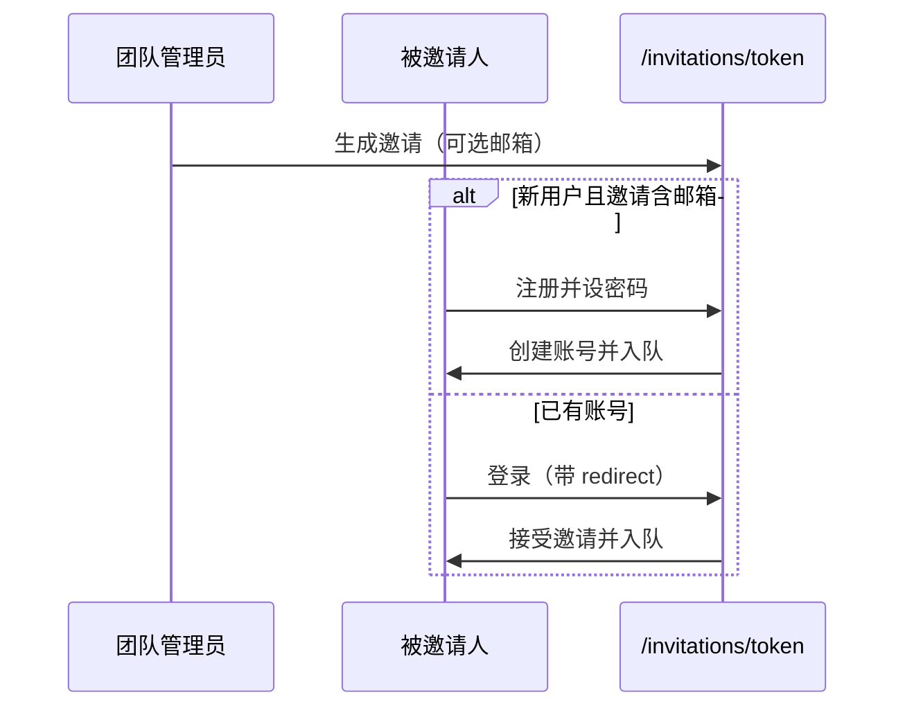
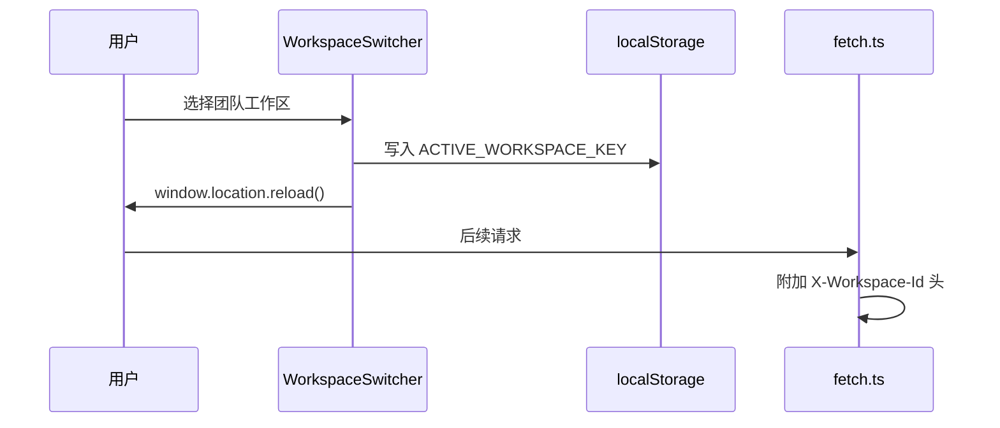
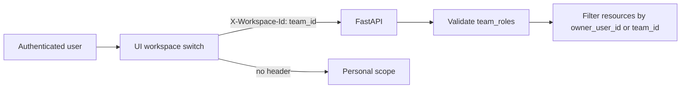

[English](teams-and-workspaces.md) · [简体中文](teams-and-workspaces.zh-CN.md)

# 团队与工作区

通过团队工作区实现多用户协作。资源（会话、代码库、知识库、交付物）可归属个人或团队。

## UI 入口

- **团队列表**：`/teams`
- **团队详情**：`/teams/[id]` — 成员、邀请、工作区切换
- **接受邀请**：`/invitations/[token]` — 预览、登录或注册并入队

## 邀请与开户流程

OpenCitadel 有两类邀请：

| 类型 | 发起方 | 链接 | 用途 |
|------|--------|------|------|
| 平台邀请 | 平台管理员 `/admin/invitations` | `/register?invite_token=...` | 仅开通平台账号 |
| 团队邀请 | 团队 Owner/Admin `/teams/[id]` | `/invitations/{token}` | 加入团队 |

团队邀请支持可选**受邀邮箱**（混合安全模型）：

- **填写邮箱**：新用户可在邀请页设密码注册并自动入队；老用户登录后接受邀请（邮箱需匹配）
- **不填邮箱**：仅已有平台账号的用户可接受（开放链接，适合可信环境）

登录页支持 `?redirect=` 安全回跳；OAuth 登录同样携带 `redirect` 与 `team_invite_token`。



## 工作区作用域

用户在 UI 选择团队工作区后，API 请求携带：

```
X-Workspace-Id: <team_id>
```

未携带该 Header 时，服务端使用**个人作用域**（`OwnerScope.personal(user_id)`）。

| 作用域 | Header | 资源归属 |
|--------|--------|----------|
| 个人 | （无） | `owner_user_id = 当前用户` |
| 团队 | `X-Workspace-Id` | `team_id = 工作区` |

服务端会校验 `principal.team_roles` 成员关系。



`WorkspaceSwitcher`（`ui/src/components/workspace-switcher.tsx`）将当前团队 id 写入 localStorage 并执行**整页 reload**，使所有 Provider 与缓存列表在新 scope 下重新拉取。



## 团队角色

| 角色 | 能力 |
|------|------|
| `OWNER` | 团队全权管理；创建邀请；调整成员角色；唯一 OWNER 时不可退出 |
| `ADMIN` | 创建邀请；管理成员（`TeamService._require_team_admin`） |
| `MEMBER` | 访问团队作用域资源；无成员管理权限 |

创建团队的用户默认为 `OWNER`。平台管理员可在 `/admin/teams` 管理团队。

## API 路由

| 方法 | 路径 | 说明 |
|------|------|------|
| POST | `/api/teams` | 创建团队 |
| GET | `/api/teams` | 我的团队列表 |
| GET | `/api/teams/{id}` | 团队详情 |
| GET | `/api/teams/{id}/members` | 成员列表 |
| POST | `/api/teams/{id}/invitations` | 创建邀请链接（可选 `email`） |
| POST | `/api/teams/{id}/leave` | 退出团队 |
| PATCH | `/api/teams/{id}/members/{user_id}` | 更新成员角色（OWNER） |
| DELETE | `/api/teams/{id}/members/{user_id}` | 移除成员 |
| GET | `/api/invitations/{token}` | 预览邀请（公开） |
| POST | `/api/invitations/{token}/register` | 注册并入队（公开，需邮箱绑定邀请） |
| POST | `/api/invitations/{token}/accept` | 接受邀请（需登录） |

会话、代码库、知识库、文件、调度、记忆等写路由需通过 `require_non_auditor`，并遵守 `WorkspaceContext`。

## 相关文档

- [安全模型](security-model.zh-CN.md) — RBAC 与工作区作用域
- [管理、审计与合规](admin-auditor-compliance.zh-CN.md) — 平台管理操作
