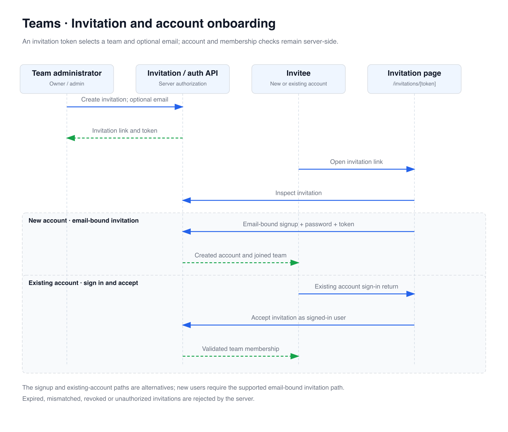
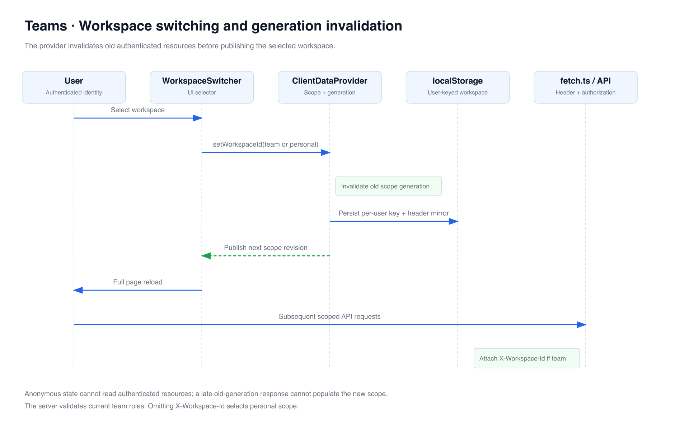
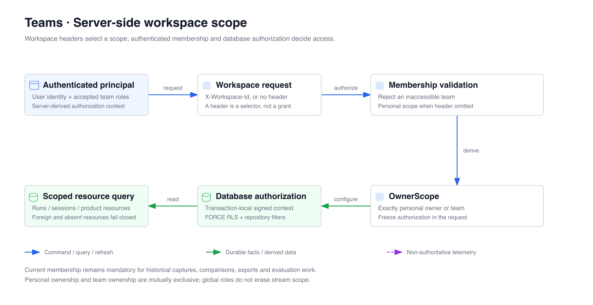

[English](teams-and-workspaces.md) · [简体中文](teams-and-workspaces.zh-CN.md)

# 团队与工作区

通过团队工作区实现多用户协作。资源（会话、知识库、交付物）可归属个人或团队。

## UI 入口

- **团队列表**：`/teams`
- **团队详情**：`/teams/[id]` — 成员、邀请、工作区切换
- **接受邀请**：`/invitations/[token]` — 预览、登录或注册并入队

## 邀请与开户流程

OpenCitadel 有两类邀请：

| 类型     | 发起方                          | 链接                         | 用途           |
| -------- | ------------------------------- | ---------------------------- | -------------- |
| 平台邀请 | 平台管理员 `/admin/invitations` | `/register?invite_token=...` | 仅开通平台账号 |
| 团队邀请 | 团队 Owner/Admin `/teams/[id]`  | `/invitations/{token}`       | 加入团队       |

团队邀请支持可选**受邀邮箱**（混合安全模型）：

- **填写邮箱**：新用户可在邀请页设密码注册并自动入队；老用户登录后接受邀请（邮箱需匹配）
- **不填邮箱**：仅已有平台账号的用户可接受（开放链接，适合可信环境）

登录页支持 `?redirect=` 安全回跳；OAuth 登录同样携带 `redirect` 与 `team_invite_token`。



## 工作区作用域

用户在 UI 选择团队工作区后，API 请求携带：

```
X-Workspace-Id: <team_id>
```

未携带该 Header 时，服务端使用**个人作用域**（`OwnerScope.personal(user_id)`）。

| 作用域 | Header           | 资源归属                   |
| ------ | ---------------- | -------------------------- |
| 个人   | （无）           | `owner_user_id = 当前用户` |
| 团队   | `X-Workspace-Id` | `team_id = 工作区`         |

服务端会校验 `principal.team_roles` 成员关系。



`WorkspaceSwitcher`（`ui/src/components/workspace-switcher.tsx`）调用 Client Data Provider，将团队 id
存入按用户隔离的 localStorage Key，并镜像到 API Header 使用的 `ACTIVE_WORKSPACE_KEY`，
发布新 Data Scope 后执行**整页 reload**。Scoped Cache 与进行中的读取按认证用户/工作区隔离；
用户不再属于已选团队时，Switcher 清空该选择。



## 团队角色

| 角色     | 能力                                                        |
| -------- | ----------------------------------------------------------- |
| `OWNER`  | 团队全权管理；创建邀请；调整成员角色；唯一 OWNER 时不可退出 |
| `ADMIN`  | 创建邀请、移除成员；修改角色与解散团队需 `OWNER`            |
| `MEMBER` | 访问团队作用域资源；无成员管理权限                          |

创建团队的用户默认为 `OWNER`。平台管理员可在 `/admin/teams` 管理团队。

## API 路由

| 方法   | 路径                                | 说明                                                      |
| ------ | ----------------------------------- | --------------------------------------------------------- |
| POST   | `/api/teams`                        | 创建团队                                                  |
| GET    | `/api/teams`                        | 我的团队列表                                              |
| GET    | `/api/teams/{id}`                   | 团队详情                                                  |
| GET    | `/api/teams/{id}/members`           | 成员列表                                                  |
| POST   | `/api/teams/{id}/invitations`       | 创建邀请链接（可选 `email`）                              |
| POST   | `/api/teams/{id}/leave`             | 退出团队                                                  |
| DELETE | `/api/teams/{id}`                   | 解散团队（OWNER）；默认 `transfer_to_owner`，或 `cascade` |
| PATCH  | `/api/teams/{id}/members/{user_id}` | 更新成员角色（OWNER）                                     |
| DELETE | `/api/teams/{id}/members/{user_id}` | 移除成员                                                  |
| GET    | `/api/invitations/{token}`          | 预览邀请（公开）                                          |
| POST   | `/api/invitations/{token}/register` | 注册并入队（公开，需邮箱绑定邀请）                        |
| POST   | `/api/invitations/{token}/accept`   | 接受邀请（需登录）                                        |

认证业务路由继承 `enforce_auditor_read_only`：Auditor 可使用 GET/HEAD/OPTIONS，不能提交
Mutation。部分写路由另有 `require_non_auditor`；Owner Scope 资源使用 `WorkspaceContext`。
解散团队会转移或处置资源，并在 Audit 中记录所选 Strategy。

## 相关文档

- [安全模型](security-model.zh-CN.md) — RBAC 与工作区作用域
- [管理、审计与合规](admin-auditor-compliance.zh-CN.md) — 平台管理操作
