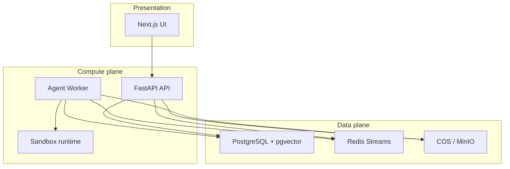
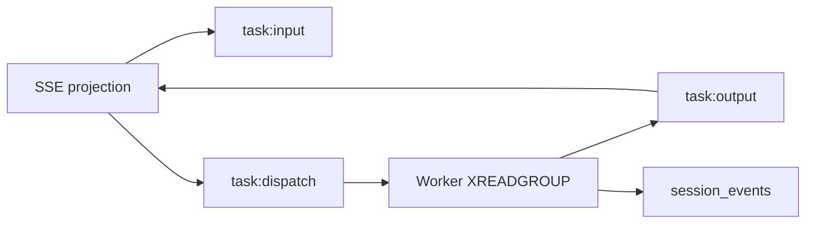

# Technical Decisions

[简体中文](technical-decisions.zh-CN.md)

This document records major technology choices for OpenCitadel: what we chose, why it fits a **self-hosted enterprise agent platform**, trade-offs, alternatives, and when to reconsider.

Each section follows the same structure:

| Section | Purpose |
|---------|---------|
| **Problem** | What architectural constraint this decision addresses |
| **Decision** | Current choice |
| **Pros / Cons** | Honest trade-offs |
| **Alternatives** | What else we evaluated |
| **Why not the alternative** | Project-specific rationale |
| **Revisit when** | Triggers to re-evaluate |

## Summary

| Area | Choice | Primary rationale |
|------|--------|-------------------|
| API stack | FastAPI + SQLAlchemy 2 + Alembic | Async agent workloads + typed API + migration control |
| Layering | interfaces / application / domain / infrastructure | Share Agent logic across API and Worker |
| Task queue | Redis Streams + consumer groups | One Redis for tasks, live SSE events, circuit breaker |
| Database | PostgreSQL 16 + pgvector | ACID + JSONB + vectors without a second datastore |
| DI | dependency-injector | Role-specific containers (API / Worker / Migrate) |
| LLM keys | Fernet in `llm_endpoints` | BYO-key UI management without mandatory Vault |
| Browser | Playwright (Worker) + Chromium (sandbox, CDP) | Isolation + HITL VNC + familiar automation API |
| Object storage | COS / MinIO abstraction | Cloud production + offline Compose demos |
| Frontend | Next.js 16 App Router | Standalone Docker image, React 19, admin UI |
| UI i18n | next-intl + build scripts | Bilingual CI enforcement |
| Sandbox | Docker / K8s Pod / remote gateway | Progressive hardening from dev to enterprise |



---

## 1. FastAPI + SQLAlchemy 2 + Alembic

### Problem

OpenCitadel needs a Python backend that can:

- Serve HTTP/SSE/WebSocket concurrently (many long-lived chat streams)
- Run heavy Agent/ingestion logic in a separate Worker process
- Evolve schema safely (40+ Alembic migrations, data migrations for keys and config)
- Integrate pgvector, Redis, object storage, and LLM SDKs in one codebase

### Decision

- **FastAPI + Uvicorn** for the API process
- **SQLAlchemy 2 (asyncpg)** for persistence
- **Alembic** for schema migrations; `app/migrate.py` for data migrations

### Pros

- Native **async/await** fits SSE chat, streaming LLM calls, and concurrent sandbox I/O
- **OpenAPI** auto-generation helps frontend types and external integrators
- SQLAlchemy 2 async + Alembic is mature for incremental schema changes (LLM endpoint split, audit chain, AppConfig tables)
- Large Python AI ecosystem (OpenAI SDK, Anthropic, Playwright, MCP SDK) without leaving Python

### Cons

- More boilerplate than Django admin for internal CRUD
- Async SQLAlchemy debugging is harder for contributors used to sync ORM
- FastAPI DI alone does not solve Worker/Migrate wiring — we still need a container layer

### Alternatives

| Alternative | Pros | Cons |
|-------------|------|------|
| **Django + DRF** | Batteries-included admin, ORM, auth | Sync-first history; async support still awkward for SSE-heavy workloads; heavier framework for an API-first agent platform |
| **Flask + extensions** | Minimal, familiar | No built-in async story; assembly required for OpenAPI, validation, streaming |
| **Node.js (Nest/Fastify)** | Strong frontend language unification | Agent/tooling ecosystem (Playwright orchestration, MCP, pgvector clients) weaker in TS for our Worker-heavy design |
| **Raw SQL + minimal framework** | Maximum control | Unmaintainable at 20+ repositories and 40+ migrations |

### Why not the alternative

Django would speed up admin CRUD but OpenCitadel's admin UI is a dedicated Next.js console; the hard problems are **Worker orchestration, Redis Streams, sandbox lifecycle, and Agent flows** — areas where FastAPI's async model and lightweight routing fit better. Flask lacks first-class async. Moving the Worker to Node would split the Agent domain across languages.

### Revisit when

- Team standardizes on Django for all internal tools and wants to merge admin into Django Admin
- API surface shrinks to CRUD-only with no SSE — unlikely for this product

---

## 2. Layered backend (ports & adapters)

### Problem

API and Worker share Agent, checkpoint, LLM, and ingestion logic but have different entry points and lifecycles. Coupling domain code to FastAPI or Redis makes testing and Worker extraction difficult.

### Decision

Four layers with explicit ports:

```text
interfaces → application → domain → infrastructure
         domain/external (ports) ← infrastructure/adapters
```

### Pros

- **AgentTaskRunner**, flows, and checkpoint logic run in Worker without importing FastAPI
- Repository interfaces (`IUoW`) keep tests on in-memory or fake adapters
- Clear place for cross-cutting concerns: `ResilientLLMClient` in infrastructure, flow selection in domain

### Cons

- More files and indirection than a flat `services/` package
- New contributors must learn where a change belongs
- Not full CQRS — read/write paths still share models

### Alternatives

| Alternative | Pros | Cons |
|-------------|------|------|
| **Monolithic `services/`** | Faster initial development | API/Worker boundaries blur; Redis and HTTP leak into Agent code |
| **Full CQRS + event sourcing** | Clean audit trail | Overkill for session-scoped agent state; major rewrite |
| **Microservices per domain** | Independent scaling | Operational cost incompatible with self-host Compose target |

### Why not the alternative

OpenCitadel targets **single-tenant and small-team self-hosting** first. A modular monolith with ports/adapters gives testability without Kubernetes-style service sprawl.

### Revisit when

- Independent scaling of ingestion vs chat requires separate deployable services
- Team size grows and ownership boundaries need hard service splits

---

## 3. Redis Streams vs message queues

### Problem

Agent tasks must be dispatched reliably, streamed to clients in real time, cancelled mid-flight, and recovered after Worker crashes — while sharing infrastructure with circuit breakers and task leases.

### Decision

- `task:input` → `task:dispatch` (consumer group) → Worker
- Live events on `task:output`; persistence to `session_events`
- Task leases (`task_lease.py`) for deduplication after XAUTOCLAIM
- Optional DLQ replay loop



### Pros

- **One Redis** already required for task state, circuit breaker, sandbox leader election — no second broker to install in Compose
- Task output stream doubles as **live SSE pipeline** — same transport for dispatch and streaming
- Consumer groups + XAUTOCLAIM support crash recovery without losing visibility
- Tunable retention via `streams.max_len` in AppConfig

### Cons

- Weaker observability than **Celery Flower** (no built-in task graph UI)
- Stream trimming misconfigured → lost events or unbounded memory
- Team must understand Redis Streams semantics (PEL, consumer groups) — steeper than Celery's task abstraction
- Not ideal for cross-region fan-out or very high fan-in analytics workloads

### Alternatives

| Alternative | Pros | Cons |
|-------------|------|------|
| **Celery + Redis/RabbitMQ** | Mature tooling, retries, Flower UI | Second worker process type; live SSE events still need a separate channel; more moving parts for self-hosters |
| **RabbitMQ / SQS** | Strong delivery guarantees, enterprise ops | Extra service in Compose; overkill when Redis already mandatory |
| **NATS JetStream** | Lightweight, good pub/sub | Additional dependency; team less familiar; no existing integration |
| **Postgres LISTEN/NOTIFY or job table polling** | No Redis | Poor fit for high-frequency token deltas and long-running agent tasks |

### Why not the alternative

OpenCitadel's unit of work is a **long-running Agent session** with **hundreds of SSE events**, not a fire-and-forget email job. Colocating dispatch and event streaming in Redis matches the product shape and minimizes `docker compose up` prerequisites (Postgres + Redis only).

### Revisit when

- Multi-region active-active deployment needs geo-replicated queues
- Queue depth exceeds Redis memory budget and events must be archived to cold storage automatically
- Dedicated SRE team wants standard Celery/RabbitMQ runbooks

---

## 4. PostgreSQL + pgvector

### Problem

Knowledge bases, codebases, and long-term memory need relational metadata (ownership, team scope, ingest status) **and** vector similarity search, often in the same transaction as chunk writes.

### Decision

PostgreSQL 16 with **pgvector** extension; hybrid BM25 + vector retrieval in application code.

### Pros

- **Single backup/restore** path for sessions, KB chunks, codebase symbols, and embeddings
- **ACID**: ingest failure rolls back metadata and vectors together
- JSONB for `pending_metadata`, AppConfig, audit payloads — no document DB required
- Works in Compose (`pgvector/pgvector:pg16`) and Helm StatefulSet without extra vendors
- Good enough ANN for typical enterprise KB sizes (thousands to low millions of chunks)

### Cons

- ANN performance plateaus vs specialized vector DBs at very large scale
- pgvector index tuning (lists, probes) requires DBA attention
- Embedding dimension changes require reindex migration
- CPU-heavy vector queries compete with OLTP on same instance

### Alternatives

| Alternative | Pros | Cons |
|-------------|------|------|
| **Qdrant / Weaviate / Milvus** | Optimized ANN, filtering, sharding | Second datastore to backup, monitor, secure; cross-DB consistency for ingest |
| **Pinecone (managed)** | Zero ops ANN | Data leaves self-hosted boundary — conflicts with private deployment promise |
| **Elasticsearch dense vectors** | Strong full-text + vectors | Heavy JVM footprint; ops complexity for small self-host installs |
| **MongoDB Atlas Vector** | Document + vector | Weaker relational model for teams, audit chains, RBAC joins |

### Why not the alternative

OpenCitadel's pitch is **"data never leaves your network."** A managed vector SaaS contradicts that. A dedicated vector cluster adds operational burden disproportionate to early/mid-scale deployments where **one Postgres** already runs migrations, sessions, and compliance audit tables.

Hybrid retrieval (BM25 fallback when `vector_degraded=true`) is implemented in-process — splitting vectors to another DB would complicate degraded-mode logic documented in [codebase-reindex](codebase-reindex.md).

### Revisit when

- Sustained >10M vectors with p99 query latency SLOs below 50ms
- Need multi-tenant vector isolation at shard level
- Dedicated search team wants Elasticsearch/OpenSearch as unified log + KB index

---

## 5. dependency-injector (API / Worker / Migrate)

### Problem

Three processes share database, Redis, LLM clients, and repositories but wire different loops: API has HTTP + MCP pool cleanup; Worker has sandbox pool, scheduler, DLQ replay; Migrate runs one-shot data migrations.

### Decision

`BaseContainer` → `ApiContainer` / `WorkerContainer`; FastAPI uses container providers via wiring config.

### Pros

- **Explicit lifecycle**: `init_api_container()` vs `init_worker_container()` — no accidental HTTP deps in Worker
- Shared providers defined once (Postgres pool, `ResilientLLMClient`, UoW factory)
- Easier integration tests: override providers without patching globals
- Matches hexagonal architecture docs in [overview](overview.md)

### Cons

- Learning curve vs plain FastAPI `Depends`
- Wiring errors surface at startup, not always at import time
- Container definitions can grow large (`container.py`)

### Alternatives

| Alternative | Pros | Cons |
|-------------|------|------|
| **FastAPI Depends only** | Idiomatic for HTTP | Cannot wire Worker CLI entry or Migrate scripts the same way |
| **Global singletons** | Simple | Untestable; hidden init order bugs |
| **manual `factory()` functions** | Transparent | Duplicated wiring between API and Worker |

### Why not the alternative

Worker is not a FastAPI app. Any DI solution that only wraps HTTP request scope forces duplicate manual wiring in `worker/main.py` — exactly the drift we avoid with role containers.

### Revisit when

- Python 3.13+ ecosystem standardizes on a built-in DI pattern
- Process count grows beyond three roles with substantially different graphs

---

## 6. Fernet encryption for LLM endpoint keys

### Problem

Users configure BYO API keys in Settings. Keys must not sit in plaintext in Postgres backups, yet many self-hosters do not run HashiCorp Vault or cloud KMS on day one.

### Decision

Store keys in `llm_endpoints.api_key`; encrypt with **Fernet** derived from `API_KEY_SECRET`. Migration upgrades `legacy_plaintext` → `fernet_v1`.

### Pros

- **UI-managed keys** without redeploying `.env` per provider rotation
- Endpoint/model split: one key serves multiple model names ([llm-endpoints-and-models](llm-endpoints-and-models.md))
- Works offline in air-gapped Compose — no external secret service
- Migrate job encrypts legacy rows in place

### Cons

- **Single key risk**: compromising `API_KEY_SECRET` exposes all endpoint keys
- Fernet is symmetric — no HSM-backed non-exportable keys
- Key rotation requires re-saving endpoints in UI (documented in [security-model](security-model.md))
- Does not replace network-level secret hygiene (backup encryption, `.env` permissions)

### Alternatives

| Alternative | Pros | Cons |
|-------------|------|------|
| **HashiCorp Vault / cloud KMS** | Enterprise rotation, audit, HSM | Extra service; high friction for 10-minute self-host tutorial |
| **Env-only keys (`OPENAI_API_KEY`)** | Simple | No per-user/per-team keys in multi-user deployment; no UI management |
| **Plaintext in DB** | Easiest | Unacceptable for backups and compliance posture |
| **Per-row random salt + AES-GCM** | Stronger than single Fernet key | More complex rotation; we may evolve here for enterprise |

### Why not the alternative

OpenCitadel's onboarding path is **"clone, compose up, paste API key in Settings."** Mandating Vault would exclude the primary audience. Fernet is a deliberate **baseline** that beats plaintext while staying operable on a laptop — with a documented upgrade path to KMS in enterprise Helm values.

### Revisit when

- Enterprise customers require FIPS/HSM or per-tenant CMK
- Compliance audits mandate external secret store with access logging
- Multi-tenant SaaS mode needs envelope encryption per organization

---

## 7. Playwright (Worker) + Chromium in sandbox (CDP)

### Problem

Web Operator runs browser automation against enterprise systems. Browser exploits must not compromise the API/Worker host. HITL requires users to **take over** the browser via VNC.

### Decision

- **Chromium runs inside the sandbox container** (with Xvfb + optional VNC)
- **Playwright in the Worker process** connects over CDP
- Shell/file tools also execute inside sandbox HTTP sidecar

### Pros

- Browser RCE surface isolated in sandbox network namespace — not co-located with JWT secrets and DB credentials
- Playwright API is stable for Agent tool loops (navigation, click, screenshot)
- VNC path (`vnc-viewer.tsx`) enables takeover without public sandbox ports
- Same pattern works for Docker, K8s Pod, and remote sandbox gateway drivers

### Cons

- CDP connection adds latency vs in-process browser
- Playwright version must match sandbox Chromium version across image builds
- VNC adds bandwidth and UX complexity for HITL
- Remote sandbox gateway mode introduces network dependency

### Alternatives

| Alternative | Pros | Cons |
|-------------|------|------|
| **Playwright inside Worker** | Lower latency | Browser exploit = Worker compromise = DB/Redis access |
| **Puppeteer inside sandbox only** | Isolation | Worker-side orchestration less uniform with existing Playwright tooling |
| **Selenium Grid** | Enterprise familiarity | Heavier ops; grid becomes another stateful service |
| **Remote browser farm (Browserless, etc.)** | No local Chromium | Data egress; conflicts with private deployment; cost per session |

### Why not the alternative

Governance (plan approval, tool gates, audit) is worthless if the browser runs in the **same process as session credentials**. CDP separation is the minimum bar for "sandbox-isolated execution" marketed in the README.

### Revisit when

- WASM-based microVM browsers mature for per-session isolation with lower overhead
- Customers mandate gVisor/Kata on every sandbox without CDP bridging complexity

---

## 8. COS / MinIO object storage abstraction

### Problem

Artifacts, uploads, browser profile snapshots, and KB documents need durable blob storage. Deployments range from **Tencent COS in production** to **fully offline MinIO on a laptop**.

### Decision

`STORAGE_PROVIDER=cos|minio`; Postgres stores object keys only; shared abstraction in infrastructure layer.

### Pros

- **One API** for API and Worker — artifact writes and checkpoint tarballs use same client
- Local demo: `COMPOSE_PROFILES=local` + MinIO — no cloud account required
- Production: vendor COS/S3 with bucket policies and encryption at rest
- Switching providers documented (`migrate_storage`) — not a one-way door

### Cons

- Abstraction leaks at edge cases (presigned URL semantics, public endpoint for vision)
- MinIO adds another Compose service in local profile
- Large artifact egress costs in cloud if not lifecycle-managed

### Alternatives

| Alternative | Pros | Cons |
|-------------|------|------|
| **Local filesystem bind mount** | Zero deps | Breaks multi-replica API/Worker; no HA |
| **Postgres BYTEA** | Transactional | Bloats DB backups; bad for multi-MB artifacts |
| **Direct S3 SDK only** | Simpler code | Blocks MinIO/offline story |
| **NFS shared volume** | Familiar to enterprises | Locking/consistency pain; not cloud-native |

### Why not the alternative

Self-hosters evaluate OpenCitadel **without cloud credentials**. Filesystem-only storage fails the moment you scale API to two replicas. BYTEA would explode Postgres backup size given browser snapshots and PDF uploads.

### Revisit when

- All deployments standardize on S3-compatible API with shared bucket policy templates
- Need WORM/immutable compliance storage — may require provider-specific features

---

## 9. Next.js 16 App Router (frontend)

### Problem

The UI must ship as a **Docker image behind Nginx**, support admin dashboards, SSE-heavy session pages, bilingual copy, and public artifact share routes — without a separate BFF service.

### Decision

Next.js 16 App Router, React 19, standalone output, `next-intl` for i18n.

### Pros

- **Standalone Docker build** — single `opencitadel-ui` image in Compose/Helm
- App Router layouts cleanly separate `/admin/*`, `/share/*`, and main shell
- React 19 + Radix UI ecosystem for complex HITL components
- Same language as many enterprise frontend teams

### Cons

- Next.js build times and memory usage exceed Vite SPA
- App Router mental model still evolving — contributor onboarding cost
- SSE chat pages stress React re-render patterns — requires careful hook design (`use-session-streams.ts`)

### Alternatives

| Alternative | Pros | Cons |
|-------------|------|------|
| **Vite + React SPA** | Fast dev/build | Need separate static hosting config; no SSR for share/admin SEO (minor) |
| **Remix** | Strong data loading | Smaller ecosystem in our stack; less standalone Docker precedent in project |
| **Vue/Nuxt** | Alternative ecosystem | Team and component library investment reset |

### Why not the alternative

The project already ships Next.js in production Compose and Helm. Migration would delay governance features (HITL bars, VNC overlay, settings modal) with no user-visible gain. Standalone output is proven in `ui/Dockerfile`.

### Revisit when

- UI becomes static-only with no server components
- Build pipeline moves to edge deployment incompatible with standalone Node server

---

## 10. next-intl + message build pipeline

### Problem

OpenCitadel ships **bilingual UI** (en/zh). Documentation uses `*.zh-CN.md` while runtime locale is `zh`. Drift between languages breaks enterprise evaluations in China.

### Decision

- Authoritative keys in `ui/scripts/build-messages.mjs`
- Generated `messages/en.json`, `messages/zh.json`
- CI: `npm run i18n:check`
- Locale in `NEXT_LOCALE` cookie; `localePrefix: "never"`

### Pros

- **CI fails** on missing keys — prevents English-only merges
- No URL prefix — simpler Nginx routing and share links
- Settings/Agent strings colocated with feature development

### Cons

- Two-step workflow: edit `.mjs` source, run `i18n:build`
- Generated JSON not hand-edited — confuses newcomers
- Docs locale (`zh-CN`) vs runtime locale (`zh`) naming split requires explanation ([ui/README](../../ui/README.md))

### Alternatives

| Alternative | Pros | Cons |
|-------------|------|------|
| **Inline English strings** | Fastest | Chinese UI impossible to maintain |
| **react-i18next only** | Popular | Less integrated with Next.js App Router than next-intl |
| **Crowdin / Lokalise** | Professional translators | Overhead for OSS; offline contributors blocked |

### Why not the alternative

Enterprise buyers test **Chinese UI on first login**. Hardcoded English fails the product promise. Crowdin adds process before the UI surface stabilizes.

### Revisit when

- Professional localization team joins with translation memory requirements
- Locale count exceeds 2 — may need TMS integration

---

## 11. Sandbox isolation (Docker / K8s / remote gateway)

### Problem

Agent tools (shell, browser, file I/O) must not run on the API host. Deployments range from **developer Docker Compose** to **Kubernetes with ResourceQuota** to **external sandbox plane**.

### Decision

Pluggable drivers: `docker`, `kubernetes`, remote gateway via `sandbox.address`; admission via `SandboxQuota`; leader-coordinated reclamation.

### Pros

- **Progressive hardening**: dev uses Docker socket; prod Helm uses Pod + RBAC — same Agent code
- Remote gateway supports air-gapped execution plane separated from control plane
- Quota + memory probe prevent OOM on shared hosts ([overview](overview.md))

### Cons

- Docker mode requires `docker.sock` — security concern on shared hosts
- K8s mode needs ServiceAccount RBAC maintenance
- Not microVM-isolated by default — relies on container boundaries

### Alternatives

| Alternative | Pros | Cons |
|-------------|------|------|
| **gVisor/Kata only** | Stronger isolation | Hardware/kernel requirements; harder local dev |
| **WASM runtimes (Wasmtime)** | Fast cold start | Incomplete browser/Playwright compatibility |
| **VM per session (Firecracker)** | Maximum isolation | Provisioning latency and density limits |

### Why not the alternative

Requiring microVMs on day one would block the **10-minute tutorial**. Container isolation with documented hardening (`cap_drop`, `no-new-privileges`) matches target audience capability while [architecture-evolution](architecture-evolution.md) leaves room for external sandbox services.

### Revisit when

- Multi-tenant public cloud offering demands kernel-level isolation
- Compliance mandates gVisor/seccomp profiles by default in Helm chart

---

## Decision review process

When adding a new dependency or replacing a core component:

1. Document the **problem**, not just the library name
2. List at least **two alternatives** with honest cons
3. State **revisit triggers** (scale, compliance, team size)
4. Update this file (EN + zh-CN) and [DOCUMENTATION_INVENTORY](../DOCUMENTATION_INVENTORY.md)
5. Link from [overview](overview.md) if the choice affects system diagram

## Related documentation

- [Architecture overview](overview.md)
- [Security model](security-model.md)
- [LLM endpoints and models](llm-endpoints-and-models.md)
- [Task recovery](task-recovery.md)
- [Config source governance](config-source-governance.md)
- [Architecture evolution](architecture-evolution.md)
