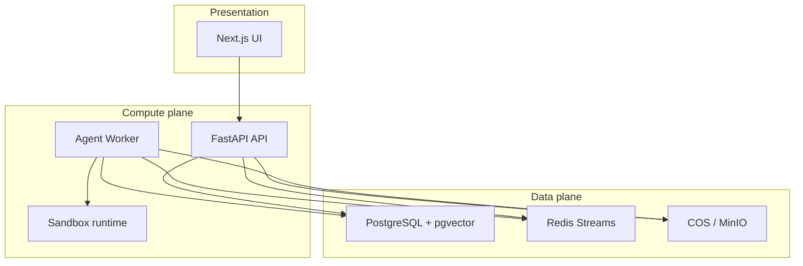
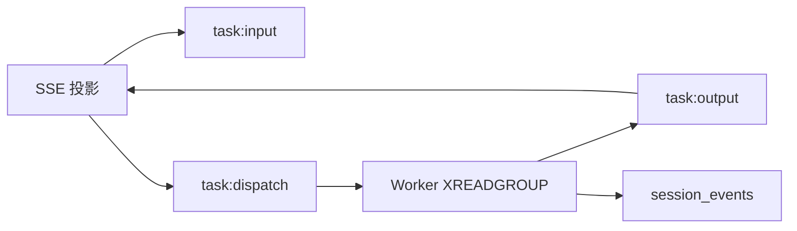

[English](technical-decisions.md)

# 技术选型

本文档记录 OpenCitadel 的主要技术选型：选了什么、为何适合**自托管企业 Agent 平台**、权衡、替代方案，以及何时重新评估。

每节采用统一结构：

| 小节 | 作用 |
|------|------|
| **要解决的问题** | 该决策针对的架构约束 |
| **当前选择** | 实际采用方案 |
| **优点 / 缺点** | 如实列出权衡 |
| **替代方案** | 评估过的其他选项 |
| **为何不选替代方案** | 结合本项目的理由 |
| **何时重估** | 触发重新评估的条件 |

## 总览

| 领域 | 选型 | 核心理由 |
|------|------|----------|
| API 栈 | FastAPI + SQLAlchemy 2 + Alembic | 异步 Agent 负载 + 类型化 API + 可控迁移 |
| 分层 | interfaces / application / domain / infrastructure | API 与 Worker 共享 Agent 逻辑 |
| 任务队列 | Redis Streams + 消费组 | 同一 Redis 承担任务、SSE 事件、熔断 |
| 数据库 | PostgreSQL 16 + pgvector | ACID + JSONB + 向量，无需第二套存储 |
| DI | dependency-injector | 按角色装配（API / Worker / Migrate） |
| LLM Key | `llm_endpoints` + Fernet | BYO Key 可在 UI 管理，不强制 Vault |
| 浏览器 | Worker 内 Playwright + 沙箱内 Chromium（CDP） | 隔离 + HITL VNC + 成熟自动化 API |
| 对象存储 | COS / MinIO 抽象 | 云端生产 + 离线 Compose 演示 |
| 前端 | Next.js 16 App Router | Standalone Docker、React 19、管理后台 |
| UI i18n | next-intl + 构建脚本 | 双语 CI 强制校验 |
| Agent Flow | 四 Flow 路由（Ask vs Agent） | 安全与成本；避免单一 ReAct 覆盖全部模式 |
| KB 检索 | 混合 RRF + GraphRAG + rerank | 企业文档召回；代码库用更轻量向量路径 |
| 鉴权（浏览器） | HttpOnly JWT + CSRF | 相对 localStorage Bearer 更抗 XSS |
| 服务 Key | 按用户 SHA-256，无团队 scope | 长期自动化且不固化过期团队成员关系 |
| 沙箱 | Docker / K8s Pod / 远程网关 | 从开发到企业可渐进加固 |



---

## 1. FastAPI + SQLAlchemy 2 + Alembic

### 要解决的问题

后端需要同时满足：

- 并发处理 HTTP/SSE/WebSocket（大量长连接对话流）
- 在独立 Worker 进程中运行 Agent/摄取重负载
- 安全演进 schema（40+ Alembic 迁移、密钥与配置数据迁移）
- 在同一代码库集成 pgvector、Redis、对象存储与 LLM SDK

### 当前选择

- **FastAPI + Uvicorn** 作为 API 进程
- **SQLAlchemy 2（asyncpg）** 持久化
- **Alembic** 做 schema 迁移；`app/migrate.py` 做数据迁移

### 优点

- 原生 **async/await** 适配 SSE 对话、流式 LLM、并发沙箱 I/O
- **OpenAPI** 自动生成，便于前端类型与外部集成
- SQLAlchemy 2 + Alembic 适合增量 schema（LLM 端点拆分、审计链、AppConfig 表）
- Python AI 生态完整（OpenAI/Anthropic SDK、Playwright、MCP SDK）

### 缺点

- 内部 CRUD 样板代码多于 Django Admin
- 异步 ORM 对习惯同步模型的贡献者调试成本更高
- 仅靠 FastAPI DI 无法解决 Worker/Migrate 装配 — 仍需容器层

### 替代方案

| 替代 | 优点 | 缺点 |
|------|------|------|
| **Django + DRF** | Admin、ORM、认证开箱即用 | 历史偏同步；SSE 密集场景 async 仍别扭；对 API 优先的 Agent 平台偏重 |
| **Flask + 扩展** | 轻量熟悉 | 无内置 async；OpenAPI/校验/流式需自行拼装 |
| **Node.js（Nest/Fastify）** | 前后端语言统一 | Worker 侧重 Playwright/MCP/pgvector 时 TS 生态弱于 Python |
| **Raw SQL + 极简框架** | 控制力强 | 20+ 仓储、40+ 迁移时不可维护 |

### 为何不选替代方案

Django 能加速 Admin CRUD，但 OpenCitadel 管理后台是独立 Next.js 控制台；真正难的是 **Worker 编排、Redis Streams、沙箱生命周期、Agent Flow** — FastAPI 异步模型与轻量路由更匹配。Flask 缺 first-class async。Worker 迁到 Node 会把 Agent 领域拆成两种语言。

### 何时重估

- 团队全面 Django 化且希望 Admin 并入 Django Admin
- API 收缩为纯 CRUD、无 SSE — 对本产品 unlikely

---

## 2. 分层后端（ports & adapters）

### 要解决的问题

API 与 Worker 共享 Agent、检查点、LLM、摄取逻辑，但入口与生命周期不同。领域代码若耦合 FastAPI 或 Redis，测试与 Worker 抽离都会变难。

### 当前选择

四层 + 显式端口：

```text
interfaces → application → domain → infrastructure
         domain/external（端口）← infrastructure/adapters
```

### 优点

- **AgentTaskRunner**、Flow、检查点逻辑可在 Worker 运行，无需 import FastAPI
- 仓储接口（`IUoW`）便于内存/fake 适配器测试
- 横切关注点位置清晰：基础设施放 `ResilientLLMClient`，领域放 Flow 选择

### 缺点

- 比扁平 `services/` 更多文件与间接层
- 新贡献者需学习变更应落在哪一层
- 非完整 CQRS — 读写仍共享模型

### 替代方案

| 替代 | 优点 | 缺点 |
|------|------|------|
| **单体 `services/`** | 初期开发快 | API/Worker 边界模糊；Redis/HTTP 渗入 Agent |
| **完整 CQRS + 事件溯源** | 审计清晰 | 对会话级 Agent 状态过重；大改 |
| **按域微服务** | 独立扩缩 | 运维成本与自托管 Compose 目标冲突 |

### 为何不选替代方案

OpenCitadel 优先服务**单租户与小团队自托管**。带 ports/adapters 的模块化单体在可测试性与运维复杂度之间取得平衡。

### 何时重估

- 摄取与对话需独立扩缩、拆成可独立部署服务
- 团队扩大、ownership 边界需硬服务拆分

---

## 3. Redis Streams vs 消息队列

### 要解决的问题

Agent 任务需可靠分发、实时推送到客户端、中途取消、Worker 崩溃后恢复 — 且与熔断器、任务租约共用基础设施。

### 当前选择

- `task:input` → `task:dispatch`（消费组）→ Worker
- 实时事件在 `task:output`；持久化到 `session_events`
- 任务租约（`task_lease.py`）在 XAUTOCLAIM 后去重
- 可选 DLQ 回放循环



### 优点

- **一个 Redis** 已承担任务状态、熔断、沙箱 Leader 选举 — Compose 无需第二套 broker
- 任务输出流同时是 **SSE 实时管道** — 分发与流式共用传输
- 消费组 + XAUTOCLAIM 支持崩溃恢复且不丢可见性
- 通过 AppConfig 的 `streams.max_len` 可调 retention

### 缺点

- 可观测性弱于 **Celery Flower**（无内置任务图 UI）
- Stream 裁剪配置不当 → 丢事件或内存膨胀
- 团队需理解 Redis Streams（PEL、消费组）— 比 Celery 任务抽象陡峭
- 不适合跨 region 扇出或极高 fan-in 分析负载

### 替代方案

| 替代 | 优点 | 缺点 |
|------|------|------|
| **Celery + Redis/RabbitMQ** | 成熟、重试、Flower UI | 多一种 worker 类型；实时 SSE 仍需独立通道；自托管组件更多 |
| **RabbitMQ / SQS** | 投递保证强、企业运维成熟 | Compose 多一个服务；Redis 已必需时显得冗余 |
| **NATS JetStream** | 轻量 pub/sub | 新依赖；团队熟悉度低；无现成集成 |
| **Postgres LISTEN/NOTIFY 或轮询 job 表** | 无 Redis | 不适合高频 token delta 与长时 Agent 任务 |

### 为何不选替代方案

OpenCitadel 的工作单元是**长时 Agent 会话** + **数百条 SSE 事件**，不是发完即忘的邮件任务。在 Redis 中合并分发与事件流，匹配产品形态，且 `docker compose up` 只需 Postgres + Redis。

### 何时重估

- 多 region  active-active 需要 geo 复制队列
- 队列深度超出 Redis 内存预算，事件需自动归档冷存储
- 专职 SRE 需要标准 Celery/RabbitMQ 运维手册

---

## 4. PostgreSQL + pgvector

### 要解决的问题

知识库、代码库、长期记忆需要关系型元数据（归属、团队 scope、摄取状态）**与**向量相似检索，且常在同一事务中写入 chunk。

### 当前选择

PostgreSQL 16 + **pgvector**；应用层 BM25 + 向量混合检索。

### 优点

- **单一备份/恢复**路径覆盖会话、KB chunk、代码符号、embedding
- **ACID**：摄取失败可同时回滚元数据与向量
- JSONB 承载 `pending_metadata`、AppConfig、审计载荷 — 无需文档库
- Compose（`pgvector/pgvector:pg16`）与 Helm StatefulSet 均可部署，无额外 vendor
- 典型企业 KB 规模（数千至数百万 chunk）ANN 性能足够

### 缺点

- 超大规模 ANN 性能不如专用向量库
- pgvector 索引（lists、probes）需 DBA 调参
- embedding 维度变更需 reindex 迁移
- 向量查询与 OLTP 争抢同一实例 CPU

### 替代方案

| 替代 | 优点 | 缺点 |
|------|------|------|
| **Qdrant / Weaviate / Milvus** | ANN 优化、过滤、分片 | 第二套存储需备份/监控/鉴权；摄取跨库一致性难 |
| **Pinecone（托管）** | 零运维 ANN | 数据出私有网络 — 与私有化部署承诺冲突 |
| **Elasticsearch 稠密向量** | 全文 + 向量 | JVM 重；小规格自托管运维复杂 |
| **MongoDB Atlas Vector** | 文档 + 向量 | 团队/RBAC/审计链 join 弱于关系模型 |

### 为何不选替代方案

OpenCitadel 卖点是**数据不出自有网络**。托管向量 SaaS 与之矛盾。独立向量集群的运维成本，对早中期规模（单 Postgres 已跑迁移、会话、合规表）不成比例。

混合检索（`vector_degraded=true` 时 BM25 降级）在进程内实现 — 向量拆到另一库会复杂化 [codebase-reindex](codebase-reindex.zh-CN.md) 中的降级逻辑。

### 何时重估

- 持续 >1000 万向量且 p99 查询 SLO <50ms
- 需 shard 级多租户向量隔离
- 搜索团队希望 Elasticsearch/OpenSearch 统一日志 + KB 索引

---

## 5. dependency-injector（API / Worker / Migrate）

### 要解决的问题

三个进程共享 DB、Redis、LLM 客户端与仓储，但装配不同循环：API 有 HTTP + MCP 池清理；Worker 有沙箱池、调度器、DLQ；Migrate 是一次性数据迁移。

### 当前选择

`BaseContainer` → `ApiContainer` / `WorkerContainer`；FastAPI 通过 wiring 使用容器 provider。

### 优点

- **生命周期明确**：`init_api_container()` vs `init_worker_container()` — Worker 不会误引 HTTP 依赖
- 共享 provider 只定义一次（Postgres 池、`ResilientLLMClient`、UoW 工厂）
- 集成测试可 override provider，无需 patch 全局单例
- 与 [overview](overview.zh-CN.md) 中的六边形架构文档一致

### 缺点

- 学习曲线高于纯 FastAPI `Depends`
- wiring 错误多在启动时暴露
- `container.py` 可能随功能增长变长

### 替代方案

| 替代 | 优点 | 缺点 |
|------|------|------|
| **仅 FastAPI Depends** | HTTP 层惯用 | 无法同样装配 Worker CLI 与 Migrate |
| **全局单例** | 简单 | 难测；初始化顺序隐患 |
| **手工 factory** | 透明 | API 与 Worker 重复装配 |

### 为何不选替代方案

Worker 不是 FastAPI 应用。只覆盖 HTTP 请求范围的 DI，必然在 `worker/main.py` 重复手工装配 — 正是角色容器要避免的漂移。

### 何时重估

- Python 生态出现更标准的内置 DI
- 进程角色超过三种且依赖图差异极大

---

## 6. LLM 端点 Key 的 Fernet 加密

### 要解决的问题

用户在设置中配置 BYO API Key。Key 不应以明文出现在 Postgres 备份中，但多数自托管用户首日不会部署 HashiCorp Vault 或云 KMS。

### 当前选择

Key 存于 `llm_endpoints.api_key`；用 **Fernet**（`API_KEY_SECRET` 派生）加密；迁移将 `legacy_plaintext` 升级为 `fernet_v1`。

### 优点

- **UI 管理 Key**，轮换 Provider 无需改 `.env` redeploy
- 端点/模型拆分：一个 Key 供多个模型名（[llm-endpoints-and-models](llm-endpoints-and-models.zh-CN.md)）
- 离线/air-gapped Compose 可用 — 无外部密钥服务
- migrate job 原地加密 legacy 行

### 缺点

- **单密钥风险**：`API_KEY_SECRET` 泄露则所有端点 Key 暴露
- Fernet 对称 — 无 HSM 不可导出密钥
- 轮换 secret 需在 UI 重新保存端点（见 [security-model](security-model.zh-CN.md)）
- 不能替代备份加密、`.env` 权限等网络层措施

### 替代方案

| 替代 | 优点 | 缺点 |
|------|------|------|
| **Vault / 云 KMS** | 企业级轮换、审计、HSM | 额外服务；10 分钟教程摩擦大 |
| **仅 env Key** | 最简单 | 多用户部署无法 per-user/per-team；无 UI 管理 |
| **DB 明文** | 最省事 | 备份与合规不可接受 |
| **每行随机 salt + AES-GCM** | 强于单 Fernet | 轮换更复杂；企业版可演进 |

### 为何不选替代方案

 onboarding 路径是**「clone、compose up、在设置粘贴 Key」**。强制 Vault 会排除主要受众。Fernet 是优于明文的**基线**，笔记本可运维，企业 Helm 可文档化 KMS 升级路径。

### 何时重估

- 企业客户要求 FIPS/HSM 或 per-tenant CMK
- 合规审计强制外部密钥库与访问日志
- 多租户 SaaS 需 per-org 信封加密

---

## 7. Playwright（Worker）+ 沙箱内 Chromium（CDP）

### 要解决的问题

Web Operator 对企业系统做浏览器自动化。浏览器漏洞不能危及 API/Worker 宿主机。HITL 要求用户通过 VNC **接管**浏览器。

### 当前选择

- **Chromium 在沙箱容器内**（Xvfb + 可选 VNC）
- **Worker 进程内 Playwright** 经 CDP 连接
- Shell/文件工具也在沙箱 HTTP sidecar 内执行

### 优点

- 浏览器 RCE 面隔离在沙箱网络命名空间 — 不与 JWT、DB 凭证同进程
- Playwright API 稳定，适合 Agent 工具循环（导航、点击、截图）
- VNC（`vnc-viewer.tsx`）支持接管，无需公开沙箱端口
- Docker、K8s Pod、远程沙箱网关驱动共用同一模式

### 缺点

- CDP 连接比进程内浏览器延迟高
- Playwright 版本需与沙箱 Chromium 镜像版本对齐
- VNC 增加带宽与 HITL UX 复杂度
- 远程沙箱网关模式引入网络依赖

### 替代方案

| 替代 | 优点 | 缺点 |
|------|------|------|
| **Worker 内 Playwright** | 延迟低 | 浏览器漏洞 = Worker 沦陷 = DB/Redis 访问 |
| **仅沙箱内 Puppeteer** | 有隔离 | Worker 侧编排与现有 Playwright 工具链不统一 |
| **Selenium Grid** | 企业熟悉 | 运维重；Grid 本身是有状态服务 |
| **远程浏览器农场** | 无本地 Chromium | 数据出网；与私有化冲突；按会话计费 |

### 为何不选替代方案

若浏览器与**会话凭证同进程**，Plan 审批、工具门控、审计都失去意义。CDP 分离是 README「沙箱隔离执行」的最低门槛。

### 何时重估

- WASM microVM 浏览器成熟且开销更低
- 客户强制 gVisor/Kata 且不愿承担 CDP 桥接复杂度

---

## 8. COS / MinIO 对象存储抽象

### 要解决的问题

交付物、上传、浏览器 Profile 快照、KB 文档需要持久 blob。部署形态从**生产腾讯云 COS**到**笔记本完全离线 MinIO**。

### 当前选择

`STORAGE_PROVIDER=cos|minio`；Postgres 只存 object key；基础设施层统一抽象。

### 优点

- **一套 API** 供 API/Worker — 交付物与检查点 tarball 同一客户端
- 本地演示：`COMPOSE_PROFILES=local` + MinIO — 无需云账号
- 生产：厂商 COS/S3 + bucket 策略与静态加密
- 切换 provider 有文档（`migrate_storage`）— 非单向门

### 缺点

- 抽象在预签名 URL、vision 公网 endpoint 等边界会泄漏
- MinIO 在 local profile 多一个 Compose 服务
- 云端大文件 egress 成本需生命周期管理

### 替代方案

| 替代 | 优点 | 缺点 |
|------|------|------|
| **本地 bind mount** | 零依赖 | 多副本 API/Worker 失效；无 HA |
| **Postgres BYTEA** | 事务内 | 撑大备份；不适合多 MB 交付物 |
| **仅直连 S3 SDK** | 代码简单 | 阻断 MinIO/离线故事 |
| **NFS 共享卷** | 企业熟悉 | 锁/一致性 pain；非 cloud-native |

### 为何不选替代方案

自托管用户常在**无云凭证**时评估产品。纯文件系统无法水平扩 API。BYTEA 会使浏览器快照与 PDF 上传撑爆 Postgres 备份。

### 何时重估

- 所有部署统一 S3 兼容 API 与 bucket 策略模板
- 需 WORM/不可变合规存储 — 可能依赖厂商专有特性

---

## 9. Next.js 16 App Router（前端）

### 要解决的问题

UI 需以 **Docker 镜像挂 Nginx** 交付，包含管理后台、SSE 密集会话页、双语文案、公开交付物分享 — 且无需独立 BFF。

### 当前选择

Next.js 16 App Router、React 19、standalone 输出、`next-intl`。

### 优点

- **Standalone Docker** — Compose/Helm 单一 `opencitadel-ui` 镜像
- App Router layout 清晰分离 `/admin/*`、`/share/*` 与主 Shell
- React 19 + Radix 适合复杂 HITL 组件
- 与企业前端团队技术栈一致

### 缺点

- 构建时间与内存高于 Vite SPA
- App Router 心智模型仍在演进 — 贡献者 onboarding 成本
- SSE 对话页考验 React 重渲染 — 需精心设计 hook（`use-session-streams.ts`）

### 替代方案

| 替代 | 优点 | 缺点 |
|------|------|------|
| **Vite + React SPA** | 构建快 | 需单独静态托管配置 |
| **Remix** | 数据加载强 | 生态与 standalone Docker 先例少于当前栈 |
| **Vue/Nuxt** | 另一生态 | 组件库与团队投入重置 |

### 为何不选替代方案

项目已在生产 Compose/Helm 使用 Next.js。迁移会延迟 HITL、VNC、设置弹窗等功能，对用户无可见收益。`ui/Dockerfile` 已验证 standalone 输出。

### 何时重估

- UI 纯静态、无 server components
- 构建/部署迁移到与 standalone Node 不兼容的边缘方案

---

## 10. next-intl + 消息构建流水线

### 要解决的问题

OpenCitadel 提供**双语 UI**（en/zh）。文档用 `*.zh-CN.md`，运行 locale 为 `zh`。语言漂移会破坏国内 enterprise 评估体验。

### 当前选择

- 权威键：`ui/scripts/build-messages.mjs`
- 生成 `messages/en.json`、`zh.json`
- CI：`npm run i18n:check`
- locale 在 `NEXT_LOCALE` Cookie；`localePrefix: "never"`

### 优点

- **CI 缺键即失败** — 防止只合英文
- 无 URL 前缀 — Nginx 路由与分享链接更简单
- 设置/Agent 文案与功能开发同仓维护

### 缺点

- 两步：改 `.mjs` 源 → 跑 `i18n:build`
- 生成 JSON 不可手改 — 新人易困惑
- 文档 locale（`zh-CN`）与运行 locale（`zh`）命名分裂需说明（[ui/README](../../ui/README.zh-CN.md)）

### 替代方案

| 替代 | 优点 | 缺点 |
|------|------|------|
| **硬编码英文** | 最快 | 中文 UI 不可维护 |
| **仅 react-i18next** | 流行 | 与 App Router 集成弱于 next-intl |
| **Crowdin / Lokalise** | 专业翻译 | OSS 流程重；离线贡献者受阻 |

### 为何不选替代方案

企业买家**首次登录就会测中文 UI**。硬编码英文违背产品承诺。UI  surface 未稳定前上 Crowdin 流程过重。

### 何时重估

- 专业本地化团队接入、需翻译记忆库
- locale 数量 >2 — 可能需要 TMS

---

## 11. 沙箱隔离（Docker / K8s / 远程网关）

### 要解决的问题

Agent 工具（shell、browser、文件）不能在 API 宿主机运行。部署从**开发者 Docker Compose**到**带 ResourceQuota 的 K8s**再到**外置沙箱平面**。

### 当前选择

可插拔驱动：`docker`、`kubernetes`、经 `sandbox.address` 的远程网关；`SandboxQuota` 准入；Leader 协调回收。

### 优点

- **渐进加固**：开发用 docker.sock；生产 Helm 用 Pod + RBAC — Agent 代码相同
- 远程网关支持控制面与执行面 air-gapped 分离
- 配额 + 内存探测防止共享主机 OOM（[overview](overview.zh-CN.md)）

### 缺点

- Docker 模式需 `docker.sock` — 共享主机有安全顾虑
- K8s 模式需维护 ServiceAccount RBAC
- 默认非 microVM — 依赖容器边界

### 替代方案

| 替代 | 优点 | 缺点 |
|------|------|------|
| **仅 gVisor/Kata** | 隔离更强 | 硬件/内核要求；本地开发难 |
| **WASM（Wasmtime）** | 冷启动快 | 浏览器/Playwright 兼容不完整 |
| **每会话 VM（Firecracker）** | 隔离最强 |  provisioning 延迟与密度限制 |

### 为何不选替代方案

首日强制 microVM 会阻断**10 分钟教程**。容器隔离 + 文档化加固（`cap_drop`、`no-new-privileges`）匹配目标用户能力；[architecture-evolution](architecture-evolution.zh-CN.md) 保留外置沙箱演进空间。

### 何时重估

- 多租户公有云需内核级隔离
- 合规强制 Helm 默认 gVisor/seccomp

---

## 12. Flow 路由 vs 单一 ReAct 循环

### 要解决的问题

会话绑定不同资源（`codebase_id`、`knowledge_base_id`）与模式（`ASK` vs `AGENT`）。若单一 ReAct 循环启用全部工具，会模糊只读问答边界，并为简单 Doc QA 膨胀提示词。

### 当前选择

`AgentTaskRunner` 路由到四种 Flow：`HybridAskFlow`、`CodeAskFlow`、`DocQAFlow`、`PlannerReActFlow`。Ask 流程使用 `build_ask_tools`（无 shell/file/browser）；Agent 模式使用完整工具注册表的 `PlannerReActFlow`。

### 优点

- **安全**：Ask 模式不能修改会话沙箱或执行 shell
- **延迟/成本**：仅绑定 KB 时跳过 Planner
- **体验清晰**：代码库 + KB 混合问答有专用检索提示词

### 缺点

- 四条代码路径需维护与测试（`test_agent_task_runner_flow_routing.py`）
- 贡献者新增会话类型前需理解路由矩阵

### 替代方案

| 替代 | 优点 | 缺点 |
|------|------|------|
| **单一 ReAct + 动态工具过滤** | 一种 Flow 实现 | Ask 易泄漏写工具；提示词膨胀 |
| **按模式拆微服务** | 独立扩缩 | 运维成本高；破坏共享会话/事件模型 |

### 为何不选替代方案

OpenCitadel 会话共享一套 SSE 事件 schema 与检查点模型。Flow 拆分在单 Worker 管道内按模式强制工具策略。

### 何时重估

- 新会话类型（如纯语音、批处理 ETL）需要第五条 Flow — 先抽取共享 `BaseFlow`
- 产品层取消 Ask/Agent 区分

---

## 13. KB 混合检索 vs 代码库向量检索

### 要解决的问题

知识库需对异构文档（PDF、Confluence、URL）高召回 RAG；代码库需对结构化源码树做符号感知快速检索 — 检索经济性不同。

### 当前选择

- **KB**：向量 + BM25 → RRF → 可选 GraphRAG → 父块扩展 → LLM rerank（`HybridRetriever`）
- **Codebase**：符号静态分析 + pgvector chunk 检索；无 BM25/rerank 栈

独立配置开关：`knowledge_base.vector_enabled`（默认 true）与长期记忆的 `memory.vector_enabled`（默认 false）—— 勿混淆。

### 优点

- KB 流水线为企业文档优化召回/精度
- 代码库摄取更轻；`vector_degraded` 优雅降级
- 共享 pgvector 基础设施 — 无需第二套向量库

### 缺点

- 贡献者需理解两套模型（「为何 KB 比 codebase 复杂？」）
- KB rerank 增加每次查询 LLM 成本

### 替代方案

| 替代 | 优点 | 缺点 |
|------|------|------|
| **统一检索器** | 一种实现 | 权衡错误 — 代码库不需要 GraphRAG |
| **KB 专用向量库** | 大规模 ANN 更优 | 第二套备份；跨库摄取一致性难 |

### 何时重估

- KB chunk 数超过单节点 pgvector SLO
- 代码库语义检索需在规模上对文件路径做 BM25

---

## 14. 服务 API Key 不含团队 scope

### 要解决的问题

自动化调用方（入站 A2A、脚本）需长期凭证且无需交互登录，但团队成员身份是会话时的选择。

### 当前选择

服务 API Key 按用户 SHA-256 存储；`require_service_api_key` 的 Principal 仅含 `user_id` + `global_role` — **`team_roles` 为空**。团队作用域 API 需 Cookie JWT + `X-Workspace-Id`。

### 优点

- Key 便于 CI 与外部 Agent 携带
- 长期密钥不固化过期团队成员关系
- 安全边界在 API README 中明确

### 缺点

- 调用方不能仅用 `X-Api-Key` 访问团队拥有的代码库/KB
- 集成方需理解两种鉴权模式

### 替代方案

| 替代 | 优点 | 缺点 |
|------|------|------|
| **团队级 API Key** | 团队自动化直接可用 | 轮换复杂；角色漂移 |
| **每团队 OAuth client credentials** | 企业标准模式 | 自托管小团队配置过重 |

### 何时重估

- 企业客户要求团队绑定的机器身份
- 细粒度 scoped key（只读 KB、单 Skill）成为产品需求

---

## 15. Cookie JWT + CSRF vs localStorage Bearer

### 要解决的问题

浏览器 UI 需持久会话，同时避免 XSS 通过 `localStorage` 窃取令牌。

### 当前选择

HttpOnly Cookie 存 access/refresh JWT；变更类请求 CSRF 双提交；`X-Workspace-Id` 传递工作区 scope。UI `fetch.ts` 集中 401 刷新队列。

### 优点

- JavaScript 无法读取令牌
- 与同域 Nginx 反代（`/api`）配合良好
- 刷新轮换无需每个组件处理 SPA token

### 缺点

- 跨源 SPA 托管需仔细配置 `cors_origins` 与 Cookie
- 非浏览器客户端需 Cookie jar 或服务 API Key

### 替代方案

| 替代 | 优点 | 缺点 |
|------|------|------|
| **localStorage Bearer** | 移动端/SPA 教程简单 | XSS → 账户完全沦陷 |
| **仅内存短效 access** | 缩小 XSS 窗口 | 刷新体验差；多标签不持久 |

### 何时重估

- 原生移动 App 需要一等 OAuth 设备流
- 支持在不相关域名嵌入第三方 SPA

---

## 16. AppConfig YAML 种子 + PostgreSQL 热配置

### 要解决的问题

运维需要 git 中版本化默认（`config.yaml`），又要在不重新部署 API/Worker 镜像的情况下调运行时参数。

### 当前选择

`config.yaml` 在 migrate 时种子化空 `app_configs`；生产 `USE_DB_APP_CONFIG=true`。`OwnerConfigResolver` 应用用户/团队覆盖；API 与 Worker 监听配置失效。

### 优点

- 全新安装可离线靠种子文件工作
- 管理 UI（`RuntimeSettings`、HITL）编辑持久化到 DB 并带修订历史
- 同一镜像跨环境 — 配置由 DB 区分

### 缺点

- `config.yaml` 与 DB 无迁移时可能漂移
- 贡献者需知优先级（env > DB > yaml 种子）

### 替代方案

| 替代 | 优点 | 缺点 |
|------|------|------|
| **仅环境变量十二要素** | 运维简单 | 无修订回滚；无 UI 编辑 |
| **etcd/Consul 实时配置** | 集群实时同步 | 多一套服务；Compose 过重 |

### 何时重估

- 需要多 region 配置复制
- 仅 GitOps 客户禁止 UI 修改运行时开关

---

## 17. 沙箱池化 vs 按需创建

### 要解决的问题

浏览器/shell 工具冷启动影响交互 Agent 体验；无界动态创建耗尽主机内存。

### 当前选择

Worker 可选 `sandbox.pool_enabled` + `pool_size` 预热空闲沙箱；`SandboxQuota` 准入 + Leader 协调回收限制存活实例。`config.yaml` 种子默认关闭池（`pool_enabled: false`）以利最小开发安装。

### 优点

- 池化降低首次工具调用延迟
- 准入防止共享主机 Worker OOM
- Docker 与 K8s 驱动共用代码路径

### 缺点

- 预热沙箱空闲时仍占内存
- 池大小因环境而异 — 非一刀切

### 替代方案

| 替代 | 优点 | 缺点 |
|------|------|------|
| **始终按需创建** | 空闲成本最低 | 首次浏览器操作慢 |
| **仅固定 compose 沙箱服务** | 开发可预测 | 无法扩展至多 Worker 池 |

### 何时重估

- 关闭池时 p99 首次工具延迟超过产品 SLO
- K8s HPA 扩展 Worker — 池大小需按节点动态调整

---

## 决策评审流程

新增依赖或替换核心组件时：

1. 文档化**问题**，而非只写库名
2. 至少列出**两个替代方案**及真实缺点
3. 写明**重估触发条件**（规模、合规、团队）
4. 更新本文（中英文）与 [DOCUMENTATION_INVENTORY](../DOCUMENTATION_INVENTORY.zh-CN.md)
5. 若影响系统图，在 [overview](overview.zh-CN.md) 加链

## 相关文档

- [架构总览](overview.zh-CN.md)
- [安全模型](security-model.zh-CN.md)
- [LLM 端点与模型](llm-endpoints-and-models.zh-CN.md)
- [任务恢复](task-recovery.zh-CN.md)
- [配置来源治理](config-source-governance.zh-CN.md)
- [架构演进](architecture-evolution.zh-CN.md)
