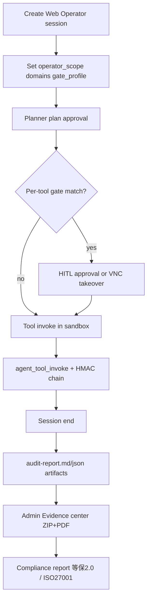

[English](web-operator.md) · [简体中文](web-operator.zh-CN.md)

# Web Operator architecture

Governed browser automation for enterprise-owned systems without APIs.

## Flow

## Components

| Layer | Responsibility |
|-------|------------------|
| Session UI | `operator_scope`, domain allowlist, gate profile |
| Planner→ReAct | Plan approval, selective tool gates |
| Sandbox | Chrome + VNC, checkpoint snapshots |
| Audit | Per-tool redacted logs + MD/JSON report artifacts |
| Evidence chain | HMAC hash chain on `audit_logs` (`chain_seq`, `prev_hash`, `entry_hash`) |
| Compliance | 等保2.0 + ISO27001 control mapping, evidence ZIP+PDF |
| Automation | Scheduled/webhook jobs with operator template fields |

## Gate profiles

Configured in `api/config.yaml` → `hitl.gate_profiles`:

- **loose**: plan + first-visit domain only
- **standard**: + critical actions (`close`, `refund`, `delete`, …)
- **strict**: all risk-list browser tools per-call

Per-session override via `gate_profile` on session create (Web Operator dialog).

## Audit contract

Tool-level auditing applies **only to Web Operator sessions** (`gate_profile` set at session create). Ordinary coding/RAG sessions do not write `agent_tool_invoke` rows.

Runtime `agent_tool_invoke` entries (success **and** failure/timeout) include:

- redacted `args`
- `result_summary`, `success`, `duration_ms`
- `gate_profile` (session gate preset)
- `gated` (whether the call matched per-call gate rules: risk list / critical action)
- `chain_seq`, `prev_hash`, `entry_hash` (immutable evidence chain)

Session end produces `audit-report.md` + `audit-report.json` artifacts aggregating governance actions and tool invocations.

Admin **Evidence center** (`/admin/compliance`) can download a full evidence package (ZIP + PDF summary) per session.

## Demo target

`demo/ops-console` — ticket + settlement ledger backend with read-only REST API and form-only writes (`docker compose --profile demo`).

Use the **退款对账稽核** (`refund-reconciliation`) skill for governed cross-system reconciliation against ops-console.

## K8s note

`kubernetes_sandbox.py` implements workspace/browser profile snapshots aligned with Docker tar flow (Pod exec + file API).

See [Governed Web Operator tutorial](../tutorials/04-governed-web-operator.md) and [Refund reconciliation & compliance](../tutorials/05-refund-reconciliation-compliance.md).
