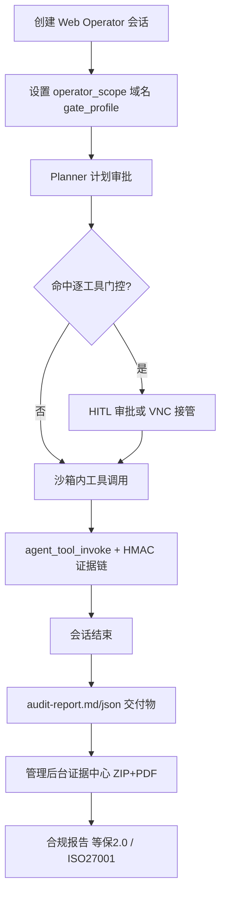

[English](web-operator.md) · [简体中文](web-operator.zh-CN.md)

# Web Operator 架构

面向**无 API 的企业自有系统**的受治理浏览器自动化。

## 流程

## 组件

| 层 | 职责 |
|----|------|
| 会话 UI | `operator_scope`、域名白名单、门控档位 |
| Planner→ReAct | 计划审批、智能分级逐工具门控 |
| 沙箱 | Chrome + VNC、检查点快照 |
| 审计 | 脱敏工具级留痕 + MD/JSON 报告 artifact |
| 证据链 | `audit_logs` 上的 HMAC 哈希链（`chain_seq`、`prev_hash`、`entry_hash`） |
| 合规 | 等保2.0 + ISO27001 控制项映射、证据 ZIP+PDF |
| 自动化 | 带 Operator 模板字段的定时/Webhook 任务 |

## 门控档位

配置于 `api/config.yaml` → `hitl.gate_profiles`：

- **loose（宽松）**：计划 + 首访域名
- **standard（标准）**：+ 高危操作（关单/退款/删除等）
- **strict（严格）**：所有风险列表浏览器工具逐次审批

建 Web Operator 会话时通过 `gate_profile` 按会话覆盖。

## 审计契约

工具级审计**仅对 Web Operator 会话**生效（建会话时设置 `gate_profile`）。普通编码/RAG 会话不写 `agent_tool_invoke` 记录。

运行时 `agent_tool_invoke`（**成功与失败/超时均留痕**）包含：

- 脱敏 `args`
- `result_summary`、`success`、`duration_ms`
- `gate_profile`（会话门控档位）
- `gated`（是否命中逐工具门控规则：风险列表 / 高危操作）
- `chain_seq`、`prev_hash`、`entry_hash`（不可变证据链）

会话结束产出 `audit-report.md` + `audit-report.json`，汇总治理动作与工具调用明细。

管理后台**证据中心**（`/admin/compliance`）可按会话下载完整证据包（ZIP + PDF 摘要）。

## 演示目标

`demo/ops-console` — 工单与结算台账后台，提供只读 REST API，写操作仅表单 POST（`docker compose --profile demo`）。

使用内置 Skill **退款对账稽核**（`refund-reconciliation`）对 ops-console 做受治理的跨系统对账。

## K8s 说明

`kubernetes_sandbox.py` 已实现与 Docker tar 方案对齐的工作区/浏览器 Profile 快照（Pod exec + 文件 API）。

详见 [受治理 Web Operator 教程](../tutorials/04-governed-web-operator.zh-CN.md) 与 [退款对账与合规审计](../tutorials/05-refund-reconciliation-compliance.zh-CN.md)。
