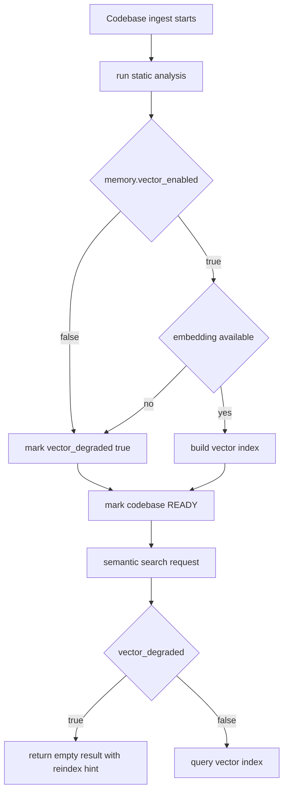

# Codebase 向量降级与重新索引

本文档是 Codebase 摄取过程中向量降级、语义检索不可用提示与手动重新索引的权威说明。

## 降级触发

Embedding 不可用或 `memory.vector_enabled=false` 时，摄取流程跳过向量步骤，代码库仍标记为 `READY`，并设置 `vector_degraded=true`。

## 恢复路径（手动）

1. 确认 `/api/llm/status` 中 embedding 可用
2. 调用 `POST /api/codebases/{codebase_id}/reanalyze`
3. UI 在 `vector_degraded=true` 时展示「语义检索不可用 — 重建索引」

## 行为说明

- 静态分析与 artifacts 在降级时仍正常完成
- 语义检索工具在 `vector_degraded` 期间返回空结果并提示重建索引

## 相关文档

- [模型韧性设计](model-resilience.md)
- [配置来源治理](config-source-governance.md)
- [系统架构](architecture.md)
