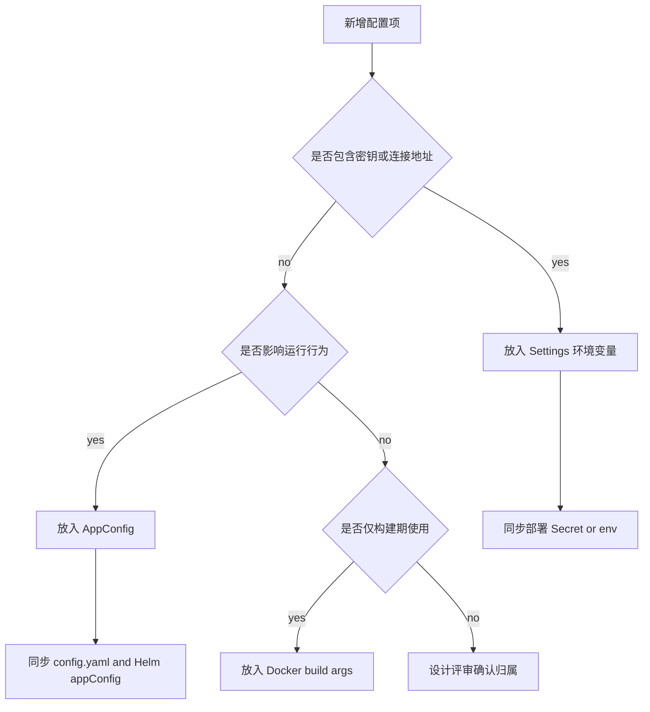

# 配置来源治理

本文档是 MyManus 配置来源、行为开关归属和配置同步要求的权威说明。

## 唯一权威

| 类型 | 来源 | 示例 |
|------|------|------|
| 行为配置 | `AppConfig`，由 DB 承载，`config.yaml` / Helm `appConfig` 只做种子 | `model_resilience`, `feature_flags`, `worker`, `sandbox` |
| 密钥/连接 | `Settings` 环境变量 | `EMBEDDING_API_KEY`, Postgres, Redis, COS |

## 决策树

## 生产部署

- **必须** `USE_DB_APP_CONFIG=true`（Helm `env` 已配置）
- `config.yaml` / Helm `appConfig` 为初始默认值；migrate job 在表空时种子写入 DB

## 禁止

- 不为行为开关新增平行环境变量（紧急止血除外：回滚镜像/配置）

## 同步清单

修改 `AppConfig` 字段时需同步：`app_config.py` schema、`config.yaml`、Helm `appConfig`、相关文档。

| 变更类型 | 必须同步 |
|----------|----------|
| 新增 `AppConfig` 字段 | `api/app/domain/models/app_config.py`、`api/config.yaml`、Helm `appConfig`、相关文档 |
| 新增环境变量 | `Settings` schema、`.env.example`、部署文档 / Helm env |
| 新增用户可见契约 | API schema、前端类型、兼容策略文档 |

## 相关文档

- [系统架构](architecture.md)
- [模型韧性设计](model-resilience.md)
- [API/SSE 协议兼容策略](contract-compatibility.md)
