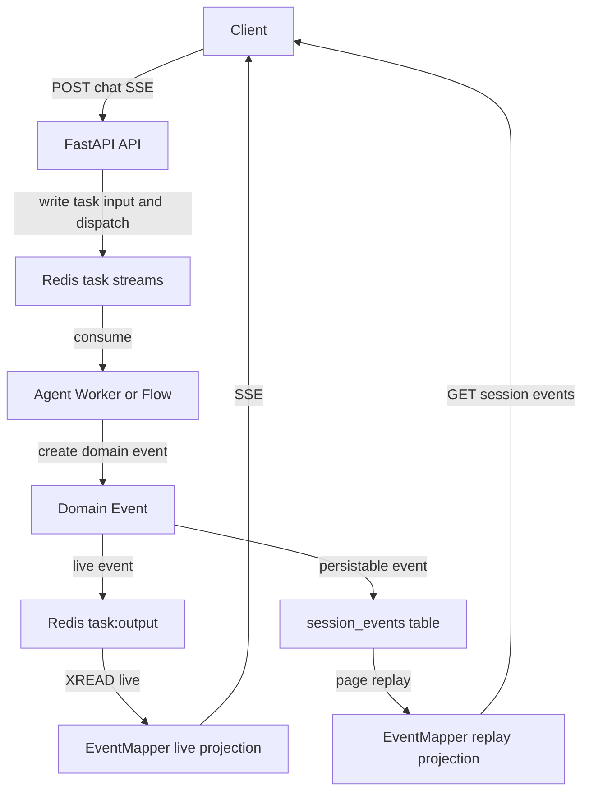
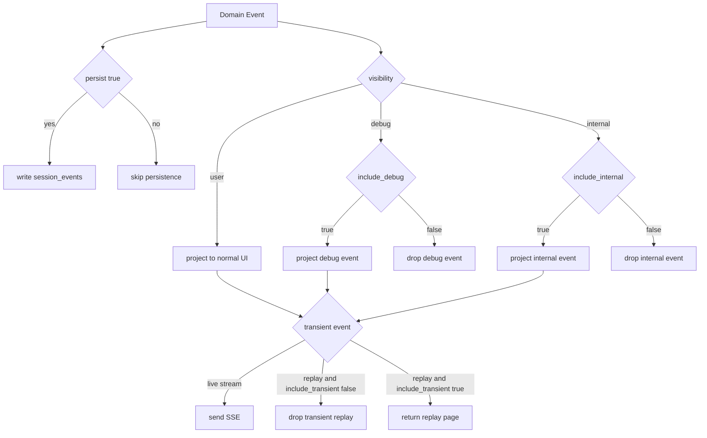

# 事件系统设计

本文档是 MyManus 会话事件系统的权威说明，覆盖领域事件、SSE 线上契约、投影策略、持久化与分页重放。

## 事件链路

- **领域事件**定义在 `api/app/domain/models/event.py`，由 Agent、Flow、TaskRunner 创建。
- **实时通道**使用 Redis Stream `task:output:{task_id}`，API 通过 `XREAD` 转发为 SSE。
- **持久化通道**使用追加式 `session_events` 表，按 `(session_id, seq)` 分页重放。
- **SSE 投影**集中在 `api/app/interfaces/schemas/event.py` 的 `EventMapper`。

## EventMeta

所有 SSE data 都必须携带统一元信息：

| 字段 | 说明 |
|------|------|
| `event_id` | Redis stream id 或领域事件 id |
| `created_at` | 秒级时间戳 |
| `schema_version` | 当前事件 schema 版本 |
| `visibility` | `user` / `internal` / `debug` |
| `channel` | `ui` / `runtime` / `debug` |
| `persist` | 是否允许持久化 |

当前 `EVENT_SCHEMA_VERSION=2`。旧 payload 会通过 `event_upgrader.py` 升级后再反序列化。

## SSE 事件目录

| 事件 | 说明 | 默认投影 |
|------|------|----------|
| `message` | 用户或助手完整消息 | live + replay |
| `message_delta` | 助手文本增量 | live |
| `reasoning_delta` | 思考内容增量 | debug live |
| `tool_args_delta` | 工具参数增量 | debug live |
| `assistant_notice` | 面向用户的助手提示 | live + replay |
| `session_status` | 服务端权威会话状态 | live + replay |
| `debug_item` | 内部调试项 | debug replay |
| `title` | 会话标题更新 | live + replay |
| `plan` | 计划步骤快照 | live + replay |
| `step` | 单个执行步骤状态 | live + replay |
| `subagent` | 子 Agent 委派状态（goal / 摘要） | live + replay |
| `tool` | 工具调用状态与结果 | live + replay |
| `wait` | 等待用户输入 | live + replay |
| `usage` | Token 用量增量/汇总 | live + replay |
| `done` | 本轮流结束 | live + replay |
| `error` | 错误事件 | live + replay |

默认 UI 受众只接收 `user` 可见事件和 `message_delta`。需要诊断信息时，请使用 `include_debug=true`。

## 投影策略

`event_policy.py` 提供统一策略：

- `should_persist_event(event)`：决定是否写入 `session_events`。
- `should_project_event(event, include_transient, include_debug, include_internal)`：决定事件是否发送给当前客户端。
- `project_events(...)`：批量投影，用于 replay。

实时 SSE 与历史 replay 都必须通过同一投影策略，避免 live/replay 行为不一致。

## 持久化与分页

事件写入使用 `session_events` 追加表：

| 字段 | 说明 |
|------|------|
| `seq` | 全局递增游标 |
| `session_id` | 会话 id |
| `stream_id` | Redis stream id |
| `type` | 事件类型 |
| `payload` | 原始领域事件 JSONB |
| `created_at` | 事件时间 |
| `source` | `agent` 或 `legacy` |

读取接口：

- `GET /api/sessions/{id}`：返回会话详情和首个事件页，`events_next_cursor` 表示后续游标。
- `GET /api/sessions/{id}/events?after=<seq>&limit=100`：按游标增量读取事件页。

旧的 `sessions.events` JSONB 数组只作为迁移来源和兼容 fallback，不再作为新增事件的主写入路径。

## 前端约定

前端类型定义在 `ui/src/lib/api/types.ts`：

- `EventMeta` 为所有事件 data 的必备字段。
- `SSEEventData` 是按 `type` 区分的联合类型。
- `ui/src/hooks/use-session-detail.ts` 会先读取 `GET /sessions/{id}` 的首屏事件，再使用 `events_next_cursor` 分页补齐历史事件，最后通过 `/chat` SSE 追实时事件。

## 相关文档

- [系统架构](architecture.md)
- [API/SSE 协议兼容策略](contract-compatibility.md)
- [模型韧性设计](model-resilience.md)
