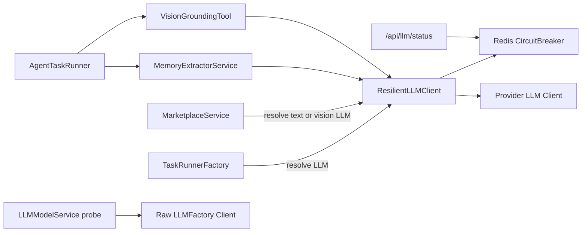
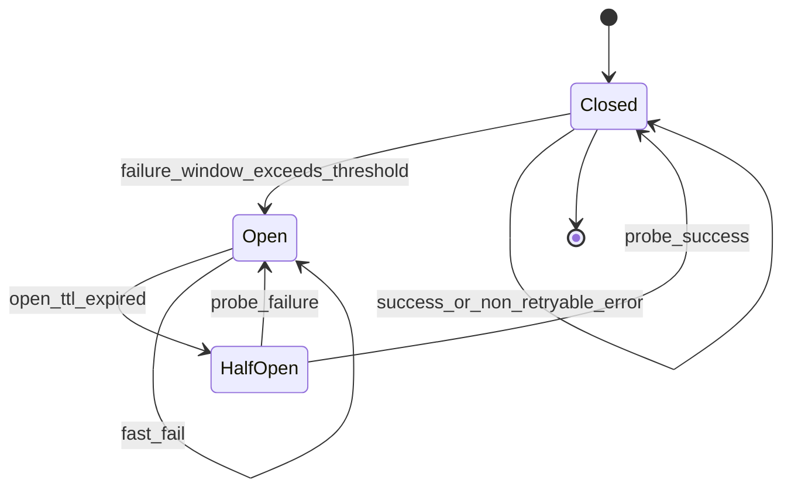

# 模型韧性设计

本文档是 MyManus 模型隔离、熔断、fallback、SLO 与运行治理的权威说明。

## 目标与范围

模型全部不可用时，平台仍需满足：

- 配置可改：模型 probe 与配置保存解耦。
- 健康可见：`/api/status` 表示平台域健康，`/api/llm/status` 表示模型域健康。
- 非模型功能可用：Room、问卷、文件、Marketplace 目录不依赖 chat LLM。
- 模型入口快速失败：Agent、A2A、Marketplace LLM 以明确错误码终止，不堆积 Worker、沙箱或 Redis 资源。

### P0 范围

| 能力 | 说明 |
|------|------|
| DB 配置冷启动种子 | `AppConfig` 为空时由 `config.yaml` / Helm `appConfig` 初始化 |
| `ModelResilienceConfig` | 模型韧性行为配置的唯一来源 |
| `feature_flags` | 控制 Agent / A2A 等模型依赖入口 |
| probe 解耦 | 用户主动探测使用原始 LLM，不经 chat 熔断域 |
| 健康面拆分 | `/api/status` 与 `/api/llm/status` 分离 |
| 分级错误码 | `ErrorEvent.code` 携带 `MODEL_*` 等可机器识别原因 |
| 熔断与快速失败 | Redis 熔断状态驱动 Worker、reconcile、A2A 快速失败 |
| Embedding 降级 | Codebase ingest 可在向量不可用时降级完成 |

### 非 P0 增强

| 能力 | 当前定位 |
|------|----------|
| 跨 Provider fallback | 默认关闭，需单独灰度 |
| DLQ 自动重放 | 默认关闭，当前按运行手册手动控制 |
| 完整容器拆分 | 长期结构隔离方向 |
| UI Badge 全量覆盖 | 已部分落地，后续完善 |

## 架构设计

### 调用点边界

| 调用点 | 路径 | 失败域 |
|--------|------|--------|
| Agent 主链路 | `TaskRunnerFactory._resolve_llm_and_config` -> `create_resilient_llm` | chat LLM |
| MemoryExtractorService | 继承 runner 注入的 `llm` | chat LLM |
| VisionGroundingTool | 继承 Agent 注入的 `llm` | chat LLM |
| Marketplace LLM | `_resolve_text_llm` / `_resolve_vision_llm` | chat LLM |
| ImageGenerationTool / `generate_image()` | 图片生成 | 独立工具域，不经 chat LLM fallback |
| `LLMModelService._run_vision_probe` | 用户主动探测 | 原始 `LLMFactory.create`，不经韧性层 |

## 熔断器状态机

| 状态 | 行为 |
|------|------|
| `closed` | 正常调用 Provider，失败计入窗口 |
| `open` | 不调用 Provider，直接返回模型不可用错误 |
| `half-open` | 放行少量探测请求，成功关闭，失败重新打开 |

熔断状态保存在 Redis `cb:open_until:*`、`cb:errors:*`、`cb:probe:*`，窗口阈值来自 `AppConfig.model_resilience`。熔断错误分类只统计 429、5xx、timeout 等可恢复故障；认证、配置缺失等不可恢复错误应快速暴露，不参与 fallback。

## Fallback 与重试边界

| 阶段 | 行为 |
|------|------|
| 首 token / 首 delta 发出前 | 可走 `ResilientLLMClient` 瞬态重试与同 Provider 能力匹配 fallback |
| 已 emit 任意 delta 之后 | 禁止 mid-stream 换模型；以 `ErrorEvent.code=MODEL_*` 终止 |
| 非流式 `invoke` | 不受 mid-stream 限制，可重试或 fallback |

实现约束：

- `ResilientLLMClient.streaming_started` 在首个 chunk yield 后置位。
- `stream_invoke` 在 `streaming_started=true` 后遇错直接抛 `ModelUnavailableError`，不切换候选模型。
- OpenAI 路径不再保留独立重试 helper，chat LLM 重试权威集中在 `ResilientLLMClient`。
- `allow_cross_provider_fallback=false` 为默认值；跨 Provider fallback 不是 P0 能力。

## 健康、SLO 与告警

### 平台域 L0

| 指标 | 目标 |
|------|------|
| `/api/status` 可用性 | >= 99.9% |
| P95 延迟 | < 500ms |

### 模型域 L2 / L3

| 指标 | 说明 |
|------|------|
| 按 provider / model_id 成功率 | 来自 resilience_events |
| 429 / 5xx / timeout 比例 | 计入熔断窗口 |
| 熔断开路时长 | Redis `cb:open_until:*` TTL |
| fallback 命中率 | `fallback_success` 事件 |

### Embedding 域

| 指标 | 说明 |
|------|------|
| 索引任务成功率 | codebase ingest |
| 降级触发率 | `vector_degraded=true` |

### `/api/llm/status`

| 指标 | 目标 |
|------|------|
| 可用性 | > 99.5% |
| P95 | < 200ms，纯读聚合 |

阈值初值见 `AppConfig.model_resilience`，建议每周回顾调优。

## 运行手册

### 灰度顺序

1. 只观测：部署 `/api/llm/status` 与 resilience 指标，不开启 fallback。
2. 分级错误码：前后端识别 `ErrorEvent.code`。
3. 熔断：`model_resilience.enabled=true`，`fallback_enabled=false`。
4. Fallback：可选开启 `fallback_enabled=true`，仍保持 `allow_cross_provider_fallback=false`。

### Kill-switch

| 开关 | 效果 |
|------|------|
| `model_resilience.enabled=false` | 关闭熔断与 `ResilientLLMClient` 快速失败 |
| `model_resilience.fallback_enabled=false` | 关闭同 Provider fallback |
| `feature_flags.enable_agent_features=false` | 关闭 Agent / A2A 入口 |

### DLQ 重放

`dlq_replay_enabled=false` 是当前默认配置。需要手动重放时遵循：

1. 仅重放 `error_code` 以 `MODEL_` 开头的条目。
2. 确认对应 `model_id` 熔断状态为 `closed`。
3. 批次不超过 `dlq_replay_batch_size`，间隔不低于 `dlq_replay_interval_seconds`。
4. 模型再次进入 `open` 时暂停重放。

### A2A 固定错误

模型不可用时，A2A JSON-RPC 返回：

| 字段 | 值 |
|------|----|
| `code` | `-32001` |
| `message` | `模型服务暂不可用（熔断开路），请稍后重试` |

## 落地顺序

| 阶段 | 内容 |
|------|------|
| 短期，已落地 / 低风险 | DB 配置迁移、`AppConfig` schema、probe 解耦、健康拆分、`/api/llm/status`、`ErrorEvent.code`、Marketplace catalog `model_dependency`、Marketplace 懒解析 LLM |
| 中期，核心韧性 | Redis 熔断 + half-open Lua、`ResilientLLMClient`、DLQ `error_code`、Worker 快速失败、reconcile 熔断联动、Embedding ingest 降级、A2A 入口治理 |
| 长期，结构隔离 | `feature_flags` 路由分组、Worker runner registry、UI 全量可视化、Codebase reindex UI |

## 回归重点

| 测试 | 覆盖 |
|------|------|
| `test_model_error_fixes.py` | 模型错误分类与前后端兼容 |
| `test_reconcile.py` | 孤儿任务 reconcile |
| `test_reconcile_circuit.py` | reconcile 与熔断联动 |
| `test_status_routes.py` | `/api/status` |
| `api/tests/app/infrastructure/external/llm/test_circuit_breaker.py` | Redis 熔断状态转换 |
| `api/tests/app/domain/models/test_event_upgrader.py` | 旧事件 `ErrorEvent.code` 兼容 |
| `test_marketplace_catalog.py` | `model_dependency` 字段校验 |

## 相关文档

- [系统架构](architecture.md)
- [事件系统](events.md)
- [配置来源治理](config-source-governance.md)
- [API/SSE 协议兼容策略](contract-compatibility.md)
- [Codebase 向量降级与重新索引](codebase-reindex.md)
