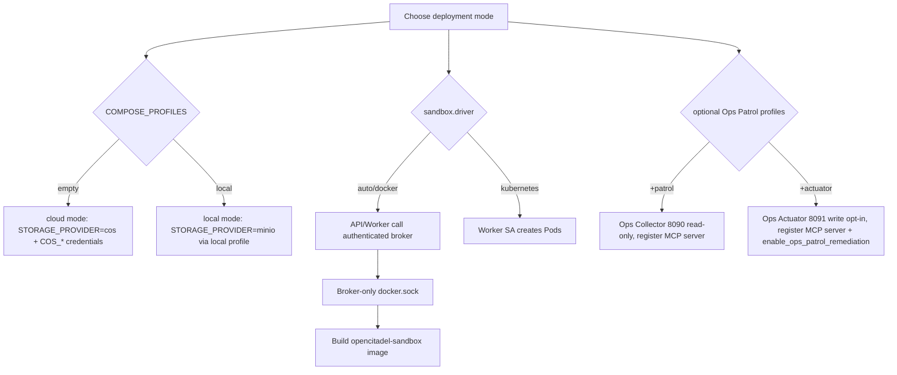

[简体中文](deployment.zh-CN.md)

# OpenCitadel Production Deployment Guide

## 📋 Server recommendations

| Item | Recommendation |
|------|----------------|
| **OS** | Ubuntu 24.04 LTS or equivalent Linux |
| **CPU / RAM** | Production: 8 cores / 16 GB minimum |
| **Disk** | 100 GB+ SSD; scale with file and log retention |
| **Bandwidth** | Size for user count and file upload volume |

---

## 🚀 Quick deploy (5 minutes)

For a local trial with minimal setup, see [Self-host in 10 minutes](../tutorials/01-self-host-10-minutes.md) (`make quickstart` builds the sandbox image and defaults to local MinIO).

For production server deploy, continue below.

### 1. Server initialization

```bash
# SSH into the server
ssh root@YOUR_SERVER_IP

# Update the system
sudo apt update && sudo apt upgrade -y

# Install basic tools
sudo apt install -y curl wget git vim ufw
```

### 2. Install Docker

```bash
# Install Docker
curl -fsSL https://get.docker.com | bash

# Enable and start Docker
sudo systemctl enable docker
sudo systemctl start docker

# Install Docker Compose
sudo curl -L "https://github.com/docker/compose/releases/latest/download/docker-compose-$(uname -s)-$(uname -m)" -o /usr/local/bin/docker-compose
sudo chmod +x /usr/local/bin/docker-compose

# Verify installation
docker --version
docker-compose --version

# Add the current user to the docker group (avoid sudo on every command)
sudo usermod -aG docker $USER
newgrp docker
```

### 3. Deploy the application

```bash
# Clone the repository
cd /opt
git clone https://github.com/OceaLong/opencitadel.git opencitadel
cd opencitadel

# Create environment file
cp .env.example .env

# Edit configuration (see configuration section below)
vim .env
vim api/config.yaml

# Build sandbox image (dynamic mode does not start a fixed opencitadel-sandbox service by default, but the image is required for Worker-created sandboxes)
docker compose build opencitadel-sandbox opencitadel-api opencitadel-worker opencitadel-ui

# Build and start services
docker compose up -d --build

# Check service status (includes opencitadel-migrate / opencitadel-api / opencitadel-worker)
docker compose ps
docker compose logs -f
```

> **Dynamic sandbox mode**: When `sandbox.address: null`, API/Worker call
> `opencitadel-sandbox-broker`; only that narrow, token-authenticated service
> mounts `docker.sock`. Sandboxes join the externally isolated
> `opencitadel-sandbox-network`, not the PostgreSQL/Redis network. Their sole
> Internet path is `opencitadel-sandbox-egress` (Squid), whose destination ACLs
> deny private, link-local, reserved, and metadata ranges.

> **Startup order**: PostgreSQL + Redis + sandbox egress → migrate (Alembic +
> LLM key migration) → API + worker → UI → Nginx.

> **Agent Worker is required**: If `opencitadel-worker` is not running, chat requests are queued but agents will not execute. Use `docker compose logs -f opencitadel-worker` to troubleshoot.

### 3.1 Docker build mirror settings (optional)

`docker-compose.yml` injects unified build args for Python and npm services. Defaults use Aliyun PyPI and npmmirror to avoid `files.pythonhosted.org` timeouts. Override in `.env` or your shell for corporate networks:

```bash
# Example: private PyPI proxy
export PIP_INDEX_URL=https://pypi.mycompany.internal/simple/
export PIP_TRUSTED_HOST=pypi.mycompany.internal
export UV_INDEX_URL=https://pypi.mycompany.internal/simple/
export UV_HTTP_TIMEOUT=600
export NPM_CONFIG_REGISTRY=https://npm.mycompany.internal/

docker compose build
docker compose up -d
```

| Variable | Default | Purpose |
|----------|---------|---------|
| `PIP_INDEX_URL` | Aliyun PyPI | `pip install uv` |
| `UV_INDEX_URL` | Aliyun PyPI | `uv sync --frozen` |
| `UV_VERSION` | `0.11.19` | Pinned uv version at build time |
| `UV_HTTP_TIMEOUT` | `300` | HTTP timeout (seconds) for `uv sync` wheel downloads |
| `NPM_CONFIG_REGISTRY` | npmmirror | npm for sandbox / ui |

Built application images are named: `opencitadel-api`, `opencitadel-worker`, `opencitadel-migrate`, `opencitadel-ui`, `opencitadel-sandbox`, and the optional `opencitadel-ops-collector` and `opencitadel-ops-actuator`.

> **CI/CD note**: [`.github/workflows/ci.yml`](../../.github/workflows/ci.yml)
> runs API, UI, sandbox, Ops Collector, and Ops Actuator tests; builds and Trivy-scans all seven images; and
> validates Compose, Helm, Squid, and documentation on every PR and `main`
> push. [`.github/workflows/security.yml`](../../.github/workflows/security.yml)
> adds Gitleaks history scanning, dependency review/audits, CodeQL, and Trivy
> filesystem/IaC scanning. Dependabot covers GitHub Actions, uv, npm, and
> Docker. Tagged releases use full-SHA-pinned Actions to publish
> `linux/amd64` + `linux/arm64` images with digest scans, SBOM, maximum
> provenance, and registry attestations. See [CI and release security
> gates](#ci-and-release-security-gates).

---

## ⚙️ Core configuration

### Deployment mode (.env)

Choose the deployment mode with two variables at the top of `.env`:


```mermaid
flowchart TD
  Start["Choose deployment mode"] --> Profile{"COMPOSE_PROFILES"}
  Profile -->|"empty"| Cloud["cloud mode: STORAGE_PROVIDER=cos + COS_* credentials"]
  Profile -->|"local"| Local["local mode: STORAGE_PROVIDER=minio via local profile"]
  Start --> SandboxDriver{"sandbox.driver"}
  SandboxDriver -->|"auto/docker"| Broker["API/Worker call authenticated broker"]
  SandboxDriver -->|"kubernetes"| K8sRBAC["Worker SA creates Pods"]
  Broker --> DockerSock["Broker-only docker.sock"]
  DockerSock --> BuildImg["Build opencitadel-sandbox image"]
  Start --> OpsPatrol{"optional Ops Patrol profiles"}
  OpsPatrol -->|"+patrol"| Collector["Ops Collector 8090 read-only, register MCP server"]
  OpsPatrol -->|"+actuator"| Actuator["Ops Actuator 8091 write opt-in, register MCP server + enable_ops_patrol_remediation"]
```

| Mode | `COMPOSE_PROFILES` | `STORAGE_PROVIDER` | Required |
|------|-------------------|-------------------|----------|
| **cloud** (default) | empty | `cos` | `COS_*` credentials |
| **local** | `local` | `minio` | MinIO defaults work out of the box |

Optional profiles are additive — combine with `local`/cloud via a comma-separated `COMPOSE_PROFILES` (e.g. `COMPOSE_PROFILES=local,patrol`):

| Profile | Adds | Purpose |
|---------|------|---------|
| `fixed-sandbox` | `opencitadel-sandbox` service | Persistent sandbox container instead of Worker-created dynamic sandboxes |
| `patrol` | `opencitadel-ops-collector` (8090) | Read-only MCP probes for Ops Patrol; see [Ops Patrol operations](ops-patrol.md) |
| `actuator` | `opencitadel-ops-actuator` (8091) | Approval-gated write MCP for Ops Patrol Remediation; disabled by default |
| `demo` | `ops-console` | Sample ticketing backend for the Web Operator / remediation tutorials |

### cloud mode

Generate each secret independently in a protected operator shell:

```bash
for name in API_KEY_SECRET AUDIT_SIGNING_KEY JWT_SECRET SESSION_SECRET \
  SANDBOX_BROKER_TOKEN; do
  printf '%s=%s\n' "$name" "$(openssl rand -hex 32)"
done
```

Paste those outputs into `.env`; command substitution is not evaluated inside
an env file. The template below intentionally uses placeholders, which
production startup rejects until replaced:

```bash
COMPOSE_PROFILES=
STORAGE_PROVIDER=cos

ENV=production
LOG_LEVEL=INFO
API_KEY_SECRET=<UNIQUE_64_HEX_VALUE>
API_KEY_SECRET_ID=primary
API_KEY_PREVIOUS_SECRETS={}
AUDIT_SIGNING_KEY=<DIFFERENT_UNIQUE_64_HEX_VALUE>
AUDIT_SIGNING_KEY_ID=primary
AUDIT_PREVIOUS_SIGNING_KEYS={}
JWT_SECRET=<DIFFERENT_UNIQUE_64_HEX_VALUE>
SESSION_SECRET=<DIFFERENT_UNIQUE_64_HEX_VALUE>
SANDBOX_BROKER_TOKEN=<DIFFERENT_UNIQUE_64_HEX_VALUE>
BOOTSTRAP_ADMIN_EMAIL=admin@example.com
BOOTSTRAP_ADMIN_PASSWORD=<STRONG_12_PLUS_CHARACTER_PASSWORD>
COOKIE_DOMAIN=
COOKIE_SECURE=true
FRONTEND_BASE_URL=https://your-domain.com
OAUTH_REDIRECT_BASE=https://your-domain.com/api/auth/oauth
GOOGLE_CLIENT_ID=
GOOGLE_CLIENT_SECRET=
GITHUB_CLIENT_ID=
GITHUB_CLIENT_SECRET=
USE_DB_APP_CONFIG=true
TRUSTED_PROXY_CIDRS=<EXACT_INGRESS_PROXY_CIDRS>
OUTBOUND_ALLOWED_PORTS=80,443,8080,8443,11434
OUTBOUND_PRIVATE_HOST_ALLOWLIST=

POSTGRES_ADMIN_USER=postgres
POSTGRES_ADMIN_PASSWORD=<DISTINCT_16_PLUS_CHARACTER_ADMIN_PASSWORD>
POSTGRES_USER=opencitadel_app
POSTGRES_PASSWORD=<DIFFERENT_16_PLUS_CHARACTER_APP_PASSWORD>
POSTGRES_DB=opencitadel
POSTGRES_HOST=opencitadel-postgres

REDIS_HOST=opencitadel-redis
REDIS_PORT=6379
REDIS_DB=0
REDIS_PASSWORD=<STRONG_16_PLUS_CHARACTER_REDIS_PASSWORD>

COS_SECRET_ID=<YOUR_COS_SECRET_ID>
COS_SECRET_KEY=<YOUR_COS_SECRET_KEY>
COS_REGION=ap-guangzhou
COS_BUCKET=<YOUR_BUCKET_NAME>
COS_DOMAIN=<YOUR_COS_DOMAIN>

NGINX_PORT=8088
NGINX_HTTPS_PORT=443
OPENCITADEL_DOMAIN=
HTTPS_ENABLED=false
```

### local mode

```bash
COMPOSE_PROFILES=local
STORAGE_PROVIDER=minio

ENV=production
LOG_LEVEL=INFO
API_KEY_SECRET=<UNIQUE_64_HEX_VALUE>
API_KEY_SECRET_ID=primary
API_KEY_PREVIOUS_SECRETS={}
AUDIT_SIGNING_KEY=<DIFFERENT_UNIQUE_64_HEX_VALUE>
AUDIT_SIGNING_KEY_ID=primary
AUDIT_PREVIOUS_SIGNING_KEYS={}
JWT_SECRET=<DIFFERENT_UNIQUE_64_HEX_VALUE>
SESSION_SECRET=<DIFFERENT_UNIQUE_64_HEX_VALUE>
SANDBOX_BROKER_TOKEN=<DIFFERENT_UNIQUE_64_HEX_VALUE>
BOOTSTRAP_ADMIN_EMAIL=admin@example.com
BOOTSTRAP_ADMIN_PASSWORD=<STRONG_12_PLUS_CHARACTER_PASSWORD>
COOKIE_DOMAIN=
COOKIE_SECURE=true
FRONTEND_BASE_URL=https://your-domain.com
OAUTH_REDIRECT_BASE=https://your-domain.com/api/auth/oauth
USE_DB_APP_CONFIG=true
TRUSTED_PROXY_CIDRS=<EXACT_INGRESS_PROXY_CIDRS>
OUTBOUND_ALLOWED_PORTS=80,443,8080,8443,11434

POSTGRES_ADMIN_USER=postgres
POSTGRES_ADMIN_PASSWORD=<DISTINCT_16_PLUS_CHARACTER_ADMIN_PASSWORD>
POSTGRES_USER=opencitadel_app
POSTGRES_PASSWORD=<DIFFERENT_16_PLUS_CHARACTER_APP_PASSWORD>
POSTGRES_DB=opencitadel
POSTGRES_HOST=opencitadel-postgres

REDIS_HOST=opencitadel-redis
REDIS_PORT=6379
REDIS_DB=0
REDIS_PASSWORD=<STRONG_16_PLUS_CHARACTER_REDIS_PASSWORD>

# Required only when using the host Ollama endpoint below.
OUTBOUND_PRIVATE_HOST_ALLOWLIST=host.docker.internal

# MinIO defaults work out of the box
MINIO_ENDPOINT=opencitadel-minio:9000
MINIO_ACCESS_KEY=minioadmin
MINIO_SECRET_KEY=minioadmin
MINIO_BUCKET=opencitadel
MINIO_SECURE=false

NGINX_PORT=8088
```

`API_KEY_SECRET`, `AUDIT_SIGNING_KEY`, `JWT_SECRET`, and `SESSION_SECRET` must
be four distinct values of at least 32 characters. The sandbox broker token
must also be at least 32 characters; both PostgreSQL credentials must be
distinct, and Redis authentication is mandatory. `COOKIE_SECURE=false` is only
for local evaluation with `ENV=development`, never this production template.
Set `TRUSTED_PROXY_CIDRS` only to the actual ingress/reverse-proxy peers, and
add private egress hosts by exact hostname rather than wildcard.

For local LLM, keep the exact `OUTBOUND_PRIVATE_HOST_ALLOWLIST=host.docker.internal`
entry above, then add an **endpoint** in Settings → Models with Provider=ollama,
`base_url=http://host.docker.internal:11434/v1`, and add a **model** under it.

Behavior settings (CORS, rate limits, sandbox, memory, worker concurrency, OTEL, etc.) belong in `api/config.yaml`, not `.env`.

### Upload size limits

Do not assume a single global upload cap. Align all layers when changing limits:

| Layer | Limit | Config / code |
|-------|-------|---------------|
| Nginx gateway | 200 MB | `nginx/nginx.conf` → `client_max_body_size 200m` |
| Codebase ZIP | 200 MB | `ui/src/lib/constants.ts` → `CODEBASE_ZIP_MAX_BYTES` |
| Knowledge base document | 50 MB default | AppConfig `knowledge_base.document.max_bytes` |

See [Nginx gateway](../../nginx/README.md), [Config source governance](../architecture/config-source-governance.md), and [Knowledge base ingestion](../architecture/knowledge-base-ingestion.md).

### Runtime configuration (api/config.yaml)

Docker Compose mounts `./api/config.yaml` into API/Worker containers at `/app/config.yaml`.

```yaml
server:
  cors_origins: '*'
  rate_limit_enabled: true
  rate_limit_per_minute: 120

agent_config:
  max_iterations: 100
  max_retries: 3
  max_search_results: 10

sandbox:
  address: null
  image: opencitadel-sandbox
  name_prefix: opencitadel-sandbox
  network: opencitadel-network
  memory_limit: 1g
  pool_enabled: false
  pool_size: 1          # Pre-warm only 1; concurrent tasks create on demand, capped by worker.max_concurrent_tasks
  ttl_minutes: 20
  idle_timeout_minutes: 10
  cleanup_interval_seconds: 60

memory:
  vector_enabled: false
  embedding:
    provider: openai
    model: text-embedding-3-small
    base_url: https://api.openai.com/v1

observability:
  otel_enabled: false
  otel_service_name: opencitadel-api

mcp_config:
  mcpServers:
    amap-maps-streamableHTTP:
      transport: streamable_http
      enabled: true
      url: https://mcp.amap.com/mcp?key=YOUR_AMAP_KEY

a2a_config:
  a2a_servers: []
```

See [MCP integrations](../tutorials/03-mcp-integrations.md) for configuring MCP servers.

### Models, Skills, and memory

- **Default models are not imported on first boot.** In Settings → Model Management, add an **endpoint** (Provider / Base URL / API Key) first, then add multiple **models** under the same endpoint (differing only by model name), and set a default before starting a chat. Connection settings live in PostgreSQL `llm_endpoints`; models live in `llm_models`. API keys are encrypted with `API_KEY_SECRET`.
- The `llm_endpoints.api_key_encryption` field indicates storage format:
  `legacy_plaintext` (historical plaintext), `fernet_v1` (legacy unversioned
  Fernet), or `fernet_v2` (current key-id-prefixed Fernet).
  `opencitadel-migrate` encrypts plaintext automatically after Alembic.
  Updating an endpoint URL or API key applies to all models under that
  endpoint.
- Built-in Skill templates (coding assistant, research, data analysis, content writing) are created automatically; customize them in Settings → Skill Templates.
- Long-term memory is managed in Settings → Long-term Memory (global and session scopes). Relevant memories are recalled at task start (time decay + optional pgvector hybrid search).
- Enable vector memory with `memory.vector_enabled: true` in `config.yaml` and `EMBEDDING_API_KEY` in `.env`. PostgreSQL uses the `pgvector/pgvector:pg16` image.
- Session detail pages show agent session memory with compress, clear, or delete actions per message.

### Database migrations

Migrations run automatically via the **`opencitadel-migrate` one-shot init job**: Alembic schema migrations first, then encryption of legacy plaintext LLM API keys. The API only validates schema version at startup—it no longer runs `alembic upgrade` in lifespan.

```bash
# Normal deploy: docker compose up runs opencitadel-migrate
docker compose up -d --build

# Manual migration (version upgrade or troubleshooting)
docker compose run --rm opencitadel-migrate
# Or inside the api container:
docker compose exec opencitadel-api python -m app.migrate

# Local development (equivalent to python -m app.migrate)
cd api && ./migrate.sh
```

Recent migrations include `memory_entries.embedding vector(1536)` (pgvector extension).

#### New Compose database volume

On the first PostgreSQL start,
`/docker-entrypoint-initdb.d/10-opencitadel-app-role.sh` creates the distinct
`NOSUPERUSER NOBYPASSRLS` application role and transfers the database/schema to
it before `opencitadel-migrate` runs:

```bash
docker compose up -d opencitadel-postgres opencitadel-redis
docker compose run --rm opencitadel-migrate
docker compose up -d
```

#### Existing Compose database volume

Initialization scripts do not rerun for an existing data directory. Use this
ordered, in-place procedure; never delete the production volume.
`POSTGRES_ADMIN_PASSWORD` must still match the existing database admin role
during this migration—rotate that database password separately:

```bash
# 1. Stop application writers and take an admin-role backup.
docker compose stop opencitadel-api opencitadel-worker
mkdir -p backups
docker compose exec -T opencitadel-postgres sh -ceu \
  'pg_dump -U "$POSTGRES_USER" "$POSTGRES_DB"' \
  > "backups/opencitadel-before-app-role-$(date +%Y%m%d%H%M%S).sql"

# 2. After .env contains distinct POSTGRES_ADMIN_* and POSTGRES_* values,
# recreate only PostgreSQL so the checked-in script and new env are mounted.
docker compose up -d --force-recreate opencitadel-postgres

# 3. Run the idempotent role and relation-ownership migration.
docker compose exec -T opencitadel-postgres \
  /docker-entrypoint-initdb.d/10-opencitadel-app-role.sh

# 4. Both booleans must be false; wrong_owner must be 0.
docker compose exec -T opencitadel-postgres sh -ceu '
  psql -v ON_ERROR_STOP=1 -U "$POSTGRES_USER" -d "$POSTGRES_DB" \
    -v app_user="$OPENCITADEL_APP_USER"
' <<'SQL'
SELECT rolname, rolsuper, rolbypassrls
FROM pg_roles
WHERE rolname = :'app_user';
SELECT count(*) AS wrong_owner
FROM pg_class c
JOIN pg_namespace n ON n.oid = c.relnamespace
WHERE n.nspname = 'public'
  AND c.relkind IN ('r', 'p', 'S', 'v', 'm', 'f')
  AND pg_get_userbyid(c.relowner) <> :'app_user';
SQL

# 5. Only now run schema/data migrations and restart writers.
docker compose run --rm opencitadel-migrate
docker compose up -d opencitadel-api opencitadel-worker opencitadel-ui nginx
curl --fail http://127.0.0.1:8088/api/status
```

### Storage backend switch and migration

When switching COS ↔ MinIO in the same environment, migrate object data first (the database stores keys only, not backend type). A built-in CLI supports full-bucket copy and verification:

```bash
# 1. Ensure .env has credentials for both source and target
# 2. COS -> MinIO (local profile ensures minio is running)
COMPOSE_PROFILES=local docker compose run --rm opencitadel-api \
  python -m app.migrate_storage --source cos --target minio

# 3. Verify
COMPOSE_PROFILES=local docker compose run --rm opencitadel-api \
  python -m app.migrate_storage --source cos --target minio --verify-only

# 4. Switch .env: STORAGE_PROVIDER=minio, then restart
docker compose up -d opencitadel-api opencitadel-worker
```

Recommended flow: low-traffic / read-only window → migrate → verify → change `STORAGE_PROVIDER` → restart → spot-check historical attachments, screenshots, checkpoints. Keep source objects for rollback.

Optional flags: `--dry-run` (list differences only), `--prefix logs/` (limit prefix), `--concurrency 8`.

### CI and release security gates

Local validation is fast feedback, not a replacement for the repository's
Docker/PostgreSQL/Helm-backed CI:

| Workflow | Required controls |
|----------|-------------------|
| `ci.yml` | Full API pytest against PostgreSQL/Redis, UI i18n/typecheck/lint/test/build, sandbox/Collector/Actuator tests, seven image builds with Trivy `HIGH,CRITICAL` blocking, Compose render, Squid parse, Helm/Kustomize checks, documentation checks |
| `security.yml` | Gitleaks full-history scan; PR dependency review blocks `high` severity and GPL-3.0/AGPL-3.0; Python and production npm audits; CodeQL `security-extended` for Python and JavaScript/TypeScript; Trivy vulnerability/secret/IaC scan blocks `HIGH,CRITICAL` |
| `dependabot.yml` | Weekly GitHub Actions, uv, npm, and Docker update groups |
| `release.yml` | Full-SHA-pinned Actions; seven `linux/amd64` + `linux/arm64` images; built-digest Trivy scan; SBOM; `provenance: mode=max`; registry attestations |

Run `./scripts/check-docs.sh`, Compose rendering, and shell/YAML parsing locally.
Require the hosted checks before release because they also exercise clean
dependency installs, image builds, PostgreSQL migration, Helm rendering, and
security scanners.

---

## 🔒 Security hardening

### 1. Firewall

```bash
# Enable UFW
sudo ufw enable

# Allow SSH
sudo ufw allow 22/tcp

# Allow application port
sudo ufw allow 8088/tcp

# View rules
sudo ufw status verbose
```

See [Security model](../architecture/security-model.md) for trust boundaries and sandbox isolation.

### 2. Docker resource limits

OpenCitadel's Compose file uses top-level `mem_limit` and `cpus` on each service (compatible with `docker compose up`). Example from the shipped `docker-compose.yml`:

```yaml
services:
  opencitadel-api:
    mem_limit: 640m
    cpus: 2
```

Do **not** rely on `deploy.resources` unless you run Compose in Swarm mode. Adjust limits to match your host memory budget (see [Memory budget](#memory-budget-16-gb-host-right-sized) below).

### 3. Backup strategy

```bash
# Create backup script
cat > /opt/opencitadel/backup.sh << 'EOF'
#!/bin/bash
BACKUP_DIR="/opt/backups/opencitadel"
DATE=$(date +%Y%m%d_%H%M%S)

mkdir -p $BACKUP_DIR

# Backup PostgreSQL
docker exec opencitadel-postgres pg_dump -U postgres opencitadel > $BACKUP_DIR/db_$DATE.sql

# Compress backup
tar -czf $BACKUP_DIR/backup_$DATE.tar.gz -C $BACKUP_DIR db_$DATE.sql
rm $BACKUP_DIR/db_$DATE.sql

# Keep last 7 days
find $BACKUP_DIR -name "backup_*.tar.gz" -mtime +7 -delete

echo "Backup completed: backup_$DATE.tar.gz"
EOF

chmod +x /opt/opencitadel/backup.sh

# Cron (daily at 2 AM)
crontab -e
# Add: 0 2 * * * /opt/opencitadel/backup.sh >> /var/log/opencitadel-backup.log 2>&1
```

---

## 📊 Monitoring and logs

### 1. Service status

```bash
# All container status
docker-compose ps

# Live logs
docker-compose logs -f opencitadel-api
docker-compose logs -f opencitadel-ui
docker-compose logs -f opencitadel-nginx

# Resource usage
docker stats
```

### 2. Health checks

```bash
# API health
curl http://localhost:8088/api/status

# Prometheus metrics
curl http://localhost:8088/api/metrics

# Frontend
curl -I http://localhost:8088

# Database
docker exec opencitadel-postgres pg_isready -U postgres

# Worker
docker compose logs --tail=50 opencitadel-worker
```

### 3. Log rotation

```bash
# Configure Docker log rotation
cat > /etc/docker/daemon.json << 'EOF'
{
  "log-driver": "json-file",
  "log-opts": {
    "max-size": "100m",
    "max-file": "3"
  }
}
EOF

# Restart Docker
sudo systemctl restart docker
```

---

## 🔄 Operations

### Service management

```bash
# Start all services
cd /opt/opencitadel
docker-compose up -d

# Stop all services
docker-compose down

# Restart a single service
docker compose restart opencitadel-api
docker compose restart opencitadel-worker

# Scale Worker replicas (remove container_name in compose or use a scale profile)
# docker compose up -d --scale opencitadel-worker=2

# Rebuild and start
docker-compose up -d --build

# Service logs
docker-compose logs -f --tail=100 opencitadel-api
```

### Version updates

```bash
cd /opt/opencitadel
git pull origin main
docker compose build
docker compose up -d --build
docker image prune -f
```

### Database maintenance

```bash
# Open psql
docker exec -it opencitadel-postgres psql -U postgres -d opencitadel

# Run migrations
docker compose run --rm opencitadel-migrate

# Restore from backup
docker exec -i opencitadel-postgres psql -U postgres opencitadel < backup.sql
```

### Credential encryption and audit signing-key rotation

Normal deployment runs `python -m app.migrate`, which converts historical
`legacy_plaintext` endpoint credentials without logging secret material.
`python -m app.migrate_llm_api_keys` remains a legacy-repair command; use the
versioned rotation below when changing the encryption key.

#### Rotate `API_KEY_SECRET`

1. Enter a maintenance window, back up the database and `.env` through the
   approved secret store, then stop credential writers:

   ```bash
   docker compose stop opencitadel-api opencitadel-worker
   ```

2. Preserve the old id/secret in JSON and set a new active id/secret:

   ```bash
   API_KEY_SECRET=<NEW_UNIQUE_64_HEX_VALUE>
   API_KEY_SECRET_ID=2026-07-primary
   API_KEY_PREVIOUS_SECRETS={"primary":"<OLD_API_KEY_SECRET>"}
   ```

3. Rotate all non-empty endpoint records before removing the old key:

   ```bash
   docker compose run --rm opencitadel-migrate \
     python -m app.migrate_llm_api_key_rotation
   ```

4. Verify `fernet_v2` and the active id, then restart API and Worker:

   ```bash
   docker compose exec -T opencitadel-postgres sh -ceu '
     psql -v ON_ERROR_STOP=1 -U "$POSTGRES_USER" -d "$POSTGRES_DB"
   ' <<'SQL'
   SELECT api_key_encryption,
          split_part(api_key, '.', 2) AS key_id,
          count(*) AS endpoints
   FROM llm_endpoints
   WHERE coalesce(api_key, '') <> ''
   GROUP BY api_key_encryption, split_part(api_key, '.', 2)
   ORDER BY api_key_encryption, key_id;
   SQL
   docker compose up -d --force-recreate \
     opencitadel-api opencitadel-worker
   ```

   Every non-empty row must report `fernet_v2` and `2026-07-primary`. Keep the
   previous key through the rollback/backup verification window. Immediately
   before removing it, rerun the rotation and query; a removed key cannot
   decrypt any record or backup that still references its id.

#### Rotate `AUDIT_SIGNING_KEY`

Audit rows are append-only and retain their `signing_key_id`; they are not
rewritten during rotation. Preserve every old signing key required by retained
rows:

```bash
AUDIT_SIGNING_KEY=<NEW_DISTINCT_64_HEX_VALUE>
AUDIT_SIGNING_KEY_ID=2026-07-audit
AUDIT_PREVIOUS_SIGNING_KEYS={"primary":"<OLD_AUDIT_SIGNING_KEY>"}
```

As an `ADMIN` or `AUDITOR`, verify the global chain before the change, restart
all writers, then verify again:

```bash
curl --fail --cookie "access_token=${ADMIN_OR_AUDITOR_ACCESS_TOKEN}" \
  https://your-domain.com/api/admin/audit/verify-chain
docker compose up -d --force-recreate \
  opencitadel-api opencitadel-worker opencitadel-migrate
curl --fail --cookie "access_token=${ADMIN_OR_AUDITOR_ACCESS_TOKEN}" \
  https://your-domain.com/api/admin/audit/verify-chain
```

The response must contain `"ok": true`. Remove an old audit verification key
only after no retained row or evidence package uses its id; append-only
historical rows otherwise become unverifiable. Alert on
`AUDIT_CHAIN_INTEGRITY_FAILURE`. The chain and database trigger are tamper
evidence, so export regulated audit data to external immutable/WORM storage.

### Production security verification

After a new deployment, role migration, or key rotation, record these checks
with the change ticket:

```bash
# PostgreSQL role flags and wrong_owner=0: use the queries in
# "Existing Compose database volume" above.

# Schema is at Alembic head.
docker compose run --rm opencitadel-migrate alembic current

# Redis authentication is enabled and succeeds.
docker compose exec -T opencitadel-redis sh -ceu \
  'test -n "$REDIS_PASSWORD"; redis-cli --no-auth-warning -a "$REDIS_PASSWORD" ping'

# Narrow sandbox broker and Squid egress proxy are healthy.
docker compose exec -T opencitadel-api \
  curl --fail http://opencitadel-sandbox-broker:8090/healthz
docker inspect --format '{{.State.Health.Status}}' \
  opencitadel-sandbox-egress

# Public health and authenticated audit-chain integrity.
curl --fail https://your-domain.com/api/status
curl --fail --cookie "access_token=${ADMIN_OR_AUDITOR_ACCESS_TOKEN}" \
  https://your-domain.com/api/admin/audit/verify-chain
```

---

## 🛠️ Troubleshooting

### Common issues

#### 1. Docker build failure (`uv sync` timeout)

If `docker compose build` fails at `RUN uv sync --frozen` with `Failed to download` or `UV_HTTP_TIMEOUT current value: 30s`:

```bash
# Confirm build args (should show UV_HTTP_TIMEOUT: "300")
docker compose config | grep -A5 UV_HTTP_TIMEOUT

# Increase timeout on slow networks (seconds)
export UV_HTTP_TIMEOUT=600
docker compose build opencitadel-api opencitadel-worker opencitadel-migrate opencitadel-sandbox

# Confirm PyPI mirror
export UV_INDEX_URL=https://mirrors.aliyun.com/pypi/simple/
docker compose build opencitadel-api
```

Built images should be named `opencitadel-api`, `opencitadel-worker`, `opencitadel-migrate`, `opencitadel-ui`, `opencitadel-sandbox`—not `opencitadel-opencitadel-*`.

#### 2. Container startup failure

```bash
# Detailed logs
docker compose logs opencitadel-api

# Check configuration
docker exec -it opencitadel-api printenv API_KEY_SECRET ENV SQLALCHEMY_DATABASE_URI
docker exec -it opencitadel-api cat /app/config.yaml

# Network
docker network inspect opencitadel-network
```

#### 3. Database connection failure

If `opencitadel-migrate` reports `password authentication failed`:

- The database container uses `POSTGRES_ADMIN_*` only for bootstrap/administration. API, worker, and migrations use the distinct `POSTGRES_*` application role.
- The application role must be `NOSUPERUSER NOBYPASSRLS`; production startup rejects a role that can bypass RLS.
- PostgreSQL initialization scripts run only for a **new data directory**. Existing volumes must be migrated in place before switching `POSTGRES_USER`; do not delete a production volume.
- Do not keep a stale `SQLALCHEMY_DATABASE_URI`, because it overrides the URI derived from `POSTGRES_*`.

```bash
# Database status
docker compose logs opencitadel-postgres

# URI derived from POSTGRES_* (migrate container)
docker compose run --rm opencitadel-migrate python -c "from core.config import get_settings; print(get_settings().sqlalchemy_database_uri)"
```

For an existing data volume, follow [Existing Compose database
volume](#existing-compose-database-volume) from backup through `wrong_owner=0`;
do not skip directly to the migrate job.

#### 4. Memory pressure / swap thrashing

On a 16 GB host, sustained memory >95% with high disk read IO usually means **overcommit + swap paging**, not CPU shortage.

```bash
# Collect before/after metrics (non-zero si/so = swap thrashing)
bash deploy/scripts/verify-host-health.sh before
bash deploy/scripts/verify-host-health.sh after

# Memory and container quotas
free -h
swapon --show
vmstat 1 5
docker stats --no-stream
docker ps -a --filter "name=opencitadel-sandbox-"

# Host tuning (4G swap safety net + vm.swappiness=10 + Docker log rotation)
sudo bash deploy/scripts/host-tune.sh

# Apply right-sized compose and config (see docker-compose.yml / api/config.yaml)
cd /opt/opencitadel && docker compose up -d --build

# Prune unused images/containers (avoid --volumes; deletes DB volumes)
docker system prune -a -f
```

**Memory budget (16 GB host, right-sized)**

| Service | mem_limit |
|---------|-----------|
| postgres | 1024m |
| api | 640m |
| worker | 1024m |
| ui | 384m |
| redis | 512m |
| nginx | 128m |
| sandboxes (1 pre-warm + up to 3 on demand) | 1~4g |

#### 5. Nginx 502

```bash
# Backend services
docker-compose ps opencitadel-api opencitadel-ui

# Nginx config test
docker exec opencitadel-nginx nginx -t

# Reload Nginx
docker exec opencitadel-nginx nginx -s reload
```

---

## 🔄 Memory-safe architecture upgrade and rollback

### Upgrade (existing instance)

```bash
# 1. Backup
docker exec opencitadel-postgres pg_dump -U postgres opencitadel > backup_$(date +%Y%m%d).sql
cp .env .env.bak && cp api/config.yaml api/config.yaml.bak

# 2. Pull and rebuild
git pull
docker compose build opencitadel-sandbox opencitadel-api opencitadel-worker opencitadel-ui
docker compose up -d

# 3. Verify Worker startup reconcile (adopts existing opencitadel-sandbox-*)
docker compose logs opencitadel-worker | tail -50
docker stats
free -m
```

### Rollback

No database schema change—restore old config:

```bash
cp .env.bak .env && cp api/config.yaml.bak api/config.yaml
docker compose up -d
```

### New settings (api/config.yaml worker/sandbox)

| Setting | Default | Description |
|---------|---------|-------------|
| `sandbox.driver` | `auto` | `docker` / `kubernetes` |
| `worker.max_sandboxes_per_node` | 4 | Hard per-node sandbox quota |
| `worker.admission_min_host_available_mb` | 3072 | Do not create sandboxes below this free memory |
| `worker.admission_reclaim_enabled` | true | Reclaim idle sandboxes under memory pressure |
| `sandbox.pool_enabled` | false | Disable always-on pre-warmed sandboxes |

---

## 📈 Performance tuning

### 1. Host tuning (recommended after first deploy)

```bash
# One-shot: vm.swappiness=10, 4G swap safety net, Docker log rotation
sudo bash deploy/scripts/host-tune.sh

# Verify (si/so should be 0 after tuning; memory idle <80%)
bash deploy/scripts/verify-host-health.sh after
```

> **Do not** run `swapoff -a` while memory is still overcommitted: swap thrashing becomes OOM kills. Right-size `docker-compose.yml` and `api/config.yaml` first, then keep a small swap as a safety net.

### 2. Container and sandbox quotas

Right-sized in [docker-compose.yml](../../docker-compose.yml) and [api/config.yaml](../../api/config.yaml):

- Core services mem_limit total ~**3.7 GB** (postgres 1G / worker 1G / api 640M / ui 384M / redis 512M / nginx 128M)
- Sandboxes: **on-demand** (`pool_enabled: false`), `memory_limit: 1g`
- Sandbox concurrency: Redis node quota `max_sandboxes_per_node` + memory watermark `admission_min_host_available_mb`
- Task concurrency: `worker.max_concurrent_tasks` (independent of sandbox quota)

### 3. PostgreSQL tuning

Postgres parameters are set in `docker-compose.yml` `command` (matched to 1 GB container limit):

- `shared_buffers = 256MB`
- `effective_cache_size = 768MB`
- `work_mem = 8MB`
- `maintenance_work_mem = 64MB`

After changes: `docker compose up -d opencitadel-postgres`

### 4. Redis

Configured in docker-compose.yml:
- Max memory: 256 MB
- Eviction: allkeys-lru
- AOF persistence: enabled

### 5. Architecture evolution

For horizontal scale after a stable single node, see [Architecture evolution](../architecture/architecture-evolution.md) (external DB/Redis, K8s HPA, external sandbox).

---

## 🔐 HTTPS (optional)

HTTP works out of the box at `http://SERVER_IP:8088`. To enable HTTPS, set domain and certificate variables in `.env` and restart Nginx—no manual Nginx or Compose file edits.

```bash
# .env
OPENCITADEL_DOMAIN=your-domain.com
HTTPS_ENABLED=true
NGINX_PORT=8088
NGINX_HTTPS_PORT=443

docker compose up -d opencitadel-nginx
```

Full domain binding, certificate setup (Let's Encrypt or custom), verification, and rollback: **[HTTPS & domain setup](https-domain-setup.md)**.

---

## ☸️ Kubernetes / Helm deployment

Helm chart at `deploy/helm/opencitadel/` supports full-stack deploy (Postgres/Redis/UI/Ingress + API/Worker + K8s Pod sandbox driver + optional read-only Ops Collector + optional write-capable Ops Actuator).

```bash
# Build and push images (api, worker, migrate reuses the api target;
# ops-collector and ops-actuator are optional, only needed for Ops Patrol)
docker build --target api -t your-registry/opencitadel-api ./api
docker build --target worker -t your-registry/opencitadel-worker ./api
docker build --target api -t your-registry/opencitadel-migrate ./api
docker build -t your-registry/opencitadel-ui ./ui
docker build -t your-registry/opencitadel-sandbox ./sandbox
docker build -t your-registry/opencitadel-ops-collector ./ops-collector
docker build -t your-registry/opencitadel-ops-actuator ./ops-actuator
for image in api worker migrate ui sandbox ops-collector ops-actuator; do
  docker push "your-registry/opencitadel-${image}"
done
```

> **Helm note**: the migrate initContainer reuses `image.api` (same Dockerfile target). The separate `opencitadel-migrate` tag is used by Docker Compose one-off jobs and release publishing.

> **kubernetes extra**: `api/Dockerfile` gates the `kubernetes` Python SDK behind `ARG WITH_K8S` (default `1`), required only by the K8s Pod sandbox driver. Published release/CI images always build with `WITH_K8S=1` (full-featured) — Helm/K8s deployments using those images already include the extra, no action needed. The local `docker-compose.yml` build passes `WITH_K8S=0` because Compose only ever runs the Docker sandbox driver. If you build the `api`/`worker`/`migrate` images yourself for a K8s deployment, either omit `WITH_K8S` (defaults to `1`) or pass `--build-arg WITH_K8S=1` explicitly.

```bash
helm upgrade --install opencitadel ./deploy/helm/opencitadel \
  --namespace opencitadel --create-namespace \
  --values production-values.yaml \
  --set image.api.repository=your-registry/opencitadel-api \
  --set image.worker.repository=your-registry/opencitadel-worker \
  --set image.ui.repository=your-registry/opencitadel-ui \
  --set image.sandbox.repository=your-registry/opencitadel-sandbox \
  --set opsCollector.enabled=true \
  --set opsCollector.image.repository=your-registry/opencitadel-ops-collector \
  --set opsActuator.enabled=true \
  --set opsActuator.image.repository=your-registry/opencitadel-ops-actuator \
  --set appConfig.sandbox.driver=kubernetes \
  --set ingress.enabled=true \
  --set replicaCount.worker=2
```

Ops Patrol and Ops Patrol Remediation are optional and disabled by default. Before enabling the read-only Collector or the write-capable Actuator, configure allowlists/registered probes, fixed MCP tool policies, the `enable_ops_patrol` / `enable_ops_patrol_remediation` feature flags, and NetworkPolicy using the dedicated [Ops Patrol operations runbook](ops-patrol.md).

`production-values.yaml` must override every required secret with a secret
manager or protected values mechanism, keep the four application secrets
distinct, use separate PostgreSQL admin/application passwords, enable Redis
authentication, set `networkPolicy.enabled=true`, and narrow
`env.TRUSTED_PROXY_CIDRS` to the ingress controller.

### Existing chart-managed PostgreSQL PVC

`/docker-entrypoint-initdb.d` only runs for a new PVC. Before an upgrade that
introduces the non-bypass application role, use a maintenance window and this
ordered procedure. `production-values.yaml` must retain the existing admin
password while supplying the new application password.

```bash
NS=opencitadel
RELEASE=opencitadel
VALUES=production-values.yaml
APP_USER=opencitadel_app
PG_POD="$(kubectl -n "$NS" get pod \
  -l app.kubernetes.io/component=postgres \
  -o jsonpath='{.items[0].metadata.name}')"

# 1. Stop writers and back up the existing PVC.
kubectl -n "$NS" scale deployment \
  "${RELEASE}-api" "${RELEASE}-worker" --replicas=0
kubectl -n "$NS" exec "$PG_POD" -- sh -ceu \
  'pg_dump -U "$POSTGRES_USER" "$POSTGRES_DB"' \
  > "${RELEASE}-before-app-role-$(date +%Y%m%d%H%M%S).sql"

# 2. Apply only the new Secret and checked-in init-script ConfigMap.
# Do not run the API migrate initContainer yet.
helm template "$RELEASE" ./deploy/helm/opencitadel \
  --namespace "$NS" --values "$VALUES" \
  --show-only templates/secret.yaml \
  --show-only templates/configmap-postgres-init.yaml \
  | kubectl -n "$NS" apply -f -

# 3. Copy the reviewed repository script and read the app password from Secret.
kubectl -n "$NS" cp \
  deploy/helm/opencitadel/files/postgres/init-app-role.sh \
  "$PG_POD:/tmp/init-app-role.sh"
APP_PASSWORD="$(kubectl -n "$NS" get secret "${RELEASE}-secret" \
  -o jsonpath='{.data.POSTGRES_PASSWORD}' | base64 --decode)"

# 4. Create/alter the app role and transfer existing relation ownership.
kubectl -n "$NS" exec "$PG_POD" -- chmod 0500 /tmp/init-app-role.sh
kubectl -n "$NS" exec "$PG_POD" -- env \
  OPENCITADEL_APP_USER="$APP_USER" \
  OPENCITADEL_APP_PASSWORD="$APP_PASSWORD" \
  /tmp/init-app-role.sh

# 5. rolsuper/rolbypassrls must be false; wrong_owner must be 0.
kubectl -n "$NS" exec -i "$PG_POD" -- env \
  OPENCITADEL_APP_USER="$APP_USER" sh -ceu '
    psql -v ON_ERROR_STOP=1 -U "$POSTGRES_USER" -d "$POSTGRES_DB" \
      -v app_user="$OPENCITADEL_APP_USER"
  ' <<'SQL'
SELECT rolname, rolsuper, rolbypassrls
FROM pg_roles
WHERE rolname = :'app_user';
SELECT count(*) AS wrong_owner
FROM pg_class c
JOIN pg_namespace n ON n.oid = c.relnamespace
WHERE n.nspname = 'public'
  AND c.relkind IN ('r', 'p', 'S', 'v', 'm', 'f')
  AND pg_get_userbyid(c.relowner) <> :'app_user';
SQL
unset APP_PASSWORD

# 6. Only after verification may Helm start the migration initContainer.
helm upgrade "$RELEASE" ./deploy/helm/opencitadel \
  --namespace "$NS" --values "$VALUES"
kubectl -n "$NS" rollout status deployment/"${RELEASE}-api"
kubectl -n "$NS" rollout status deployment/"${RELEASE}-worker"
kubectl -n "$NS" get networkpolicy "${RELEASE}-sandbox"
kubectl -n "$NS" exec deployment/"${RELEASE}-api" -- \
  curl --fail http://127.0.0.1:8000/api/status
```

This applies only to chart-managed PostgreSQL. For an external database or
PostgreSQL operator, run
`deploy/helm/opencitadel/files/postgres/init-app-role.sh` through that
platform's approved admin channel before Helm starts its migration
initContainer.

Chart features:
- In-cluster **PostgreSQL (pgvector) / Redis** (StatefulSet + PVC)
- **UI + Ingress** (`/` → UI, `/api` → API)
- Worker **ServiceAccount + RBAC** (pods create/delete/get/list) for K8s sandbox driver
- **No docker.sock mount** under kubernetes driver
- Same admission/reclaim logic as single-node compose via **Redis node quota**

Details: [Helm chart README](../../deploy/helm/opencitadel/README.md).

---

## 🆘 Support

- **Project docs**: [README.md](../../README.md) · [Documentation index](../README.md)
- **Health check**: `GET http://YOUR_SERVER_IP:8088/api/status` (via Nginx)
- **OpenAPI (internal)**: FastAPI serves `/docs` on the API container port 8000 only; Nginx does not expose it on `:8088`. Use `docker compose exec opencitadel-api curl -s localhost:8000/docs` or port-forward for debugging.
- **Logs**: `docker compose logs`
- **Data volumes**: `/var/lib/docker/volumes`

---

**Last updated**: 2026-06-11  
**Applies to**: OpenCitadel v1.0  
**Reference environment**: Ubuntu 24.04 LTS, 8 cores / 16 GB / 270 GB SSD / 18 Mbps
