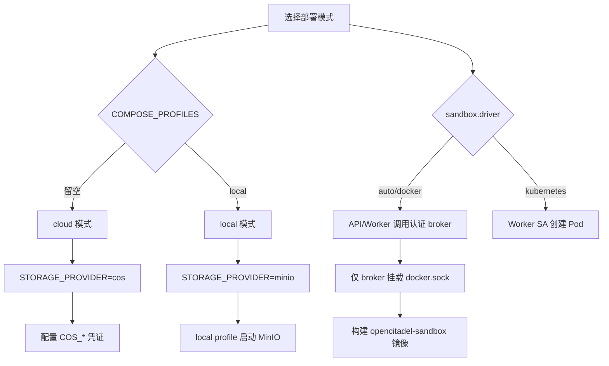

[English](deployment.md)

# OpenCitadel 生产环境部署指南

## 📋 服务器建议

| 项目 | 配置 |
|------|------|
| **操作系统** | Ubuntu 24.04 LTS 或同等 Linux 发行版 |
| **CPU/内存** | 生产建议 8 核 / 16GB 起 |
| **系统盘** | 100GB+ SSD，按文件与日志保留周期扩容 |
| **带宽** | 按用户规模与文件上传需求评估 |

---

## 🚀 快速部署（5分钟）

本地快速体验见 [10 分钟自托管教程](../tutorials/01-self-host-10-minutes.zh-CN.md)（`make quickstart` 会构建沙箱镜像并默认启用本地 MinIO）。

以下为生产服务器部署步骤。

### 1. 服务器初始化

```bash
# SSH登录服务器
ssh root@YOUR_SERVER_IP

# 更新系统
sudo apt update && sudo apt upgrade -y

# 安装必要工具
sudo apt install -y curl wget git vim ufw
```

### 2. 安装 Docker 环境

```bash
# 安装 Docker
curl -fsSL https://get.docker.com | bash -s docker --mirror Aliyun

# 启动 Docker
sudo systemctl enable docker
sudo systemctl start docker

# 安装 Docker Compose
sudo curl -L "https://github.com/docker/compose/releases/latest/download/docker-compose-$(uname -s)-$(uname -m)" -o /usr/local/bin/docker-compose
sudo chmod +x /usr/local/bin/docker-compose

# 验证安装
docker --version
docker-compose --version

# 将当前用户加入 docker 组（避免每次使用 sudo）
sudo usermod -aG docker $USER
newgrp docker
```

### 3. 部署应用

```bash
# 克隆代码
cd /opt
git clone https://github.com/OceaLong/opencitadel.git opencitadel
cd opencitadel

# 创建环境变量文件
cp .env.example .env

# 编辑配置文件（见下方配置说明）
vim .env
vim api/config.yaml

# 构建沙箱镜像（动态模式默认不启动固定 opencitadel-sandbox 服务，但需镜像供 Worker 创建）
docker compose build opencitadel-sandbox opencitadel-api opencitadel-worker opencitadel-ui

# 构建并启动服务
docker compose up -d --build

# 查看服务状态（含 opencitadel-migrate / opencitadel-api / opencitadel-worker）
docker compose ps
docker compose logs -f
```

> **动态沙箱模式**：`sandbox.address: null` 时，API/Worker 调用
> `opencitadel-sandbox-broker`；仅该窄接口、Token 认证服务挂载
> `docker.sock`。沙箱加入无外部默认网关的
> `opencitadel-sandbox-network`，不与 PostgreSQL/Redis 共网；唯一公网出口为
> `opencitadel-sandbox-egress`（Squid），其目标 ACL 拒绝私网、链路本地、
> 保留与元数据网段。

> **服务启动顺序**：PostgreSQL + Redis + 沙箱出口 → migrate（Alembic +
> LLM Key 迁移）→ API + Worker → UI → Nginx。

> **Agent Worker 必须运行**：若 `opencitadel-worker` 未启动，对话请求会写入队列但 Agent 不会执行。可通过 `docker compose logs -f opencitadel-worker` 排查。

### 3.1 Docker 构建期镜像源（可选）

`docker-compose.yml` 已为 Python / npm 服务注入统一 build args，默认使用阿里云 PyPI 与 npmmirror，避免 `files.pythonhosted.org` 下载超时。企业内网可在 `.env` 或 shell 中覆盖：

```bash
# 示例：使用私有 PyPI 代理
export PIP_INDEX_URL=https://pypi.mycompany.internal/simple/
export PIP_TRUSTED_HOST=pypi.mycompany.internal
export UV_INDEX_URL=https://pypi.mycompany.internal/simple/
export UV_HTTP_TIMEOUT=600
export NPM_CONFIG_REGISTRY=https://npm.mycompany.internal/

docker compose build
docker compose up -d
```

| 变量 | 默认值 | 说明 |
|------|--------|------|
| `PIP_INDEX_URL` | 阿里云 PyPI | `pip install uv` |
| `UV_INDEX_URL` | 阿里云 PyPI | `uv sync --frozen` |
| `UV_VERSION` | `0.11.19` | 固定构建期 uv 版本 |
| `UV_HTTP_TIMEOUT` | `300` | `uv sync` 下载 wheel 的 HTTP 超时（秒） |
| `NPM_CONFIG_REGISTRY` | npmmirror | sandbox / ui 的 npm |

Compose 构建后的应用镜像统一命名为：`opencitadel-api`、`opencitadel-worker`、`opencitadel-migrate`、`opencitadel-ui`、`opencitadel-sandbox`。

> **CI/CD 说明**：[`.github/workflows/ci.yml`](../../.github/workflows/ci.yml)
> 在每个 PR 与 `main` 推送中运行 API、UI、沙箱测试，构建并用 Trivy
> 扫描五个镜像，同时校验 Compose、Helm、Squid 与文档。
> [`.github/workflows/security.yml`](../../.github/workflows/security.yml)
> 增加 Gitleaks 历史扫描、依赖评审/审计、CodeQL 与 Trivy 文件系统/IaC
> 扫描。Dependabot 覆盖 GitHub Actions、uv、npm、Docker。Tag Release
> 使用完整 SHA 固定的 Actions，发布 `linux/amd64` + `linux/arm64`
> 镜像，并执行摘要扫描、生成 SBOM、最大级别 provenance 与 Registry
> attestation。详见 [CI 与 Release 安全门禁](#ci-与-release-安全门禁)。

---

## ⚙️ 核心配置

### 部署模式 (.env)

`.env` 顶部通过两个变量选择部署模式：



| 模式 | `COMPOSE_PROFILES` | `STORAGE_PROVIDER` | 需填写 |
|------|-------------------|-------------------|--------|
| **cloud**（默认） | 留空 | `cos` | `COS_*` 凭证 |
| **local** | `local` | `minio` | MinIO 默认值开箱可用 |

### cloud 模式配置

在受保护的运维 Shell 中分别生成每个 Secret：

```bash
for name in API_KEY_SECRET AUDIT_SIGNING_KEY JWT_SECRET SESSION_SECRET \
  SANDBOX_BROKER_TOKEN; do
  printf '%s=%s\n' "$name" "$(openssl rand -hex 32)"
done
```

将输出粘贴到 `.env`；env 文件不会执行命令替换。下述模板故意使用
Placeholder，未替换前生产启动会拒绝：

```bash
COMPOSE_PROFILES=
STORAGE_PROVIDER=cos

ENV=production
LOG_LEVEL=INFO
API_KEY_SECRET=<唯一_64位_HEX>
API_KEY_SECRET_ID=primary
API_KEY_PREVIOUS_SECRETS={}
AUDIT_SIGNING_KEY=<另一个唯一_64位_HEX>
AUDIT_SIGNING_KEY_ID=primary
AUDIT_PREVIOUS_SIGNING_KEYS={}
JWT_SECRET=<另一个唯一_64位_HEX>
SESSION_SECRET=<另一个唯一_64位_HEX>
SANDBOX_BROKER_TOKEN=<另一个唯一_64位_HEX>
BOOTSTRAP_ADMIN_EMAIL=admin@example.com
BOOTSTRAP_ADMIN_PASSWORD=<至少12字符的强密码>
COOKIE_DOMAIN=
COOKIE_SECURE=true
FRONTEND_BASE_URL=https://your-domain.com
OAUTH_REDIRECT_BASE=https://your-domain.com/api/auth/oauth
GOOGLE_CLIENT_ID=
GOOGLE_CLIENT_SECRET=
GITHUB_CLIENT_ID=
GITHUB_CLIENT_SECRET=
USE_DB_APP_CONFIG=true
TRUSTED_PROXY_CIDRS=<精确的Ingress代理CIDR>
OUTBOUND_ALLOWED_PORTS=80,443,8080,8443,11434
OUTBOUND_PRIVATE_HOST_ALLOWLIST=

POSTGRES_ADMIN_USER=postgres
POSTGRES_ADMIN_PASSWORD=<独立且至少16字符的管理密码>
POSTGRES_USER=opencitadel_app
POSTGRES_PASSWORD=<另一个至少16字符的应用密码>
POSTGRES_DB=opencitadel
POSTGRES_HOST=opencitadel-postgres

REDIS_HOST=opencitadel-redis
REDIS_PORT=6379
REDIS_DB=0
REDIS_PASSWORD=<至少16字符的强Redis密码>

COS_SECRET_ID=<YOUR_COS_SECRET_ID>
COS_SECRET_KEY=<YOUR_COS_SECRET_KEY>
COS_REGION=ap-guangzhou
COS_BUCKET=<YOUR_BUCKET_NAME>
COS_DOMAIN=<YOUR_COS_DOMAIN>

NGINX_PORT=8088
NGINX_HTTPS_PORT=443
OPENCITADEL_DOMAIN=
HTTPS_ENABLED=false
```

### local 模式配置

```bash
COMPOSE_PROFILES=local
STORAGE_PROVIDER=minio

ENV=production
LOG_LEVEL=INFO
API_KEY_SECRET=<唯一_64位_HEX>
API_KEY_SECRET_ID=primary
API_KEY_PREVIOUS_SECRETS={}
AUDIT_SIGNING_KEY=<另一个唯一_64位_HEX>
AUDIT_SIGNING_KEY_ID=primary
AUDIT_PREVIOUS_SIGNING_KEYS={}
JWT_SECRET=<另一个唯一_64位_HEX>
SESSION_SECRET=<另一个唯一_64位_HEX>
SANDBOX_BROKER_TOKEN=<另一个唯一_64位_HEX>
BOOTSTRAP_ADMIN_EMAIL=admin@example.com
BOOTSTRAP_ADMIN_PASSWORD=<至少12字符的强密码>
COOKIE_DOMAIN=
COOKIE_SECURE=true
FRONTEND_BASE_URL=https://your-domain.com
OAUTH_REDIRECT_BASE=https://your-domain.com/api/auth/oauth
USE_DB_APP_CONFIG=true
TRUSTED_PROXY_CIDRS=<精确的Ingress代理CIDR>
OUTBOUND_ALLOWED_PORTS=80,443,8080,8443,11434

POSTGRES_ADMIN_USER=postgres
POSTGRES_ADMIN_PASSWORD=<独立且至少16字符的管理密码>
POSTGRES_USER=opencitadel_app
POSTGRES_PASSWORD=<另一个至少16字符的应用密码>
POSTGRES_DB=opencitadel
POSTGRES_HOST=opencitadel-postgres

REDIS_HOST=opencitadel-redis
REDIS_PORT=6379
REDIS_DB=0
REDIS_PASSWORD=<至少16字符的强Redis密码>

# 仅在使用下述宿主机 Ollama 端点时需要。
OUTBOUND_PRIVATE_HOST_ALLOWLIST=host.docker.internal

# MinIO 默认值开箱可用
MINIO_ENDPOINT=opencitadel-minio:9000
MINIO_ACCESS_KEY=minioadmin
MINIO_SECRET_KEY=minioadmin
MINIO_BUCKET=opencitadel
MINIO_SECURE=false

NGINX_PORT=8088
```

`API_KEY_SECRET`、`AUDIT_SIGNING_KEY`、`JWT_SECRET`、`SESSION_SECRET`
必须是四个互不相同且至少 32 字符的值。沙箱 Broker Token 也必须至少
32 字符；两套 PostgreSQL 凭证必须不同，Redis 必须启用认证。
`COOKIE_SECURE=false` 仅用于 `ENV=development` 的本地体验，不能用于
此生产模板。`TRUSTED_PROXY_CIDRS` 只填写实际 Ingress/反向代理对端；
私网出站仅按精确 Hostname 加入，不使用通配符。

本地 LLM：保留上述精确白名单 `OUTBOUND_PRIVATE_HOST_ALLOWLIST=host.docker.internal`，
再在 UI「模型管理」新增端点，Provider=ollama，
`base_url=http://host.docker.internal:11434/v1`，并在该端点下添加模型。

行为类配置（CORS、限流、沙箱、记忆、Worker 并发、OTEL 开关等）统一在 `api/config.yaml` 维护，不要写入 `.env`。

### 上传大小限制

勿假设全局统一上传上限。修改时需对齐各层：

| 层级 | 限制 | 配置 / 代码 |
|------|------|-------------|
| Nginx 网关 | 200 MB | `nginx/nginx.conf` → `client_max_body_size 200m` |
| Codebase ZIP | 200 MB | `ui/src/lib/constants.ts` → `CODEBASE_ZIP_MAX_BYTES` |
| 知识库文档 | 默认 50 MB | AppConfig `knowledge_base.document.max_bytes` |
| 市场资源 | 默认 25 MB | AppConfig `server.marketplace_max_upload_bytes` |

见 [Nginx 网关](../../nginx/README.zh-CN.md)、[配置来源治理](../architecture/config-source-governance.zh-CN.md)、[知识库摄取](../architecture/knowledge-base-ingestion.zh-CN.md)。

### 运行时配置 (api/config.yaml)

Docker Compose 将 `./api/config.yaml` 挂载到 API/Worker 容器的 `/app/config.yaml`。

```yaml
server:
  cors_origins: '*'
  rate_limit_enabled: true
  rate_limit_per_minute: 120

agent_config:
  max_iterations: 100
  max_retries: 3
  max_search_results: 10

sandbox:
  address: null
  image: opencitadel-sandbox
  name_prefix: opencitadel-sandbox
  network: opencitadel-network
  memory_limit: 1g
  pool_enabled: false
  pool_size: 1          # 只预热 1 个；并发任务按需创建，上限见 worker.max_concurrent_tasks
  ttl_minutes: 20
  idle_timeout_minutes: 10
  cleanup_interval_seconds: 60

memory:
  vector_enabled: false
  embedding:
    provider: openai
    model: text-embedding-3-small
    base_url: https://api.openai.com/v1

observability:
  otel_enabled: false
  otel_service_name: opencitadel-api

mcp_config:
  mcpServers:
    amap-maps-streamableHTTP:
      transport: streamable_http
      enabled: true
      url: https://mcp.amap.com/mcp?key=YOUR_AMAP_KEY

a2a_config:
  a2a_servers: []
```

### 模型、Skill 与记忆

- **首次启动不会自动导入默认模型**，请在前端「设置中心 → 模型管理」先添加 **端点**（Provider / Base URL / API Key），再在同一端点下添加多个 **模型**（仅 model name 不同），并设置默认项后才能发起对话。连接信息存储在 PostgreSQL `llm_endpoints` 表，模型存储在 `llm_models` 表；API Key 由 `API_KEY_SECRET` 加密。
- `llm_endpoints.api_key_encryption` 标识存储格式：
  `legacy_plaintext`（历史明文）、`fernet_v1`（旧版无 key id Fernet）或
  `fernet_v2`（当前带 key id 前缀的 Fernet）。`opencitadel-migrate`
  会在 Alembic 后自动加密历史明文；修改端点 URL 或 API Key 后，同端点
  下所有模型同步生效。
- 系统会自动创建内置 Skill 模板（编程助手、研究分析、数据分析、内容写作），也可在「设置中心 → Skill 模板」维护自定义模板。
- 长期记忆在「设置中心 → 长期记忆」维护，支持全局和会话两种作用域；任务开始时会自动召回相关记忆（时间衰减 + 可选 pgvector 向量混合检索）。
- 开启向量记忆需在 `config.yaml` 设置 `memory.vector_enabled: true`，并在 `.env` 配置 `EMBEDDING_API_KEY`；PostgreSQL 使用 `pgvector/pgvector:pg16` 镜像。
- 会话详情页可查看 Agent 会话内存，并支持压缩、清空或删除单条内存消息。

### 数据库迁移

迁移由 **`opencitadel-migrate` 一次性 init job** 自动执行：先跑 Alembic schema 迁移，再加密历史明文 LLM API Key。API 启动时仅校验 schema 版本，不再在 lifespan 内跑 `alembic upgrade`。

```bash
# 正常部署：docker compose up 会自动运行 opencitadel-migrate
docker compose up -d --build

# 手动执行迁移（版本升级或排查）
docker compose run --rm opencitadel-migrate
# 或进入 api 容器:
docker compose exec opencitadel-api python -m app.migrate

# 本地开发（等价于 python -m app.migrate）
cd api && ./migrate.sh
```

新增迁移版本包括 `memory_entries.embedding vector(1536)`（pgvector 扩展）。

#### 全新 Compose 数据卷

PostgreSQL 首次启动时，
`/docker-entrypoint-initdb.d/10-opencitadel-app-role.sh` 会先创建独立的
`NOSUPERUSER NOBYPASSRLS` 应用角色，并把数据库/Schema 所有权转给它，
随后才运行 `opencitadel-migrate`：

```bash
docker compose up -d opencitadel-postgres opencitadel-redis
docker compose run --rm opencitadel-migrate
docker compose up -d
```

#### 已有 Compose 数据卷

已有数据目录不会再次运行初始化脚本。按下列顺序原地升级，切勿删除生产
卷。迁移期间 `POSTGRES_ADMIN_PASSWORD` 必须仍与数据库当前管理角色一致；
数据库管理密码应另行轮换：

```bash
# 1. 停止应用写入，并用管理角色备份。
docker compose stop opencitadel-api opencitadel-worker
mkdir -p backups
docker compose exec -T opencitadel-postgres sh -ceu \
  'pg_dump -U "$POSTGRES_USER" "$POSTGRES_DB"' \
  > "backups/opencitadel-before-app-role-$(date +%Y%m%d%H%M%S).sql"

# 2. .env 设置互不相同的 POSTGRES_ADMIN_* 与 POSTGRES_* 后，
# 只重建 PostgreSQL，使仓库脚本与新环境变量完成挂载。
docker compose up -d --force-recreate opencitadel-postgres

# 3. 执行可重复运行的角色/关系对象所有权迁移。
docker compose exec -T opencitadel-postgres \
  /docker-entrypoint-initdb.d/10-opencitadel-app-role.sh

# 4. 两个布尔值都必须为 false，wrong_owner 必须为 0。
docker compose exec -T opencitadel-postgres sh -ceu '
  psql -v ON_ERROR_STOP=1 -U "$POSTGRES_USER" -d "$POSTGRES_DB" \
    -v app_user="$OPENCITADEL_APP_USER"
' <<'SQL'
SELECT rolname, rolsuper, rolbypassrls
FROM pg_roles
WHERE rolname = :'app_user';
SELECT count(*) AS wrong_owner
FROM pg_class c
JOIN pg_namespace n ON n.oid = c.relnamespace
WHERE n.nspname = 'public'
  AND c.relkind IN ('r', 'p', 'S', 'v', 'm', 'f')
  AND pg_get_userbyid(c.relowner) <> :'app_user';
SQL

# 5. 此时才能执行 Schema/Data 迁移并重启写入进程。
docker compose run --rm opencitadel-migrate
docker compose up -d opencitadel-api opencitadel-worker opencitadel-ui nginx
curl --fail http://127.0.0.1:8088/api/status
```

### 存储后端切换与迁移

同一环境从 COS 切换到 MinIO（或反向）时，需先迁移对象数据（数据库只存 key，不记录后端类型）。内置 CLI 支持全桶复制与校验：

```bash
# 1. 确保 .env 同时配置了源端与目标端凭证
# 2. COS -> MinIO（local profile 保证 minio 已启动）
COMPOSE_PROFILES=local docker compose run --rm opencitadel-api \
  python -m app.migrate_storage --source cos --target minio

# 3. 校验
COMPOSE_PROFILES=local docker compose run --rm opencitadel-api \
  python -m app.migrate_storage --source cos --target minio --verify-only

# 4. 切换 .env: STORAGE_PROVIDER=minio，重启
docker compose up -d opencitadel-api opencitadel-worker
```

切换流程：低峰/只读窗口 → 迁移 → 校验 → 改 `STORAGE_PROVIDER` → 重启 → 抽查历史附件/截图/检查点。源端对象保留以便回滚。

可选参数：`--dry-run`（只列差异）、`--prefix logs/`（限定前缀）、`--concurrency 8`（并发数）。

### CI 与 Release 安全门禁

本地校验用于快速反馈，不能替代仓库中依赖 Docker/PostgreSQL/Helm 的 CI：

| Workflow | 必须通过的控制 |
|----------|---------------|
| `ci.yml` | PostgreSQL/Redis 上的完整 API pytest；UI i18n/typecheck/lint/test/build；沙箱测试；五个镜像构建及阻断 `HIGH,CRITICAL` 的 Trivy 扫描；Compose 渲染；Squid 解析；Helm lint/template；文档检查 |
| `security.yml` | Gitleaks 全历史扫描；PR 依赖评审阻断 `high` 严重度与 GPL-3.0/AGPL-3.0；Python 与生产 npm 审计；Python、JavaScript/TypeScript 的 CodeQL `security-extended`；阻断 `HIGH,CRITICAL` 的 Trivy 漏洞/Secret/IaC 扫描 |
| `dependabot.yml` | 每周更新 GitHub Actions、uv、npm、Docker |
| `release.yml` | Actions 固定完整 SHA；五个 `linux/amd64` + `linux/arm64` 镜像；构建摘要 Trivy 扫描；SBOM；`provenance: mode=max`；Registry attestation |

本地运行 `./scripts/check-docs.sh`、Compose 渲染、Shell/YAML 解析。Release
前必须等待托管检查，因为它还覆盖干净依赖安装、镜像构建、PostgreSQL
迁移、Helm 渲染及安全扫描器。

---

## 🔒 安全加固

### 1. 防火墙配置

```bash
# 启用 UFW 防火墙
sudo ufw enable

# 允许 SSH
sudo ufw allow 22/tcp

# 允许应用端口
sudo ufw allow 8088/tcp

# 查看规则
sudo ufw status verbose
```

### 2. Docker 资源限制

仓库自带的 `docker-compose.yml` 使用顶层 `mem_limit` 与 `cpus`（适用于 `docker compose up`）。示例：

```yaml
services:
  opencitadel-api:
    mem_limit: 640m
    cpus: 2
```

除非使用 Swarm 模式，否则不要依赖 `deploy.resources`。请按宿主机内存预算调整（见下文「内存预算」）。

### 3. 数据备份策略

```bash
# 创建备份脚本
cat > /opt/opencitadel/backup.sh << 'EOF'
#!/bin/bash
BACKUP_DIR="/opt/backups/opencitadel"
DATE=$(date +%Y%m%d_%H%M%S)

mkdir -p $BACKUP_DIR

# 备份 PostgreSQL
docker exec opencitadel-postgres pg_dump -U postgres opencitadel > $BACKUP_DIR/db_$DATE.sql

# 压缩备份
tar -czf $BACKUP_DIR/backup_$DATE.tar.gz -C $BACKUP_DIR db_$DATE.sql
rm $BACKUP_DIR/db_$DATE.sql

# 保留最近7天备份
find $BACKUP_DIR -name "backup_*.tar.gz" -mtime +7 -delete

echo "Backup completed: backup_$DATE.tar.gz"
EOF

chmod +x /opt/opencitadel/backup.sh

# 设置定时任务（每天凌晨2点备份）
crontab -e
# 添加：0 2 * * * /opt/opencitadel/backup.sh >> /var/log/opencitadel-backup.log 2>&1
```

---

## 📊 监控与日志

### 1. 查看服务状态

```bash
# 查看所有容器状态
docker-compose ps

# 查看实时日志
docker-compose logs -f opencitadel-api
docker-compose logs -f opencitadel-ui
docker-compose logs -f opencitadel-nginx

# 查看资源使用
docker stats
```

### 2. 健康检查

```bash
# API 健康检查
curl http://localhost:8088/api/status

# Prometheus 指标
curl http://localhost:8088/api/metrics

# 前端访问测试
curl -I http://localhost:8088

# 数据库连接测试
docker exec opencitadel-postgres pg_isready -U postgres

# Worker 运行状态
docker compose logs --tail=50 opencitadel-worker
```

### 3. 日志管理

```bash
# 配置 Docker 日志轮转
cat > /etc/docker/daemon.json << 'EOF'
{
  "log-driver": "json-file",
  "log-opts": {
    "max-size": "100m",
    "max-file": "3"
  }
}
EOF

# 重启 Docker
sudo systemctl restart docker
```

---

## 🔄 运维操作

### 服务管理

```bash
# 启动所有服务
cd /opt/opencitadel
docker-compose up -d

# 停止所有服务
docker-compose down

# 重启单个服务
docker compose restart opencitadel-api
docker compose restart opencitadel-worker

# 扩展 Worker 副本（需移除 compose 中 container_name 或使用 scale profile）
# docker compose up -d --scale opencitadel-worker=2

# 重新构建并启动
docker-compose up -d --build

# 查看服务日志
docker-compose logs -f --tail=100 opencitadel-api
```

### 版本更新

```bash
cd /opt/opencitadel
git pull origin main
docker compose build
docker compose up -d --build
docker image prune -f
```

### 数据库维护

```bash
# 进入数据库
docker exec -it opencitadel-postgres psql -U postgres -d opencitadel

# 执行迁移
docker compose run --rm opencitadel-migrate

# 备份恢复
docker exec -i opencitadel-postgres psql -U postgres opencitadel < backup.sql
```

### 凭证加密与审计签名 Key 轮换

常规部署运行 `python -m app.migrate`，自动转换历史
`legacy_plaintext` 端点凭证且不会输出 Secret。`python -m
app.migrate_llm_api_keys` 仅用于旧版修复；更换加密 Key 时使用下述带版本
轮换流程。

#### 轮换 `API_KEY_SECRET`

1. 进入维护窗口，通过批准的 Secret Store 备份数据库与 `.env`，然后
   停止凭证写入进程：

   ```bash
   docker compose stop opencitadel-api opencitadel-worker
   ```

2. 用 JSON 保留旧 id/Secret，并设置新的当前 id/Secret：

   ```bash
   API_KEY_SECRET=<新的唯一64位HEX>
   API_KEY_SECRET_ID=2026-07-primary
   API_KEY_PREVIOUS_SECRETS={"primary":"<旧_API_KEY_SECRET>"}
   ```

3. 在移除旧 Key 前轮换所有非空端点记录：

   ```bash
   docker compose run --rm opencitadel-migrate \
     python -m app.migrate_llm_api_key_rotation
   ```

4. 校验 `fernet_v2` 与当前 id，然后重启 API/Worker：

   ```bash
   docker compose exec -T opencitadel-postgres sh -ceu '
     psql -v ON_ERROR_STOP=1 -U "$POSTGRES_USER" -d "$POSTGRES_DB"
   ' <<'SQL'
   SELECT api_key_encryption,
          split_part(api_key, '.', 2) AS key_id,
          count(*) AS endpoints
   FROM llm_endpoints
   WHERE coalesce(api_key, '') <> ''
   GROUP BY api_key_encryption, split_part(api_key, '.', 2)
   ORDER BY api_key_encryption, key_id;
   SQL
   docker compose up -d --force-recreate \
     opencitadel-api opencitadel-worker
   ```

   所有非空行必须显示 `fernet_v2` 与 `2026-07-primary`。在回滚/备份
   验证窗口内保留旧 Key；移除前再次运行轮换与查询。已移除的 Key 无法
   解密仍引用其 id 的记录或备份。

#### 轮换 `AUDIT_SIGNING_KEY`

审计行不可修改并保留自己的 `signing_key_id`，轮换不会重写历史行。因此
必须保留所有仍被保留记录需要的旧签名 Key：

```bash
AUDIT_SIGNING_KEY=<新的且与其他密钥不同的64位HEX>
AUDIT_SIGNING_KEY_ID=2026-07-audit
AUDIT_PREVIOUS_SIGNING_KEYS={"primary":"<旧_AUDIT_SIGNING_KEY>"}
```

使用 `ADMIN` 或 `AUDITOR` 身份在变更前校验全局链，重启所有写入进程，
然后再次校验：

```bash
curl --fail --cookie "access_token=${ADMIN_OR_AUDITOR_ACCESS_TOKEN}" \
  https://your-domain.com/api/admin/audit/verify-chain
docker compose up -d --force-recreate \
  opencitadel-api opencitadel-worker opencitadel-migrate
curl --fail --cookie "access_token=${ADMIN_OR_AUDITOR_ACCESS_TOKEN}" \
  https://your-domain.com/api/admin/audit/verify-chain
```

响应必须含 `"ok": true`。只有在没有保留的审计行或证据包使用旧 id 后
才能移除旧验证 Key，否则追加式历史记录将无法验证。对
`AUDIT_CHAIN_INTEGRITY_FAILURE` 告警。哈希链与数据库 Trigger 提供的是
篡改证据；受监管审计数据还应导出到外部不可变/WORM 存储。

### 生产安全验证

全新部署、角色迁移或 Key 轮换后，将以下结果记录到变更单：

```bash
# PostgreSQL 角色标记与 wrong_owner=0：
# 使用上文“已有 Compose 数据卷”的查询。

# Schema 位于 Alembic head。
docker compose run --rm opencitadel-migrate alembic current

# Redis 已启用认证且可通过。
docker compose exec -T opencitadel-redis sh -ceu \
  'test -n "$REDIS_PASSWORD"; redis-cli --no-auth-warning -a "$REDIS_PASSWORD" ping'

# 窄接口沙箱 Broker 与 Squid 出站代理均健康。
docker compose exec -T opencitadel-api \
  curl --fail http://opencitadel-sandbox-broker:8090/healthz
docker inspect --format '{{.State.Health.Status}}' \
  opencitadel-sandbox-egress

# 公共健康检查与已认证审计链完整性。
curl --fail https://your-domain.com/api/status
curl --fail --cookie "access_token=${ADMIN_OR_AUDITOR_ACCESS_TOKEN}" \
  https://your-domain.com/api/admin/audit/verify-chain
```

---

## 🛠️ 故障排查

### 常见问题

#### 1. Docker 构建失败（`uv sync` 超时）

若 `docker compose build` 在 `RUN uv sync --frozen` 阶段失败，日志出现 `Failed to download` 或 `UV_HTTP_TIMEOUT current value: 30s`：

```bash
# 确认 build args 已传入（应看到 UV_HTTP_TIMEOUT: "300"）
docker compose config | grep -A5 UV_HTTP_TIMEOUT

# 弱网环境可提高超时（秒）
export UV_HTTP_TIMEOUT=600
docker compose build opencitadel-api opencitadel-worker opencitadel-migrate opencitadel-sandbox

# 同时确认 PyPI 镜像源
export UV_INDEX_URL=https://mirrors.aliyun.com/pypi/simple/
docker compose build opencitadel-api
```

构建成功后，应用镜像名应为 `opencitadel-api`、`opencitadel-worker`、`opencitadel-migrate`、`opencitadel-ui`、`opencitadel-sandbox`，而非 `opencitadel-opencitadel-*`。

#### 2. 容器启动失败

```bash
# 查看详细日志
docker compose logs opencitadel-api

# 检查配置文件
docker exec -it opencitadel-api printenv API_KEY_SECRET ENV SQLALCHEMY_DATABASE_URI
docker exec -it opencitadel-api cat /app/config.yaml

# 验证网络连接
docker network inspect opencitadel-network
```

#### 3. 数据库连接失败

若 `opencitadel-migrate` 报 `password authentication failed`：

- 数据库容器仅用 `POSTGRES_ADMIN_*` 做初始化/管理；API、Worker、迁移使用独立的 `POSTGRES_*` 应用角色。
- 应用角色必须为 `NOSUPERUSER NOBYPASSRLS`；能绕过 RLS 的角色会导致生产启动直接失败。
- PostgreSQL 初始化脚本只在**全新数据目录**执行。已有卷必须先原地迁移再切换 `POSTGRES_USER`，不要删除生产数据卷。
- 不要保留过期的 `SQLALCHEMY_DATABASE_URI`，它会覆盖由 `POSTGRES_*` 派生的连接串。

```bash
# 检查数据库状态
docker compose logs opencitadel-postgres

# 查看 migrate 实际使用的连接参数（URI 由 POSTGRES_* 派生）
docker compose run --rm opencitadel-migrate python -c "from core.config import get_settings; print(get_settings().sqlalchemy_database_uri)"
```

已有数据卷必须从备份开始完整执行[已有 Compose
数据卷](#已有-compose-数据卷)流程，直到 `wrong_owner=0`，不能直接跳到
migrate job。

#### 4. 内存不足 / Swap 抖动

16GB 单机若内存长期 >95% 且磁盘读 IO 持续高位，多为**超额订阅 + Swap 换页**，而非 CPU 不足。

```bash
# 一键采集调优前后指标（si/so 非零 = swap 抖动）
bash deploy/scripts/verify-host-health.sh before
bash deploy/scripts/verify-host-health.sh after

# 查看内存与容器配额
free -h
swapon --show
vmstat 1 5
docker stats --no-stream
docker ps -a --filter "name=opencitadel-sandbox-"

# 宿主机调优（4G swap 兜底 + vm.swappiness=10 + Docker 日志轮转）
sudo bash deploy/scripts/host-tune.sh

# 应用右配后的 compose 与 config（见 docker-compose.yml / api/config.yaml）
cd /opt/opencitadel && docker compose up -d --build

# 清理未使用的镜像/容器（勿随意 --volumes，会删数据库卷）
docker system prune -a -f
```

**内存预算（16GB 主机，已右配）**

| 服务 | mem_limit |
|------|-----------|
| postgres | 1024m |
| api | 640m |
| worker | 1024m |
| ui | 384m |
| redis | 512m |
| nginx | 128m |
| 沙箱（1 预热 + 最多 3 按需） | 1~4g |

#### 5. Nginx 502 错误

```bash
# 检查后端服务
docker-compose ps opencitadel-api opencitadel-ui

# 检查 Nginx 配置
docker exec opencitadel-nginx nginx -t

# 重载 Nginx
docker exec opencitadel-nginx nginx -s reload
```

---

## 🔄 内存安全架构升级与回滚

### 升级（已有实例）

```bash
# 1. 备份
docker exec opencitadel-postgres pg_dump -U postgres opencitadel > backup_$(date +%Y%m%d).sql
cp .env .env.bak && cp api/config.yaml api/config.yaml.bak

# 2. 拉取代码并重建
git pull
docker compose build opencitadel-sandbox opencitadel-api opencitadel-worker opencitadel-ui
docker compose up -d

# 3. 验证 Worker 启动 reconcile（收编存量 opencitadel-sandbox-*）
docker compose logs opencitadel-worker | tail -50
docker stats
free -m
```

### 回滚

无数据库 schema 变更，恢复旧配置即可：

```bash
cp .env.bak .env && cp api/config.yaml.bak api/config.yaml
docker compose up -d
```

### 新增配置项（api/config.yaml worker/sandbox 段）

| 配置 | 默认 | 说明 |
|------|------|------|
| `sandbox.driver` | `auto` | `docker` / `kubernetes` |
| `worker.max_sandboxes_per_node` | 4 | 节点沙箱配额硬上限 |
| `worker.admission_min_host_available_mb` | 3072 | 低于此值不新建沙箱 |
| `worker.admission_reclaim_enabled` | true | 低内存主动回收空闲沙箱 |
| `sandbox.pool_enabled` | false | 关闭常驻预热沙箱 |

---

## 📈 性能优化建议

### 1. 宿主机调优（推荐首次部署后执行）

```bash
# 一键：vm.swappiness=10、4G swap 兜底、Docker 日志轮转
sudo bash deploy/scripts/host-tune.sh

# 验证（调优后 si/so 应为 0，内存 idle <80%）
bash deploy/scripts/verify-host-health.sh after
```

> **不要**在内存仍超额订阅时 `swapoff -a`：会从 swap 抖动变为 OOM kill。应先右配 `docker-compose.yml` 与 `api/config.yaml`，再保留小 swap 作兜底。

### 2. 容器与沙箱配额

已在 [docker-compose.yml](../../docker-compose.yml) 与 [api/config.yaml](../../api/config.yaml) 右配：

- 核心服务 mem_limit 合计约 **3.7GB**（postgres 1G / worker 1G / api 640M / ui 384M / redis 512M / nginx 128M）
- 沙箱：**按需创建**（`pool_enabled: false`），`memory_limit: 1g`
- 沙箱并发由 **Redis 节点配额** `max_sandboxes_per_node` + **内存水位** `admission_min_host_available_mb` 双重控制
- 任务并发仍由 `worker.max_concurrent_tasks` 控制（与沙箱配额独立）

### 3. PostgreSQL 调优

Postgres 参数已内置于 `docker-compose.yml` 的 `command`（匹配 1GB 容器配额）：

- `shared_buffers = 256MB`
- `effective_cache_size = 768MB`
- `work_mem = 8MB`
- `maintenance_work_mem = 64MB`

修改后执行：`docker compose up -d opencitadel-postgres`

### 4. Redis 优化

已在 docker-compose.yml 中配置：
- 最大内存：256MB
- 淘汰策略：allkeys-lru
- AOF 持久化：开启

### 5. 架构演进

单机稳定后若需水平扩展，见 [架构演进指南](../architecture/architecture-evolution.zh-CN.md)（DB/Redis 外置、K8s HPA、沙箱外置）。

---

## 🔐 HTTPS 配置（可选）

默认 HTTP 即可使用（`http://服务器IP:8088`）。启用 HTTPS 只需在 `.env` 中设置域名与证书相关变量并重启 Nginx，无需手动改 Nginx 或 Compose 文件。

```bash
# .env
OPENCITADEL_DOMAIN=your-domain.com
HTTPS_ENABLED=true
NGINX_PORT=8088
NGINX_HTTPS_PORT=443

docker compose up -d opencitadel-nginx
```

域名绑定、证书准备（Let's Encrypt 或自有证书）、验证与回滚，详见 **[HTTPS 配置](https-domain-setup.zh-CN.md)**。

---

## ☸️ Kubernetes / Helm 部署

Helm Chart 位于 `deploy/helm/opencitadel/`，支持全栈部署（Postgres/Redis/UI/Ingress + API/Worker + K8s Pod 沙箱 driver）。

```bash
# 构建并推送五镜像（api、worker、migrate 复用 api 镜像 tag）
docker build --target api -t your-registry/opencitadel-api ./api
docker build --target worker -t your-registry/opencitadel-worker ./api
docker build --target api -t your-registry/opencitadel-migrate ./api
docker build -t your-registry/opencitadel-ui ./ui
docker build -t your-registry/opencitadel-sandbox ./sandbox
docker push your-registry/opencitadel-api your-registry/opencitadel-worker your-registry/opencitadel-migrate your-registry/opencitadel-ui your-registry/opencitadel-sandbox
```

> **Helm 说明**：migrate initContainer 复用 `image.api`（同一 Dockerfile target）。独立的 `opencitadel-migrate` 标签供 Docker Compose 一次性任务与 release 发布使用。

> **kubernetes extra 说明**：`api/Dockerfile` 通过 `ARG WITH_K8S`（默认 `1`）控制是否安装 `kubernetes` Python SDK，该 SDK 仅 K8s Pod 沙箱 driver 需要。发布/CI 镜像始终以 `WITH_K8S=1` 构建（全功能）——用这些镜像做 Helm/K8s 部署已自带 k8s extra，无需额外操作。本地 `docker-compose.yml` 构建传 `WITH_K8S=0`，因为 Compose 始终只跑 Docker 沙箱 driver。若你自行构建 `api`/`worker`/`migrate` 镜像用于 K8s 部署，不传 `WITH_K8S`（默认即 `1`）或显式传 `--build-arg WITH_K8S=1` 即可。

```bash
helm upgrade --install opencitadel ./deploy/helm/opencitadel \
  --namespace opencitadel --create-namespace \
  --values production-values.yaml \
  --set image.api.repository=your-registry/opencitadel-api \
  --set image.worker.repository=your-registry/opencitadel-worker \
  --set image.ui.repository=your-registry/opencitadel-ui \
  --set image.sandbox.repository=your-registry/opencitadel-sandbox \
  --set appConfig.sandbox.driver=kubernetes \
  --set ingress.enabled=true \
  --set replicaCount.worker=2
```

`production-values.yaml` 必须通过 Secret Manager 或受保护的 Values 机制
覆盖所有必需 Secret，确保四个应用密钥互不相同、PostgreSQL 管理/应用
密码不同、Redis 启用认证、`networkPolicy.enabled=true`，并把
`env.TRUSTED_PROXY_CIDRS` 收窄到实际 Ingress Controller。

### 已有 Chart 托管 PostgreSQL PVC

`/docker-entrypoint-initdb.d` 只在全新 PVC 执行。引入不可绕过 RLS 的应用
角色前，在维护窗口按以下顺序操作；`production-values.yaml` 必须保留
当前管理密码，同时提供新的应用密码。

```bash
NS=opencitadel
RELEASE=opencitadel
VALUES=production-values.yaml
APP_USER=opencitadel_app
PG_POD="$(kubectl -n "$NS" get pod \
  -l app.kubernetes.io/component=postgres \
  -o jsonpath='{.items[0].metadata.name}')"

# 1. 停止写入并备份当前 PVC。
kubectl -n "$NS" scale deployment \
  "${RELEASE}-api" "${RELEASE}-worker" --replicas=0
kubectl -n "$NS" exec "$PG_POD" -- sh -ceu \
  'pg_dump -U "$POSTGRES_USER" "$POSTGRES_DB"' \
  > "${RELEASE}-before-app-role-$(date +%Y%m%d%H%M%S).sql"

# 2. 只应用新 Secret 与仓库内 Init Script ConfigMap，
# 暂不启动 API migrate initContainer。
helm template "$RELEASE" ./deploy/helm/opencitadel \
  --namespace "$NS" --values "$VALUES" \
  --show-only templates/secret.yaml \
  --show-only templates/configmap-postgres-init.yaml \
  | kubectl -n "$NS" apply -f -

# 3. 复制已审查的仓库脚本，并从 Secret 读取应用密码。
kubectl -n "$NS" cp \
  deploy/helm/opencitadel/files/postgres/init-app-role.sh \
  "$PG_POD:/tmp/init-app-role.sh"
APP_PASSWORD="$(kubectl -n "$NS" get secret "${RELEASE}-secret" \
  -o jsonpath='{.data.POSTGRES_PASSWORD}' | base64 --decode)"

# 4. 创建/收敛应用角色，并转移已有关系对象所有权。
kubectl -n "$NS" exec "$PG_POD" -- chmod 0500 /tmp/init-app-role.sh
kubectl -n "$NS" exec "$PG_POD" -- env \
  OPENCITADEL_APP_USER="$APP_USER" \
  OPENCITADEL_APP_PASSWORD="$APP_PASSWORD" \
  /tmp/init-app-role.sh

# 5. rolsuper/rolbypassrls 必须为 false，wrong_owner 必须为 0。
kubectl -n "$NS" exec -i "$PG_POD" -- env \
  OPENCITADEL_APP_USER="$APP_USER" sh -ceu '
    psql -v ON_ERROR_STOP=1 -U "$POSTGRES_USER" -d "$POSTGRES_DB" \
      -v app_user="$OPENCITADEL_APP_USER"
  ' <<'SQL'
SELECT rolname, rolsuper, rolbypassrls
FROM pg_roles
WHERE rolname = :'app_user';
SELECT count(*) AS wrong_owner
FROM pg_class c
JOIN pg_namespace n ON n.oid = c.relnamespace
WHERE n.nspname = 'public'
  AND c.relkind IN ('r', 'p', 'S', 'v', 'm', 'f')
  AND pg_get_userbyid(c.relowner) <> :'app_user';
SQL
unset APP_PASSWORD

# 6. 校验通过后才能让 Helm 启动迁移 initContainer。
helm upgrade "$RELEASE" ./deploy/helm/opencitadel \
  --namespace "$NS" --values "$VALUES"
kubectl -n "$NS" rollout status deployment/"${RELEASE}-api"
kubectl -n "$NS" rollout status deployment/"${RELEASE}-worker"
kubectl -n "$NS" get networkpolicy "${RELEASE}-sandbox"
kubectl -n "$NS" exec deployment/"${RELEASE}-api" -- \
  curl --fail http://127.0.0.1:8000/api/status
```

该流程仅适用于 Chart 托管的 PostgreSQL。外部数据库或 PostgreSQL
Operator 应通过其批准的管理通道运行
`deploy/helm/opencitadel/files/postgres/init-app-role.sh`，再允许 Helm
启动 migration initContainer。

Chart 特性：
- 进集群 **PostgreSQL(pgvector) / Redis**（StatefulSet + PVC）
- **UI + Ingress**（`/` → UI，`/api` → API）
- Worker **ServiceAccount + RBAC**（pods create/delete/get/list）供 K8s 沙箱 driver
- kubernetes driver 下 **不挂载 docker.sock**
- 准入/回收逻辑与单机 compose **同一套 Redis 节点配额**

---

## 🆘 技术支持

- **项目文档**: [README.zh-CN.md](../../README.zh-CN.md) · [文档中心](../README.zh-CN.md)
- **健康检查**: `GET http://YOUR_SERVER_IP:8088/api/status`（经 Nginx）
- **OpenAPI（内网调试）**: FastAPI 的 `/docs` 仅在 API 容器 8000 端口提供，Nginx 未在 `:8088` 暴露。可用 `docker compose exec opencitadel-api curl -s localhost:8000/docs` 或 port-forward 调试。
- **日志位置**: `docker compose logs`
- **数据目录**: `/var/lib/docker/volumes`

---

**最后更新时间**: 2026-06-11
**适用版本**: OpenCitadel v1.0  
**部署环境**: Ubuntu 24.04 LTS, 8核/16GB/270GB SSD/18Mbps
