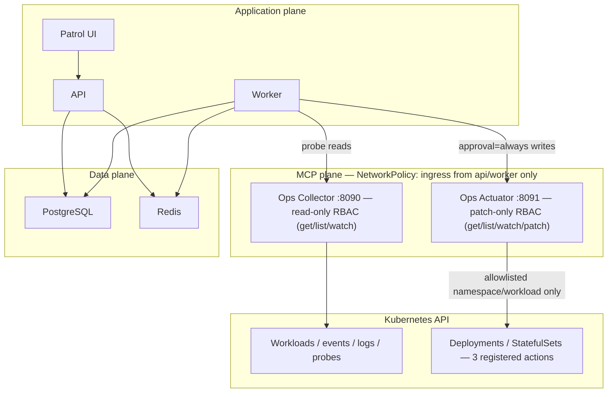

[简体中文](ops-patrol.zh-CN.md)

# Ops Patrol operations

This runbook covers production enablement, Collector deployment, least privilege, validation, evidence, retention, recovery, and troubleshooting. For the domain contract, see [Ops Patrol architecture](../architecture/ops-patrol.md).

## Production readiness checklist

- API, Worker, PostgreSQL, Redis, migrations, and a tool-capable model are healthy.
- `AUDIT_SIGNING_KEY` is unique, secret-managed, and its key id/previous-key map follow the normal audit rotation procedure.
- The Collector has a dedicated read-only Kubernetes ServiceAccount and is not publicly reachable.
- Every namespace, workload, Prometheus query, HTTP/TLS/backup endpoint, and dependency is explicitly reviewed and registered.
- Collector egress NetworkPolicy matches those targets; registered endpoints are internal and return minimum status data without embedding credentials in URLs.
- All nine MCP tool policies are `integration_read` + `read_only` + `safe` + `never` approval.
- Fixture replay remains disabled in production.
- A dry run and one manual Run pass before scheduling is enabled.

## Security boundary

The Collector exports exactly nine fixed tools: capability discovery plus Kubernetes workload/events/logs and registered Prometheus, HTTP, TLS, backup, and dependency probes. It has no Shell, browser, write API, raw URL, or raw PromQL input. Collected strings are untrusted data. The API recomputes final status and evidence completeness.

Kubernetes RBAC is limited to `get`, `list`, and `watch`; Secrets, exec, attach, impersonation, and mutation verbs are excluded. The container runs as UID/GID 10001 with a read-only root filesystem, all Linux capabilities dropped, `RuntimeDefault` seccomp, and a writable 32 MiB `/tmp` only.

## Deployment

Ops Patrol has two independent MCP surfaces: the always-relevant, read-only Collector (checks) and the optional, write-scoped Actuator (approved remediation only — see [Approve a remediation](../tutorials/07-approved-remediation.md)). They are deployed, scoped, and network-restricted separately.



### Docker Compose

```bash
docker compose --profile patrol up -d --build opencitadel-ops-collector
docker compose ps opencitadel-ops-collector
```

This profile verifies the MCP transport/configuration and can run registered non-Kubernetes probes. It does not mount the host kubeconfig. Use Helm or Kustomize with a dedicated ServiceAccount for real Kubernetes checks; do not solve local access by mounting privileged host credentials.

### Helm

Build/pull the `opencitadel-ops-collector` image, then use a protected values file:

```bash
helm upgrade --install opencitadel deploy/helm/opencitadel \
  --namespace opencitadel --create-namespace \
  --values production-values.yaml \
  --set opsCollector.enabled=true \
  --set opsCollector.image.repository=your-registry/opencitadel-ops-collector \
  --set opsCollector.image.tag=YOUR_RELEASE_TAG \
  --set opsCollector.targetRef=cluster-a \
  --set-json 'opsCollector.allowedNamespaces=["opencitadel"]'
```

Configure `allowedWorkloads` and every `registered*` map in the values file; the complete schema and example are in the [Collector README](../../ops-collector/README.md#configuration-reference). The UI wizard enables all built-in checks and therefore expects these ids (only a full custom API config can disable selected checks):

- `pvc-utilization`, `app-5xx-ratio`
- `primary-endpoint`, `primary-tls`
- `primary-database`, `primary-dependencies`

If `opsCollector.serviceAccount.create=false`, set `opsCollector.serviceAccount.name` to a pre-created account with equivalent least privilege. Do not grant Secret read or mutation verbs.

### Kustomize

```bash
kubectl kustomize deploy/kustomize/ops-collector >/dev/null
kubectl apply -k deploy/kustomize/ops-collector
```

Treat the checked-in Kustomization as a base. Before applying it outside a disposable environment, patch the image/tag, target ref, allowlists, registered-target JSON environment values, resource limits, namespace, and NetworkPolicy egress.

### Network placement

Keep the Collector Service internal (`ClusterIP`). Ingress should allow only API/Worker on TCP 8090. Egress should allow DNS, the Kubernetes API, and exact registered target ports. The registry remains the authoritative SSRF boundary because port-only NetworkPolicy cannot validate hostnames or URL paths.

### Actuator (optional write path)

Deploy the Actuator only if [Approve a remediation](../tutorials/07-approved-remediation.md) is in scope. It is a second, stricter MCP surface — never expose it to a model, and never broaden its RBAC beyond `get`/`list`/`watch`/`patch` on Deployments/StatefulSets and `get`/`list` on ReplicaSets.

**Docker Compose**

```bash
docker compose --profile actuator up -d --build opencitadel-ops-actuator
docker compose ps opencitadel-ops-actuator
```

This profile is disabled by default (opt-in `actuator` profile in `docker-compose.yml`) and, like the Collector, does not mount a host kubeconfig.

**Helm**

Build/pull the `opencitadel-ops-actuator` image, then:

```bash
helm upgrade --install opencitadel deploy/helm/opencitadel \
  --namespace opencitadel --create-namespace \
  --values production-values.yaml \
  --set opsActuator.enabled=true \
  --set opsActuator.image.repository=your-registry/opencitadel-ops-actuator \
  --set opsActuator.image.tag=YOUR_RELEASE_TAG \
  --set opsActuator.targetRef=cluster-a \
  --set-json 'opsActuator.allowedNamespaces=["opencitadel"]' \
  --set-json 'opsActuator.allowedWorkloads={"opencitadel":{"opencitadel-api":{"kind":"deployment","min_replicas":2,"max_replicas":10}}}'
```

This renders `templates/deployment-ops-actuator.yaml`, `templates/rbac-ops-actuator.yaml`, and `templates/networkpolicy-ops-actuator.yaml`. If `opsActuator.serviceAccount.create=false`, set `opsActuator.serviceAccount.name` to a pre-created account with equivalent least privilege — never Secret read/write or mutation verbs beyond the three registered actions.

**Kustomize**

```bash
kubectl kustomize deploy/kustomize/ops-actuator >/dev/null
kubectl apply -k deploy/kustomize/ops-actuator
```

Treat the checked-in Kustomization as a base, the same way as the Collector's: patch image/tag, target ref, allowlists, resource limits, namespace, and NetworkPolicy egress before applying it outside a disposable environment. `rbac.yaml` defines the write-scoped `ClusterRole`/`ClusterRoleBinding`.

**Actuator network placement**

Keep the Actuator Service internal (`ClusterIP`). Ingress should allow only API/Worker on TCP 8091. Unlike the Collector, egress should allow only DNS and the Kubernetes API — the Actuator never talks to PostgreSQL, Redis, MinIO, or Prometheus, so keeping those ports open on a write-scoped ServiceAccount's Pod would be a lateral-movement surface with no corresponding need.

## Register the MCP Server

The Helm service URL is normally:

```text
http://opencitadel-ops-collector:8090/mcp
```

In **Settings → Integrations**, create the streamable-HTTP connection and enable it. The Developer Preview form does not author Tool Policies. As an authenticated administrator, persist them through `POST /api/app-config/mcp-servers/ops-collector/update` (or an equivalent approved bootstrap) with this complete request body:

```json
{
  "mcpServers": {
    "ops-collector": {
      "transport": "streamable_http",
      "enabled": true,
      "url": "http://opencitadel-ops-collector:8090/mcp",
      "tool_policies": {
        "get_capabilities": {"capability":"integration_read","effect":"read_only","idempotency":"safe","approval":"never","concurrency_group":"ops-patrol"},
        "k8s_workload_summary": {"capability":"integration_read","effect":"read_only","idempotency":"safe","approval":"never","concurrency_group":"ops-patrol"},
        "k8s_recent_events": {"capability":"integration_read","effect":"read_only","idempotency":"safe","approval":"never","concurrency_group":"ops-patrol"},
        "k8s_pod_logs": {"capability":"integration_read","effect":"read_only","idempotency":"safe","approval":"never","concurrency_group":"ops-patrol"},
        "prom_query": {"capability":"integration_read","effect":"read_only","idempotency":"safe","approval":"never","concurrency_group":"ops-patrol"},
        "http_probe": {"capability":"integration_read","effect":"read_only","idempotency":"safe","approval":"never","concurrency_group":"ops-patrol"},
        "certificate_status": {"capability":"integration_read","effect":"read_only","idempotency":"safe","approval":"never","concurrency_group":"ops-patrol"},
        "backup_status": {"capability":"integration_read","effect":"read_only","idempotency":"safe","approval":"never","concurrency_group":"ops-patrol"},
        "dependency_status": {"capability":"integration_read","effect":"read_only","idempotency":"safe","approval":"never","concurrency_group":"ops-patrol"}
      }
    }
  }
}
```

Normal UI connection edits omit `tool_policies`, so the service preserves the persisted map. Reapply/review the map whenever the Collector tool catalog changes.

Pack validation fails closed if a required policy is missing/conservative, the Server is disabled, live capability discovery fails, a schema hash differs, a required tool is absent, or the read-only dry run fails.

## Register the Actuator MCP Server

Only needed if the Actuator is deployed. The Helm service URL is normally:

```text
http://opencitadel-ops-actuator:8091/mcp
```

`api/config.yaml` ships a disabled seed entry at `mcp_config.mcpServers.ops-actuator` with this exact URL; the DB-backed AppConfig does not pick up a config-file edit on an existing row, so enabling it must happen through the UI/API. In **Settings → Integrations**, register the URL as streamable HTTP, enable it, and name it exactly `ops-actuator` — the remediation execution service resolves the Server by this fixed name, unlike the Collector, which is bound per-Pack.

Unlike the Collector, the Actuator's write tools (`get_capabilities`, `restart_workload`, `scale_workload`, `rollback_workload`) are never exposed to a model — the backend execution service calls them directly — so there is no separate Tool Policy payload to persist for this registration.

## Enablement order

1. Deploy migrations and confirm API/Worker health.
2. Deploy and restrict the Collector; verify its readiness and ServiceAccount.
3. Register and enable the MCP Server, then persist all fixed read-only Tool Policies through the authenticated management API.
4. As an administrator, open **Settings → Runtime → feature_flags** and set `enable_ops_patrol=true`. With DB AppConfig enabled, editing only `api/config.yaml` does not update an existing database row.
5. Keep `enable_ops_patrol_fixture_replay=false`.
6. Create a Pack and inspect its live preflight summary. The wizard auto-activates a successful validation; failed validation remains non-active until fixed, revalidated, and explicitly activated.
7. Trigger one manual Run and verify results/evidence before enabling its schedule.
8. **Optional, for approved remediation:** deploy and restrict the Actuator; verify its readiness and ServiceAccount.
9. Register the Actuator MCP Server (`ops-actuator`) and enable it; no Tool Policy persistence step is required for this one.
10. As an administrator, set `enable_ops_patrol_remediation=true` in **Settings → Runtime → feature_flags**. The built-in `ops-patrol-remediation` Skill is seeded automatically on API/Worker startup — no manual registration step.
11. Propose one remediation end to end and verify the recheck Run before relying on the loop broadly.

The Pack schedule uses a five-field daily cron and an IANA timezone. Configuration changes increment the Pack version, pause its ScheduledJob, and require validation/activation again.

## Required configuration

| Setting | Ownership and limit |
|---------|---------------------|
| `feature_flags.enable_ops_patrol` | Global DB-backed AppConfig kill switch |
| `feature_flags.enable_ops_patrol_fixture_replay` | Test/demo only; false in production |
| `feature_flags.enable_ops_patrol_remediation` | Global DB-backed AppConfig kill switch for the write path; `propose()` fails closed when false, before touching anything |
| `patrol_retention.run_days` / `finding_days` | Default 30 days, clamped to 1–90 |
| `patrol_retention.collector_evidence_days` | Default 7 days, clamped to 1–90 |
| `patrol_retention.cleanup_batch_size` | Default 100, clamped to 1–1000 per tick |
| `AUDIT_SIGNING_KEY` | HMAC key; rotate with audit key id and previous-key map |
| `OPS_COLLECTOR_*` | Collector-only target, allowlists, registries, concurrency, and output caps |
| `OPS_ACTUATOR_*` | Actuator-only target ref, namespace/workload allowlist, transport, and concurrency (write path, disabled by default) |

Collector and Actuator variables and their Kubernetes identities belong to their own deployments, not Pack tool arguments. Do not add raw destinations to a Pack.

## Verification

```bash
make test-patrol
helm lint deploy/helm/opencitadel
helm template opencitadel deploy/helm/opencitadel \
  --set opsCollector.enabled=true >/dev/null
helm template opencitadel deploy/helm/opencitadel \
  --set opsActuator.enabled=true >/dev/null
kubectl kustomize deploy/kustomize/ops-collector >/dev/null
kubectl kustomize deploy/kustomize/ops-actuator >/dev/null
docker compose --env-file .env.example config --quiet
```

After deployment:

```bash
kubectl -n opencitadel rollout status deployment/opencitadel-ops-collector
kubectl auth can-i get pods \
  --as system:serviceaccount:opencitadel:opencitadel-ops-collector
kubectl auth can-i create pods \
  --as system:serviceaccount:opencitadel:opencitadel-ops-collector
kubectl auth can-i get secrets \
  --as system:serviceaccount:opencitadel:opencitadel-ops-collector
```

The first command should succeed, while both permission checks for `create pods` and `get secrets` must print `no`.

The destructive fixture suite must be run only with `./scripts/run-patrol-fixtures.sh`. It creates its own `kind-opencitadel-patrol-*` cluster, verifies reset baselines and write denial, scores all 21 cases, then deletes the cluster unless `PATROL_KEEP_DEMO_CLUSTER=true` is explicitly set.

Case 21 (`21-remediation-crashloop`) is the only one that exercises the write path (restart/scale/rollback via a real Actuator) rather than a read-only Collector replay; it only runs when `PATROL_RUN_REMEDIATION_FIXTURE=true`, since it needs to build and `kind load` a real `opencitadel-ops-actuator` image first. Locally that variable still defaults to `false` (the other 20 read-only cases need no Actuator at all), but CI's `patrol-kind-fixtures` job now sets it `true` unconditionally, so case 21 runs on every push/PR, not as an opt-in extra. When it runs, the loop is verified deterministically by two independent, LLM-free layers:

- **kind layer** (`scripts/drive_remediation_fixture.py`, driven from the `patrol-kind-fixtures` job): drives the real Ops Actuator MCP server over streamable-HTTP against the disposable cluster — pre-fail Collector read, `restart_workload` with a fresh idempotency key, a same-key replay asserting `skipped_idempotent`, a healthy-image redeploy, and a post-heal Collector read — cross-checking every step against `kubectl`, not just the Actuator's own envelope.
- **In-process layer** (`api/tests/app/integration/test_remediation_fixture_replay.py`, part of the ordinary `api-test` job's `pytest` run, no cluster involved): replays the same fixture's `expected.json` `remediation` block (`expected_status_sequence`, `recheck_expected_results`) directly against `PatrolRemediationService`/`PatrolRunService`, asserting the propose → execute → auto-recheck → finalize state machine end to end.

Both layers run on every CI invocation, independently of each other; a regression in either the Actuator-facing write path or the server-side remediation state machine fails the corresponding job.

## Evidence verification

Downloading a Run writes the audit action `patrol_evidence_downloaded`. The ZIP includes the Session audit material plus:

- `patrol/run.json`, `patrol/pack-snapshot.json`
- `patrol/check-results.json`, `patrol/findings.json`
- `patrol/report.md`, `patrol/evidence-index.json`
- `manifest.json`, `chain-signature.txt`

Verify every `manifest.json.file_hashes` entry before trusting the package. In a protected operator shell, compute `HMAC-SHA256(AUDIT_SIGNING_KEY, exact manifest.json bytes)` and compare it with the value after `manifest HMAC-SHA256:` in `chain-signature.txt`. Use the manifest `signing_key_id` to select the current or retained previous key. Never send the signing key to a browser or general-purpose verification service.

## Retention, backup, and restore

The Worker scheduler clears expired evidence references and deletes expired Findings/Runs in bounded leased ticks. Audit-chain rows are preserved. If the Scheduler is disabled, retention does not run; monitor both scheduler leadership and cleanup logs.

Back up PostgreSQL and object storage using the main [production deployment runbook](deployment.md). Patrol tables are part of the database backup. Restore the database, object storage, audit current/previous signing keys, and MCP/Collector configuration from the same recovery point, then validate Packs before resuming schedules.

Do not drop Patrol tables during rollback. To stop the feature safely, disable the feature flag; history remains available to authorized readers.

## Recovery and rollback

1. Disable `feature_flags.enable_ops_patrol` to stop new work without deleting data.
2. If only one target is unhealthy, pause the affected Pack.
3. Restore Collector connectivity or its registered target entry; never broaden to raw destinations.
4. Revalidate every changed Pack; activation is version-bound.
5. Re-enable the flag, run one manual Run, inspect evidence, then restore schedules.

## Troubleshooting

| Symptom | Check |
|---------|-------|
| Navigation missing / API says disabled | Global DB AppConfig `feature_flags.enable_ops_patrol`; config seed alone does not overwrite an existing row |
| No Collector in wizard | MCP Server is enabled, accessible in the current workspace scope, and uses streamable HTTP |
| `COLLECTOR_UNAVAILABLE` | MCP URL, Service/NetworkPolicy, readiness, DNS, last successful preflight |
| `COLLECTOR_CAPABILITY_MISMATCH` | Collector image/tool schema changed; pause and revalidate the Pack |
| `TARGET_SCOPE_DENIED` | Target ref, Namespace/Workload/registered-target allowlist |
| `AUTH_FAILED` | P0 registered HTTP probes do not accept arbitrary auth headers; use an approved internal status endpoint or disable the check, never embed credentials in its URL |
| `RATE_LIMITED` | Collector retries once; lower schedule concurrency or upstream load |
| `EVIDENCE_INCOMPLETE` | Required evidence type, canonical SHA-256, expiry, output truncation |
| Pack cannot activate | Current Pack version was not successfully validated, or capability/tool-policy check failed |
| Run remains queued/running | Worker/Redis health, model availability, active-run lock, Pack timeout (default 15 min, max 30 min) |
| Scheduled Runs absent | Pack active, schedule enabled, Scheduler enabled/leader, timezone/next run, feature flag still on |
| Retention not progressing | Worker scheduler loop, leader lease, `patrol_retention` limits, cleanup logs |
| `error_code=PARAMS_TAMPERED` | Recomputed `params_hash` at execution time no longer matches the value fixed at proposal; zero Actuator calls made |
| `error_code=CAPABILITY_BASELINE_MISSING` / `CAPABILITY_DRIFT` | Actuator's capability hash was never captured, or no longer matches the baseline taken when the session was built; execution fails closed before any Actuator call |
| `error_code=SESSION_TERMINATED` | Remediation session was rejected, abandoned, or hit an approval-batch expiry without a decision; still-`proposed` remediation is auto-cancelled, Actuator untouched |
| `error_code=recheck_failed` | Recheck Run's matching check still fails or warns after an `executed` remediation; Finding stays open for a human decision |
| `ACTUATOR_UNREACHABLE` / `ACTUATOR_FAILED` | Actuator MCP connectivity, NetworkPolicy egress from API/Worker on TCP 8091, Actuator readiness |

Logs should include Run, Pack, Session, check, request, target identifiers and a status/error code, but never credentials or raw authorization headers.
