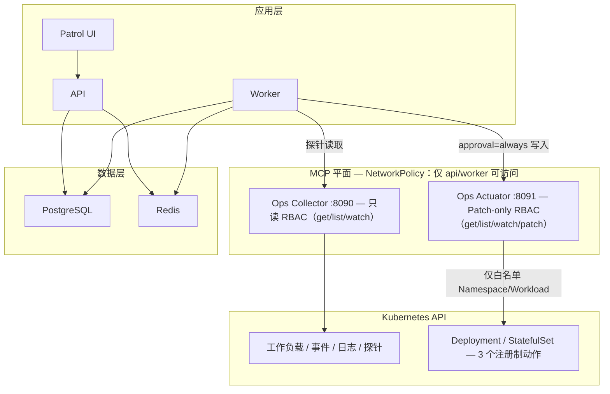

[English](ops-patrol.md)

# Ops Patrol 运维手册

本文覆盖生产启用、Collector 部署、最小权限、验证、证据、保留、恢复与排障。领域契约见 [Ops Patrol 架构](../architecture/ops-patrol.zh-CN.md)。

## 生产就绪清单

- API、Worker、PostgreSQL、Redis、Migration 及支持工具调用的模型均健康。
- `AUDIT_SIGNING_KEY` 独立生成并由 Secret Manager 保存，Key ID/历史 Key Map 遵循既有审计轮换流程。
- Collector 使用专用 Kubernetes 只读 ServiceAccount，且不暴露到公网。
- 每个 Namespace、Workload、Prometheus Query、HTTP/TLS/备份 Endpoint 与依赖都已显式评审和注册。
- Collector Egress NetworkPolicy 与目标一致；注册 Endpoint 为内网最小状态接口，URL 不嵌入凭据。
- 九个 MCP Tool Policy 全部为 `integration_read` + `read_only` + `safe` + `never` approval。
- Fixture Replay 在生产保持关闭。
- 启用计划前已通过 dry-run 和一次手动 Run。

## 安全边界

Collector 只暴露九个固定工具：能力发现、Kubernetes 工作负载/事件/日志，以及已注册的 Prometheus、HTTP、TLS、备份和依赖探针。它不提供 Shell、浏览器、写 API、任意 URL 或任意 PromQL。采集字符串一律视为不可信数据，最终状态和证据完整率由 API 重新计算。

Kubernetes RBAC 仅允许 `get`、`list`、`watch`，排除 Secret、exec、attach、impersonation 和全部变更动词。容器使用 UID/GID 10001、只读根文件系统、删除全部 Linux Capability、`RuntimeDefault` seccomp，仅挂载 32 MiB 可写 `/tmp`。

## 部署

Ops Patrol 有两个独立的 MCP 面：始终相关的只读 Collector（检查）和可选的写范围 Actuator（仅用于已审批的修复——见 [审批通过后执行 Ops Patrol 修复](../tutorials/07-approved-remediation.zh-CN.md)）。二者分别部署、限定 Scope 并做网络隔离。



### Docker Compose

```bash
docker compose --profile patrol up -d --build opencitadel-ops-collector
docker compose ps opencitadel-ops-collector
```

该 Profile 可验证 MCP 传输/配置并运行已注册的非 Kubernetes 探针，但不会挂载宿主机 kubeconfig。真实 Kubernetes 检查应使用 Helm/Kustomize 专用 ServiceAccount；不要通过挂载高权限宿主凭据解决本地访问。

### Helm

构建或拉取 `opencitadel-ops-collector` 镜像后，使用受保护的 Values 文件：

```bash
helm upgrade --install opencitadel deploy/helm/opencitadel \
  --namespace opencitadel --create-namespace \
  --values production-values.yaml \
  --set opsCollector.enabled=true \
  --set opsCollector.image.repository=your-registry/opencitadel-ops-collector \
  --set opsCollector.image.tag=YOUR_RELEASE_TAG \
  --set opsCollector.targetRef=cluster-a \
  --set-json 'opsCollector.allowedNamespaces=["opencitadel"]'
```

在 Values 文件配置 `allowedWorkloads` 与所有 `registered*` Map；完整 Schema 与示例见 [Collector README](../../ops-collector/README.zh-CN.md#配置参考)。UI 向导会启用全部内置检查，因此需要以下 ID（仅完整自定义 API Config 可禁用部分检查）：

- `pvc-utilization`、`app-5xx-ratio`
- `primary-endpoint`、`primary-tls`
- `primary-database`、`primary-dependencies`

若 `opsCollector.serviceAccount.create=false`，必须设置 `opsCollector.serviceAccount.name` 并预先授予等价最小只读权限。不得授予 Secret 读取或任何变更动词。

### Kustomize

```bash
kubectl kustomize deploy/kustomize/ops-collector >/dev/null
kubectl apply -k deploy/kustomize/ops-collector
```

仓库内 Kustomization 应作为 Base。用于非一次性环境前，必须 Patch 镜像/Tag、Target Ref、白名单、注册目标 JSON 环境变量、资源限制、Namespace 和 NetworkPolicy Egress。

### 网络位置

Collector Service 保持内部 `ClusterIP`，Ingress 仅允许 API/Worker 访问 TCP 8090。Egress 仅允许 DNS、Kubernetes API 和注册目标的准确端口。仅按端口限制的 NetworkPolicy 无法验证主机名或 URL Path，因此注册表仍是 SSRF 权威边界。

### Actuator（可选写路径）

仅当 [审批通过后执行 Ops Patrol 修复](../tutorials/07-approved-remediation.zh-CN.md) 在范围内时才需要部署 Actuator。它是第二个、要求更严格的 MCP 面——绝不能暴露给模型，RBAC 也绝不能超出对 Deployment/StatefulSet 的 `get`/`list`/`watch`/`patch` 与对 ReplicaSet 的 `get`/`list`。

**Docker Compose**

```bash
docker compose --profile actuator up -d --build opencitadel-ops-actuator
docker compose ps opencitadel-ops-actuator
```

该 Profile 默认关闭（`docker-compose.yml` 中的 opt-in `actuator` Profile），与 Collector 一样不会挂载宿主机 kubeconfig。

**Helm**

构建或拉取 `opencitadel-ops-actuator` 镜像后：

```bash
helm upgrade --install opencitadel deploy/helm/opencitadel \
  --namespace opencitadel --create-namespace \
  --values production-values.yaml \
  --set opsActuator.enabled=true \
  --set opsActuator.image.repository=your-registry/opencitadel-ops-actuator \
  --set opsActuator.image.tag=YOUR_RELEASE_TAG \
  --set opsActuator.targetRef=cluster-a \
  --set-json 'opsActuator.allowedNamespaces=["opencitadel"]' \
  --set-json 'opsActuator.allowedWorkloads={"opencitadel":{"opencitadel-api":{"kind":"deployment","min_replicas":2,"max_replicas":10}}}'
```

该命令会渲染 `templates/deployment-ops-actuator.yaml`、`templates/rbac-ops-actuator.yaml` 与 `templates/networkpolicy-ops-actuator.yaml`。若 `opsActuator.serviceAccount.create=false`，须设置 `opsActuator.serviceAccount.name` 并预先授予等价最小权限——绝不能授予 Secret 读写或超出三个注册动作的变更动词。

**Kustomize**

```bash
kubectl kustomize deploy/kustomize/ops-actuator >/dev/null
kubectl apply -k deploy/kustomize/ops-actuator
```

仓库内 Kustomization 应作为 Base，与 Collector 相同的处理方式：用于非一次性环境前，必须 Patch 镜像/Tag、Target Ref、白名单、资源限制、Namespace 和 NetworkPolicy Egress。`rbac.yaml` 定义了写范围的 `ClusterRole`/`ClusterRoleBinding`。

**Actuator 网络位置**

Actuator Service 保持内部 `ClusterIP`，Ingress 仅允许 API/Worker 访问 TCP 8091。与 Collector 不同，Egress 仅允许 DNS 和 Kubernetes API——Actuator 从不连接 PostgreSQL、Redis、MinIO 或 Prometheus，在写范围 ServiceAccount 的 Pod 上放开这些端口只会增加横向移动面，没有对应必要性。

## 注册 MCP Server

Helm Service URL 通常为：

```text
http://opencitadel-ops-collector:8090/mcp
```

在 **设置 → 集成** 中创建 Streamable HTTP 连接并启用。Developer Preview 表单暂不编辑 Tool Policy；管理员需通过已认证的 `POST /api/app-config/mcp-servers/ops-collector/update`（或等价的受控引导流程）持久化以下完整请求体：

```json
{
  "mcpServers": {
    "ops-collector": {
      "transport": "streamable_http",
      "enabled": true,
      "url": "http://opencitadel-ops-collector:8090/mcp",
      "tool_policies": {
        "get_capabilities": {"capability":"integration_read","effect":"read_only","idempotency":"safe","approval":"never","concurrency_group":"ops-patrol"},
        "k8s_workload_summary": {"capability":"integration_read","effect":"read_only","idempotency":"safe","approval":"never","concurrency_group":"ops-patrol"},
        "k8s_recent_events": {"capability":"integration_read","effect":"read_only","idempotency":"safe","approval":"never","concurrency_group":"ops-patrol"},
        "k8s_pod_logs": {"capability":"integration_read","effect":"read_only","idempotency":"safe","approval":"never","concurrency_group":"ops-patrol"},
        "prom_query": {"capability":"integration_read","effect":"read_only","idempotency":"safe","approval":"never","concurrency_group":"ops-patrol"},
        "http_probe": {"capability":"integration_read","effect":"read_only","idempotency":"safe","approval":"never","concurrency_group":"ops-patrol"},
        "certificate_status": {"capability":"integration_read","effect":"read_only","idempotency":"safe","approval":"never","concurrency_group":"ops-patrol"},
        "backup_status": {"capability":"integration_read","effect":"read_only","idempotency":"safe","approval":"never","concurrency_group":"ops-patrol"},
        "dependency_status": {"capability":"integration_read","effect":"read_only","idempotency":"safe","approval":"never","concurrency_group":"ops-patrol"}
      }
    }
  }
}
```

常规 UI 连接编辑不会提交 `tool_policies`，Service 会保留已持久化 Map。Collector Tool Catalog 变化时必须重新应用并评审该 Map。

任一必需 Policy 缺失或保守化、Server 未启用、实时能力发现失败、Schema Hash 不同、缺少必需工具或只读 dry-run 失败，Pack 验证都会 Fail Closed。

## 注册 Actuator MCP Server

仅当部署了 Actuator 时才需要。Helm Service URL 通常为：

```text
http://opencitadel-ops-actuator:8091/mcp
```

`api/config.yaml` 在 `mcp_config.mcpServers.ops-actuator` 下提供一条禁用状态的种子记录，URL 完全一致；DB 承载的 AppConfig 不会因编辑配置文件而更新已有行，因此启用必须通过 UI/API 完成。在 **设置 → 集成** 中把该 URL 注册为 Streamable HTTP、启用，并严格命名为 `ops-actuator`——修复执行服务按这个固定名称解析 Server，这与按 Pack 绑定的 Collector 不同。

与 Collector 不同，Actuator 的写工具（`get_capabilities`、`restart_workload`、`scale_workload`、`rollback_workload`）从不暴露给模型——后端执行服务直接调用它们——因此这次注册不需要额外持久化 Tool Policy Payload。

## 启用顺序

1. 部署 Migration 并确认 API/Worker 健康。
2. 部署并限制 Collector，验证 Readiness 与 ServiceAccount。
3. 注册并启用 MCP Server，再通过已认证管理 API 持久化全部固定只读 Tool Policy。
4. 管理员打开 **设置 → 运行时 → feature_flags**，设置 `enable_ops_patrol=true`。启用 DB AppConfig 后，仅修改 `api/config.yaml` 不会覆盖已有数据库行。
5. 保持 `enable_ops_patrol_fixture_replay=false`。
6. 创建 Pack 并检查实时 Preflight 摘要。向导会自动激活验证成功的 Pack；失败时保持非 Active，修复并重新验证后再显式激活。
7. 触发一次手动 Run，核验证据后再启用计划。
8. **可选，用于已审批修复：** 部署并限制 Actuator，验证其 Readiness 与 ServiceAccount。
9. 注册 Actuator MCP Server（`ops-actuator`）并启用；这次注册不需要持久化 Tool Policy。
10. 管理员在 **设置 → 运行时 → feature_flags** 中将 `enable_ops_patrol_remediation` 设为 `true`。内置 `ops-patrol-remediation` Skill 在 API/Worker 启动时自动 Seed，无需手工注册。
11. 端到端发起一次修复并核验复检 Run，再大范围依赖该闭环。

Pack 计划使用五段每日 Cron 与 IANA 时区。配置变更会增加 Pack Version、暂停其 ScheduledJob，并要求重新验证/激活。

## 必需配置

| 配置 | 归属与限制 |
|------|------------|
| `feature_flags.enable_ops_patrol` | DB 承载的全局 AppConfig 总开关 |
| `feature_flags.enable_ops_patrol_fixture_replay` | 仅测试/演示；生产保持 false |
| `feature_flags.enable_ops_patrol_remediation` | 写路径的 DB 承载全局 AppConfig 总开关；关闭时 `propose()` 在触碰任何数据前就 Fail Closed |
| `patrol_retention.run_days` / `finding_days` | 默认 30 天，收敛到 1–90 |
| `patrol_retention.collector_evidence_days` | 默认 7 天，收敛到 1–90 |
| `patrol_retention.cleanup_batch_size` | 默认 100，每 Tick 收敛到 1–1000 |
| `AUDIT_SIGNING_KEY` | HMAC Key；随审计 Key ID 与历史 Key Map 轮换 |
| `OPS_COLLECTOR_*` | Collector 独有目标、白名单、注册表、并发与输出上限 |
| `OPS_ACTUATOR_*` | Actuator 独有 Target Ref、Namespace/Workload 白名单、传输与并发（写路径，默认关闭） |

Collector 与 Actuator 的变量及其各自 Kubernetes 身份都属于各自的部署，不属于 Pack Tool 参数；不得向 Pack 增加原始目的地。

## 验证

```bash
make test-patrol
helm lint deploy/helm/opencitadel
helm template opencitadel deploy/helm/opencitadel \
  --set opsCollector.enabled=true >/dev/null
helm template opencitadel deploy/helm/opencitadel \
  --set opsActuator.enabled=true >/dev/null
kubectl kustomize deploy/kustomize/ops-collector >/dev/null
kubectl kustomize deploy/kustomize/ops-actuator >/dev/null
docker compose --env-file .env.example config --quiet
```

部署后执行：

```bash
kubectl -n opencitadel rollout status deployment/opencitadel-ops-collector
kubectl auth can-i get pods \
  --as system:serviceaccount:opencitadel:opencitadel-ops-collector
kubectl auth can-i create pods \
  --as system:serviceaccount:opencitadel:opencitadel-ops-collector
kubectl auth can-i get secrets \
  --as system:serviceaccount:opencitadel:opencitadel-ops-collector
```

`get pods` 应成功，`create pods` 与 `get secrets` 必须输出 `no`。

破坏性 Fixture 仅能用 `./scripts/run-patrol-fixtures.sh` 运行。它会创建专用 `kind-opencitadel-patrol-*` 集群、校验每次重置基线与写权限拒绝、评分全部 21 案例，并在结束时删除集群；仅显式设置 `PATROL_KEEP_DEMO_CLUSTER=true` 才保留。

案例 21（`21-remediation-crashloop`）是唯一走写路径（经真实 Actuator 重启/扩缩容/回滚）而非只读 Collector 回放的案例；它只在 `PATROL_RUN_REMEDIATION_FIXTURE=true` 时运行，因为需要先构建并 `kind load` 一个真实的 `opencitadel-ops-actuator` 镜像。本地这个变量仍然默认 `false`（其余 20 个只读案例完全不需要 Actuator），但 CI 的 `patrol-kind-fixtures` job 现在无条件将其设为 `true`，所以案例 21 在每次 push/PR 都会运行，而不是一个可选的额外项。运行时，这条闭环由两个相互独立、都不依赖 LLM 的验证层确定性核验：

- **kind 层**（`scripts/drive_remediation_fixture.py`，由 `patrol-kind-fixtures` job 驱动）：以 streamable-HTTP 驱动真实的 Ops Actuator MCP Server，作用于一次性集群——前置失败态的 Collector 读取、用新的幂等键调用 `restart_workload`、用同一个键重放并断言 `skipped_idempotent`、重新部署健康镜像、修复后的 Collector 读取——每一步都拿 `kubectl` 回读结果交叉校验，而不只信任 Actuator 自己的信封。
- **进程内层**（`api/tests/app/integration/test_remediation_fixture_replay.py`，属于普通 `api-test` job 的 `pytest` 运行的一部分，不涉及任何集群）：直接针对同一个 Fixture 的 `expected.json` 里的 `remediation` 区块（`expected_status_sequence`、`recheck_expected_results`），对 `PatrolRemediationService`/`PatrolRunService` 做端到端回放，断言提案 → 执行 → 自动复检 → 收尾的整条状态机。

两层在每次 CI 触发时都会运行，彼此独立；无论是面向 Actuator 的写路径退化，还是服务端修复状态机本身退化，都会让对应的 job 失败。

## 证据验证

下载 Run 会写入 `patrol_evidence_downloaded` 审计动作。ZIP 包含 Session 审计材料以及：

- `patrol/run.json`、`patrol/pack-snapshot.json`
- `patrol/check-results.json`、`patrol/findings.json`
- `patrol/report.md`、`patrol/evidence-index.json`
- `manifest.json`、`chain-signature.txt`

信任证据前必须逐项校验 `manifest.json.file_hashes`。在受保护运维 Shell 中计算 `HMAC-SHA256(AUDIT_SIGNING_KEY, manifest.json 原始精确字节)`，并与 `chain-signature.txt` 中 `manifest HMAC-SHA256:` 后的值比较。根据 Manifest 的 `signing_key_id` 选择当前或保留的历史 Key。绝不能把签名 Key 发送到浏览器或通用在线验证服务。

## 保留、备份与恢复

Worker Scheduler 通过有租约的有界 Tick 清空过期证据引用并删除过期 Finding/Run；审计链行始终保留。若 Scheduler 被关闭，保留任务也不会运行，因此应监控 Scheduler Leader 与 Cleanup Log。

PostgreSQL 与对象存储备份遵循主[生产部署手册](deployment.zh-CN.md)。Patrol 表随数据库备份。恢复时应从同一恢复点恢复数据库、对象存储、当前/历史审计签名 Key 和 MCP/Collector 配置，再验证 Pack 后恢复计划。

回滚时不要删除 Patrol 表。安全停止方式是关闭功能总开关；有权限的历史仍可读取。

## 恢复与回滚

1. 关闭 `feature_flags.enable_ops_patrol`，停止新工作但保留数据。
2. 若只有单个目标异常，暂停对应 Pack。
3. 恢复 Collector 连通性或注册目标；不得临时放开任意目的地。
4. 重新验证所有变更过的 Pack；激活与版本绑定。
5. 打开总开关，先手动运行并检查证据，再恢复计划。

## 排障

| 现象 | 检查项 |
|------|--------|
| 导航缺失 / API 提示 disabled | DB 全局 AppConfig `feature_flags.enable_ops_patrol`；配置种子不会覆盖已有行 |
| 向导看不到 Collector | MCP Server 已启用、在当前工作区 Scope 可访问且使用 Streamable HTTP |
| `COLLECTOR_UNAVAILABLE` | MCP URL、Service/NetworkPolicy、Readiness、DNS、最近成功 Preflight |
| `COLLECTOR_CAPABILITY_MISMATCH` | Collector Image/Tool Schema 变化；暂停并重新验证 Pack |
| `TARGET_SCOPE_DENIED` | Target Ref、Namespace/Workload/注册目标白名单 |
| `AUTH_FAILED` | P0 注册 HTTP 探针不接受任意 Auth Header；使用获批内网 Status Endpoint 或禁用检查，严禁在 URL 嵌入凭据 |
| `RATE_LIMITED` | Collector 只重试一次；降低计划并发或上游负载 |
| `EVIDENCE_INCOMPLETE` | 必需证据类型、规范化 SHA-256、过期时间和截断 |
| Pack 无法激活 | 当前 Pack Version 未成功验证，或 Capability/Tool Policy 校验失败 |
| Run 长期 queued/running | Worker/Redis、模型可用性、活动 Run 锁、Pack Timeout（默认 15 分钟，最大 30 分钟） |
| 无计划 Run | Pack Active、计划 Enabled、Scheduler Enabled/Leader、时区/Next Run、总开关仍开启 |
| 保留任务不前进 | Worker Scheduler Loop、Leader Lease、`patrol_retention` 限制与 Cleanup Log |
| `error_code=PARAMS_TAMPERED` | 执行时重新计算的 `params_hash` 与提案时固定的值不一致；未产生任何 Actuator 调用 |
| `error_code=CAPABILITY_BASELINE_MISSING` / `CAPABILITY_DRIFT` | Actuator 的 Capability Hash 从未被捕获，或与会话构建时的基线不一致；执行在调用 Actuator 前 Fail Closed |
| `error_code=SESSION_TERMINATED` | 修复会话被拒绝、放弃，或审批批次未决策即过期；仍处于 `proposed` 的修复记录自动转为 `cancelled`，Actuator 未被触碰 |
| `error_code=recheck_failed` | `executed` 状态修复触发的复检 Run 中对应检查项仍失败或告警；Finding 保持开放，等待人工决策 |
| `ACTUATOR_UNREACHABLE` / `ACTUATOR_FAILED` | Actuator MCP 连通性、API/Worker 到 TCP 8091 的 NetworkPolicy Egress、Actuator Readiness |

日志应包含 Run、Pack、Session、Check、Request、Target 标识和状态/错误码，但不能包含凭据或原始 Authorization Header。
