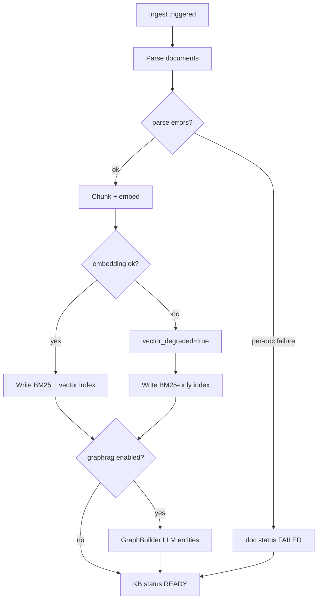

[简体中文](02-internal-knowledge-base.zh-CN.md)

# Tutorial 2: Build an Internal Knowledge Base

Connect your company documents to OpenCitadel for **private, in-network Q&A** — data never leaves your deployment.

## Overview

OpenCitadel knowledge bases support:

- Document upload (PDF, Markdown, text)
- Chunking + vector/hybrid retrieval
- Graph-augmented search (`graph_search` tool)
- Scoped access per user/team workspace

## Ingestion pipeline

When documents are added, `KBIngestionRunner` executes the following pipeline (SSE `step` events mirror each stage):

- **Parse**: upload, ZIP, web, Confluence, or Feishu sources → `PageBlock` per document
- **Chunk**: parent/child chunks via `KBChunker`; embeddings via `KBVectorService`
- **Index**: `replace_index_chunks()` persists searchable chunks
- **Graph** (optional): `GraphBuilder` when `graphrag.enabled=true`
- **Degraded path**: embedding failure sets `vector_degraded=true`; retrieval falls back to BM25/hybrid without vectors

## Steps

### 1. Create a knowledge base

1. Open **Knowledge** from the **header workspace menu** (not the left sidebar)
2. Click **New knowledge base**
3. Name it (e.g. `Engineering Handbook`) and choose visibility (personal or team)

### 2. Ingest documents

**Upload files:**

1. Open the knowledge base
2. Click **Add document** → upload PDF/MD/TXT
3. Wait for indexing (status shows in document list)

**Optional connectors** (configure in `.env`):

- Confluence (`CONFLUENCE_TOKEN`)
- Feishu/Lark (`FEISHU_APP_ID`, `FEISHU_APP_SECRET`)

### 3. Ask questions (Doc QA flow)

Start a session and ask:

> Search our engineering handbook: what is our incident response process for P1 outages?

The Agent uses `kb_search` and `get_document` tools against your indexed content.

### 4. Combine with general Agent tasks

Example:

> Based on our security policy document in the Engineering Handbook KB, draft a checklist for onboarding new contractors.

The Agent retrieves policy excerpts, then writes the checklist in the sandbox.

## Best practices

| Practice | Why |
|----------|-----|
| Split large PDFs by topic | Better retrieval precision |
| Use team workspaces | Shared KBs with RBAC |
| Enable vector memory in `config.yaml` | Better long-session recall |
| Review [security model](../architecture/security-model.md) | Understand data boundaries |

## Evaluation tip

Create 10–20 question/answer pairs from your docs and spot-check retrieval quality before rolling out to a wider team.

## Next

- [Tutorial 3: MCP integrations](./03-mcp-integrations.md)
- [Security model](../architecture/security-model.md)
